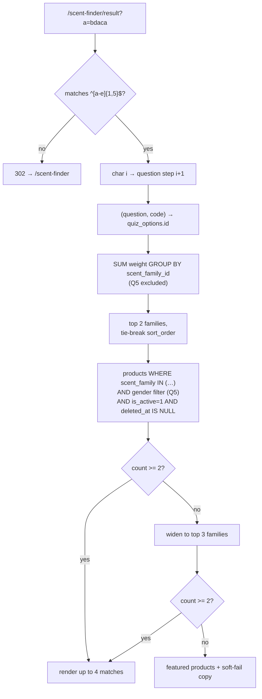

# 01a — Schema Catalogue: Catalogue & Site Tables

This document is the DDL contract for the **catalogue and site half** of the Sky Fragrances
database: the tables that describe what is sold (`collections`, `scent_families`, `products`,
`product_sizes`, `product_images`, `reviews`), the tables that describe the site itself
(`settings`, `content_pages`, `slug_redirects`, `contact_messages`, `newsletter_subscribers`,
`quiz_questions`, `quiz_options`, `quiz_option_scores`), and the tables that let one
non-technical owner administer it safely (`admin_users`, `admin_login_attempts`,
`admin_sessions`, `activity_log`). The commerce half — `cart_*`, `orders`, `order_items`,
`coupons`, `coupon_redemptions`, `order_status_history`, `payment_proofs` — is specified in its
own sibling document and is referenced here only where a foreign key or a delete rule crosses
the boundary. Every name below matches the cross-stream contract in
`07-seed-seo-quality.md §0.2`; where this document adds a column that contract does not list,
the addition is called out explicitly in §1.4 so the seed and SEO streams can pick it up.

---

## 1. Conventions that apply to every table in this document

### 1.1 Physical conventions

Every `CREATE TABLE` in this document ends with exactly:

```sql
) ENGINE=InnoDB DEFAULT CHARSET=utf8mb4 COLLATE=utf8mb4_unicode_ci;
```

`utf8mb4_unicode_ci` is mandatory and `utf8mb4_0900_ai_ci` is forbidden — the latter does not
exist on MariaDB 10.4 and the import dies on the first table. No table uses a functional
default, a generated column, a `CHECK` constraint with a subquery, or a `JSON` column; all four
are either unsupported or behave differently across the two engines this must run on.

| Convention | Rule | Reason |
|---|---|---|
| Primary key | `INT UNSIGNED NOT NULL AUTO_INCREMENT` named `id` | 4.29 billion rows is far beyond this shop; `BIGINT` doubles every index page for nothing. |
| Timestamps | `created_at DATETIME NOT NULL`, `updated_at DATETIME NULL DEFAULT NULL` | Written by PHP in `Asia/Karachi`, never by MySQL. `CURRENT_TIMESTAMP` defaults differ subtly between the engines and hide the timezone question. |
| Booleans | `TINYINT(1) UNSIGNED NOT NULL DEFAULT 0` (or `1`) | Portable, indexable, and phpMyAdmin renders it plainly for the owner. |
| Enumerations | `VARCHAR(20)` holding a short lowercase string | Contract §0.2. The owner can never be blocked by a DDL change, and an unknown value degrades to "unknown" instead of throwing. |
| Money | `DECIMAL(10,2) UNSIGNED` PKR | Max Rs. 99,999,999.99. Never `FLOAT`, never `INT`. |
| Slugs | `VARCHAR(160) NOT NULL` + `UNIQUE` | Matches the route regex `[a-z0-9-]+`; 160 leaves room inside the 3072-byte index limit at 4 bytes/char with room for a second column. |
| Free text | `TEXT` for body copy, `VARCHAR(n)` for anything ever indexed or sorted | A `TEXT` column cannot be indexed without a prefix length. |
| Sort columns | `sort_order SMALLINT UNSIGNED NOT NULL DEFAULT 0`, seeded in tens | Lets the owner insert between two rows without renumbering the table. |

### 1.2 Money contract — a conflict to resolve in favour of DECIMAL

`03-storefront-pages.md §1.4` states prices are "stored as unsigned integers in whole rupees".
`07-seed-seo-quality.md §0.2` and the task constraints state `DECIMAL(10,2)`.
**`DECIMAL(10,2)` wins and `03 §1.4` should be amended.** The seed already ships
`8950.00` literals, coupon maths produces fractional intermediates that must round once at the
end rather than at every step, and a future paisa-priced sample vial costs an `ALTER` on a live
shared-hosting database. The display rule from `03 §1.4` is unaffected: every amount renders
through one helper as `'Rs.&nbsp;' . number_format($v, 0)` → `Rs. 4,950`. The `.00` exists for
arithmetic, never for the customer.

### 1.3 Soft delete vs hard delete — the decision, per table

The owner is one non-technical person with no database access beyond phpMyAdmin. The rule is:
**anything a customer's order can point at is never destroyed; anything else is deleted for
real, because an admin list full of invisible ghosts is how a shop like this rots.**

| Table | Policy | Why |
|---|---|---|
| `products` | **Soft** — `is_active=0` to hide, `deleted_at` to retire | An `order_items` row keeps `product_id`; a hard delete orphans invoice history and the best-seller report. Retired products still serve their URL for SEO. |
| `product_sizes` | **Soft** (`is_active=0`) | Order lines reference `product_size_id`. A discontinued 100ml must still print on last month's packing slip. |
| `collections` | **Soft** (`is_active=0`, no `deleted_at`) | Products carry `collection_id`; collections are few (5) and never truly deleted in practice. |
| `scent_families` | **Soft** (`is_active=0`) | Each one owns an indexable `/scent/{slug}` landing page. Deleting one silently 404s a ranked URL. |
| `product_images` | **Hard** + unlink the file | Nothing references an image. Keeping dead rows means orphan files the owner cannot see or clear on a shared-hosting disk quota. |
| `reviews` | **Hard** for spam, `status='rejected'` for judgement calls | Moderation is a workflow, not a deletion. Obvious spam is purged so the queue stays usable. |
| `contact_messages` | **Soft** (`is_archived=1`) | The inbox is the only record of a WhatsApp-adjacent conversation; the owner will archive, then want it back. |
| `newsletter_subscribers` | **Soft** (`status='unsubscribed'`) | A hard delete lets a re-import re-subscribe someone who opted out. The unsubscribe record *is* the compliance artefact. |
| `content_pages` | **Soft** (`is_active=0`) | Routes 23–28 are fixed; a missing `/privacy` row is a 404 on a legally expected page. |
| `slug_redirects` | **Hard**, and only when the row is superseded | Purely mechanical. See §5.2. |
| `settings` | **Hard** (never deleted in practice) | Keys are code-owned. See §5.3. |
| `admin_users` | **Soft** (`is_active=0`) | `activity_log.admin_user_id` must resolve to a name forever. |
| `admin_login_attempts` | **Hard**, purged on a schedule | Security telemetry with a defined retention, not records. |
| `activity_log` | **Hard**, purged at 365 days | Append-only audit; unbounded growth on a shared-hosting quota is a real risk. |
| `quiz_*` | **Hard** | Authoring data with no external references. Rewriting a question is normal. |

> Superseded by 08-decisions-register.md §2 — C-05: `admin_sessions` is not created; `activity_log` is `admin_activity_log` (C-18); `contact_messages` and `newsletter_subscribers` follow the 05a DDL (C-20).

### 1.4 Additions to the §0.2 contract made by this document

These columns are **not** in `07 §0.2` and the seed/SEO streams must adopt them:

- `products.published_at` — required by `03 §4.5` (new-arrivals ordering) and `§1.3` (the `NEW`
  badge window). Nullable; a `NULL` means "not yet announced" and sorts last.
- `products.rating_avg`, `products.rating_count` — required by `03 §1.3` (`PRODUCT_CARD`
  shows a rating only when `rating_count >= 1`). Denormalised cache, recomputed on every review
  approval or rejection. Never edited by hand.
- `products.deleted_at`, `product_sizes.is_active`.
- `product_images.width`, `product_images.height` — emitted as `` to stop
  layout shift, which the brief's Lighthouse-90 target will not survive without.
- `reviews.rejected_at`, `reviews.moderated_by`.
- `scent_families` as a table (see §3.2 for the justification).
- Added by 08-decisions-register.md §1.2: `collections.show_on_home TINYINT(1) UNSIGNED NOT NULL DEFAULT 0` (03 §16), `products.sales_count INT UNSIGNED NOT NULL DEFAULT 0` (03 §16; +quantity in the order transaction, −quantity on cancel), `product_sizes.low_stock_threshold TINYINT UNSIGNED NULL` (05a §0.3).

---

## 2. Site and administration tables

### 2.1 `settings`

**Purpose.** A single flat key/value store for every owner-editable string in the site chrome:
store name, phone, WhatsApp number, social links, announcement text, hero copy, shipping fee,
free-shipping threshold, payment-method toggles, bank/JazzCash/Easypaisa details, meta
description. One row per key, loaded once per request into an in-memory array.

```sql
CREATE TABLE settings (
  setting_key    VARCHAR(64)  NOT NULL,
  setting_value  TEXT         NULL,
  setting_group  VARCHAR(32)  NOT NULL DEFAULT 'general',
  updated_at     DATETIME     NULL DEFAULT NULL,
  PRIMARY KEY (setting_key),
  KEY idx_settings_group (setting_group)
) ENGINE=InnoDB DEFAULT CHARSET=utf8mb4 COLLATE=utf8mb4_unicode_ci;
```

| Column | Type | Notes |
|---|---|---|
| `setting_key` | `VARCHAR(64)` PK | Natural key, e.g. `whatsapp`, `free_shipping_threshold`. No surrogate `id` — the key *is* the identity and a second row for the same key must be impossible. |
| `setting_value` | `TEXT NULL` | Always read as a string; cast at the point of use. `NULL` is distinct from `''` (see §5.3). |
| `setting_group` | `VARCHAR(32)` | `general`, `contact`, `social`, `home`, `shipping`, `payment`, `seo`. Drives the tab layout of the admin Settings screen only. |

- `PRIMARY KEY (setting_key)` — uniqueness is the whole point; also the lookup path.
- `idx_settings_group` — the admin Settings screen renders one tab per group.

Note there is no `id` column here, deliberately. It is the one table in the schema whose primary
key is not a surrogate integer.

### 2.2 `admin_users`

**Purpose.** Administrator accounts for `/admin`. In v1 there is one owner account; the table is
plural because the audit trail needs a stable actor identity and the owner will eventually add a
staff member for order packing.

```sql
CREATE TABLE admin_users (
  id                  INT UNSIGNED    NOT NULL AUTO_INCREMENT,
  username            VARCHAR(64)     NOT NULL,
  email               VARCHAR(190)    NOT NULL,
  password_hash       VARCHAR(255)    NOT NULL,
  display_name        VARCHAR(100)    NOT NULL,
  is_active           TINYINT(1) UNSIGNED NOT NULL DEFAULT 1,
  last_login_at       DATETIME        NULL DEFAULT NULL,
  last_login_ip_hash  CHAR(64)        NULL DEFAULT NULL,
  password_changed_at DATETIME        NULL DEFAULT NULL,
  created_at          DATETIME        NOT NULL,
  updated_at          DATETIME        NULL DEFAULT NULL,
  PRIMARY KEY (id),
  UNIQUE KEY uq_admin_users_username (username),
  UNIQUE KEY uq_admin_users_email (email),
  KEY idx_admin_users_active (is_active)
) ENGINE=InnoDB DEFAULT CHARSET=utf8mb4 COLLATE=utf8mb4_unicode_ci;
```

| Column | Type | Notes |
|---|---|---|
| `password_hash` | `VARCHAR(255)` | `password_hash($p, PASSWORD_DEFAULT)`. 255 so a future Argon2id hash fits without an `ALTER`. |
| ~~`role`~~ | — | Superseded by 08-decisions-register.md §2 — C-21: column cut; one owner account in v1, staff is question Q-10. |
| `last_login_ip_hash` | `CHAR(64)` | `hash('sha256', $ip . $pepper)`. A raw IP is personal data with no use here. |
| `password_changed_at` | `DATETIME NULL` | Lets a future "your password is a year old" nudge exist without schema work. |
| `known_devices` | `TEXT NULL` | **Added by 08 §2.4 C-51.** JSON array of up to 5 `sha256` hashes of the `SFDEV` known-device cookie issued on each successful login (05a §2.4 step 7a). A login request carrying a matching cookie is exempt from the username progressive delay. Never holds the cookie value itself. |

- `uq_admin_users_username` — the login lookup and the uniqueness guarantee in one index.
- `uq_admin_users_email` — password-reset lookup by email; also stops two accounts sharing a mailbox.
- `idx_admin_users_active` — tiny table, but the login query filters on it and the optimiser should not read a deactivated row's password hash at all.

Email is `VARCHAR(190)`, not 255: a `utf8mb4` unique index is capped at 767 bytes on an
older MariaDB row format, and 190 × 4 = 760 fits under it. This applies to every unique-indexed
email column in the schema.

### 2.3 `admin_login_attempts`

**Purpose.** Rate limiting for `/admin/login`, as required by the brief. Every attempt is
recorded, success or failure; the login controller counts recent failures for the IP hash and
for the username independently and locks the slower of the two.

```sql
CREATE TABLE admin_login_attempts (
  id            INT UNSIGNED    NOT NULL AUTO_INCREMENT,
  ip_hash       CHAR(64)        NOT NULL,
  username      VARCHAR(64)     NOT NULL,
  attempted_at  DATETIME        NOT NULL,
  was_success   TINYINT(1) UNSIGNED NOT NULL DEFAULT 0,
  PRIMARY KEY (id),
  KEY idx_attempts_ip_time (ip_hash, attempted_at),
  KEY idx_attempts_user_time (username, attempted_at),
  KEY idx_attempts_time (attempted_at)
) ENGINE=InnoDB DEFAULT CHARSET=utf8mb4 COLLATE=utf8mb4_unicode_ci;
```

- `idx_attempts_ip_time` — the throttle query: failures for this IP in the last 15 minutes.
- `idx_attempts_user_time` — the same window per username, so an attacker rotating IPs against one account still trips the lock.
- `idx_attempts_time` — the purge (`DELETE WHERE attempted_at < NOW() - INTERVAL 30 DAY`) must not table-scan.

Throttle policy: 5 failures in 15 minutes per `ip_hash` **or** per `username` → locked for 15
minutes, with the response time held constant so a locked account is indistinguishable from a
wrong password. `username` is stored raw and unindexed-for-uniqueness on purpose — it records
what was *attempted*, including usernames that do not exist.

There is no cron on the cheapest Hostinger plans that the owner will reliably configure, so the
purge runs opportunistically: roughly 1 login in 50 (`random_int(1,50) === 1`) also deletes rows
older than 30 days. The same trick purges `admin_sessions` and `activity_log`.

### 2.4 `admin_sessions` — yes, include it

> Superseded by 08-decisions-register.md §2 — C-05: table CUT. Admin and storefront sessions are PHP file sessions in `storage/sessions/` (`SFADMIN` path `/admin`, `SFSHOP` path `/`); password change regenerates the id. Do not create this table.

**Decision: include it.** PHP's default session handler writes files to a shared `/tmp` that the
owner cannot inspect, that some Hostinger plans garbage-collect aggressively (logging the owner
out mid-order-edit), and that gives no way to answer "is anyone else logged in as me?" or to
revoke a session after a password change. A DB-backed session *index* costs one table and two
queries per admin request, and it is the only way the brief's "manage orders from my phone"
survives a session file being swept while the owner is on a packing run.

The row is an index, not a store: PHP still holds the session payload. The table records that a
session id exists, who owns it, and when it was last seen.

```sql
CREATE TABLE admin_sessions (
  id              CHAR(64)        NOT NULL,
  admin_user_id   INT UNSIGNED    NOT NULL,
  ip_hash         CHAR(64)        NOT NULL,
  user_agent      VARCHAR(255)    NULL DEFAULT NULL,
  created_at      DATETIME        NOT NULL,
  last_seen_at    DATETIME        NOT NULL,
  expires_at      DATETIME        NOT NULL,
  revoked_at      DATETIME        NULL DEFAULT NULL,
  PRIMARY KEY (id),
  KEY idx_sessions_user (admin_user_id, last_seen_at),
  KEY idx_sessions_expiry (expires_at),
  CONSTRAINT fk_sessions_admin FOREIGN KEY (admin_user_id)
    REFERENCES admin_users (id) ON DELETE CASCADE ON UPDATE CASCADE
) ENGINE=InnoDB DEFAULT CHARSET=utf8mb4 COLLATE=utf8mb4_unicode_ci;
```

| Column | Type | Notes |
|---|---|---|
| `id` | `CHAR(64)` PK | `hash('sha256', session_id())` — the raw session id never lands in the database, so a leaked DB dump cannot be replayed as a login. |
| `expires_at` | `DATETIME` | Absolute lifetime, 14 days. Idle timeout is 12 hours, enforced against `last_seen_at`. |
| `revoked_at` | `DATETIME NULL` | Set on logout, on password change (all rows for that user), and from a future "sign out everywhere" button. |

- `PRIMARY KEY (id)` — the per-request lookup.
- `idx_sessions_user` — "your active sessions" list, and the bulk revoke on password change.
- `idx_sessions_expiry` — the opportunistic purge.
- `ON DELETE CASCADE` is safe and correct here: `admin_users` is soft-deleted, so this only fires in the genuine hard-delete case, where orphan sessions would be a security hole.

`session_regenerate_id(true)` on privilege change rewrites the `id` of the row rather than
inserting a second one.

### 2.5 `activity_log`

> Superseded by 08-decisions-register.md §2 — C-18: the table is `admin_activity_log` with the 05b §0.2 column set (`admin_id`, `admin_username`, `entity_type`, `entity_id`, `action`, `summary`, `before_json`, `after_json`, `ip_hash`, `user_agent`, `created_at`) and dotted actions (`order.status_change`). The DDL below is not used.

**Purpose.** Append-only audit of every write an administrator performs: what changed, on which
record, by whom, from where. The brief does not ask for it; one owner plus a future staff
account plus "restore stock on cancel" makes it the difference between a mistake being
diagnosable and being a mystery.

```sql
CREATE TABLE activity_log (
  id             INT UNSIGNED    NOT NULL AUTO_INCREMENT,
  admin_user_id  INT UNSIGNED    NULL DEFAULT NULL,
  action         VARCHAR(40)     NOT NULL,
  entity_type    VARCHAR(40)     NOT NULL,
  entity_id      INT UNSIGNED    NULL DEFAULT NULL,
  summary        VARCHAR(255)    NOT NULL,
  changes        TEXT            NULL DEFAULT NULL,
  ip_hash        CHAR(64)        NULL DEFAULT NULL,
  created_at     DATETIME        NOT NULL,
  PRIMARY KEY (id),
  KEY idx_activity_entity (entity_type, entity_id, created_at),
  KEY idx_activity_user_time (admin_user_id, created_at),
  KEY idx_activity_time (created_at),
  CONSTRAINT fk_activity_admin FOREIGN KEY (admin_user_id)
    REFERENCES admin_users (id) ON DELETE SET NULL ON UPDATE CASCADE
) ENGINE=InnoDB DEFAULT CHARSET=utf8mb4 COLLATE=utf8mb4_unicode_ci;
```

| Column | Type | Notes |
|---|---|---|
| `action` | `VARCHAR(40)` | `create` \| `update` \| `delete` \| `login` \| `logout` \| `status_change` \| `stock_adjust` \| `setting_change` \| `review_moderate` \| `export`. |
| `entity_type` | `VARCHAR(40)` | The table name: `products`, `orders`, `reviews`, `settings`. Not a foreign key — a log row must outlive a hard-deleted image row. |
| `summary` | `VARCHAR(255)` | Human sentence rendered directly in the admin list: `Changed order SKY-1042 from Packing to Shipped`. |
| `changes` | `TEXT NULL` | `json_encode(['field' => ['old','new'], ...])` for the detail drawer. Stored as text and only ever decoded in PHP — it is never queried, so no `JSON` column and no MariaDB incompatibility. |

- `idx_activity_entity` — "history of this product", the drawer on every edit screen.
- `idx_activity_user_time` — "what did this account do", the reason the table exists once a staff login is issued.
- `idx_activity_time` — the global feed and the 365-day purge.
- `ON DELETE SET NULL` rather than `CASCADE`: deleting an account must never erase what it did. The UI renders a `NULL` actor as "deleted account".

Passwords, hashes, session ids and payment-proof contents are never written to `changes`. The
writer maintains a hard deny-list of field names (`password`, `password_hash`, `token`).

### 2.6 `content_pages`

**Purpose.** Backs routes 23–28 (`/about`, `/faq`, `/shipping`, `/returns`, `/privacy`,
`/terms`) so the owner can edit legal and policy copy without touching a `.php` file in File
Manager — the single most likely way this deployment gets broken.

```sql
CREATE TABLE content_pages (
  id               INT UNSIGNED    NOT NULL AUTO_INCREMENT,
  slug             VARCHAR(160)    NOT NULL,
  title            VARCHAR(160)    NOT NULL,
  heading          VARCHAR(160)    NULL DEFAULT NULL,
  body             MEDIUMTEXT      NOT NULL,
  body_format      VARCHAR(20)     NOT NULL DEFAULT 'html',
  template         VARCHAR(30)     NOT NULL DEFAULT 'page',
  is_system        TINYINT(1) UNSIGNED NOT NULL DEFAULT 0,
  is_active        TINYINT(1) UNSIGNED NOT NULL DEFAULT 1,
  sort_order       SMALLINT UNSIGNED NOT NULL DEFAULT 0,
  seo_title        VARCHAR(160)    NULL DEFAULT NULL,
  seo_description  VARCHAR(255)    NULL DEFAULT NULL,
  created_at       DATETIME        NOT NULL,
  updated_at       DATETIME        NULL DEFAULT NULL,
  PRIMARY KEY (id),
  UNIQUE KEY uq_content_pages_slug (slug),
  KEY idx_content_pages_active (is_active, sort_order)
) ENGINE=InnoDB DEFAULT CHARSET=utf8mb4 COLLATE=utf8mb4_unicode_ci;
```

| Column | Type | Notes |
|---|---|---|
| `body_format` | `VARCHAR(20)` | `html` \| `faq`. `faq` means the body is a sequence of `## Question` / paragraph pairs, parsed into the accordion and the `FAQPage` JSON-LD required by route 24. |
| `template` | `VARCHAR(30)` | `page` or `page-faq`, matching the view column of the route table. |
| `is_system` | `TINYINT(1)` | `1` on the six seeded pages. The admin UI hides the delete button and refuses to change the slug of a system page — those six slugs are hard-coded in the footer and the route table. |

- `uq_content_pages_slug` — the route lookup; also stops two `/privacy` rows existing.
- `idx_content_pages_active` — the footer link list and the sitemap.

`body` is `MEDIUMTEXT` because a Terms page pasted from a lawyer's Word document routinely
exceeds 64 KB. It is stored as sanitised HTML (a fixed tag allow-list applied on save, escaped
again nowhere — the page prints it raw, which is exactly why the allow-list is applied on the
way in and only an authenticated owner can write it).
> Amended by 08 §2.4 — C-62: "a fixed tag allow-list" is the `DOMDocument`-based `sanitize_html()` defined in 02c §3.2 (tags `p, br, strong, em, b, i, ul, ol, li, a, h2, h3, blockquote`; only `href` survives, http/https/mailto/site-relative only; `rel="nofollow noopener"` forced). It is applied on save **and again on render**, because "only an authenticated owner can write it" is one stolen admin cookie away from being false, and a planted `javascript:` link would survive a password change. `strip_tags()` is never used.

### 2.7 `slug_redirects`

**Purpose.** Slug history. When a product, collection, scent family or content page is renamed,
the old URL 301s to the new one instead of 404ing — which matters here more than on most sites,
because the owner sends product links over WhatsApp and those messages are forwarded for months.

```sql
CREATE TABLE slug_redirects (
  id           INT UNSIGNED    NOT NULL AUTO_INCREMENT,
  entity_type  VARCHAR(20)     NOT NULL,
  old_slug     VARCHAR(160)    NOT NULL,
  new_slug     VARCHAR(160)    NOT NULL,
  entity_id    INT UNSIGNED    NULL DEFAULT NULL,
  hit_count    INT UNSIGNED    NOT NULL DEFAULT 0,
  created_at   DATETIME        NOT NULL,
  PRIMARY KEY (id),
  UNIQUE KEY uq_redirect_lookup (entity_type, old_slug),
  KEY idx_redirect_entity (entity_type, entity_id)
) ENGINE=InnoDB DEFAULT CHARSET=utf8mb4 COLLATE=utf8mb4_unicode_ci;
```

- `uq_redirect_lookup` — the miss path (`entity_type` + `old_slug`) is the only read query, and the uniqueness stops two rows disagreeing about where one old URL goes.
- `idx_redirect_entity` — "show me this product's old URLs" on the edit screen, and the rewrite sweep in §5.2.
- `entity_type` ∈ `product` | `collection` | `scent` | `page`. No foreign key on `entity_id`: a redirect must keep working after the product is hard-deleted in some future cleanup, and the type column means no single FK target exists anyway.
- `hit_count` is incremented on each 301. A redirect with zero hits after a year can be pruned; one with thousands tells the owner not to rename that product again.

### 2.8 `contact_messages`

> Superseded by 08-decisions-register.md §2 — C-20: the 05a §0.3 DDL is canonical (`status` new|read|replied|archived, `admin_note`, `read_at`) plus `order_number VARCHAR(20) NULL`; `is_archived` is not used.

**Purpose.** Route 30 (`POST /contact`) writes here before any email is attempted, so a failed
SMTP call on shared hosting never loses a customer enquiry.

```sql
CREATE TABLE contact_messages (
  id           INT UNSIGNED    NOT NULL AUTO_INCREMENT,
  name         VARCHAR(100)    NOT NULL,
  email        VARCHAR(190)    NULL DEFAULT NULL,
  phone        VARCHAR(30)     NULL DEFAULT NULL,
  subject      VARCHAR(160)    NULL DEFAULT NULL,
  message      TEXT            NOT NULL,
  order_number VARCHAR(20)     NULL DEFAULT NULL,
  status       VARCHAR(20)     NOT NULL DEFAULT 'new',
  is_archived  TINYINT(1) UNSIGNED NOT NULL DEFAULT 0,
  ip_hash      CHAR(64)        NULL DEFAULT NULL,
  user_agent   VARCHAR(255)    NULL DEFAULT NULL,
  replied_at   DATETIME        NULL DEFAULT NULL,
  created_at   DATETIME        NOT NULL,
  PRIMARY KEY (id),
  KEY idx_contact_status (is_archived, status, created_at),
  KEY idx_contact_created (created_at),
  KEY idx_contact_order (order_number)
) ENGINE=InnoDB DEFAULT CHARSET=utf8mb4 COLLATE=utf8mb4_unicode_ci;
```

- `idx_contact_status` — the admin inbox: unarchived, newest first, filtered by status.
- `idx_contact_created` — the dashboard "new messages today" count.
- `idx_contact_order` — jumps from an enquiry straight to the order it names. Not an FK: the customer types the number and frequently mistypes it.
- `status` ∈ `new` | `read` | `replied` | `spam`. `email` and `phone` are both nullable but the form requires at least one; that rule lives in PHP, not in a `CHECK` (MariaDB 10.4 parses `CHECK` but enforcement differs from MySQL 8, so no constraint in this schema relies on it).

### 2.9 `newsletter_subscribers`

> Superseded by 08-decisions-register.md §2 — C-20: the 05a §0.3 DDL is canonical (`status`, `source`, `unsub_token`, `subscribed_at`, `unsubscribed_at`).

**Purpose.** The footer and home-page signup (route 38) plus the one-click unsubscribe
(route 31) and the admin CSV export.

```sql
CREATE TABLE newsletter_subscribers (
  id              INT UNSIGNED    NOT NULL AUTO_INCREMENT,
  email           VARCHAR(190)    NOT NULL,
  status          VARCHAR(20)     NOT NULL DEFAULT 'subscribed',
  source          VARCHAR(30)     NOT NULL DEFAULT 'footer',
  unsubscribe_token CHAR(32)      NOT NULL,
  ip_hash         CHAR(64)        NULL DEFAULT NULL,
  subscribed_at   DATETIME        NOT NULL,
  unsubscribed_at DATETIME        NULL DEFAULT NULL,
  created_at      DATETIME        NOT NULL,
  PRIMARY KEY (id),
  UNIQUE KEY uq_newsletter_email (email),
  KEY idx_newsletter_status (status, subscribed_at),
  KEY idx_newsletter_token (unsubscribe_token)
) ENGINE=InnoDB DEFAULT CHARSET=utf8mb4 COLLATE=utf8mb4_unicode_ci;
```

- `uq_newsletter_email` — a second signup with the same address is an idempotent re-subscribe (`status='subscribed'`, `unsubscribed_at=NULL`), never a duplicate row.
- `idx_newsletter_status` — the export and the count both filter on `status`.
- `idx_newsletter_token` — route 31 looks up by `?t=` alone; the `?e=` parameter is compared with `hash_equals` afterwards so a guessed token without the matching email does nothing.
- Email is lower-cased and trimmed before insert, so the unique index is meaningful under `utf8mb4_unicode_ci`.
- `source` ∈ `footer` | `home` | `popup` | `checkout` | `import`, purely for the owner's curiosity about what converts.

---

## 3. Catalogue tables

### 3.1 `collections`

**Purpose.** The five merchandising groups (Dawn Chorus … Monsoon Veil). A product belongs to at
most one; each owns an indexable landing page at `/collections/{slug}` (route 4).

```sql
CREATE TABLE collections (
  id               INT UNSIGNED    NOT NULL AUTO_INCREMENT,
  name             VARCHAR(100)    NOT NULL,
  slug             VARCHAR(160)    NOT NULL,
  tagline          VARCHAR(160)    NULL DEFAULT NULL,
  description      TEXT            NULL DEFAULT NULL,
  mood             VARCHAR(255)    NULL DEFAULT NULL,
  image            VARCHAR(255)    NULL DEFAULT NULL,
  sort_order       SMALLINT UNSIGNED NOT NULL DEFAULT 0,
  is_active        TINYINT(1) UNSIGNED NOT NULL DEFAULT 1,
  seo_title        VARCHAR(160)    NULL DEFAULT NULL,
  seo_description  VARCHAR(255)    NULL DEFAULT NULL,
  created_at       DATETIME        NOT NULL,
  updated_at       DATETIME        NULL DEFAULT NULL,
  PRIMARY KEY (id),
  UNIQUE KEY uq_collections_slug (slug),
  KEY idx_collections_active (is_active, sort_order)
) ENGINE=InnoDB DEFAULT CHARSET=utf8mb4 COLLATE=utf8mb4_unicode_ci;
```

- `uq_collections_slug` — route 4's lookup, and the guarantee that two collections cannot claim one URL.
- `idx_collections_active` — the header mega-panel, the home "shop by collection" band and the collections index all run `WHERE is_active=1 ORDER BY sort_order` and are served entirely from this index.
- `image` is a path relative to `/uploads/`, e.g. `collections/midnight-meridian.webp`. No leading slash, ever — the display helper prefixes it, and a stored absolute URL breaks the day the domain changes.

### 3.2 `scent_families` — a table, not just a string

The contract fixes `products.scent_family` as a column on `products`. **Both exist**: the column
stays as written, and a lookup table sits beside it.

The reason is route 8, `/scent/{slug}` — an indexable landing page with its own H1, intro copy,
`seo_title` and `seo_description`. A bare string column cannot carry a slug (is `Woody Oud`
`woody-oud`? `woody-and-oud`?), cannot carry landing copy, and lets one typo (`Woody Oud ` with a
trailing space) silently fork a ranked URL into two. A pure foreign key, on the other hand,
would break the seed and the SEO stream, which both write the family as a literal string.

So: `products.scent_family` remains the `VARCHAR(60)` display name and is the value the seed
writes; `scent_families.name` is `UNIQUE` and the join is on the name. The admin product form
offers a `<select>` populated from `scent_families`, so the string can only ever be one of the
known values, and saving a product with an unknown family inserts the family row first. This is
a denormalisation with one writer and a closed vocabulary — the case where it is safe.

```sql
CREATE TABLE scent_families (
  id               INT UNSIGNED    NOT NULL AUTO_INCREMENT,
  name             VARCHAR(60)     NOT NULL,
  slug             VARCHAR(160)    NOT NULL,
  intro            TEXT            NULL DEFAULT NULL,
  sort_order       SMALLINT UNSIGNED NOT NULL DEFAULT 0,
  is_active        TINYINT(1) UNSIGNED NOT NULL DEFAULT 1,
  seo_title        VARCHAR(160)    NULL DEFAULT NULL,
  seo_description  VARCHAR(255)    NULL DEFAULT NULL,
  created_at       DATETIME        NOT NULL,
  updated_at       DATETIME        NULL DEFAULT NULL,
  PRIMARY KEY (id),
  UNIQUE KEY uq_scent_families_name (name),
  UNIQUE KEY uq_scent_families_slug (slug),
  KEY idx_scent_families_active (is_active, sort_order)
) ENGINE=InnoDB DEFAULT CHARSET=utf8mb4 COLLATE=utf8mb4_unicode_ci;
```

- `uq_scent_families_name` — the join key from `products.scent_family`; uniqueness is what makes the denormalisation safe.
- `uq_scent_families_slug` — route 8's lookup.
- `idx_scent_families_active` — the shop filter sidebar.

Renaming a family is a two-statement transaction: `UPDATE scent_families SET name=?` then
`UPDATE products SET scent_family=? WHERE scent_family=?`. The admin UI is the only writer and
performs both. If the slug changes too, §5.2 applies.

### 3.3 `products`

**Purpose.** One perfume. Prices and stock do **not** live here — they live on `product_sizes`,
because every size has its own price, sale price and stock per the brief.

```sql
CREATE TABLE products (
  id                INT UNSIGNED    NOT NULL AUTO_INCREMENT,
  collection_id     INT UNSIGNED    NULL DEFAULT NULL,
  name              VARCHAR(120)    NOT NULL,
  slug              VARCHAR(160)    NOT NULL,
  gender            VARCHAR(20)     NOT NULL DEFAULT 'unisex',
  scent_family      VARCHAR(60)     NULL DEFAULT NULL,
  short_description VARCHAR(255)    NULL DEFAULT NULL,
  description       TEXT            NULL DEFAULT NULL,
  notes_top         VARCHAR(255)    NULL DEFAULT NULL,
  notes_heart       VARCHAR(255)    NULL DEFAULT NULL,
  notes_base        VARCHAR(255)    NULL DEFAULT NULL,
  longevity         TINYINT UNSIGNED NULL DEFAULT NULL,
  sillage           TINYINT UNSIGNED NULL DEFAULT NULL,
  best_season       VARCHAR(60)     NULL DEFAULT NULL,
  occasion          VARCHAR(120)    NULL DEFAULT NULL,
  is_featured       TINYINT(1) UNSIGNED NOT NULL DEFAULT 0,
  is_new            TINYINT(1) UNSIGNED NOT NULL DEFAULT 0,
  is_active         TINYINT(1) UNSIGNED NOT NULL DEFAULT 1,
  sort_order        SMALLINT UNSIGNED NOT NULL DEFAULT 0,
  rating_avg        DECIMAL(3,2)    NOT NULL DEFAULT 0.00,
  rating_count      INT UNSIGNED    NOT NULL DEFAULT 0,
  published_at      DATETIME        NULL DEFAULT NULL,
  deleted_at        DATETIME        NULL DEFAULT NULL,
  seo_title         VARCHAR(160)    NULL DEFAULT NULL,
  seo_description   VARCHAR(255)    NULL DEFAULT NULL,
  created_at        DATETIME        NOT NULL,
  updated_at        DATETIME        NULL DEFAULT NULL,
  PRIMARY KEY (id),
  UNIQUE KEY uq_products_slug (slug),
  KEY idx_products_listing (is_active, deleted_at, sort_order),
  KEY idx_products_collection (collection_id, is_active),
  KEY idx_products_gender (gender, is_active),
  KEY idx_products_family (scent_family, is_active),
  KEY idx_products_new (is_active, published_at),
  KEY idx_products_featured (is_featured, is_active),
  FULLTEXT KEY ft_products_search (name, short_description, description),
  -- Superseded by 08-decisions-register.md §2 — C-38: FULLTEXT index NOT created; /search is scored LIKE (03 §5.15).
  CONSTRAINT fk_products_collection FOREIGN KEY (collection_id)
    REFERENCES collections (id) ON DELETE SET NULL ON UPDATE CASCADE
) ENGINE=InnoDB DEFAULT CHARSET=utf8mb4 COLLATE=utf8mb4_unicode_ci;
```

- `uq_products_slug` — route 13, and the URL uniqueness guarantee.
- `idx_products_listing` — the leading predicate of every storefront listing query.
- `idx_products_collection` / `idx_products_gender` / `idx_products_family` — routes 4–8, one index per preset.
- `idx_products_new` — route 9 and the `NEW` badge window (`published_at >= NOW() - INTERVAL 30 DAY`).
- `idx_products_featured` — the home best-sellers and featured bands.
- `ft_products_search` — route 12. InnoDB FULLTEXT exists on MySQL 5.6+ and MariaDB 10.0+, so it is portable; the search controller falls back to `LIKE '%term%'` when the term is under 4 characters (the default `ft_min_word_len` / `innodb_ft_min_token_size`) or when the match returns nothing.
- `ON DELETE SET NULL` on the collection: collections are soft-deleted, but if one is ever removed for real the products must survive uncollected rather than vanish with it.

Notable columns:

| Column | Notes |
|---|---|
| `gender` | `him` \| `her` \| `unisex`. Routes 5–7 pass presets `gender=him`/`her`/`unisex` directly — no mapping (08 C-29). |
| `longevity`, `sillage` | `TINYINT` 1–5, drive the PDP meters. `NULL` hides the meter rather than drawing an empty one. |
| `best_season`, `occasion` | Free strings, comma-separated the same way the notes are (§5.1). Displayed, never queried. |
| `rating_avg` / `rating_count` | Denormalised cache over approved reviews. Recomputed inside the same transaction as any review approval or rejection; never trusted as authoritative if it can be recomputed. |
| `published_at` | Announce date. `NULL` sorts last in new-arrivals. |
| `deleted_at` | Retirement. All storefront queries carry `deleted_at IS NULL`; the admin list has a "retired" filter that drops it. |

### 3.4 `product_sizes`

**Purpose.** The purchasable unit. Every price, sale price, SKU and stock level in the shop is a
row here, and an order line points at one.

```sql
CREATE TABLE product_sizes (
  id          INT UNSIGNED    NOT NULL AUTO_INCREMENT,
  product_id  INT UNSIGNED    NOT NULL,
  size_label  VARCHAR(20)     NOT NULL,
  size_ml     SMALLINT UNSIGNED NULL DEFAULT NULL,
  sku         VARCHAR(40)     NOT NULL,
  price       DECIMAL(10,2) UNSIGNED NOT NULL,
  sale_price  DECIMAL(10,2) UNSIGNED NULL DEFAULT NULL,
  stock       INT UNSIGNED    NOT NULL DEFAULT 0,   -- 08 C-03: UNSIGNED (was signed INT)
  is_default  TINYINT(1) UNSIGNED NOT NULL DEFAULT 0,
  is_active   TINYINT(1) UNSIGNED NOT NULL DEFAULT 1,
  sort_order  SMALLINT UNSIGNED NOT NULL DEFAULT 0,
  created_at  DATETIME        NOT NULL,
  updated_at  DATETIME        NULL DEFAULT NULL,
  PRIMARY KEY (id),
  UNIQUE KEY uq_sizes_sku (sku),
  KEY idx_sizes_product (product_id, is_active, sort_order),
  KEY idx_sizes_stock (stock),
  CONSTRAINT fk_sizes_product FOREIGN KEY (product_id)
    REFERENCES products (id) ON DELETE CASCADE ON UPDATE CASCADE
) ENGINE=InnoDB DEFAULT CHARSET=utf8mb4 COLLATE=utf8mb4_unicode_ci;
```

- `uq_sizes_sku` — the owner's inventory identity; a duplicate SKU is a packing error waiting to happen.
- `idx_sizes_product` — every PDP and every card's price range loads sizes by product in display order.
- `idx_sizes_stock` — the dashboard low-stock alert (`stock <= settings.low_stock_threshold`).
- `ON DELETE CASCADE` is correct **because `products` is soft-deleted**: the cascade only fires on a deliberate hard delete of a product with no order history, where leaving orphan sizes would be worse.

Rules: `sale_price` is `NULL` when not on sale — never `0.00`, never equal to `price`; the
effective price is `COALESCE(sale_price, price)` in exactly one helper. `stock` is a signed `INT`
(Superseded by 08-decisions-register.md §2 — C-03: `stock` is `INT UNSIGNED`; strict mode raises an out-of-range error rather than clamping, so it is the loud second wall behind the guard.)
on purpose: the column can physically hold a negative, and the *application* refuses to write
one, so an oversell attempt fails loudly in one guarded place rather than silently clamping at an
unsigned zero. Exactly one active size per product carries `is_default=1`; enforced in PHP (a
unique index would need the product id plus a nullable flag and behaves differently across the
two engines).

### 3.5 `product_images`

**Purpose.** The gallery. One row per uploaded file plus its generated derivatives.

```sql
CREATE TABLE product_images (
  id          INT UNSIGNED    NOT NULL AUTO_INCREMENT,
  product_id  INT UNSIGNED    NOT NULL,
  filename    VARCHAR(255)    NOT NULL,
  alt_text    VARCHAR(255)    NULL DEFAULT NULL,
  width       SMALLINT UNSIGNED NULL DEFAULT NULL,
  height      SMALLINT UNSIGNED NULL DEFAULT NULL,
  sort_order  SMALLINT UNSIGNED NOT NULL DEFAULT 0,
  is_primary  TINYINT(1) UNSIGNED NOT NULL DEFAULT 0,
  created_at  DATETIME        NOT NULL,
  PRIMARY KEY (id),
  KEY idx_images_product (product_id, sort_order),
  KEY idx_images_primary (product_id, is_primary),
  CONSTRAINT fk_images_product FOREIGN KEY (product_id)
    REFERENCES products (id) ON DELETE CASCADE ON UPDATE CASCADE
) ENGINE=InnoDB DEFAULT CHARSET=utf8mb4 COLLATE=utf8mb4_unicode_ci;
```

- `idx_images_product` — gallery load in display order.
- `idx_images_primary` — the card query fetches one image per product; without this it reads the whole gallery for every card in a 24-product grid.

`filename` is the base name only (`azure-oud-1.jpg`), relative to `/uploads/products/`. The
derivatives GD writes at upload time — `-400.webp`, `-600.webp`, `-900.webp` and matching JPEGs
for the `srcset` in `PRODUCT_CARD` — are derived from that base name by convention, not stored
as rows. `width`/`height` are the intrinsic dimensions of the largest derivative and are emitted
as attributes to hold layout. Deleting a row unlinks every derivative; this is the one table
where a hard delete must also touch the filesystem, and the delete path is a single function.

### 3.6 `reviews`

**Purpose.** Customer reviews, admin-moderated. The brief is explicit: no fake reviews, nothing
public until approved.

```sql
CREATE TABLE reviews (
  id            INT UNSIGNED    NOT NULL AUTO_INCREMENT,
  product_id    INT UNSIGNED    NOT NULL,
  customer_name VARCHAR(100)    NOT NULL,
  customer_city VARCHAR(80)     NULL DEFAULT NULL,
  rating        TINYINT UNSIGNED NOT NULL,
  title         VARCHAR(160)    NULL DEFAULT NULL,
  body          TEXT            NULL DEFAULT NULL,
  status        VARCHAR(20)     NOT NULL DEFAULT 'pending',
  is_sample     TINYINT(1) UNSIGNED NOT NULL DEFAULT 0,
  ip_hash       CHAR(64)        NULL DEFAULT NULL,
  moderated_by  INT UNSIGNED    NULL DEFAULT NULL,
  created_at    DATETIME        NOT NULL,
  approved_at   DATETIME        NULL DEFAULT NULL,
  rejected_at   DATETIME        NULL DEFAULT NULL,
  PRIMARY KEY (id),
  KEY idx_reviews_public (product_id, status, created_at),
  KEY idx_reviews_queue (status, created_at),
  KEY idx_reviews_sample (is_sample),
  CONSTRAINT fk_reviews_product FOREIGN KEY (product_id)
    REFERENCES products (id) ON DELETE CASCADE ON UPDATE CASCADE,
  CONSTRAINT fk_reviews_moderator FOREIGN KEY (moderated_by)
    REFERENCES admin_users (id) ON DELETE SET NULL ON UPDATE CASCADE
) ENGINE=InnoDB DEFAULT CHARSET=utf8mb4 COLLATE=utf8mb4_unicode_ci;
```

- `idx_reviews_public` — the PDP list (`product_id` + `status='approved'`, newest first) and the rating recount.
- `idx_reviews_queue` — the moderation screen, which is the whole workflow.
- `idx_reviews_sample` — `is_sample=1` marks seeded demo reviews, and the launch checklist deletes them all in one statement. A seeded review left live is a fake review, which the brief forbids.

`rating` is 1–5, validated in PHP. `status` ∈ `pending` | `approved` | `rejected`; the storefront
filters on `status='approved'` and never on `approved_at IS NOT NULL`, so there is exactly one
public/not-public test in the codebase. Approving or rejecting recomputes
`products.rating_avg`/`rating_count` from approved rows in the same transaction.

---

## 4. Scent Finder (routes 15–16)

Five questions, one answer each, scored into scent families. Questions, options and weights are
all data, so the owner can retune the quiz from the admin panel without a deploy.

### 4.1 `quiz_questions`

```sql
CREATE TABLE quiz_questions (
  id          INT UNSIGNED    NOT NULL AUTO_INCREMENT,
  question    VARCHAR(255)    NOT NULL,
  helper_text VARCHAR(255)    NULL DEFAULT NULL,
  step        TINYINT UNSIGNED NOT NULL,
  is_active   TINYINT(1) UNSIGNED NOT NULL DEFAULT 1,
  created_at  DATETIME        NOT NULL,
  updated_at  DATETIME        NULL DEFAULT NULL,
  PRIMARY KEY (id),
  UNIQUE KEY uq_quiz_step (step),
  KEY idx_quiz_active (is_active, step)
) ENGINE=InnoDB DEFAULT CHARSET=utf8mb4 COLLATE=utf8mb4_unicode_ci;
```

- `uq_quiz_step` — two questions cannot occupy step 3; the answer string in `?a=` is positional, so a duplicate step corrupts every shared result URL.
- `idx_quiz_active` — the quiz load, in order.

### 4.2 `quiz_options`

```sql
CREATE TABLE quiz_options (
  id          INT UNSIGNED    NOT NULL AUTO_INCREMENT,
  question_id INT UNSIGNED    NOT NULL,
  label       VARCHAR(120)    NOT NULL,
  sublabel    VARCHAR(160)    NULL DEFAULT NULL,
  option_code CHAR(1)         NOT NULL,
  image       VARCHAR(255)    NULL DEFAULT NULL,
  sort_order  SMALLINT UNSIGNED NOT NULL DEFAULT 0,
  PRIMARY KEY (id),
  UNIQUE KEY uq_option_code (question_id, option_code),
  KEY idx_option_question (question_id, sort_order),
  CONSTRAINT fk_option_question FOREIGN KEY (question_id)
    REFERENCES quiz_questions (id) ON DELETE CASCADE ON UPDATE CASCADE
) ENGINE=InnoDB DEFAULT CHARSET=utf8mb4 COLLATE=utf8mb4_unicode_ci;
```

- `uq_option_code` — `option_code` (`a`–`e`) is what appears in `/scent-finder/result?a=bdaca`; it must be unique within its question or the URL is ambiguous.
- `idx_option_question` — rendering one question's options in order.
- `ON DELETE CASCADE` — an option without its question is meaningless; the quiz is authoring data with no external references (§1.3).

### 4.3 `quiz_option_scores`

**Purpose.** The mapping that makes the quiz a recommendation rather than a toy: each option
contributes weight to one or more scent families.

```sql
CREATE TABLE quiz_option_scores (
  id              INT UNSIGNED    NOT NULL AUTO_INCREMENT,
  option_id       INT UNSIGNED    NOT NULL,
  scent_family_id INT UNSIGNED    NOT NULL,
  weight          TINYINT UNSIGNED NOT NULL DEFAULT 1,
  PRIMARY KEY (id),
  UNIQUE KEY uq_option_family (option_id, scent_family_id),
  KEY idx_scores_family (scent_family_id),
  CONSTRAINT fk_scores_option FOREIGN KEY (option_id)
    REFERENCES quiz_options (id) ON DELETE CASCADE ON UPDATE CASCADE,
  CONSTRAINT fk_scores_family FOREIGN KEY (scent_family_id)
    REFERENCES scent_families (id) ON DELETE CASCADE ON UPDATE CASCADE
) ENGINE=InnoDB DEFAULT CHARSET=utf8mb4 COLLATE=utf8mb4_unicode_ci;
```

- `uq_option_family` — one weight per (option, family) pair; a duplicate would double-count silently.
- `idx_scores_family` — "which options feed Woody Oud", the admin authoring view.
- Both FKs cascade: a score row is meaningless without either parent. This is the one place a `scent_families` hard delete has teeth, which is why §1.3 soft-deletes that table.

Question 5 is the gender question and is **not** scored into families. Its `option_code` maps to
`products.gender` and acts as a filter, not a weight.

### 4.4 Scoring algorithm

1. Read `?a=` and validate it against `^[a-e]{1,5}$`; anything else redirects to `/scent-finder`.
2. Split into characters, position *i* → the active question at `step = i + 1`.
3. Resolve each (question, `option_code`) to an `option_id`. An unresolvable pair is skipped, not fatal — this is how a result URL shared before the owner retuned the quiz still returns something.
4. Sum `weight` per `scent_family_id` across all resolved options, excluding question 5.
5. Take the top two families by total score, tie-broken by `scent_families.sort_order`.
6. Select active, undeleted products whose `scent_family` name is in that pair, filtered by the question-5 gender unless the answer was "no preference", ordered by family score then `is_featured DESC`, then `rating_avg DESC`, limit 4.
7. Fewer than 2 results → widen to the top three families. Still fewer than 2 → fall back to featured products, and render the "we could not narrow it down" copy rather than an empty page.



No quiz responses are stored. The result is a pure function of the URL, which makes it shareable
on WhatsApp, cacheable, and free of any consent question.

---

## 5. The four questions, answered in one place

### 5.1 The notes pyramid — exact format and parsing rule

`notes_top`, `notes_heart`, `notes_base` are `VARCHAR(255) NULL` on `products`, each holding a
**comma-separated list of note names**, per the contract. No child table, no `JSON` column —
MariaDB 10.4 has no usable JSON type, the admin edits each tier as one text input, and nothing in
the site ever queries *inside* a pyramid.

Stored format, exactly:

```
Calabrian Bergamot, Juniper Berry, Violet Leaf, Pink Pepper
```

- Separator: comma followed by one space. Written that way on save, tolerated either way on read.
- Title Case as typed by the owner. No normalisation, no de-duplication, no sorting — the order is the perfumer's order and carries meaning.
- A note name may not itself contain a comma. The admin form strips commas from inside a pasted value and the save handler collapses `,,` to `,`.
- Empty tier = `NULL`, never `''`. A `NULL` tier is omitted from the pyramid and from the JSON-LD rather than rendering an empty row.

Parsing rule, one helper, used everywhere:

```
$notes = array_values(array_filter(array_map('trim', explode(',', (string) $value)), 'strlen'));
```

That is: split on comma, trim each, drop empties, reindex. It survives trailing commas, double
spaces and a value saved by hand in phpMyAdmin. Render length is capped at 8 notes per tier in
the UI; the column's 255 characters is the real limit and the admin form counts down to it.

Migration path if this ever becomes insufficient (a note-based filter, say): a `product_notes`
child table populated by exploding these three columns, with the columns kept as the
admin-editable source until the new path is proven. Nothing here blocks that.

### 5.2 Changing a slug without losing the URL

Slugs are editable — the owner will rename `Azure Oud` to `Azure Oud Intense` — and every product
URL has been pasted into WhatsApp. The rule: **the old URL never 404s.**

On save, when `new_slug !== old_slug`, inside one transaction:

1. Validate the new slug: lowercase, `[a-z0-9-]+`, not already taken in `products.slug`.
2. `INSERT INTO slug_redirects (entity_type, old_slug, new_slug, entity_id, created_at)` with `entity_type='product'`.
3. **Collapse the chain.** `UPDATE slug_redirects SET new_slug = :new WHERE entity_type='product' AND new_slug = :old`. Every historical slug now points directly at the current one, so a 301 is always one hop — never a chain, which search engines discount and browsers cap.
4. **Delete the loop.** `DELETE FROM slug_redirects WHERE entity_type='product' AND old_slug = :new`. Reverting a rename must not leave a row redirecting the live slug to itself, which is an infinite loop.
5. `UPDATE products SET slug = :new`.
6. Write an `activity_log` row recording both slugs.

On request, the product controller: look up `products.slug` → hit, render 200. Miss → look up
`slug_redirects (entity_type='product', old_slug=…)` → hit, `301` to `/product/{new_slug}`,
increment `hit_count`. Miss again → 404.

The same three steps apply to `collections`, `scent_families` and `content_pages` with
`entity_type` = `collection` / `scent` / `page`; `is_system` content pages refuse the rename
outright. The sitemap emits only current slugs — a redirect is for humans and for links already
in the wild, never something to advertise.

### 5.3 How `settings` degrades when a key is missing

A missing key must never be a fatal error or a blank page. It is going to happen: `install.php`
predates a feature, the owner clears a field, an import is partial. The contract is three layers.

1. **Code-owned defaults.** `app/lib/settings.php` returns an array of every key the code reads, with a sane value. This file is the canonical list of settings keys — the database is the override layer, not the source of truth.
   Superseded by 08-decisions-register.md §2 — C-23: no `/includes`; the defaults array lives in `app/lib/settings.php`.
2. **One load, one merge.** Each request runs `SELECT setting_key, setting_value FROM settings` once and merges the rows over the defaults array. A row whose `setting_value` is `NULL` or `''` does **not** override the default; only a non-empty value does. This is why `NULL` and `''` are distinguished — an empty field in the admin form means "use the default", not "render nothing".
3. **Typed accessors.** `setting($key)`, `setting_int($key)`, `setting_bool($key)`, `setting_money($key)`. Each casts and each falls back to the default if the stored value fails its cast — `free_shipping_threshold = 'free'` returns the default, it does not become `0` and give the whole country free shipping.

A key present in neither the database nor the defaults returns `''` (or `0`/`false`), logs a
warning once per request, and **never throws**. Callers treat an empty setting as "hide this
element": no announcement text hides the announcement bar, no Instagram handle hides the
Instagram section, no bank details hide the bank-transfer payment option at checkout.

`install.php` inserts every default into the table so the owner sees a fully populated Settings
screen rather than empty boxes. Three keys are exempt and stay `NULL` until entered, because a
plausible-looking placeholder is worse than a visibly absent one: `whatsapp_number`,
`bank_account_details`, `jazzcash_number`.
   Superseded by 08-decisions-register.md §1.4 — the keys are `whatsapp`, `bank_account_number`, `jazzcash_number`, `easypaisa_number` (05a §4.9 spellings).

### 5.4 Table creation order

Foreign keys make the order load-bearing for `install.php` and for `db/schema.sql`:

```
settings
admin_users
admin_login_attempts, admin_activity_log   (08 C-05/C-18)
collections
scent_families
products
product_sizes, product_images, reviews
content_pages, slug_redirects, contact_messages, newsletter_subscribers
quiz_questions → quiz_options → quiz_option_scores
```

`db/schema.sql` carries no `SET FOREIGN_KEY_CHECKS` toggle: if the order is right it is not
needed, and on a phpMyAdmin import a left-over `0` is a silent data-integrity hole. The file
opens with `SET NAMES utf8mb4 COLLATE utf8mb4_unicode_ci;`, is saved UTF-8 without BOM, and every
`CREATE TABLE` is `CREATE TABLE IF NOT EXISTS` so a half-finished import can be re-run by a
non-developer without dropping the database first.
