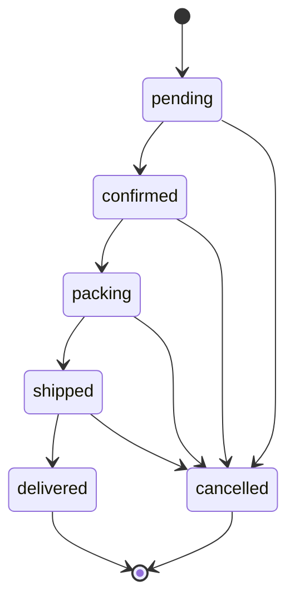
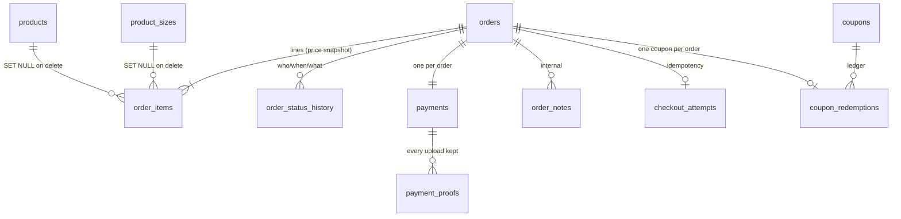

# 01b — Commerce Schema (Orders, Payments, Coupons, Fulfilment)

This document specifies the **commerce half** of the Sky Fragrances database: everything
that comes into existence at the moment a guest presses *Place Order*, and everything that
happens to that order afterwards. It is the companion to the catalogue half (`collections`,
`products`, `product_sizes`, `product_images`, `reviews`, `settings`) whose names are fixed by
the cross-stream contract in `07-seed-seo-quality.md §0.2`. Every table below is
`InnoDB` / `utf8mb4` / `utf8mb4_unicode_ci`, portable to both MySQL 8+ and MariaDB 10.4+, and
written so a non-developer can import it through phpMyAdmin in one paste. The governing idea
is that **an order is an immutable commercial record**: once written it must render identically
in five years, after the product has been renamed, repriced, discontinued and deleted.

---

## 0. Decisions this document makes

These are settled here so no other stream has to guess.

> Superseded by 08-decisions-register.md §2 — C-07…C-12: `orders` column edits (`phone`→`customer_phone`, `email`→`customer_email`, `order_status`→`status`, `stock_restored`→`stock_restored_at DATETIME NULL`; added `idempotency_key CHAR(32) UNIQUE`, `payment_reference VARCHAR(64) NULL`, `payment_account_snapshot VARCHAR(160) NULL`, `paid_at DATETIME NULL`); order numbers are `SF-YYMMDD-XXXX` random (§4 is void); `payments`, `checkout_attempts` and `order_number_seq` are cut. The amended DDL is reproduced in 08 §2.3.

| Question | Decision | Why |
|---|---|---|
| Money type | `DECIMAL(10,2)` everywhere, PKR | The brief and `07 §0.2` are explicit. `03-storefront-pages.md §1.4` says "unsigned integers in whole rupees" — **that line is superseded**; the display rule (`Rs. 4,950`, no decimals) still holds, the storage rule does not. Percent coupons produce halves; DECIMAL arithmetic in SQL is exact, integer rupees would force rounding decisions into PHP. |
| Payment proof | Its own table, `payment_proofs`, not a column on `payments` | A customer routinely uploads a blurry screenshot, is asked on WhatsApp for a better one, and uploads again. Keeping all attempts is the dispute record. A single column would silently destroy evidence. |
| Enumerations | Short `VARCHAR` strings, never MySQL `ENUM` | Contract `07 §0.2`. Adding a status must never require `ALTER TABLE` on shared hosting. |
| Guest identity | Denormalised onto `orders`; no `customers` table in v1 | The brief says guest checkout, no accounts. A phone-keyed customer table would be a second source of truth for PII with no feature to justify it. Repeat-customer analytics come from `GROUP BY phone_normalized`. |
| Order numbering | `SF-YY-NNNNNN`, allocated from a counter table with atomic `LAST_INSERT_ID()` | §4. Never from `MAX()+1`, never from the auto-increment id. |
| Cascades | Orders **never** cascade-delete. Products deleted from the catalogue do not touch order history. | `ON DELETE RESTRICT` / `SET NULL`, never `CASCADE`, on anything hanging off `orders`. |
| Time | All timestamps `DATETIME`, written by PHP in Asia/Karachi | Shared hosting `time_zone` is unreliable and `TIMESTAMP` would silently re-interpret. One `date_default_timezone_set('Asia/Karachi')` in `config.php` is the single authority. |

Two names are **added to the cross-stream contract** by this document and must be adopted by
the seed and admin streams:

- `coupons.per_phone_limit` `SMALLINT UNSIGNED NULL` — see §6.
- `coupons.used_count` is retained from the contract but is now defined as a **cached
  denormalisation** of `coupon_redemptions`, not the source of truth.

---

## 1. `orders` — the order header

One row per placed order. Written once inside the checkout transaction, then only ever
updated on the operational columns (`order_status`, `payment_status`, courier fields). The
money columns and the PII columns are treated as append-only by convention: nothing in the
admin panel edits them.

```sql
CREATE TABLE orders (
  id                  INT UNSIGNED NOT NULL AUTO_INCREMENT,
  order_number        VARCHAR(16)      NOT NULL,
  access_token        CHAR(32)         NOT NULL,

  customer_name       VARCHAR(120)     NOT NULL,
  customer_phone               VARCHAR(24)      NOT NULL,
  phone_normalized    VARCHAR(16)      NOT NULL,
  customer_email               VARCHAR(190)     NULL,
  city                VARCHAR(80)      NOT NULL,
  address             VARCHAR(500)     NOT NULL,
  postal_code         VARCHAR(12)      NULL,
  customer_note       VARCHAR(500)     NULL,

  subtotal            DECIMAL(10,2)    NOT NULL,
  discount_total      DECIMAL(10,2)    NOT NULL DEFAULT 0.00,
  shipping_fee        DECIMAL(10,2)    NOT NULL DEFAULT 0.00,
  cod_fee             DECIMAL(10,2)    NOT NULL DEFAULT 0.00,
  grand_total         DECIMAL(10,2)    NOT NULL,
  item_count          SMALLINT UNSIGNED NOT NULL,
  currency            CHAR(3)          NOT NULL DEFAULT 'PKR',

  coupon_id           INT UNSIGNED     NULL,
  coupon_code         VARCHAR(40)      NULL,
  coupon_type         VARCHAR(12)      NULL,
  coupon_value        DECIMAL(10,2)    NULL,

  payment_method      VARCHAR(16)      NOT NULL,
  payment_status      VARCHAR(16)      NOT NULL DEFAULT 'unpaid',
  status        VARCHAR(16)      NOT NULL DEFAULT 'pending',

  courier_name        VARCHAR(60)      NULL,
  tracking_number     VARCHAR(60)      NULL,
  tracking_url        VARCHAR(255)     NULL,
  shipped_at          DATETIME         NULL,
  delivered_at        DATETIME         NULL,
  cancelled_at        DATETIME         NULL,
  cancel_reason       VARCHAR(255)     NULL,
  stock_restored_at   DATETIME         NULL,                -- 08 C-07/C-12 (was stock_restored TINYINT)
  idempotency_key     CHAR(32)         NOT NULL,            -- 08 C-11 (UNIQUE uq_orders_idempotency)
  payment_reference   VARCHAR(64)      NULL,                -- 08 C-08 (customer-typed TID)
  payment_account_snapshot VARCHAR(160) NULL,               -- 08 C-08 (receiving account shown at checkout)
  paid_at             DATETIME         NULL,                -- 08 C-08

  ip_hash             CHAR(64)         NULL,
  user_agent          VARCHAR(255)     NULL,
  source              VARCHAR(20)      NOT NULL DEFAULT 'web',

  created_at          DATETIME         NOT NULL,
  updated_at          DATETIME         NOT NULL,

  PRIMARY KEY (id),
  UNIQUE KEY uq_orders_number (order_number),
  KEY idx_orders_phone_norm (phone_normalized),
  KEY idx_orders_track (order_number, phone_normalized),
  KEY idx_orders_status_created (order_status, created_at),
  KEY idx_orders_paystatus_created (payment_status, created_at),
  KEY idx_orders_created (created_at),
  KEY idx_orders_coupon (coupon_id),
  CONSTRAINT fk_orders_coupon FOREIGN KEY (coupon_id)
    REFERENCES coupons (id) ON DELETE SET NULL ON UPDATE CASCADE
) ENGINE=InnoDB DEFAULT CHARSET=utf8mb4 COLLATE=utf8mb4_unicode_ci;
```

### 1.1 Columns

| Column | Type | Purpose / rule |
|---|---|---|
| `order_number` | `VARCHAR(16)` | Public identifier, `SF-26-000418`. The only order id ever shown to a customer or printed on a slip. Unique — the last line of defence behind §4. |
| `access_token` | `CHAR(32)` | 16 random bytes hex-encoded, from `bin2hex(random_bytes(16))`. Gates `/order/{order_number}` (route 20) so the confirmation page cannot be enumerated. Emailed in the confirmation link; never shown on screen. |
| `customer_name` | `VARCHAR(120)` | **PII.** |
| `customer_phone` (08 C-07; was `phone`) | `VARCHAR(24)` | **PII.** Exactly as typed (`0300-1234567`, `+92 300 1234567`). Kept verbatim so the client recognises it on WhatsApp. |
| `phone_normalized` | `VARCHAR(16)` | **PII.** Derived: strip non-digits, drop a leading `0`, drop a leading `92`, prefix `+92` → `+923001234567`. This is the *only* column used for matching (track-order, coupon per-phone limit, repeat-customer lookup). Never displayed. |
| `customer_email` (08 C-07; was `email`) | `VARCHAR(190)` | **PII.** Optional per the brief; `NULL` when the customer skips it. 190 not 255 so it stays indexable under the 3072-byte utf8mb4 key limit if an index is ever added. |
| `city`, `address`, `postal_code` | | **PII.** One free-text address line per the brief; no structured province field in v1 — Pakistani courier slips take the city name. |
| `customer_note` | `VARCHAR(500)` | Customer's own delivery note. Distinct from `order_notes` (§8), which is internal. |
| `subtotal` | `DECIMAL(10,2)` | Sum of `order_items.line_total`. Recomputed server-side at checkout; the browser's number is never trusted. |
| `discount_total` | `DECIMAL(10,2)` | Coupon discount actually applied, already clamped to `subtotal` (a fixed coupon larger than the cart discounts to zero, never negative). |
| `shipping_fee` | `DECIMAL(10,2)` | Snapshot of `settings.shipping_fee`, or `0.00` when `subtotal - discount_total >= settings.free_shipping_threshold`. Snapshotting matters: the client edits these in Settings and must not retroactively change last month's orders. (Superseded by 08 §2.4 C-43: the predicate is `subtotal >= free_shipping_threshold` — the **pre-discount** subtotal, 06a §4.1. The value is whatever the single 06a §2.2 function returned inside the transaction.) |
| `cod_fee` | `DECIMAL(10,2)` | Reserved, `0.00` in v1. Present now because adding a money column to a live orders table on shared hosting is the kind of task that gets a non-developer stuck. |
| `grand_total` | `DECIMAL(10,2)` | `subtotal - discount_total + shipping_fee + cod_fee`. Stored, not computed on read — it is what the customer agreed to pay. |
| `item_count` | `SMALLINT UNSIGNED` | Sum of `order_items.quantity`. Denormalised for the admin list, which must not join to count. |
| `coupon_id` | FK, nullable | Analytics link. `ON DELETE SET NULL`: deleting a coupon must not delete or block an order. |
| `coupon_code`/`coupon_type`/`coupon_value` | | **Snapshot.** If the client later edits `WELCOME10` from 10% to 15%, this order still explains its own discount. This is why `coupon_id` going `NULL` is harmless. |
| `payment_method` | `VARCHAR(16)` | `cod` \| `bank` \| `jazzcash` \| `easypaisa`. Snapshot — the client can disable a method in Settings without orphaning history. |
| `payment_status` | `VARCHAR(16)` | `unpaid` \| `awaiting_verification` \| `paid` \| `refunded` \| `failed`. Deliberately separate from `order_status`: a COD order is `unpaid` right up to `delivered`. |
| `status` (08 C-07; was `order_status`) | `VARCHAR(16)` | Lifecycle state; vocabulary and transitions in §3. |
| `courier_name`, `tracking_number`, `tracking_url` | | Filled by the admin at the Shipped step. `tracking_url` is stored resolved, not templated, so the track page needs no courier registry. |
| `shipped_at`, `delivered_at`, `cancelled_at` | `DATETIME` | Denormalised milestones. `order_status_history` is the truth; these exist so the admin list can sort and filter without a correlated subquery. They are written in the same statement as the status change. |
| `stock_restored_at` (08 C-07/C-12; was `stock_restored`) | `DATETIME NULL` | Guard timestamp. Cancelling an already-cancelled order must not return stock twice. Set to `1` inside the same transaction that increments `product_sizes.stock`. |
| `ip_hash` | `CHAR(64)` | `hash('sha256', $ip . $pepper)`. Abuse triage (a burst of fake COD orders is the common Pakistani retail problem) without storing a raw IP. |
| `source` | `VARCHAR(20)` | `web` \| `whatsapp` \| `admin`. The client will hand-enter phone orders. |

### 1.2 Indexes and why each exists

| Index | Serves |
|---|---|
| `uq_orders_number` | Uniqueness guarantee for §4, and the single-row lookup for `/order/{n}` and the admin detail page. |
| `idx_orders_track` `(order_number, phone_normalized)` | The track-order query (§9) is an equality match on both columns; this covers it as an index-only condition. Left-most prefix also serves plain `order_number` scans on MariaDB when the optimiser prefers a non-unique key. |
| `idx_orders_phone_norm` | "Show me everything this customer ever ordered" — used by the admin order detail (repeat-customer badge) and by the per-phone coupon check (§6). |
| `idx_orders_status_created` | The admin order list is *always* filtered by status and sorted by newest. Composite in that order so the sort is satisfied by the index. |
| `idx_orders_paystatus_created` | The "payments needing verification" queue — the screen the client opens most often after a bank-transfer order. |
| `idx_orders_created` | Dashboard revenue windows (`created_at >= CURDATE()`, month-to-date) and CSV export ranges. |
| `idx_orders_coupon` | Coupon performance report; also required by MySQL for the FK. |

No index on `email` or `customer_name`: admin search on those is rare and runs against at most
a few thousand rows on this shop's scale — a full scan is cheaper than the write cost.

### 1.3 Guest checkout — where the customer lives

There is no `customers` table and no account. The customer exists **only as columns on
`orders`**, and that is a deliberate design, not a shortcut:

1. The brief states checkout is guest-only. A `customers` table would need a natural key;
   the only candidate is the phone number, which in Pakistani retail is shared between family
   members and re-issued by carriers. Keying identity on it creates wrong merges.
2. An order must be a *snapshot of who ordered and where it went*. If the customer moves house
   and orders again, last month's packing slip must still show last month's address. A joined
   `customers` row would rewrite history exactly the way a joined product row would.
3. PII deletion (a "delete my data" request) is then a single `UPDATE` over the PII columns of
   that customer's orders, leaving the money record intact for the client's books.

**The PII columns are exactly these seven, and nothing outside this list is personal data:**
`customer_name`, `phone`, `phone_normalized`, `email`, `city`, `address`, `postal_code`,
plus `customer_note` (free text, may contain anything) and `ip_hash` (pseudonymous). Any CSV
export, log line or JSON response that includes one of these is a PII surface and must be
justified. The admin CSV export includes them; the storefront track-order response does not
(§9). `ip_hash` and `user_agent` are never exported.

Repeat customers are recognised, not stored:

```sql
SELECT COUNT(*), MAX(created_at)
FROM orders
WHERE phone_normalized = ? AND id <> ? AND order_status <> 'cancelled';
```

---

## 2. `order_items` — the immutable line items

One row per cart line. **Every commercially meaningful value is copied at write time.** After
the insert this row never reads from `products` or `product_sizes` again; the FKs exist only to
let the admin link back to a live product when one still exists.

```sql
CREATE TABLE order_items (
  id                  INT UNSIGNED NOT NULL AUTO_INCREMENT,
  order_id            INT UNSIGNED NOT NULL,

  product_id          INT UNSIGNED NULL,
  product_size_id     INT UNSIGNED NULL,

  product_name        VARCHAR(160)  NOT NULL,
  product_slug        VARCHAR(180)  NOT NULL,
  size_label          VARCHAR(32)   NOT NULL,
  size_ml             SMALLINT UNSIGNED NULL,
  sku                 VARCHAR(48)   NOT NULL,
  image_filename      VARCHAR(160)  NULL,

  unit_price          DECIMAL(10,2) NOT NULL,
  sale_price          DECIMAL(10,2) NULL,
  unit_price_charged  DECIMAL(10,2) NOT NULL,
  quantity            SMALLINT UNSIGNED NOT NULL,
  line_total          DECIMAL(10,2) NOT NULL,
  line_discount       DECIMAL(10,2) NOT NULL DEFAULT 0.00,

  created_at          DATETIME      NOT NULL,

  PRIMARY KEY (id),
  KEY idx_items_order (order_id),
  KEY idx_items_product (product_id),
  KEY idx_items_size (product_size_id),
  CONSTRAINT fk_items_order FOREIGN KEY (order_id)
    REFERENCES orders (id) ON DELETE CASCADE ON UPDATE CASCADE,
  CONSTRAINT fk_items_product FOREIGN KEY (product_id)
    REFERENCES products (id) ON DELETE SET NULL ON UPDATE CASCADE,
  CONSTRAINT fk_items_size FOREIGN KEY (product_size_id)
    REFERENCES product_sizes (id) ON DELETE SET NULL ON UPDATE CASCADE
) ENGINE=InnoDB DEFAULT CHARSET=utf8mb4 COLLATE=utf8mb4_unicode_ci;
```

### 2.1 The price snapshot — named explicitly

These are the columns that make later product edits harmless. This is the question the
document exists to answer, so it is answered without hedging.

| Snapshot column | Copied from | What it protects |
|---|---|---|
| `product_name` | `products.name` | The invoice still says *Azure Oud* after the client renames it *Azure Oud Intense*. |
| `product_slug` | `products.slug` | Lets the admin and the confirmation email link back (`/product/{slug}`) even after a rename, via `slug_redirects`. Purely navigational — never used to re-resolve price. |
| `size_label` | `product_sizes.size_label` | `"100ml"`. The customer bought a 100ml bottle; renaming the size to `"100 ml Eau de Parfum"` must not alter the record. |
| `size_ml` | `product_sizes.size_ml` | Numeric size for courier weight and for reporting by volume. |
| `sku` | `product_sizes.sku` | The client's own stock reference, printed on the packing slip. |
| `image_filename` | primary `product_images.filename` | The order detail and confirmation email render a thumbnail without joining a table whose rows the client deletes freely. |
| `unit_price` | `product_sizes.price` | The **list** price at purchase time — the struck-through number on the invoice. |
| `sale_price` | `product_sizes.sale_price` | The **sale** price at purchase time, or `NULL` if the item was not on sale. Keeping both proves the discount the customer was shown. |
| `unit_price_charged` | computed | `COALESCE(sale_price, unit_price)`. The one number the arithmetic uses. Stored rather than derived so no future reader has to re-implement the `COALESCE` rule and get it wrong. |
| `quantity` | cart | |
| `line_total` | computed | `unit_price_charged * quantity`, rounded half-up to 2dp. `orders.subtotal` is `SUM(line_total)` by definition. |
| `line_discount` | computed | Order-level coupon discount apportioned to this line, for per-product margin reporting. Apportioned by `line_total` weight, largest-remainder so the parts sum exactly to `orders.discount_total`. `0.00` when there is no coupon. |

Invariants enforced by the checkout transaction, not by the schema (no `CHECK`: MariaDB 10.4
and MySQL 8 disagree on enforcement, and a silently-ignored constraint is worse than none):

- `line_total = ROUND(unit_price_charged * quantity, 2)`
- `orders.subtotal = SUM(order_items.line_total)`
- `SUM(order_items.line_discount) = orders.discount_total`
- `orders.item_count = SUM(order_items.quantity)`

A nightly-equivalent integrity check is not scheduled (no cron on the cheapest Hostinger
plans); instead the admin order detail page recomputes these four and shows a red banner if any
disagrees. That surfaces a bug on the screen the client actually opens.

### 2.2 Why `ON DELETE CASCADE` here and nowhere else

`order_items → orders` cascades because an order and its lines are one aggregate: if an order
row is ever hard-deleted (test data, GDPR-style erasure), orphan lines are pure corruption.
Every *other* FK on this table is `SET NULL`: deleting a product must never delete an order
line, and must never be blocked by one. `RESTRICT` would leave the client unable to remove a
discontinued perfume, and they would solve that by deleting the orders.

---

## 3. Status vocabulary and `order_status_history`

### 3.1 The status values (short strings, not `ENUM`)

`orders.order_status` — the brief's lifecycle, lowercased and underscore-free:

| Value | Meaning | Terminal? |
|---|---|---|
| `pending` | Placed. COD not yet confirmed, or manual payment not yet verified. | no |
| `confirmed` | Client has accepted the order (phone confirmation or payment verified). | no |
| `packing` | Being prepared. | no |
| `shipped` | Handed to the courier; `courier_name` + `tracking_number` are now required. | no |
| `delivered` | Money in hand (COD) or parcel received. | yes |
| `cancelled` | Dead. Stock returns once, guarded by `orders.stock_restored_at`. | yes |

`orders.payment_status` — orthogonal, because a COD order is `unpaid` until the rider returns:

| Value | Meaning |
|---|---|
| `unpaid` | Nothing received. Default for `cod`. |
| `awaiting_verification` | Manual transfer: customer submitted a transaction id and/or a proof; the client has not checked it. Default for `bank`/`jazzcash`/`easypaisa`. |
| `paid` | Verified by the client. |
| `failed` | Proof rejected, wrong amount, fake screenshot. |
| `refunded` | Money returned. |

Allowed transitions (anything else is rejected with a flash message, not a 500):



`delivered` is final: there is no un-deliver. A mistaken `delivered` is corrected by a note
(§8), not by a rewind, because the alternative is a client who "fixes" revenue by walking
statuses backwards.

### 3.2 The history table

```sql
CREATE TABLE order_status_history (
  id             INT UNSIGNED NOT NULL AUTO_INCREMENT,
  order_id       INT UNSIGNED NOT NULL,
  field          VARCHAR(16)  NOT NULL DEFAULT 'order_status',
  from_status    VARCHAR(16)  NULL,
  to_status      VARCHAR(16)  NOT NULL,
  note           VARCHAR(500) NULL,
  changed_by     VARCHAR(16)  NOT NULL,
  admin_id       INT UNSIGNED NULL,
  admin_username VARCHAR(60)  NULL,
  ip_hash        CHAR(64)     NULL,
  created_at     DATETIME     NOT NULL,
  PRIMARY KEY (id),
  KEY idx_hist_order_created (order_id, created_at),
  KEY idx_hist_to_created (to_status, created_at),
  CONSTRAINT fk_hist_order FOREIGN KEY (order_id)
    REFERENCES orders (id) ON DELETE CASCADE ON UPDATE CASCADE
) ENGINE=InnoDB DEFAULT CHARSET=utf8mb4 COLLATE=utf8mb4_unicode_ci;
```

**Who / when / what, precisely:**

- **What** — `field` says *which* status moved (`order_status` or `payment_status`), so one
  table records both lifecycles; `from_status` → `to_status` is the change itself. `from_status`
  is `NULL` only for the birth row written inside the checkout transaction
  (`NULL → pending`), which is what makes the timeline start at the customer's own action.
- **When** — `created_at`, written by PHP in Asia/Karachi. Index `(order_id, created_at)` makes
  the timeline on the track page and the admin detail a single ordered range read.
- **Who** — `changed_by` is `customer` \| `admin` \| `system`. When it is `admin`,
  `admin_id` carries the id and `admin_username` carries a **snapshot of the name**, so the
  audit trail survives an admin account being renamed or removed. `admin_id` is intentionally
  *not* a foreign key: the `admins` table belongs to the other schema stream, and an FK here
  would make deleting a staff account either impossible or destructive to the audit log.
- `note` holds the cancel reason, the payment-rejection reason, or the courier handover note.

The storefront timeline (route 22) renders only rows with `field = 'order_status'` and never
exposes `note`, `admin_username` or `ip_hash`.

---

## 4. Order numbers — `SF-YY-NNNNNN`, race-free

> Superseded by 08-decisions-register.md §2 — C-10: order numbers are `SF-YYMMDD-XXXX` (4 random chars from `A-HJ-NP-Z2-9`, UNIQUE + retry, 06b §0.3). `order_number_seq` is not created; §4.1–4.3 below are void. Router regex: `^SF-\d{6}-[A-HJ-NP-Z2-9]{4}$`.

Format: literal `SF`, hyphen, two-digit year in Asia/Karachi, hyphen, six digits zero-padded,
sequence restarting at `1` each calendar year. `SF-26-000418` is the 418th order of 2026.
Regex for the router (route 20/22): `^SF-\d{2}-\d{6}$`.

### 4.1 The mechanism

A dedicated counter table, one row per year:

```sql
CREATE TABLE order_number_seq (
  year_yy   TINYINT UNSIGNED NOT NULL,
  next_val  INT UNSIGNED     NOT NULL,
  PRIMARY KEY (year_yy)
) ENGINE=InnoDB DEFAULT CHARSET=utf8mb4 COLLATE=utf8mb4_unicode_ci;
```

Allocation is **one statement**:

```sql
INSERT INTO order_number_seq (year_yy, next_val) VALUES (:yy, 1)
ON DUPLICATE KEY UPDATE next_val = LAST_INSERT_ID(next_val + 1);
```

then `SELECT LAST_INSERT_ID()` — or `$pdo->lastInsertId()` on the same connection — and format:

```
sprintf('SF-%02d-%06d', $yy, $n)
```

### 4.2 Why it cannot collide

1. `ON DUPLICATE KEY UPDATE` is atomic. InnoDB takes an exclusive lock on the existing
   `year_yy` row for the duration of the statement; a second request updating the same year
   blocks until the first commits. Two connections cannot read the same `next_val`.
2. `LAST_INSERT_ID(expr)` is the documented idiom for "return the value I just wrote" — it sets
   the **session's** last-insert-id to `expr`. It is per-connection state, so a concurrent
   request cannot observe another's value. This works identically on MySQL 8 and MariaDB 10.4;
   it is the sequence-emulation pattern both manuals publish, and it needs no `SEQUENCE` object
   (MariaDB-only) and no stored procedure (which File-Manager deployment cannot reliably load).
3. The first order of a year inserts the row; every later order updates it. The `INSERT` path
   is protected by the primary key: if two first-orders race, one inserts and the other hits the
   duplicate-key branch and updates. There is no read-then-write window anywhere.
4. The allocation runs **inside the checkout transaction**, immediately before the `orders`
   insert, so a rolled-back checkout also rolls back the counter — no gaps from abandoned
   attempts. (Gaps from a crash between allocation and commit are acceptable and invisible;
   the format promises uniqueness, not density.)
5. `UNIQUE KEY uq_orders_number` is the backstop. If any future code path invents a number by
   another route, the insert fails loudly instead of producing two `SF-26-000418`s.

What is explicitly **rejected**: `MAX(order_number)+1` (classic lost-update under concurrency),
deriving the number from `orders.id` (auto-increment gaps leak order volume to competitors and
cannot restart yearly), and `UUID`/random numbers (unreadable over the phone, which is how the
client's customers will quote them).

### 4.3 Year rollover

The year comes from `date('y')` under `Asia/Karachi`, read once at allocation time. At
midnight on 1 January the `INSERT` branch fires for the new `year_yy` and numbering restarts at
`SF-27-000001` with no deploy, no cron and no manual reset. Old years' rows stay as an audit of
annual volume.

---

## 5. `payments` and `payment_proofs`

> Superseded by 08-decisions-register.md §2 — C-08: the `payments` table is CUT. `orders` carries `payment_reference`, `payment_account_snapshot`, `paid_at`; `payment_proofs.order_id` references `orders` directly (replace `payment_id`) and gains `transaction_ref`, `sender_name`, `amount_claimed`, `review_status`, `reviewed_by`, `reviewed_at`, `review_note` from 06b §0.2.

The brief has two manual rails — bank transfer and JazzCash/Easypaisa — where the customer
types a transaction id and uploads a screenshot, plus COD where nothing is collected online.
One `payments` row is created at checkout for every order regardless of method, so the
verification queue is a single uniform query.

```sql
CREATE TABLE payments (
  id                 INT UNSIGNED NOT NULL AUTO_INCREMENT,
  order_id           INT UNSIGNED  NOT NULL,
  method             VARCHAR(16)   NOT NULL,
  status             VARCHAR(16)   NOT NULL DEFAULT 'unpaid',
  amount_expected    DECIMAL(10,2) NOT NULL,
  amount_received    DECIMAL(10,2) NULL,
  transaction_ref    VARCHAR(64)   NULL,
  sender_name        VARCHAR(120)  NULL,
  sender_account     VARCHAR(60)   NULL,
  paid_at            DATETIME      NULL,
  account_label      VARCHAR(120)  NULL,
  account_number     VARCHAR(60)   NULL,
  verified_at        DATETIME      NULL,
  verified_by        INT UNSIGNED  NULL,
  verified_by_name   VARCHAR(60)   NULL,
  rejection_reason   VARCHAR(255)  NULL,
  created_at         DATETIME      NOT NULL,
  updated_at         DATETIME      NOT NULL,
  PRIMARY KEY (id),
  UNIQUE KEY uq_payments_order (order_id),
  KEY idx_payments_status_created (status, created_at),
  KEY idx_payments_ref (transaction_ref),
  CONSTRAINT fk_payments_order FOREIGN KEY (order_id)
    REFERENCES orders (id) ON DELETE CASCADE ON UPDATE CASCADE
) ENGINE=InnoDB DEFAULT CHARSET=utf8mb4 COLLATE=utf8mb4_unicode_ci;
```

| Column | Purpose |
|---|---|
| `uq_payments_order` | One payment record per order in v1. Unique, not just indexed, so a double-submitted proof form can never create a second row — the second attempt updates. Partial payments are out of scope; when they arrive, this unique key is dropped and `amount_received` becomes additive. |
| `amount_expected` | Snapshot of `orders.grand_total` at checkout. The verification screen shows expected vs received side by side, because the common Pakistani fraud is a real screenshot for a smaller amount. |
| `transaction_ref` | The TID the customer types. Indexed: the client's first move on a disputed payment is to search the TID their bank app shows. Not unique — customers mistype, and a duplicate TID should be flagged on screen, not blocked by a 500. |
| `account_label` / `account_number` | **Snapshot of the receiving account** shown to that customer, taken from settings at checkout. The client edits their JazzCash number in Settings; last month's order must still record where that money was told to go. |
| `verified_by` / `verified_by_name` | Same no-FK-plus-snapshot rule as §3.2. |
| `status` | Mirrors `orders.payment_status`; `orders` carries the copy so the order list needs no join, `payments` carries the authority. Both are written in one transaction. |

### 5.1 `payment_proofs` — a table, not a column

```sql
CREATE TABLE payment_proofs (
  id            INT UNSIGNED NOT NULL AUTO_INCREMENT,
  payment_id    INT UNSIGNED NOT NULL,
  order_id      INT UNSIGNED NOT NULL,
  filename      VARCHAR(160) NOT NULL,
  mime_type     VARCHAR(40)  NOT NULL,
  byte_size     INT UNSIGNED NOT NULL,
  sha256        CHAR(64)     NOT NULL,
  uploaded_by   VARCHAR(16)  NOT NULL DEFAULT 'customer',
  status        VARCHAR(16)  NOT NULL DEFAULT 'pending',
  created_at    DATETIME     NOT NULL,
  PRIMARY KEY (id),
  KEY idx_proofs_payment (payment_id),
  KEY idx_proofs_order (order_id),
  KEY idx_proofs_sha (sha256),
  CONSTRAINT fk_proofs_payment FOREIGN KEY (payment_id)
    REFERENCES payments (id) ON DELETE CASCADE ON UPDATE CASCADE,
  CONSTRAINT fk_proofs_order FOREIGN KEY (order_id)
    REFERENCES orders (id) ON DELETE CASCADE ON UPDATE CASCADE
) ENGINE=InnoDB DEFAULT CHARSET=utf8mb4 COLLATE=utf8mb4_unicode_ci;
```

> Amended by 08-decisions-register.md §2.4 — C-57 / C-65: the canonical `payment_proofs` (C-08 columns, keyed on `order_id`) also carries `file_path VARCHAR(160) NULL` (NULL = the post-commit write failed or the file has been purged) and `purged_at DATETIME NULL`. The privacy purge (`/admin/tools/purge`, 05b §0.4) deletes the file and sets `file_path = NULL, purged_at = :now` for orders `delivered`/`cancelled` more than 90 days ago; the row, `transaction_ref` and verdict are kept.

The decision, stated plainly: **a separate table, because re-uploads are the normal case.**
A customer sends a cropped screenshot, the client asks for a clearer one on WhatsApp, a second
arrives. A `payments.proof_filename` column would overwrite the first — destroying evidence in
exactly the situation where evidence is needed. Rows are append-only; rejection sets `status`.

`filename` is the stored name only (random, e.g. `pp_9f3c…jpg`), never the customer's original
name; the directory is fixed at `/uploads/proofs/` and is not a column, so a path can never be
traversed out of a database value. `sha256` indexed makes "this same screenshot was already
used on three other orders" a one-query check — the highest-yield fraud signal on this shop.
Proof files are served through a PHP gate that checks an admin session; `/uploads` itself has
PHP execution disabled per `03 §1.1`.

---

## 6. Coupons — global limit *and* per-phone limit

`coupons` keeps the contract columns from `07 §0.2` and gains one:

```sql
ALTER TABLE coupons
  ADD COLUMN per_phone_limit SMALLINT UNSIGNED NULL AFTER usage_limit;
```

`usage_limit` = total redemptions allowed across the whole shop (`NULL` = unlimited).
`per_phone_limit` = redemptions allowed per `phone_normalized` (`NULL` = unlimited; `1` is the
value `WELCOME10` ships with, which is what "welcome" is supposed to mean). Both are enforced
against one ledger:

```sql
CREATE TABLE coupon_redemptions (
  id               INT UNSIGNED NOT NULL AUTO_INCREMENT,
  coupon_id        INT UNSIGNED  NOT NULL,
  order_id         INT UNSIGNED  NOT NULL,
  code             VARCHAR(40)   NOT NULL,
  phone_normalized VARCHAR(16)   NOT NULL,
  discount_amount  DECIMAL(10,2) NOT NULL,
  order_subtotal   DECIMAL(10,2) NOT NULL,
  status           VARCHAR(12)   NOT NULL DEFAULT 'applied',
  created_at       DATETIME      NOT NULL,
  PRIMARY KEY (id),
  UNIQUE KEY uq_redemption_order_coupon (order_id, coupon_id),
  KEY idx_redeem_coupon_phone (coupon_id, phone_normalized, status),
  KEY idx_redeem_coupon_status (coupon_id, status),
  CONSTRAINT fk_redeem_coupon FOREIGN KEY (coupon_id)
    REFERENCES coupons (id) ON DELETE RESTRICT ON UPDATE CASCADE,
  CONSTRAINT fk_redeem_order FOREIGN KEY (order_id)
    REFERENCES orders (id) ON DELETE CASCADE ON UPDATE CASCADE
) ENGINE=InnoDB DEFAULT CHARSET=utf8mb4 COLLATE=utf8mb4_unicode_ci;
```

`ON DELETE RESTRICT` on `coupon_id` is the one place deletion is blocked: a coupon with
redemptions must be deactivated (`is_active = 0`), never deleted, or the client loses the
explanation for money already discounted. The admin UI hides Delete once a redemption exists.

**Enforcement, inside the checkout transaction, in this order:**

1. `SELECT ... FROM coupons WHERE code = ? AND is_active = 1 FOR UPDATE` — the row lock is what
   serialises two simultaneous redemptions of the last available use.
2. Reject on window: `starts_at` in the future, `expires_at` past (both compared in Asia/Karachi).
3. Reject if `subtotal < min_order_total`.
4. Global: `usage_limit IS NOT NULL` and
   `SELECT COUNT(*) FROM coupon_redemptions WHERE coupon_id = ? AND status = 'applied'` `>= usage_limit` → reject.
   > Superseded by 08-decisions-register.md §2.4 — C-44: the global limit is checked **only** by the guarded `UPDATE coupons SET used_count = used_count + 1 WHERE id = ? AND is_active = 1 AND (usage_limit IS NULL OR used_count < usage_limit)` with `rowCount() === 1` (06b §1.5 step 5). The ledger count is not consulted for the global limit.
5. Per-phone: `per_phone_limit IS NOT NULL` and the same count with
   `AND phone_normalized = ?` `>= per_phone_limit` → reject. Served by `idx_redeem_coupon_phone`.
6. Compute the discount, insert the redemption row, snapshot `coupon_code`/`type`/`value` onto
   the order, and `UPDATE coupons SET used_count = used_count + 1`.

`used_count` is a **cache for the admin list only**; every limit decision counts the ledger.
If a drifted counter ever contradicts the ledger, the ledger wins and the admin coupon page
offers a one-click recount. Cancelling an order sets the redemption's `status = 'reverted'` and
decrements `used_count`, which returns the use to the customer — the behaviour a shop owner
expects when they cancel a duplicate order.
> Superseded by 08-decisions-register.md §2.4 — C-44: **`coupons.used_count` is authoritative for the global limit**; `coupon_redemptions` is the audit trail and the only per-phone check. **There is no recount feature** — it would let a seeded or hand-set counter (07 A.3 seeds `FIRST50` at 50/50 with no ledger rows) reopen a closed code. Cancellation as described (status `reverted` + decrement, one transaction) stands and wins over 06a §3.7's delete.

Counting the ledger rather than the counter is what makes the per-phone rule honest: the
counter cannot express "per phone" at all, and any design that tries ends up with a second
counter that drifts twice as fast.

---

## 7. Double-submit protection — `checkout_attempts`

> Superseded by 08-decisions-register.md §2 — C-11: table CUT. `orders.idempotency_key CHAR(32)` with `UNIQUE uq_orders_idempotency` is the guard; a duplicate-key exception on insert redirects to the existing order (06b §2).

The failure this prevents: a customer on a weak mobile connection taps *Place Order*, sees
nothing happen, taps again, and two identical orders are created and two lots of stock are
decremented.

```sql
CREATE TABLE checkout_attempts (
  id               INT UNSIGNED NOT NULL AUTO_INCREMENT,
  idempotency_key  CHAR(40)     NOT NULL,
  session_id_hash  CHAR(64)     NULL,
  order_id         INT UNSIGNED NULL,
  state            VARCHAR(12)  NOT NULL DEFAULT 'in_progress',
  created_at       DATETIME     NOT NULL,
  completed_at     DATETIME     NULL,
  PRIMARY KEY (id),
  UNIQUE KEY uq_attempt_key (idempotency_key),
  KEY idx_attempt_created (created_at),
  CONSTRAINT fk_attempt_order FOREIGN KEY (order_id)
    REFERENCES orders (id) ON DELETE SET NULL ON UPDATE CASCADE
) ENGINE=InnoDB DEFAULT CHARSET=utf8mb4 COLLATE=utf8mb4_unicode_ci;
```

1. The checkout page renders a hidden `idempotency_key` — 20 random bytes hex — generated once
   per page load and stored in the session alongside the CSRF token.
2. `POST /checkout` first runs `INSERT INTO checkout_attempts (idempotency_key, …) VALUES (…)`.
   The unique key makes this the gate: the **second** submit gets a duplicate-key error.
3. On duplicate, the handler re-reads the row. `state = 'done'` → 303-redirect to the existing
   `/order/{order_number}?t=…`; the customer sees their real order, not a second one.
   `state = 'in_progress'` → show "we are still placing your order" and re-check, rather than
   racing the first request.
4. On success the attempt is marked `done` with its `order_id` in the same transaction as the
   order insert. On failure it is marked `failed` and the page re-renders with a fresh key.

This is a database-level guarantee, not a JS button-disable — the brief's customers are on
phones where the JS may not have run. Rows older than 7 days are pruned opportunistically on
checkout (1-in-50 requests), because shared hosting has no dependable cron.

---

## 8. `order_notes` — internal annotations

```sql
CREATE TABLE order_notes (
  id           INT UNSIGNED NOT NULL AUTO_INCREMENT,
  order_id     INT UNSIGNED NOT NULL,
  body         VARCHAR(1000) NOT NULL,
  author_type  VARCHAR(16)   NOT NULL DEFAULT 'admin',
  admin_id     INT UNSIGNED  NULL,
  admin_name   VARCHAR(60)   NULL,
  is_pinned    TINYINT(1)    NOT NULL DEFAULT 0,
  created_at   DATETIME      NOT NULL,
  PRIMARY KEY (id),
  KEY idx_notes_order_created (order_id, created_at),
  CONSTRAINT fk_notes_order FOREIGN KEY (order_id)
    REFERENCES orders (id) ON DELETE CASCADE ON UPDATE CASCADE
) ENGINE=InnoDB DEFAULT CHARSET=utf8mb4 COLLATE=utf8mb4_unicode_ci;
```

Separate from `order_status_history.note` because most notes accompany no status change
("customer asked to deliver after 6pm", "rider could not reach, retry tomorrow"). Never shown
to the customer — not on the confirmation page, not on the track page, not in any email.
`is_pinned` floats the one note the client wants at the top of the order detail.

---

## 9. Track-order lookup (route 21/22)

The form takes **order number + phone**, and the query is exactly:

```sql
SELECT id, order_number, order_status, payment_method, payment_status,
       courier_name, tracking_number, tracking_url, grand_total, created_at
FROM orders
WHERE order_number = :num AND phone_normalized = :phone
LIMIT 1;
```

- The typed phone is normalised with the same function as checkout before binding, so
  `0300-1234567`, `+92 300 1234567` and `92 300 1234567` all match one stored value. Matching on
  raw `phone` would fail for most customers and generate support messages.
- Index: `idx_orders_track (order_number, phone_normalized)` covers both equality predicates.
  `uq_orders_number` alone would work, but the composite lets InnoDB reject a wrong-phone guess
  from the index without touching the row.
- Both must match. The order number alone is guessable — `SF-26-000417` is one below
  `SF-26-000418` — so the phone is the shared secret. A mismatch returns one generic
  "no order found with those details", never "wrong phone", which would confirm the number exists.
- Rate limit: 8 lookups per IP per 10 minutes, counted in the same `admin_login_attempts`-style
  Superseded by 08-decisions-register.md §2 — C-42: counted in `rate_limits` (bucket `track`, 06b §0.2), not an `admin_login_attempts` clone.
  fashion, to stop enumeration of the whole year's numbers.
- The timeline is `order_status_history` filtered to `field = 'order_status'`, ordered by
  `created_at`. The response carries **no PII** — no name, no address, no email — only status,
  courier, tracking and total. Someone who already knows the number and the phone learns nothing
  new about the customer.

---

## 10. Object graph and creation order



`install.php` and `db/schema.sql` must create tables in this order, because FKs are declared
inline: `collections` → `products` → `product_sizes` → `product_images` → `coupons` →
`orders` → `order_items` → `order_status_history` →
`payment_proofs` → `coupon_redemptions` → `order_notes` → `email_outbox` → `rate_limits`. (08 C-08/C-10/C-11: `order_number_seq`, `payments`, `checkout_attempts` are not created.)

Portability checklist for this file's DDL, verified against both engines: no `ENUM`, no `CHECK`,
no `JSON`, no functional or expression defaults, no `ON UPDATE CURRENT_TIMESTAMP` (PHP writes
`updated_at`), no `utf8mb4_0900_ai_ci`, every index under the 3072-byte key limit, and every
`CREATE TABLE` carrying an explicit `ENGINE`, `CHARSET` and `COLLATE` so a phpMyAdmin import
cannot inherit a server default that breaks the em dashes in §0.3 of the seed document.
