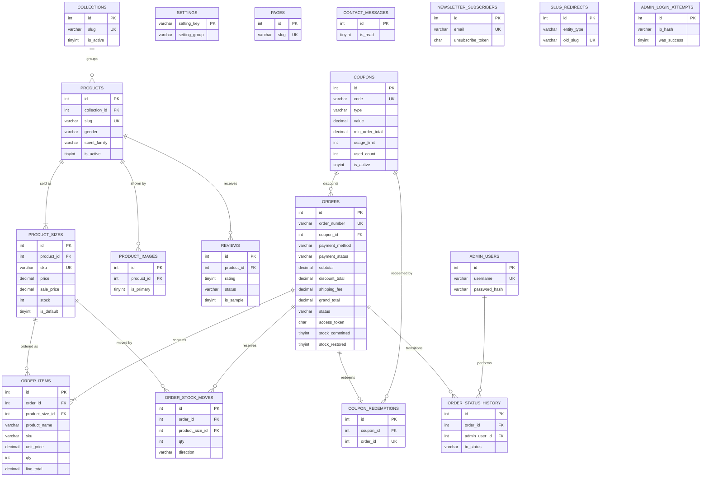

# 01c — Schema Rules, Invariants & ERD

This document owns the **cross-cutting data decisions** for Sky Fragrances: how money is
stored and rounded, how stock is decremented so it can never go negative, how stock is
restored exactly once when an order is cancelled, what character set / collation / time
zone everything uses, the naming rules every table must obey, the full entity-relationship
diagram, and the exact order in which tables must be created and populated given the
foreign keys. It is a rules document, not a catalogue: `01a-schema-catalogue.md` owns the
catalogue-side DDL (collections, products, sizes, images, reviews) and
`01b-schema-commerce.md` owns the commerce-side DDL (orders, items, coupons, settings,
admin). **Neither of those files existed when this was written**, so every table and column
named here is written against the cross-stream naming contract in
`07-seed-seo-quality.md` §0.2, and the commerce-side names (`orders`, `order_items`,
`order_status_history`, `order_stock_moves`, `coupon_redemptions`, `contact_messages`,
`newsletter_subscribers`, `pages`, `admin_users`) are **proposed here and become the
contract** unless 01b, when written, says otherwise — in which case 01b wins on names and
this document wins on behaviour.

---

## 1. Money

### 1.1 The storage decision

Every monetary column is:

```sql
price DECIMAL(10,2) UNSIGNED NOT NULL DEFAULT 0.00
```

`DECIMAL(10,2)`, unsigned, PKR, never `FLOAT`, never `DOUBLE`, never `INT`. Ten digits
gives a ceiling of Rs. 99,999,999.99 — far past any plausible perfume order — and the two
decimal places are kept for arithmetic safety even though retail prices are whole rupees.

**Conflict to resolve:** `03-storefront-pages.md` §1.4 says prices are unsigned integers in
whole rupees. That is superseded here — the brief and `07-seed-seo-quality.md` §0.2 both say
`DECIMAL(10,2)`. Doc 03 should be amended; until it is, **this section wins**. What survives
from 03 §1.4 is the display format and the round-half-up rule.

Columns that are money, and therefore `DECIMAL(10,2) UNSIGNED`:

| Table | Columns |
|---|---|
| `product_sizes` | `price`, `sale_price` (nullable — `NULL` means "not on sale", never `0.00`) |
| `coupons` | `value` (rupees when `type='fixed'`; percent 0–100 when `type='percent'`), `min_order_total` |
| `orders` | `subtotal`, `discount_total`, `shipping_fee`, `grand_total` |
| `order_items` | `unit_price`, `line_total` |
| `settings` | shipping keys are stored as text in `setting_value` and cast on read (see §1.5) |

`sale_price` nullable is load-bearing: `COALESCE(sale_price, price)` is the effective price
everywhere, and a `0.00` sentinel would silently make products free.

### 1.2 The rounding rule

Retail PKR is whole rupees. There are no paisa in circulation. Therefore:

1. **Rounding happens exactly once per computed amount, server-side, at the moment of
   calculation**, using round-half-up to 0 decimal places:
   `round($v, 0, PHP_ROUND_HALF_UP)`, stored back as `number_format($v, 2, '.', '')`.
2. The amounts that get rounded are: a percent coupon's discount, a free-shipping or
   flat-shipping fee derived from a percentage (there is none in v1, but the rule stands),
   and nothing else.
3. **Rounding must NOT happen** to: `product_sizes.price` / `sale_price` (the admin types
   whole rupees; they are stored as typed), `order_items.unit_price` (copied verbatim from
   the effective size price at order time), `line_total` (`unit_price * qty` — exact by
   construction because unit prices are whole), `subtotal` (the exact sum of line totals),
   or `grand_total` (`subtotal - discount_total + shipping_fee` — exact once the discount
   is already rounded).
4. **Rounding must NOT happen at display time.** The display helper formats; it does not
   round. If a stored value has a non-zero paisa component, that is a bug upstream and the
   site should show it rather than hide it during testing.
5. **Rounding must NOT happen in the browser.** JS may render an optimistic subtotal in the
   cart drawer, but the server recomputes every amount on `POST /checkout` from
   `product_sizes` and `coupons` as they are at that instant, and the server's numbers are
   the ones written to `orders`. A browser-supplied price is never read.

Worked example — cart of Rs. 5,450 + Rs. 8,450 = Rs. 13,900 subtotal, `WELCOME10`
(10%, min Rs. 3,000), shipping Rs. 250:

```
discount_raw   = 13900.00 * 0.10 = 1390.00
discount_total = round(1390.00)  = 1390.00      <- the one rounding step
shipping_fee   =                    250.00      (or 0.00 if subtotal >= free threshold)
grand_total    = 13900.00 - 1390.00 + 250.00 = 12760.00
```

A percent coupon can never take `grand_total` below `shipping_fee`; `discount_total` is
clamped to `MIN(discount_raw, subtotal)` before rounding so a fixed coupon larger than the
cart cannot produce a negative total. `orders.grand_total` is `UNSIGNED`, so a negative
would be a hard write error rather than a silent zero — that is intentional.

### 1.3 The display helper contract

One function, in `app/lib/money.php` (08 C-02/C-23; was `/includes/format.php`), used by every view, admin screen, invoice and
email. No view ever calls `number_format()` directly.

```
money(string|float $value, bool $withDecimals = false): string
```

- Input is the raw column value (a PDO `DECIMAL` comes back as a **string** — pass it
  through as a string; do not cast to float on the way in).
- Output: `Rs.` + U+00A0 (non-breaking space) + thousands-separated integer part.
  `money('4950.00')` → `Rs. 4,950`. `money('13950.00')` → `Rs. 13,950`.
- `$withDecimals = true` appends `.00`-style paisa and is used in exactly two places: the
  CSV order export and the printed invoice's total line, where an auditor may want them.
- `money('0.00')` → `Rs. 0`. Free shipping renders as the literal string `Free`, decided by
  the caller, not by the helper.
- The helper is display-only. It never rounds, never parses, and its output never re-enters
  a calculation or a database write.
- A second helper `money_attr(string $value): string` returns the bare `4950.00` form for
  JSON-LD `offers.price` and `<meta itemprop="price">`, where Google requires a plain
  decimal with no currency symbol and no separators. Currency is emitted separately as
  `PKR`.

---

## 2. The stock-safe decrement pattern

This is the single most important rule in the schema. The brief requires that stock is
decremented on order and **cannot go negative**. On shared hosting with no queue, no lock
service and concurrent shoppers, the only reliable way to do that is to let the database
decide, in one statement, with the guard in the `WHERE` clause.

### 2.1 The statement

```sql
UPDATE product_sizes
   SET stock = stock - :qty
 WHERE id = :id
   AND stock >= :qty;
```

Then, in PHP, the check that makes it work:

```
$stmt->execute([':qty' => $qty, ':id' => $sizeId]);
if ($stmt->rowCount() !== 1) {
    // insufficient stock, or the size was deleted/deactivated mid-checkout
    throw new OutOfStockException($sizeId);
}
```

`rowCount()` is the whole mechanism. Zero affected rows means the guard failed and **no
row changed** — the decrement did not happen, so there is nothing to undo for that line.
MySQL/MariaDB take a row-level exclusive lock on the matched row for the duration of the
statement, so two concurrent requests for the last unit serialise: one gets
`rowCount() === 1`, the other gets `0`.

Caveat: with the default `PDO::MYSQL_ATTR_FOUND_ROWS = false`, `rowCount()` returns
*changed* rows, which coincides with matched rows here because `stock - :qty` always changes
the value. **`MYSQL_ATTR_FOUND_ROWS = true` is banned project-wide** — it would make a failed
guard look like success.

### 2.2 Why SELECT-then-UPDATE is forbidden

```
-- FORBIDDEN
SELECT stock FROM product_sizes WHERE id = :id;      -- reads 1
if ($stock >= $qty) {
    UPDATE product_sizes SET stock = :newStock WHERE id = :id;   -- writes 0
}
```

Two requests can both read `stock = 1`, both pass the PHP check, and both write `0` — one
unit sold twice. The window is milliseconds wide and opens widest during a sale. Worse, an
absolute `:newStock` discards any change made in between, silently erasing a concurrent
admin restock.

The rules, stated as prohibitions:

- Never read stock and then write an absolute stock value. Always write the delta.
- Never validate stock in PHP as the *authority*. PHP may pre-check to give a friendly
  message ("only 2 left"), but the `WHERE stock >= :qty` guard is what decides.
- `SELECT ... FOR UPDATE` is permitted only where an atomic delta is impossible (there is
  no such place in v1). Prefer the guarded `UPDATE`.

### 2.3 The surrounding transaction

Placing an order is one transaction. Either every line is reserved and the order rows
exist, or nothing happened.

1. Validate the cart in PHP (sizes active, product active, qty 1–10 per line).
2. Recompute all money server-side from `product_sizes` and `coupons`.
3. `$pdo->beginTransaction()`.
4. `INSERT INTO orders (...)` — status `pending`, `stock_committed = 0`.
5. For each line, **in the lock order of §2.4**:
   a. run the guarded `UPDATE product_sizes`;
   b. if `rowCount() !== 1` → `$pdo->rollBack()`, re-read that size's current stock, and
      return the shopper to `/cart` with a per-line "no longer available / only N left"
      message. No partial order survives.
   c. `INSERT INTO order_items (...)` with `unit_price` copied from the price used in the
      calculation.
   d. `INSERT INTO order_stock_moves (order_id, product_size_id, qty, direction='out')`.
6. `UPDATE orders SET stock_committed = 1 WHERE id = :orderId`.
   (Superseded by 08-decisions-register.md §2 — C-12: steps 5d and 6 are dropped — no ledger row, no `stock_committed` flag; an `orders` row exists only if its stock decrement committed.)
7. If a coupon was used: `UPDATE coupons SET used_count = used_count + 1 WHERE id = :id
   AND (usage_limit IS NULL OR used_count < usage_limit)` — the same guard-in-the-WHERE
   shape; `rowCount() !== 1` means the coupon was exhausted by someone else during
   checkout, and the transaction rolls back with "this coupon is no longer available".
   Then `INSERT INTO coupon_redemptions (coupon_id, order_id)`.
8. `INSERT INTO order_status_history (order_id, to_status='pending', ...)`.
9. `$pdo->commit()`.
10. **Only after a successful commit**: send the customer and admin emails, and redirect to
    `/order/{order_number}`. Email is never inside the transaction — a slow SMTP handshake
    must not hold row locks on popular sizes, and a mail failure must not roll back a paid
    order. If mail throws, log it and still show the confirmation page.

### 2.4 Lock ordering — the deadlock rule

An order with several lines takes several row locks. Two shoppers buying the same two
sizes in opposite orders deadlock, and InnoDB kills one with error 1213.

**Rule: within a transaction, always touch `product_sizes` rows in ascending `id` order.**
Sort the cart lines by `product_size_id ASC` immediately before step 5 and iterate that
sorted list. Cart display order is a presentation concern and stays whatever the shopper
built; only the write loop is sorted. The same rule applies to the cancel/restore path
(§3) and to any admin bulk stock edit, which must also sort by `id` ASC.

Because every writer takes locks in the same total order, a cycle cannot form, and
deadlock becomes structurally impossible rather than merely unlikely.

Belt and braces: wrap the whole transaction in a retry loop of **at most 2 attempts** on
SQLSTATE `40001` (serialisation failure) or MySQL error `1213`, with a 50ms sleep between.
If the second attempt fails, show the shopper a "please try again" page. Never retry after
a partial commit — the retry re-runs from step 3 on a rolled-back, clean state.

### 2.5 Isolation level

`READ COMMITTED`, set once per connection immediately after connecting:

```sql
SET SESSION TRANSACTION ISOLATION LEVEL READ COMMITTED;
```

Reasoning: the default `REPEATABLE READ` takes gap locks on range scans, so the
`order_number` uniqueness check and the coupon lookup lock ranges they have no business
locking and deadlock unrelated checkouts. `READ COMMITTED` takes fewer locks and its
weakness — non-repeatable reads — is irrelevant here because **no correctness decision is
made from a `SELECT`**; every decision comes from a guarded `UPDATE`'s affected-row count.
That is what makes the weaker level safe, and why §2.1 is mandatory. `SERIALIZABLE` is
rejected: it would make every catalogue read a locking read.

### 2.6 The rollback path

- Any exception between `beginTransaction()` and `commit()` → `rollBack()` in a `finally`
  guard (`if ($pdo->inTransaction()) { $pdo->rollBack(); }`), then rethrow into the
  application error handler.
- A rolled-back checkout leaves **no** `orders` row, **no** `order_items`, **no**
  `order_stock_moves`, no coupon increment, and stock exactly as it was. There is no
  cleanup job, because there is no partial state to clean.
- The shopper's session cart is untouched by a rollback — they land back on `/cart` with
  everything still in it and one explanatory message per failed line.
- An `orders` row therefore only ever exists in a fully stock-committed state. Anything
  that finds `stock_committed = 0` on a committed order is looking at data written by hand
  in phpMyAdmin, and the admin panel should refuse to act on it.

---

## 3. Restoring stock on cancel — exactly once

> Superseded by 08-decisions-register.md §2 — C-12: there is no `order_stock_moves` ledger and no `stock_committed` flag. Quantities come from `order_items(product_size_id, quantity)`; the one-way guard is `orders.stock_restored_at IS NULL`, claimed in the same UPDATE that sets `status = 'cancelled'`, `stock_restored_at = :now`. The mechanism below stands with those substitutions.

The brief requires "restore stock on cancel". The failure mode is double restoration: the
owner cancels an order on her phone, the page is slow, she taps again, and 2 units come
back for every 1 that went out. Stock inflation is harder to notice than stock loss, so
this needs a mechanism, not care.

### 3.1 The mechanism: a one-way flag guarded in the WHERE clause

`orders` carries two flags, both `TINYINT(1) UNSIGNED NOT NULL DEFAULT 0`:

- `stock_committed` — set to 1 inside the placing transaction (§2.3 step 6).
- `stock_restored` — set to 1 inside the cancelling transaction, and **never back to 0**.

The cancel transaction, in order:

1. `$pdo->beginTransaction();`
2. Claim the restore, atomically:

```sql
UPDATE orders
   SET stock_restored = 1,
       status         = 'cancelled',
       cancelled_at   = :now
 WHERE id              = :order_id
   AND stock_committed = 1
   AND stock_restored  = 0
   AND status         <> 'cancelled';
```

3. `if ($stmt->rowCount() !== 1) { $pdo->rollBack(); return AlreadyCancelled; }`
   — a second click, a double-submitted form, a re-run of an admin script, or a race
   between two admin sessions all land here and do nothing. This is the idempotency
   mechanism: **the claim and the state change are the same statement**, so only one
   caller can ever win.
4. Read the moves for this order, sorted for the lock rule:

```sql
SELECT product_size_id, qty
  FROM order_stock_moves
 WHERE order_id = :order_id AND direction = 'out'
 ORDER BY product_size_id ASC;
```

5. For each row, `UPDATE product_sizes SET stock = stock + :qty WHERE id = :id;`
   No guard is needed on the way up — stock returning is always legal — but the ascending
   `id` order from §2.4 still applies so cancels cannot deadlock against checkouts.
   Rows are read from `order_stock_moves`, **not** from `order_items`, so that a later
   admin edit to an order's lines can never change how much stock comes back.
6. `INSERT INTO order_stock_moves (order_id, product_size_id, qty, direction='in')` for
   each — the ledger records the return as its own row, giving a complete audit trail.
7. `INSERT INTO order_status_history (order_id, from_status, to_status='cancelled', ...)`.
8. If the order consumed a coupon:
   `UPDATE coupons SET used_count = used_count - 1 WHERE id = :id AND used_count > 0;`
   Guarded so it can never go negative. Safe to include because step 3 has already
   guaranteed this block runs at most once for this order.
9. `$pdo->commit();`

### 3.2 Supporting invariants

- `order_stock_moves` has `UNIQUE KEY uk_order_stock_moves_line (order_id,
  product_size_id, direction)`. A second `out` or `in` for the same line fails with a
  duplicate-key error and rolls the transaction back rather than corrupting stock.
- Reopening a cancelled order is allowed **only** on a path that re-runs the §2 decrement
  and clears `stock_restored` in the same transaction. **v1 has no such path** — the admin
  re-enters the order. Stated so nobody adds a naive "undo cancel" button later.
- `status = 'cancelled'` is the only status that triggers restoration. `delivered` does
  not. There is no partial-line cancel in v1; cancelling is all-or-nothing per order.

---

## 4. Character set, collation, time zone, dates

### 4.1 Character set and collation

- Every table and every text column: `CHARACTER SET utf8mb4 COLLATE utf8mb4_unicode_ci`.
- **`utf8mb4_0900_ai_ci` is banned** — it does not exist on MariaDB and would make the
  dump un-importable on Hostinger. So is `utf8mb4_general_ci` (different sort order,
  invites silent collation mismatches on joins).
- Declared at three levels so no default can leak in: on `CREATE DATABASE`, on every
  `CREATE TABLE`, and at the top of every `.sql` file as
  `SET NAMES utf8mb4 COLLATE utf8mb4_unicode_ci;`.
  > Amended by 08-decisions-register.md §2.4 — C-55: **no `CREATE DATABASE` and no `USE` in any shipped `.sql`** — a Hostinger DB user has no `CREATE DATABASE` privilege and the database name is assigned by hPanel, so the line would stop the phpMyAdmin import at statement 1. Collation is declared on every `CREATE TABLE` and by `SET NAMES`; every `CREATE TABLE` also carries `ROW_FORMAT=DYNAMIC` so a legacy MariaDB account with `innodb_default_row_format=COMPACT` (767-byte index cap) still accepts `VARCHAR(190) UNIQUE` under utf8mb4.
- The PDO DSN carries `;charset=utf8mb4`.
- `.sql` files are saved **UTF-8 without BOM** — a BOM breaks the phpMyAdmin import that
  the client will actually use.
- `utf8mb4_unicode_ci` is case-insensitive, so `UNIQUE` on `slug`, `coupons.code` and
  `admin_users.username` is too — `WELCOME10` and `welcome10` are the same coupon, as wanted.
- utf8mb4 is 4 bytes/char, so every indexed string column is `VARCHAR(191)` or shorter
  (slugs, emails, SKUs, coupon codes, `order_number`). Long text is never indexed.

### 4.2 Time zone — store Asia/Karachi local time

**Decision: store local Asia/Karachi wall-clock time in `DATETIME` columns. Do not store
UTC. Do not use `TIMESTAMP`.**

The deciding fact is that **Pakistan has observed no daylight saving since 2009 and sits on
a fixed UTC+05:00 offset**. With no DST there is no ambiguous or skipped local hour, so the
usual reason to prefer UTC does not apply. Then:

- The client is a non-developer who will read `orders` in phpMyAdmin. A row that says
  `2026-09-25 14:30:00` must mean half past two in Karachi, not half past seven.
- `TIMESTAMP` is silently converted by the server using `@@session.time_zone`, and shared
  hosting does not load the MySQL time-zone tables, so `SET time_zone = 'Asia/Karachi'`
  fails there while `'+05:00'` works. `DATETIME` is stored and returned verbatim and is
  immune to a server-default change during a Hostinger migration.
- There is no multi-region requirement, ever. One shop, one country.

Enforced in three places, all three required:

1. `date_default_timezone_set('Asia/Karachi');` at the top of the bootstrap, before any
   `date()` call.
2. `SET time_zone = '+05:00';` executed on every PDO connection (numeric offset, never the
   named zone), so that any stray `NOW()` / `CURDATE()` agrees with PHP — immediately followed by
   `SET SESSION sql_mode = 'STRICT_ALL_TABLES,NO_ZERO_DATE,NO_ZERO_IN_DATE,ERROR_FOR_DIVISION_BY_ZERO'`
   (08 C-55). C-03's "UNSIGNED is the loud failure" holds only under strict mode, which is the
   host's `my.cnf` choice unless the app sets it; a permissive MariaDB image would otherwise clamp
   `stock - 5` on `3` to `0` with a warning. 07 B.4.4 tests that such an `UPDATE` raises error 1264.
   `DECIMAL(10,2) UNSIGNED` is deprecated from MySQL 8.0.17 and warns on the local MySQL 9.3 — the
   warning is accepted (MariaDB does not emit it); verified once in stage 1 and recorded.
3. All `created_at` / `updated_at` values are written from PHP
   (`date('Y-m-d H:i:s')`), not from `NOW()` and not from a column default. This is also
   forced by the portability rule: `DEFAULT CURRENT_TIMESTAMP` on more than one column per
   table is a MySQL/MariaDB version minefield, and functional defaults are banned outright.

Column shapes:

| Purpose | Type | Nullable |
|---|---|---|
| `created_at` | `DATETIME NOT NULL` | no — always written by PHP on insert |
| `updated_at` | `DATETIME NULL` | yes — `NULL` until first edit, then written by PHP |
| Lifecycle stamps (`approved_at`, `paid_at`, `shipped_at`, `delivered_at`, `cancelled_at`) | `DATETIME NULL` | yes — `NULL` means "has not happened" |
| Coupon window (`starts_at`, `expires_at`) | `DATETIME NULL` | yes — `NULL` means unbounded on that side |
| Date-only facts (none in v1) | `DATE` | — |

Coupon validity is therefore `(starts_at IS NULL OR starts_at <= :now) AND (expires_at IS
NULL OR expires_at >= :now)` with `:now` bound from PHP — never `NOW()`, so the check is
testable by passing a fixed time.

### 4.3 How dates are displayed

- Storefront: `24 Sep 2026` (`d M Y`) — matches `03-storefront-pages.md` §1.4.
- Order status timeline and confirmation page: `24 Sep 2026, 2:30 PM` (`d M Y, g:i A`).
- Admin lists: `Today, 2:30 PM` / `Yesterday, 2:30 PM`, else `24 Sep 2026`.
- CSV export and printed invoice: `2026-09-24 14:30` — sortable and Excel-safe.
- JSON-LD and `<time datetime="">`: ISO-8601 **with the offset**,
  `2026-09-24T14:30:00+05:00` — the one place the offset is written out, formed from the
  stored local value plus the constant `+05:00`.
- One helper per format in `app/lib/text.php` (08 C-23) (`date_short()`, `date_long()`,
  `date_iso()`); views never call `date()` on a raw column.

---

## 5. Naming conventions (rules, not suggestions)

1. **Tables are plural, `snake_case`**: `products`, `product_sizes`, `order_items`.
   Join/child tables read as `parent_child`: `product_images`, `order_status_history`,
   `coupon_redemptions`. No prefixes — the database is dedicated to this shop.
2. **Columns are singular `snake_case`.** No table prefix inside its own table
   (`products.name`, never `products.product_name`). The one exception is `settings`,
   whose columns are `setting_key` / `setting_value` / `setting_group` because `key` and
   `value` are reserved words in MySQL.
3. **Primary key is always `id`**, `INT UNSIGNED NOT NULL AUTO_INCREMENT` — never composite,
   never natural. Business identifiers (`slug`, `sku`, `order_number`, `code`) get a
   `UNIQUE` index, never the PK, so they stay renameable.
4. **Foreign key columns are `{singular_referenced_table}_id`**: `collection_id`,
   `product_id`, `product_size_id`, `order_id`, `coupon_id`. A column ending in `_id` is a
   foreign key or it is misnamed.
   Exception (08 C-18): `admin_activity_log.admin_id` and `order_status_history.admin_id` are deliberately not FK-constrained, with a snapshot `admin_username` beside them, so audit rows survive an account deletion.
5. **FK constraints are named `fk_{child_table}_{column}`** (`fk_product_sizes_product_id`),
   explicitly, so a Hostinger error names the relationship, not `products_ibfk_3`.
6. **Index names**: `uk_` for unique, `idx_` for non-unique, then table then columns —
   `uk_products_slug`, `idx_products_collection_active`, `idx_orders_status_created`.
   Full-text indexes are `ft_`.
7. **Booleans are `TINYINT(1) UNSIGNED NOT NULL DEFAULT 0`**, named as a positive assertion
   (`is_active`, `is_primary`, `stock_committed`, `was_success`). Never nullable, never
   negatively named.
8. **Enumerations are short lowercase strings** in `VARCHAR(20)`, never MySQL `ENUM` —
   adding a status must not require DDL. Allowed values live in PHP constants. Contract:
   `products.gender` ∈ `him|her|unisex`; `reviews.status` ∈ `pending|approved|rejected`;
   `coupons.type` ∈ `percent|fixed`; `orders.status` ∈
   `pending|confirmed|packing|shipped|delivered|cancelled`;
   `orders.payment_method` ∈ `cod|bank|jazzcash|easypaisa`;
   `orders.payment_status` ∈ `unpaid|awaiting_verification|paid|failed|refunded` (08 C-09);
   `slug_redirects.entity_type` ∈
   `product|collection|scent|page` (08 C-22).
9. **Ordering columns are `sort_order`**, `INT NOT NULL DEFAULT 0`, seeded in tens so a row
   can be inserted between two others without renumbering. Sorts are always
   `ORDER BY sort_order ASC, id ASC` — the `id` tiebreak makes pagination stable.
10. **Money columns** follow §1.1; quantities are `INT UNSIGNED`; **stock** is
    `INT UNSIGNED NOT NULL DEFAULT 0` — unsigned is the second line of defence behind the
    §2.1 guard, erroring rather than selling air.
11. **Every table is `ENGINE=InnoDB DEFAULT CHARSET=utf8mb4 COLLATE=utf8mb4_unicode_ci`.**
    MyISAM is banned — §2 needs transactions and §6 needs foreign keys.
12. **`ON DELETE` is declared on every FK**, never left to default. `CASCADE` for rows that
    are meaningless without their parent (`product_sizes`, `product_images`,
    `order_items`, `order_status_history`, `order_stock_moves`, `coupon_redemptions`).
    `RESTRICT` where deletion would destroy history (`orders.coupon_id`, and
    `products.collection_id` — a collection with products cannot be deleted; the admin
    deactivates it). `SET NULL` is used only for `order_items.product_size_id`, so a size
    the owner deletes years later does not take the order line with it — which is why
    `order_items` carries denormalised `product_name`, `size_label` and `sku` text.
13. **No triggers, no stored procedures, no views, no events.** All logic is in PHP. A
    non-developer restoring a phpMyAdmin dump must get a working database, and routine
    definers do not survive that path reliably.

---

## 6. ERD

Key columns only — full DDL lives in 01a (catalogue) and 01b (commerce). `PK`/`FK`/`UK`
markers are the contract.



`SETTINGS`, `PAGES`, `CONTACT_MESSAGES`, `NEWSLETTER_SUBSCRIBERS`, `SLUG_REDIRECTS` and
`ADMIN_LOGIN_ATTEMPTS` intentionally have no foreign keys — they are standalone and can be
truncated without touching commerce data. `ADMIN_LOGIN_ATTEMPTS.username` is free text, not
an FK, because failed logins record usernames that do not exist.

`ORDERS ||--o| COUPON_REDEMPTIONS` is one-per-order by design: v1 allows exactly one coupon
per order, enforced by `UNIQUE KEY uk_coupon_redemptions_order (order_id)`.

---

## 7. Install and seed ordering

`install.php` and `db/seed.sql` must run in this order. Foreign keys are declared inline in
`CREATE TABLE`, so a parent must exist before its child, and a parent row must exist before
a child row. **`SET FOREIGN_KEY_CHECKS = 0` is not used** — if the order is right it is not
needed, and on an import that half-fails it hides the real error from a non-developer.

**Phase 1 — session setup:** `SET NAMES utf8mb4 COLLATE utf8mb4_unicode_ci;`,
`SET time_zone = '+05:00';`, `SET SESSION TRANSACTION ISOLATION LEVEL READ COMMITTED;`.
> Amended by 08 C-55: the shipped `.sql` files carry **only** `SET NAMES`. Time zone, `sql_mode`
> and the isolation level are issued from PHP (02c §2.1, 06b §1.1); a `SET SESSION` line in a
> phpMyAdmin paste is meaningless and confuses the reader.

**Phase 2 — create tables, in dependency order** (numbered; the numbers are referenced by
the teardown order below):

1–9, no dependencies, any internal order: `settings`, `pages`, `admin_users`,
`admin_login_attempts`, `contact_messages`, `newsletter_subscribers`, `slug_redirects`,
`collections`, `coupons`.

10. `products` → needs `collections`
11. `product_sizes` → needs `products`
12. `product_images` → needs `products`
13. `reviews` → needs `products`
14. `orders` → needs `coupons`
15. `order_items` → needs `orders`, `product_sizes`
16. ~~`order_stock_moves`~~ — not created (08 C-12)
17. `order_status_history` → needs `orders`, `admin_users`
18. `coupon_redemptions` → needs `coupons`, `orders`

**Phase 3 — populate, in this order:** `settings` (every key) → `pages` (about, faq,
shipping, returns, privacy, terms) → `admin_users` (one row, `password_hash()` of a password
the installer prompts for — never a hardcoded default) → `collections` (5, `sort_order`
10–50) → `coupons` (`WELCOME10`) → `products` (12) → `product_sizes` (24) →
`product_images` → `reviews` (all `is_sample = 1`, `status = 'approved'`).

**Phase 4 — nothing.** No sample orders are seeded. The commerce tables ship empty so that
the first real order is order number one, the dashboard's revenue figures are true from day
one, and no stock has been pre-consumed.

**Phase 5 — the installer prints:** "Delete `install.php` now." Deleting it is the only
thing standing between the public internet and a re-run that would drop the shop.

Teardown, if the client ever needs a clean re-import, is the exact reverse of Phase 2
(18 → 1). `db/seed.sql` ships the `DROP TABLE IF EXISTS` statements in that reverse order
at the top of the file for the same reason.
> Superseded by 08-decisions-register.md §2.4 — C-55: **no shipped `.sql` file contains a `DROP`.**
> `db/schema.sql` is `CREATE TABLE IF NOT EXISTS` only and `db/seed.sql` is `INSERT IGNORE` keyed on
> the sample slugs, SKUs and coupon codes, so re-importing either file six months in is a no-op
> that cannot touch `orders`, `order_items`, `payment_proofs` or `coupon_redemptions`. The
> teardown order above is documentation for the "drop the database by hand in phpMyAdmin"
> instruction in 02c §7.2; it is not a file the owner can accidentally run.
