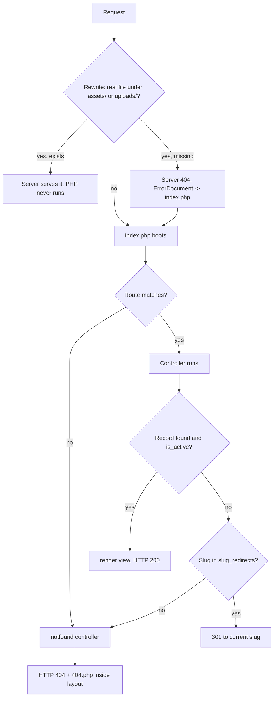

# 02a — Folder Structure & Routing Architecture

This document specifies the physical shape of the Sky Fragrances codebase as it exists on
Hostinger shared hosting: every directory and meaningful file in the shipped ZIP, how
`index.php` boots and dispatches a request, the complete storefront and admin route table,
how the app survives being installed in a subdirectory, and the naming conventions that keep
a no-framework PHP codebase navigable. It owns the *file layout and routing* contract; the
schema stream owns table and column names (`07-seed-seo-quality.md` §0.2) and the storefront
stream owns page content (`03-storefront-pages.md`). Where this document and a sibling
disagree on a path or a handler name, this document wins; where they disagree on a database
name, the schema wins. No application code appears here — only trees, DDL-adjacent config
blocks, route tables and numbered algorithms.

---

## 1. Deployment shape and its consequences

The client is a non-developer. The delivery is a single ZIP that is uploaded through hPanel
File Manager and extracted **into `public_html`**, plus one SQL file imported through
phpMyAdmin, plus one visit to `install.php`. That single fact drives every structural
decision below:

| Constraint | Structural consequence |
|---|---|
| Everything unzips inside the web root | There is no "above the document root". Private code is protected by `.htaccess`, not by being outside `public_html`. |
| No Composer | No `vendor/` autoload. Vendored classes are plain files with manual `require_once` (§9). |
| No Node, no build step | `assets/css/` and `assets/js/` ship exactly as authored and are served directly. No `dist/`, no source maps, no manifest. |
| File Manager upload | Directory count is kept small and flat. Deep nesting is a support cost when the client is told "open `app/views/product/...`" on the phone. |
| LiteSpeed reads `.htaccess` | Rewrites, HTTPS forcing and directory denial are all `.htaccess`-based and work as written on Hostinger. |
| One-time `install.php` | It is a top-level file, self-deleting-by-instruction, and refuses to run twice (§3.6). |

**Single front controller.** Exactly one PHP file is reachable by a pretty URL: `index.php`.
Everything else is either a static asset, an uploaded image, the admin front controller, or a
file inside a denied directory.

---

## 2. The shipped tree

Annotated. `→` marks a directory the web server must never serve. Sizes are indicative, not
promises.

```
public_html/
├── index.php                  Storefront front controller. The ONLY routable PHP file
│                              on the storefront. Boots, dispatches, renders. ~120 lines.
├── config.php                 DB credentials, BASE_PATH, APP_ENV, mail mode, secret salt.
│                              The one file the client edits by hand. Ships as
│                              config.sample.php; install.php writes the real one.
├── config.sample.php          Committed template with placeholder values and comments
│                              written for a non-developer.
├── install.php                One-time installer: checks PHP version and extensions,
│                              creates tables, seeds data, creates the admin account,
│                              writes config.php, then deletes itself (08 C-47).
├── cron.php                   OPTIONAL accelerator for the email outbox (06b §5.2, 08 C-56).
│                              CLI or ?key=; the site never depends on it.
├── .htaccess                  Root rewrite rules: HTTPS, www→apex, trailing-slash strip,
│                              asset pass-through, everything else → index.php.
├── robots.txt                 Static. Disallows /admin, /api, /cart, /checkout, /order.
├── favicon.ico                
├── sitemap.xml                NOT a file — served by the router from sitemap.php. Listed
│                              here only to say it must NOT exist as a stale static file.
│
├── app/                     → All application PHP. Denied to the web server.
│   ├── .htaccess              Require all denied + Deny from all (pre-2.4 fallback).
│   ├── bootstrap.php          Loads config, opens PDO, starts the session, sets the
│   │                          error/exception handlers, timezone, and the helper files.
│   ├── routes.php             Returns the route table array (§4). Data, not logic.
│   ├── router.php             Matcher: path → route entry + extracted params.
│   │
│   ├── lib/                   First-party libraries. One class or one function-set per file.
│   │   ├── db.php             PDO factory + query helpers (all prepared).
│   │   ├── request.php        Method, path, query, POST, JSON body, client IP.
│   │   ├── response.php       redirect(), json(), abort(404), status codes, headers.
│   │   ├── view.php           render($view, $data) + layout selection + escaping helper.
│   │   ├── url.php            url(), asset(), current_url(), canonical() — all BASE_PATH aware.
│   │   ├── money.php          PKR formatting ("Rs. 4,950") and DECIMAL-safe arithmetic.
│   │   ├── text.php           e(), slugify(), excerpt(), truncate_on_word().
│   │   ├── csrf.php           Token issue + verify, per-session, rotating.
│   │   ├── session.php        Session name, cookie flags, regeneration, cart storage.
│   │   ├── cart.php           Session cart model: lines, totals, coupon application.
│   │   ├── settings.php       Loads the settings table once per request into an array.
│   │   ├── seo.php            Page-head array assembly, JSON-LD block builders.
│   │   ├── image.php          GD resize/WebP derivative generation at upload time.
│   │   ├── upload.php         MIME sniffing, extension allow-list, size caps, safe names.
│   │   ├── mail.php           Thin wrapper choosing PHPMailer SMTP or PHP mail().
│   │   ├── auth.php           Admin login, password_hash/verify, rate limiting.
│   │   ├── flash.php          One-shot session messages for redirects.
│   │   ├── pagination.php     Page-number maths + rel=prev/next + canonical page URLs.
│   │   └── vendor/            Third-party, vendored verbatim. See §9.
│   │       └── PHPMailer/
│   │           ├── PHPMailer.php
│   │           ├── SMTP.php
│   │           ├── Exception.php
│   │           └── LICENSE
│   │
│   ├── controllers/           One file per route handler. Named in routes.php. See §8.
│   │   ├── home.php
│   │   ├── listing.php        Serves /shop and all 8 preset landings.
│   │   ├── collections.php
│   │   ├── product.php
│   │   ├── review-submit.php
│   │   ├── search.php
│   │   ├── quiz.php
│   │   ├── cart.php
│   │   ├── checkout.php
│   │   ├── checkout-submit.php
│   │   ├── confirmation.php
│   │   ├── track.php
│   │   ├── page.php           DB-backed content pages (about/faq/shipping/…).
│   │   ├── contact.php
│   │   ├── newsletter.php     /unsubscribe.
│   │   ├── sitemap.php
│   │   ├── notfound.php
│   │   └── api/
│   │       ├── cart.php       GET/POST cart endpoints, JSON only.
│   │       ├── search.php     Header autocomplete.
│   │       └── newsletter.php Subscribe.
│   │
│   ├── views/                 One file per rendered page. No logic beyond loops and escaping.
│   │   ├── layout.php         The single storefront layout: <head>, chrome, <main>, footer.
│   │   ├── home.php
│   │   ├── listing.php        Shared by /shop, collection, gender, family, merch, search.
│   │   ├── collections-index.php
│   │   ├── product.php
│   │   ├── quiz.php
│   │   ├── quiz-result.php
│   │   ├── cart.php
│   │   ├── checkout.php
│   │   ├── confirmation.php
│   │   ├── track.php
│   │   ├── page.php
│   │   ├── page-faq.php
│   │   ├── contact.php
│   │   ├── simple.php         Generic one-message page (unsubscribe, expired link).
│   │   └── 404.php
│   │
│   ├── partials/              Reusable fragments included by views. Prefixed by area (§8.3).
│   │   ├── head-meta.php
│   │   ├── announcement-bar.php
│   │   ├── header.php
│   │   ├── nav-mobile.php
│   │   ├── footer.php
│   │   ├── cart-drawer.php
│   │   ├── whatsapp-button.php
│   │   ├── toast-region.php
│   │   ├── product-card.php
│   │   ├── product-grid.php
│   │   ├── section-header.php
│   │   ├── filter-bar.php
│   │   ├── pagination.php
│   │   ├── review-list.php
│   │   ├── review-form.php
│   │   ├── notes-pyramid.php
│   │   ├── meters.php
│   │   ├── breadcrumbs.php
│   │   ├── newsletter-form.php
│   │   └── empty-state.php
│   │
│   └── emails/                Plain-PHP email templates, rendered to an HTML string.
│       ├── order-customer.php
│       ├── order-admin.php
│       ├── status-update.php
│       └── contact-admin.php
│
├── admin/                     Admin area. Its own front controller, its own layout.
│   ├── index.php              Admin front controller. Auth gate, then dispatch (§3.7).
│   ├── .htaccess              Headers only (X-Robots-Tag, no-store). NO RewriteEngine line —
│   │                          /admin is routed by the root file, rule 3.6a (08 C-54).
│   ├── controllers/           (own deny .htaccess + index.php stub; 08 C-54)
│   │   ├── login.php  dashboard.php  products.php  product-edit.php
│   │   ├── collections.php  orders.php  order-detail.php  coupons.php
│   │   ├── reviews.php  messages.php  subscribers.php  pages.php
│   │   ├── settings.php  account.php  export.php  invoice.php  logout.php
│   ├── views/                 Mirrors controllers one-to-one, plus layout.php and login.php. (denied, C-54)
│   └── partials/              admin-header.php, admin-sidebar.php, table-toolbar.php,
│                              status-badge.php, pager.php, image-uploader.php. (denied, C-54)
│
├── assets/                    Public, cacheable, never written to at runtime.
│   ├── .htaccess              ErrorDocument 404 "Not found" + cache headers (08 C-54).
│   ├── css/
│   │   └── site.css           THE stylesheet. Tokens, layout, components, admin, print.
│   ├── js/
│   │   ├── reveal.js ui.js cart.js product.js forms.js   Storefront, five files (04b Part 5; 08 C-31).
│   │   └── admin.js           Admin behaviour: image reorder, confirm dialogs, filters.
│   ├── img/
│   │   ├── logo.svg  logo.png  logo-mark.svg
│   │   ├── og-default.jpg     1200×630 fallback for Open Graph.
│   │   ├── placeholder-4x5.svg
│   │   └── icons/             Inline-able SVG sprites: cart, search, whatsapp, socials.
│   └── fonts/
│       ├── cormorant-garamond-300.woff2  +  cormorant-garamond-400.woff2
│       ├── jost-300.woff2  +  jost-400.woff2
│       └── jost-500.woff2     Self-hosted, five files (04a §3.2; 08 C-32). No Google Fonts request.
│
├── uploads/                   The ONLY runtime-writable directory (0755, files 0644).
│   ├── .htaccess              PHP execution off, image/PDF MIME responses only (§10).
│   ├── index.html             Empty file, defeats directory listing.
│   ├── products/              {product_id}/{hash}-{size}.webp|.jpg derivatives.
│   ├── collections/           Collection hero/thumbnail images.
│   ├── payments/              REMOVED (08 C-25): proofs live in storage/proofs/, never under uploads/.
│   │                          served through an authenticated admin handler only.
│   └── settings/              Logo, favicon source, OG image uploaded from Settings.
│
├── db/
│   ├── schema.sql             Full DDL. phpMyAdmin-importable. utf8mb4_unicode_ci.
│   ├── seed.sql               Sample content matching install.php's seed exactly.
│   └── .htaccess              Denied. It contains no secrets but there is no reason to serve it.
│
└── storage/                 → Runtime scratch, denied.
    ├── sessions/shop/         SFSHOP session files, 3-day lifetime (08 C-26, C-53)
    ├── sessions/admin/        SFADMIN session files, 12 h lifetime (08 C-53)
    ├── proofs/{YYYY}/{MM}/    payment proofs, admin-streamed only (08 C-25)
    ├── .htaccess              Denied, with a <FilesMatch "."> fallback (08 C-74).
    ├── .installed             Install lock (08 C-47). MAINTENANCE flag file lives here too (C-70).
    ├── logs/                  app-YYYY-MM.log — the only place errors are written in prod.
    └── cache/                 sitemap cache, settings.json (08 C-70).
```

`app/tools/reset-password.php` (denied tree, 05a §2.8, 08 C-64) replaces the old
`admin/reset-password.php.disabled`: the owner copies it out to the root only when needed.

**1.2 ZIP manifest (08 C-77).** The delivered ZIP is built with `zip -r -X` from a clean export
(never Finder *Compress*), archive root flat (no `public_html/` wrapper), and verified by
`unzip -l`. It **contains** every file above except `config.php`, `router.php`, `.git`,
`.DS_Store`, `__MACOSX`, `docs/`, and the contents of `storage/logs|cache|sessions|proofs`
(the directories themselves ship, each with its `index.php` stub). It **must** contain, by
count: 10 `.htaccess` files (root, `app/`, `db/`, `storage/`, `uploads/`, `assets/`,
`admin/`, `admin/controllers/`, `admin/views/`, `admin/partials/`), `.user.ini`,
`config.sample.php`, `install.php`, `cron.php`, five woff2 files, and the 12 sample products'
pre-generated derivatives under `uploads/products/`. The fresh-install rehearsal in PLAN §12
stage 6 starts from this ZIP, not from the working tree.

**Directories the web server must refuse:** `app/`, `db/`, `storage/`. Each carries its own
`.htaccess` with both the 2.4 and pre-2.4 directives, because Hostinger's LiteSpeed honours
`.htaccess` but the exact Apache generation is not something a non-developer will verify.

**`/includes` does not exist.** `03-storefront-pages.md` §1.1 assumed `/app` *and*
`/includes`; this document collapses them into `app/lib/` — one denied directory instead of
two, and one fewer thing for the client to get wrong. Treat that as an amendment to §1.1.

---

## 3. Front-controller design

### 3.1 The rewrite layer

> Superseded by 08-decisions-register.md §2.4 — C-54: **the block below is struck.** 02b §3 is the only root `.htaccess` text (its HTTPS rule carries the `SERVER_PORT` condition and `[NE]`, ships as `R=302`, and routes `/admin` with rule 3.6a). Two claims below are also wrong and corrected in 02b: `ErrorDocument 404 /index.php` *does* fire for a missing image (rule 4 only stops rewriting), so `uploads/.htaccess` and `assets/.htaccess` carry `ErrorDocument 404 "Not found"`; and rule 5's pattern belongs in the root file, not in `admin/.htaccess`, where `^admin(/.*)?$` can never match.

Root `.htaccess`, in order. Assets and uploads are matched *before* the catch-all so that a
missing image returns a real 404 from the server instead of rendering a full HTML 404 page
(which would waste a DB connection per broken image on a product grid).

```apache
Options -Indexes -MultiViews
DirectoryIndex index.php
AddDefaultCharset UTF-8

RewriteEngine On
RewriteBase /

# 1. HTTPS
RewriteCond %{HTTPS} !=on
RewriteCond %{HTTP:X-Forwarded-Proto} !https
RewriteRule ^ https://%{HTTP_HOST}%{REQUEST_URI} [L,R=301]

# 2. apex canonical
RewriteCond %{HTTP_HOST} ^www\.(.+)$ [NC]
RewriteRule ^ https://%1%{REQUEST_URI} [L,R=301]

# 3. strip trailing slash (except the root itself)
RewriteCond %{REQUEST_FILENAME} !-d
RewriteRule ^(.+)/$ /$1 [L,R=301]

# 4. real files under assets/ and uploads/ are served directly; a miss 404s here
RewriteRule ^(assets|uploads)/ - [L]

# 5. admin has its own front controller
RewriteRule ^admin(/.*)?$ admin/index.php [L,QSA]

# 6. everything else that is not an existing file or directory
RewriteCond %{REQUEST_FILENAME} !-f
RewriteCond %{REQUEST_FILENAME} !-d
RewriteRule ^ index.php [L,QSA]

ErrorDocument 404 /index.php
```

`ErrorDocument 404 /index.php` catches the case where a hosting panel or LiteSpeed rule
bypasses rule 6; `index.php` detects `REDIRECT_STATUS=404` and routes straight to the
not-found handler rather than re-matching.

### 3.2 Boot sequence — `index.php`

Numbered, and deliberately short. `index.php` contains no business logic; if it grows past
about 120 lines, the growth belongs in `app/lib/`.

1. `require __DIR__ . '/config.php'` — dies with a plain human sentence if it is missing
   ("Sky Fragrances is not configured yet. Run install.php."), never a PHP fatal.
2. `require __DIR__ . '/app/bootstrap.php'`, which:
   1. sets `date_default_timezone_set('Asia/Karachi')` and `mb_internal_encoding('UTF-8')`;
   2. applies error policy by `APP_ENV` — `production` sets `display_errors=0`,
      `log_errors=1`, log file `storage/logs/app-YYYY-MM.log`; `local` displays everything;
   3. registers a shutdown + exception handler that renders the 500 view and logs the trace,
      and never echoes a stack trace when `APP_ENV=production`;
   4. opens PDO with `charset=utf8mb4`, `ERRMODE_EXCEPTION`, `FETCH_ASSOC`,
      `EMULATE_PREPARES=false`;
   5. starts the session with `SameSite=Lax`, `HttpOnly`, `Secure` (when HTTPS), and a
      session name of `SFSHOP` (08 C-26);
   6. `require`s every file in `app/lib/` explicitly, by an ordered list — not a `glob()`,
      so load order is deterministic and a stray file cannot be executed;
   7. loads `settings` into one in-request array (one query).
3. Compute the request path (§5) — scheme/host stripped, BASE_PATH stripped, query string
   removed, percent-decoded once, lowercased for matching.
4. Reject the path if it contains `..`, a null byte, or a backslash → 404 immediately.
5. If the lowercased path differs from the raw path, 301 to the lowercase form (canonical).
6. `$route = route_match($method, $path)` against `app/routes.php`.
7. No match → `$route` is the `notfound` entry and the response status is set to 404.
8. Method mismatch on a path that exists for another method → 405 with an `Allow` header,
   rendered as the 404 view with a different heading.
9. Seed the page-head array with route defaults (`title`, `robots`, `body_class`) so a
   controller that forgets to set them still emits a valid head.
10. `require app/controllers/{$route['controller']}` with `$params` and `$head` in scope.
    The controller either calls `render()`, `json()`, `redirect()`, or `abort()`.
11. If the controller returned without rendering, that is a bug: bootstrap renders the 500
    view and logs it. Silence is never a valid outcome.

### 3.3 The route table data structure

`app/routes.php` returns a plain ordered array. Ordered, because the first match wins and
static paths must be tested before patterned ones. No regex is written by hand in the table;
`{param}` placeholders are compiled by the router.

```php
// shape only — app/routes.php
[
  'name'       => 'product.show',      // stable key used by url_for()
  'method'     => 'GET',               // 'GET' | 'POST' | 'GET|POST'
  'path'       => '/product/{slug}',   // literal segments + {param} placeholders
  'controller' => 'product.php',       // file under app/controllers/
  'view'       => 'product.php',       // default view; controller may override
  'where'      => ['slug' => 'slug'],  // named pattern per param (see below)
  'preset'     => [],                  // fixed filters merged into the query (listing routes)
  'robots'     => 'index,follow',
  'body_class' => 'product',
]
```

Param patterns are named, never inline regex, so they are consistent everywhere:

| Name | Pattern | Used by |
|---|---|---|
| `slug` | `[a-z0-9]+(?:-[a-z0-9]+)*` | product, collection, scent family, page |
| `order` | `SF-[0-9]{6}-[A-HJ-NP-Z2-9]{4}` (08 C-10) | `/order/{order_number}` |
| `num` | `[1-9][0-9]{0,5}` | admin record ids |
| `any` | `[^/]+` | reserved; unused in v1 |

### 3.4 Matching algorithm

1. Split the incoming path on `/` into segments; drop empty leading/trailing segments.
2. Take the segment count. The router keeps routes bucketed by segment count, so `/product/azure-oud`
   never compares against a 1-segment or 4-segment route. With ~45 routes this is a
   micro-optimisation, but it also makes the table self-documenting.
3. Within the bucket, walk in declaration order. For each route, compare segment by segment:
   a literal segment must match case-insensitively; a `{param}` segment must match its named
   pattern and is captured into `$params['name']`.
4. First route whose segments all match wins. Stop.
5. If segments matched but the method did not, remember it as a "method mismatch" candidate
   and keep looking; if nothing else matches, raise 405.
6. No candidate at all → the `notfound` route.
7. Captured params are returned as raw strings. Controllers are responsible for looking them
   up; the router never touches the database.

### 3.5 Raising 404 — the three kinds

A no-framework app that gets this wrong ends up serving HTTP 200 on missing products, which
poisons the index. There are exactly three paths to a 404 and they all end at the same view.



1. **Unrouted path** — no entry in the table. Router yields `notfound`.
2. **Routed but no record** — `/product/does-not-exist`, `/collections/ghost`. The controller
   calls `abort(404)` after first checking `slug_redirects` for a rename (a 301 there, not a
   404, protects links the client has already sent on WhatsApp).
3. **Routed, record exists, but not publicly visible** — `is_active = 0`, a review page for a
   pending review, an order confirmation whose token is wrong. These are 404, never 403: a
   403 confirms the record exists.

`abort(404)` sets the status, sets `robots` to `noindex,follow`, renders `views/404.php`
inside the normal layout (so the header, footer and cart drawer are present and the visitor
can carry on shopping), and exits. It must be reachable mid-controller, after headers are
prepared but before any output — hence output buffering is opened in bootstrap and only
flushed at the end of a successful render.

### 3.6 `install.php` and its guard rails

`install.php` sits at the root and is the one file a non-developer runs. It is not routed; it
is hit directly at `https://skyfragrances.com/install.php`.

1. Refuses to run if `config.php` exists **and** the `settings` table is populated — prints
   "Sky Fragrances is already installed. Delete install.php." and stops.
2. Step 1 screen: environment check — PHP ≥ 8.1, `pdo_mysql`, `gd`, `mbstring`, `fileinfo`,
   `openssl`, and a writability probe on `uploads/` and `storage/`. Each is a green/red row
   with a plain-English fix. Nothing proceeds until all are green.
3. Step 2: DB credentials form (host, name, user, password) — tested with a live connection
   before anything is written.
4. Step 3: store details + admin email + admin password (twice, minimum 10 characters).
5. Step 4: runs `db/schema.sql` statement by statement, then the seed, then writes
   `config.php` from the template with a freshly generated 32-byte `APP_SECRET`.
6. Step 5: a large, unmissable instruction to delete `install.php`, plus a link to
   `/admin`. The admin dashboard shows a persistent red banner while `install.php` still
   exists on disk — the client will forget, so the app checks every page load.

### 3.7 How the admin area is routed

The admin is a **second, independent front controller** at `admin/index.php`, not a branch
inside the storefront router. Reasons, and they are the decision, not options:

- The auth gate is one unconditional block at the top of one file. There is no route flag
  that someone can forget to set on a new admin page.
- The admin layout, CSS scope and error policy differ from the storefront's.
- A fatal in the admin cannot take the shop down, and vice versa.

`admin/.htaccess` rewrites `^admin(/.*)?$` to `admin/index.php`. Boot order:
> Superseded by 08-decisions-register.md §2.4 — C-54: the rewrite is rule 3.6a of the **root** `.htaccess`. A per-directory `RewriteEngine On` in `admin/.htaccess` would replace the inherited rule set on both Apache and LiteSpeed, so `http://…/admin/login` would never be redirected to HTTPS and the password would post in clear. `admin/.htaccess` carries header lines only (05a §1).

1. `require '../config.php'` then `require '../app/bootstrap.php'` — the same PDO, session,
   settings and lib stack. Nothing is duplicated.
2. Compute the admin sub-path by stripping BASE_PATH **and** the literal `/admin` prefix.
3. If the sub-path is `/login` or `/logout`, skip the gate.
4. Otherwise: require an authenticated admin session; on failure, 302 to `/admin/login`
   carrying `?next=` (validated as a same-site relative path, never an absolute URL).
5. Verify the CSRF token on every `POST`, centrally, before dispatch. An admin controller
   never checks CSRF itself, so it cannot forget to.
6. Regenerate the session id on login and on privilege-relevant changes (password change).
7. Dispatch through the same `route_match()` against `app/routes-admin.php`.
8. Every admin response sends `X-Robots-Tag: noindex, nofollow` and
   `Cache-Control: no-store`.

Login rate limiting lives in `admin_login_attempts` (schema contract, 07 §0.2): five failures
from one `ip_hash` within 15 minutes locks that IP for 15 minutes, counted on
`was_success = 0` rows. The username is recorded but never used as the lock key, so an
attacker cannot lock the owner out by guessing their username.
(Confirmed by 08 C-51: this paragraph wins over 05a §2.6's username hard lock; 05a's username counter becomes a progressive delay plus a known-device exemption. `ip_hash` is from `client_ip()`, C-50.)

---

## 4. The route table

### 4.1 Storefront — `app/routes.php`

Titles and indexability are owned by `03-storefront-pages.md` §2 and are not repeated here.
This table is the *dispatch* contract: pattern → controller file → view file.

| Name | Method | Pattern | Controller | View | Purpose |
|---|---|---|---|---|---|
| `home` | GET | `/` | `home.php` | `home.php` | Brand entry, merchandising rails |
| `shop` | GET | `/shop` | `listing.php` | `listing.php` | All products, full filter set |
| `collections.index` | GET | `/collections` | `collections.php` | `collections-index.php` | Index of collections |
| `collections.show` | GET | `/collections/{slug}` | `listing.php` | `listing.php` | preset `collection={slug}` |
| `gender.him` | GET | `/for-him` | `listing.php` | `listing.php` | preset `gender=him` |
| `gender.her` | GET | `/for-her` | `listing.php` | `listing.php` | preset `gender=her` |
| `gender.unisex` | GET | `/unisex` | `listing.php` | `listing.php` | preset `gender=unisex` |
| `scent.show` | GET | `/scent/{slug}` | `listing.php` | `listing.php` | preset `scent_family={slug}` |
| `new` | GET | `/new-arrivals` | `listing.php` | `listing.php` | preset `sort=newest` |
| `best` | GET | `/best-sellers` | `listing.php` | `listing.php` | preset `sort=best` |
| `sale` | GET | `/sale` | `listing.php` | `listing.php` | preset `on_sale=1` |
| `search` | GET | `/search` | `search.php` | `listing.php` | `?q=` keyword results |
| `product.show` | GET | `/product/{slug}` | `product.php` | `product.php` | PDP |
| `review.store` | POST | `/product/{slug}/review` | `review-submit.php` | redirect | Review → moderation |
| `quiz` | GET | `/scent-finder` | `quiz.php` | `quiz.php` | Scent Finder questions |
| `quiz.result` | GET | `/scent-finder/result` | `quiz.php` | `quiz-result.php` | `?a=` recommendations |
| `cart` | GET | `/cart` | `cart.php` | `cart.php` | Full cart page |
| `checkout` | GET | `/checkout` | `checkout.php` | `checkout.php` | Guest checkout form |
| `checkout.store` | POST | `/checkout` | `checkout-submit.php` | redirect | Place order |
| `order.show` | GET | `/order/{order}` | `confirmation.php` | `confirmation.php` | Token-gated thank-you |
| `track` | GET\|POST | `/track` | `track.php` | `track.php` | Track form + result |
| `page.show` | GET | `/about` `/shipping` `/returns` `/privacy` `/terms` | `page.php` | `page.php` | DB content pages |
| `page.faq` | GET | `/faq` | `page.php` | `page-faq.php` | Accordion + FAQPage schema |
| `contact` | GET\|POST | `/contact` | `contact.php` | `contact.php` | Form → DB + mail |
| `newsletter.unsub` | GET | `/unsubscribe` | `newsletter.php` | `simple.php` | `?e=&t=` one-click |
| `api.cart.get` | GET | `/api/cart` | `api/cart.php` | JSON | Drawer refresh |
| `api.cart.add` | POST | `/api/cart/add` | `api/cart.php` | JSON | Add line |
| `api.cart.update` | POST | `/api/cart/update` | `api/cart.php` | JSON | Change qty |
| `api.cart.remove` | POST | `/api/cart/remove` | `api/cart.php` | JSON | Remove line |
| `api.cart.coupon` | POST | `/api/cart/coupon` | `api/cart.php` | JSON | Apply/remove coupon |
| `api.suggest` | GET | `/api/search-suggest` | `api/search.php` | JSON | Header autocomplete |
| `api.newsletter` | POST | `/api/newsletter` | `api/newsletter.php` | JSON | Subscribe |
| `sitemap` | GET | `/sitemap.xml` | `sitemap.php` | XML | Crawl map (cached 6h) |
| `notfound` | ANY | `*` | `notfound.php` | `404.php` | HTTP 404 |

The five plain content pages share one route entry with five literal paths because they differ
only by the `pages.slug` they load. `/faq` is separate solely because it renders a different
view. `/robots.txt` is a real static file and never reaches PHP.

All `/api/*` responses set `Content-Type: application/json; charset=utf-8`,
`Cache-Control: no-store`, and `X-Content-Type-Options: nosniff`. They are same-origin only:
the request must carry the CSRF token in `X-CSRF-Token` for every POST, and a cross-origin
`Origin` header is rejected with 403 before any work is done.

### 4.2 Admin — `app/routes-admin.php`

Paths below are relative to `/admin`. Every one requires an authenticated session except
`login`. Every POST is CSRF-verified centrally (§3.7).

| Method | Pattern | Controller | View | Purpose |
|---|---|---|---|---|
| GET\|POST | `/login` | `login.php` | `login.php` | Sign in, rate-limited |
| POST | `/logout` | `logout.php` | redirect | Destroy session |
| GET | `/` | `dashboard.php` | `dashboard.php` | Revenue, counts, low stock, latest orders |
| GET | `/products` | `products.php` | `products.php` | List, filter, search, bulk toggle |
| GET\|POST | `/products/new` | `product-edit.php` | `product-edit.php` | Create |
| GET\|POST | `/products/{num}` | `product-edit.php` | `product-edit.php` | Edit: sizes, images, notes, SEO |
| POST | `/products/{num}/delete` | `products.php` | redirect | Soft delete |
| POST | `/products/{num}/images` | `product-edit.php` | JSON | Upload / reorder / set primary |
| GET\|POST | `/collections` | `collections.php` | `collections.php` | CRUD + sort_order |
| GET | `/orders` | `orders.php` | `orders.php` | Filter by status/date, search, CSV link |
| GET | `/orders/{num}` | `order-detail.php` | `order-detail.php` | Detail, payment proof, WhatsApp |
| POST | `/orders/{num}/status` | `order-detail.php` | redirect | Status change, stock restore on cancel |
| POST | `/orders/{num}/payment` | `order-detail.php` | redirect | Mark paid, courier + tracking |
| GET | `/orders/{num}/invoice` | `invoice.php` | `invoice.php` | Print invoice / packing slip |
| GET | `/orders/export` | `export.php` | CSV | Streamed CSV of the current filter |
| GET | `/admin/orders/{order_number}/proof` (08 C-25) | `order-detail.php` | image | Authenticated payment-proof stream from `storage/proofs/` |
| GET\|POST | `/coupons` | `coupons.php` | `coupons.php` | CRUD, usage counters |
| GET\|POST | `/reviews` | `reviews.php` | `reviews.php` | Approve / reject queue |
| GET | `/messages` | `messages.php` | `messages.php` | Contact form inbox |
| GET | `/subscribers` | `subscribers.php` | `subscribers.php` | List + CSV export |
| GET\|POST | `/pages` | `pages.php` | `pages.php` | Edit DB content pages |
| GET\|POST | `/settings` | `settings.php` | `settings.php` | Store, payments, shipping, SEO, social |
| GET\|POST | `/account` | `account.php` | `account.php` | Change admin password |

Payment screenshots are the one upload that is never served from `/uploads` directly — the
rewrite in §3.1 rule 4 would expose them to anyone who guessed a filename. They live in
`uploads/payments/` with unguessable hashed names **and** an admin-only handler, because
  Superseded by 08-decisions-register.md §2 — C-25: the directory is `storage/proofs/{YYYY}/{MM}/`, not `uploads/payments/`.
"unguessable" alone is not an access control.

---

## 5. Installed in a subdirectory

> Superseded by 08-decisions-register.md §2.4 — C-71: **sub-folder installs are not supported in v1.** The app lives at the root of a host — `skyfragrances.com` or the root of a `*.hostingersite.com` preview — and `install.php` refuses to run when `dirname($_SERVER['SCRIPT_NAME'])` is not `/`, saying so in plain words. The `BASE_PATH` plumbing below (items 3, 4, 7–9) stays in the code at `''` so a later release can enable it; items 1, 2, 5, 6 and 10's `BASE_PATH` clause are void. Reason: `RewriteBase` only affects relative substitutions — 02b §3 rules 3.4/3.5 (`/$1`), 3.6 (`^/(uploads|assets)/`), the `ErrorDocument` paths and `admin/.htaccess` are all absolute, so a sub-folder install was five hand edits sold to the owner as one line. Staging is done on the preview host's root instead, where `site_indexable = 0` already protects the real shop.

A real Hostinger scenario: the client stages the site at `skyfragrances.com/shop-new/` before
pointing the domain, or runs it on a free `*.hostingersite.com` preview under a folder. If the
app assumes it owns `/`, every link, form action, asset URL and redirect breaks and the client
concludes the build is broken.

**Decision: one constant, `BASE_PATH`, and no raw paths anywhere.**

1. `config.php` defines `BASE_PATH`. Empty string for a domain root; `/shop-new` (leading
   Superseded by 08-decisions-register.md §2 — C-27: `config.php` returns an array (02c §7.1); `bootstrap.php` derives the `BASE_PATH`, `SITE_URL`, `APP_ENV` constants from it.
   slash, no trailing slash) for a subdirectory. `install.php` detects it and writes it, so
   the client never types it.
2. Detection in `install.php`: take `dirname($_SERVER['SCRIPT_NAME'])` for `install.php`,
   normalise `\` to `/`, strip a trailing `/`, and treat `/` or `.` as `''`.
3. `app/lib/url.php` exposes exactly three builders, and nothing else in the codebase writes a
   URL:
   - `url('/product/azure-oud')` → `BASE_PATH . $path` for links, form actions and redirects.
   - `asset('css/site.css')` → `BASE_PATH . '/assets/css/site.css?v=' . filemtime($file)` (08 C-36: no ASSET_VERSION constant).
   - `canonical('/shop')` → `SITE_URL . $path`, absolute, for `<link rel=canonical>`,
     Open Graph, JSON-LD and the sitemap. `SITE_URL` already contains `BASE_PATH`.
4. `index.php` strips `BASE_PATH` from the incoming path **before** matching, so `routes.php`
   is written entirely in root-relative terms and never mentions the subdirectory.
5. `RewriteBase /` in the root `.htaccess` becomes `RewriteBase /shop-new/` — this is the one
   line `install.php` cannot write for the client, so the installer prints the exact line and
   which file to paste it into, and the go-live guide repeats it.
6. Redirect rules 1–3 use `%{REQUEST_URI}`, which already includes the subdirectory, so they
   are base-path-safe as written.
7. JavaScript never hard-codes a path. `layout.php` emits
   `<body data-base="<?= BASE_PATH ?>">` and `cart.js` (08 C-31) reads it once; every `fetch()` to
   `/api/...` is prefixed from that value.
8. The admin front controller strips `BASE_PATH` and then `/admin`, in that order (§3.7).
9. Cookies are issued with `path = BASE_PATH . '/'` so two staged installs on the same host do
   not share a session.
10. Sitemap and `robots.txt` use absolute `canonical()` URLs. A subdirectory install is
    `noindex` by default — `install.php` sets `settings.site_indexable = 0` whenever
    `BASE_PATH` is non-empty or the host is not `skyfragrances.com`, and the go-live guide
    makes turning it on a step. This is the cheapest available protection against a staging
    copy outranking the real shop.

**Not supported:** installing the app at a path that contains an uppercase letter, a space, or
a URL-encoded character. `install.php` refuses and says why.

---

## 6. Naming and organisation conventions

1. **Controllers** are lowercase, hyphenated, `.php`, named after the *action* not the table:
   `product.php`, `checkout-submit.php`, `review-submit.php`. A controller that only writes
   and redirects ends in `-submit`. Files map 1:1 to a `controller` value in `routes.php`; a
   controller file that is not named by any route is dead code and is deleted.
2. **Views** are named after the *page*, not the controller. `listing.php` is one view shared
   by nine routes because the page is the same page with different copy. When two routes need
   genuinely different markup they get two views (`page.php` vs `page-faq.php`), and the
   variant carries the base name plus a hyphenated suffix.
3. **Partials** are the reusable fragments and are named `noun.php` or `noun-modifier.php`:
   `product-card.php`, `nav-mobile.php`, `section-header.php`. A partial takes its data as
   local variables set immediately before the `include`, never from globals, and never runs a
   query — if a fragment needs data, the controller fetches it.
4. **Lib files** are lowercase single nouns and expose plain functions prefixed by their file:
   `cart_add()`, `money()`, `csrf_token()`, `seo_product_jsonld()`. No classes for
   first-party code; no autoloader exists, so a class buys nothing here and costs a `require`.
5. **Views escape; controllers don't.** Every value printed in a view goes through `e()`.
   The only exceptions are the JSON-LD blocks and the settings-controlled announcement text,
   which are built by `seo.php` and sanitised there.
6. **No queries in views, no HTML in controllers.** A controller ends by calling `render()`;
   a view ends by producing markup. A grep for `SELECT` under `app/views/` must return nothing
   — that is a review check, not an aspiration.
7. **One route, one controller, one view, one `render()` call.** A controller with two render
   paths is two routes.
8. Admin mirrors all of the above inside `admin/`, with its own `layout.php`.

---

## 7. Vendored third-party code

PHPMailer is the only third-party PHP in the build. It lives at
`app/lib/vendor/PHPMailer/` as four files copied verbatim from an official tagged release
(6.9.x), licence file included, and is loaded by three explicit `require_once` calls inside
`app/lib/mail.php` — nowhere else:

```php
require_once __DIR__ . '/vendor/PHPMailer/Exception.php';
require_once __DIR__ . '/vendor/PHPMailer/PHPMailer.php';
require_once __DIR__ . '/vendor/PHPMailer/SMTP.php';
```

`bootstrap.php` does **not** load them — they are required lazily, inside the one function
that sends mail, so a page view that sends nothing pays nothing. `mail.php` chooses SMTP
(Hostinger's mail server, credentials in `config.php`) when `MAIL_MODE = 'smtp'`, and falls
back to PHP `mail()` when it is `'php'`; the calling code (order confirmation, contact form,
status update) never knows which. A send failure is logged and swallowed — an order is never
lost because an SMTP host was slow.

Upgrading PHPMailer is a file-replacement task: drop in the new release's four files, re-check
that no other file references the namespace. Because there is no autoloader, an accidental
second copy elsewhere in the tree would fatal on redeclaration rather than silently win, which
is the behaviour we want.

`app/lib/vendor/` sits inside the denied `app/` directory, so no vendored file is ever
reachable over HTTP even before considering that PHPMailer ships no entry point.

**Note for the schema stream:** `07-seed-seo-quality.md` §0.1 places PHPMailer at
`/lib/PHPMailer/`. This document moves it under `app/lib/vendor/` so that exactly one
top-level directory needs an `.htaccess` deny. Table and column names in that document are
unaffected and remain authoritative.
