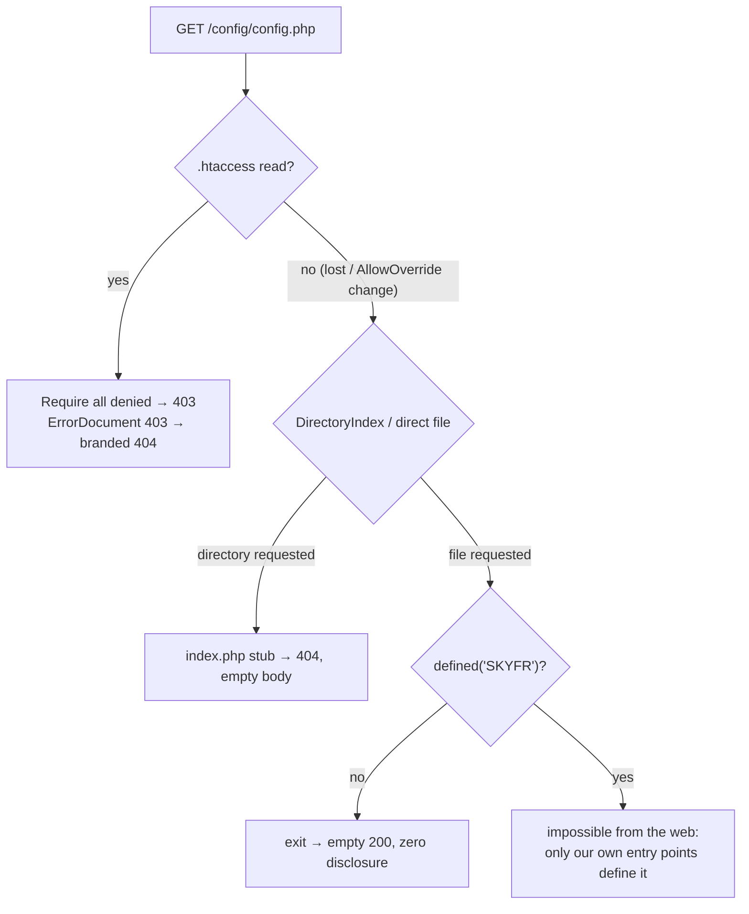

# 02b — Server Configuration & Hardening (.htaccess, headers, permissions, PHP limits)

This document specifies every piece of server configuration Sky Fragrances ships: the four
`.htaccess` files, the exact security-header values including a Content-Security-Policy that
actually works with Google Fonts, inline JSON-LD and the site's small inline JS, the
defence-in-depth pattern that keeps `/app` and `/config` unreadable even though they sit inside
`public_html`, the file and directory permissions that result from an hPanel File Manager unzip,
and the PHP resource limits a Hostinger shared plan imposes together with the design decisions
that keep the site inside them. It is written against **LiteSpeed**, not Apache — Hostinger
shared hosting runs LiteSpeed Enterprise, which reads `.htaccess` but silently ignores a
well-known set of directives, and every one of those traps is called out below. No application
code here; `.htaccess` blocks, permission tables, algorithms and one diagram.

---

## 1. The deployment reality this document is designed around

Five facts drive every decision that follows. They are not preferences.

1. **The server is LiteSpeed Enterprise, not Apache.** It re-implements `mod_rewrite`,
   `mod_headers`, `mod_expires`, `mod_deflate` and `mod_authz_core` compatibly. It does **not**
   implement `mod_php`, so every `php_flag` / `php_value` line is dead text. See §2.
2. **Everything lives inside `public_html`.** The client deploys by uploading a ZIP through
   hPanel File Manager and using "Extract". File Manager cannot reliably place a folder above
   the document root, and the non-developer owner will not use SSH. So `/app`, `/config`,
   `/lib` and `/db` are web-addressable paths that must be defended, not hidden.
3. **There is no shell, no cron-based build, no `composer`, no `npm`.** Anything that must
   happen at deploy time happens either in `install.php` (run once from the browser) or not at
   all.
4. **`AllowOverride` is fixed and generous but not unlimited.** Hostinger grants
   `FileInfo Indexes Limit Options=...` — enough for rewrites, headers, `Options -Indexes`,
   `ErrorDocument`, and `Require`. It does **not** grant `AllowOverride All` semantics for
   things like `php_admin_value`, and directives requiring server-config context
   (`Alias`, `VirtualHost`, `LimitRequestBody` beyond the pool cap) are unavailable.
5. **A bad `.htaccess` takes the whole site down with a 500**, and the owner's only recovery
   path is File Manager. Therefore: no directive that is fatal when its module is absent goes in
   unguarded, and every optional block is wrapped in `<IfModule>`.

### 1.1 Directory layout this document configures

```
public_html/
├── .htaccess              ← §3   the only rewriting file
├── index.php              ← front controller (all pretty URLs land here)
├── install.php            ← run once, then deleted (§7.4)
├── robots.txt
├── favicon.ico
├── app/                   ← controllers, views, models      → DENY (§4)
│   └── .htaccess  index.php(stub)
├── storage/               ← logs, cache, sessions, proofs    → DENY, writable (08 C-23/C-24)
│   └── .htaccess  index.php(stub)
├── config.php             ← root-level, denied by <Files "config*.php"> (08 C-23/C-27)
├── db/                    ← schema.sql, seed.sql            → DENY (§4)
│   └── .htaccess  index.php(stub)
├── admin/                 ← admin panel, own front controller (session-gated, not denied)
├── assets/                ← css/, js/, img/, fonts/         → public, long-cached (§3.8)
└── uploads/               ← GD-written product images       → PUBLIC READ, NO PHP (§5)
    └── .htaccess
```

`uploads/` is the only directory the application writes to at runtime. Everything else is
read-only in production.

> Superseded by 08-decisions-register.md §2 — C-23/C-24: the denied directories are `app/`, `db/`, `storage/` (three, not five); `storage/` is writable (sessions, proofs, logs, cache); PHPMailer is at `app/lib/vendor/` (C-35). Read every `includes/`, `config/`, `lib/` below accordingly.

---

## 2. LiteSpeed: what it honours, what it ignores, what it does differently

This is the section to read before editing any `.htaccess` on this project. Hostinger's
LiteSpeed reads `.htaccess` on every request (no restart needed), but the compatibility surface
is not 100%.

### 2.1 Honoured, safe to rely on

| Directive / module | Status on Hostinger LiteSpeed | Used by us |
|---|---|---|
| `RewriteEngine`, `RewriteCond`, `RewriteRule` | Full `mod_rewrite` syntax, including `%{HTTP:...}` | §3.2–3.5 |
| `Header set/always set/unset` (`mod_headers`) | Honoured, incl. `always` and `env=` | §3.9, §6 |
| `ExpiresActive` / `ExpiresByType` (`mod_expires`) | Honoured | §3.8 |
| `Options -Indexes` | Honoured | §3.6 |
| `ErrorDocument` | Honoured, incl. pointing at a PHP script | §3.7 |
| `Require all denied` / `granted` (`mod_authz_core`) | Honoured (LiteSpeed emulates 2.4 authz) | §4 |
| `Order` / `Deny from all` (2.2 syntax) | Still honoured, kept as a belt-and-braces fallback | §4 |
| `<Files>`, `<FilesMatch>`, `<IfModule>` | Honoured | §4, §5 |
| `AddType`, `AddDefaultCharset`, `DefaultLanguage` | Honoured | §3.8 |
| `RemoveHandler`, `RemoveType`, `SetHandler`, `AddHandler` | Honoured — this is the lever for §5 | §5 |
| `DirectoryIndex` | Honoured | §3.6 |
| `AddOutputFilterByType DEFLATE` (`mod_deflate`) | Honoured; LiteSpeed maps it onto its own gzip/brotli | §3.10 |

### 2.2 Ignored or different — do not use these

| Directive | What happens on LiteSpeed | What we do instead |
|---|---|---|
| `php_flag`, `php_value` | **Silently ignored.** LiteSpeed runs PHP as LSAPI, not `mod_php`, so `php_flag engine off` in `/uploads` does nothing. This is the classic way an "uploads are protected" claim turns out to be false. On some Apache builds it is worse than useless — it throws a 500 because `mod_php` is absent. | Never used. PHP is disabled in `/uploads` by handler removal + a `<FilesMatch>` deny (§5). PHP ini values are set via hPanel's PHP Configuration UI or a `.user.ini`/`php.ini` file (§8.2). |
| `php_admin_value`, `php_admin_flag` | Ignored (they are server-config-only even on Apache). | hPanel PHP Configuration. |
| `mod_security` rules (`SecFilterEngine`, `SecRuleRemoveById`) | Ignored; LiteSpeed has its own WAF managed by the host. | Nothing — application-level validation only. |
| `mod_pagespeed` / `ModPagespeed` | Ignored. | Hand-optimised assets (§8.4). |
| `Options +FollowSymLinks` | Accepted but meaningless; symlinks are already followed. Writing `Options All` can 500 on a restricted `AllowOverride`. | Only `Options -Indexes` is written. |
| `LimitRequestBody` above the pool limit | Cannot raise the platform cap; can only lower it. | Upload size is enforced in PHP (§8.3). |
| `<Limit>` / `<LimitExcept>` for method control | Partially honoured, inconsistently. | Method checks in the front controller. |
| `SSLRequireSSL`, `RewriteOptions Inherit` | Not reliable. | HTTPS forced by rewrite (§3.2). |
| `.htpasswd` via `AuthUserFile` with a relative path | Works only with an absolute path, which the client cannot know pre-deploy. | Admin auth is PHP sessions + `password_hash` (doc 05), not HTTP Basic. |
| `AddOutputFilterByType BROTLI` | Not a LiteSpeed directive. | Leave compression to `DEFLATE` mapping + the host's own brotli. |

### 2.3 The proxy that causes redirect loops

Hostinger terminates TLS at an edge layer in front of the LiteSpeed worker. For a portion of
requests the worker sees plain HTTP internally even though the browser used HTTPS. A naive
`RewriteCond %{HTTPS} !=on` therefore matches on an already-secure request, issues a 301 to the
same HTTPS URL, and the browser loops until it shows `ERR_TOO_MANY_REDIRECTS`. The site is then
100% down and the owner cannot fix it.

The rule must treat **any** of these three signals as "already secure":

- `%{HTTPS} = on` — direct TLS to the worker.
- `%{HTTP:X-Forwarded-Proto} = https` — the edge proxy's own header.
- `%{SERVER_PORT} = 443` — belt and braces for configurations that set neither.

All three are expressed as `RewriteCond`s that must *all* fail before the redirect fires (§3.2).

**The same proxy hides the client IP.** Behind the edge layer `REMOTE_ADDR` may be the proxy, so every rate limit and every `ip_hash` audit column depends on one function, `client_ip()` in `app/lib/request.php` (02c §1, 08 C-50): trust the **rightmost** untrusted hop of `X-Forwarded-For` only when `REMOTE_ADDR` is inside the trusted-proxy CIDR list that `install.php` wrote from its own probe request (`config['trusted_proxies']`, overridable in Settings › Advanced); otherwise use `REMOTE_ADDR` and ignore the header entirely. Never read `X-Forwarded-For` unconditionally — one forged header would then bypass every limit and poison the audit trail.

---

## 3. `public_html/.htaccess` — the root file, in full

> 08-decisions-register.md §2.4 — C-54: **this is the only root `.htaccess` text.** 02a §3.1's shorter block is struck. `/admin` is routed from this file (rule 3.6a); `admin/.htaccess` carries no `RewriteEngine` line at all (05a §1) so the HTTPS and `www` rules below apply to `/admin/*` too. C-52: the HTTPS redirect ships as `R=302` and is flipped to `R=301` by `install.php`'s Finish screen (or Settings › Advanced) once its own https self-check passes — a 301 cached against a not-yet-issued certificate is the failure §3.2 describes.

This is the only file in the project that rewrites. Order matters: canonicalisation redirects
(301, externally visible) must all fire **before** the internal front-controller rewrite,
otherwise a request is served and *then* redirected, doubling work and leaking the ugly URL.

```apache
# Sky Fragrances — public_html/.htaccess
# Target: Hostinger shared hosting (LiteSpeed Enterprise, .htaccess-compatible).
# Do not add php_flag / php_value lines here — LiteSpeed ignores them (see doc 02b §2.2).

Options -Indexes
DirectoryIndex index.php
AddDefaultCharset UTF-8
ErrorDocument 404 /index.php
ErrorDocument 403 /index.php

# --- 3.0 Files that must never be served, whatever else fails (08 C-54) --------------------
# dotfiles (.user.ini, .htaccess, .installed, .env), shipped-disabled/backup/dump/doc files,
# the config template. Real files pass rule 3.6 otherwise.
<FilesMatch "(^\.|\.(disabled|sql|md|log|bak|old|swp|dist|lock)$|^config.*\.php$)">
  <IfModule mod_authz_core.c>
    Require all denied
  </IfModule>
  <IfModule !mod_authz_core.c>
    Order allow,deny
    Deny from all
  </IfModule>
</FilesMatch>

<IfModule mod_rewrite.c>
RewriteEngine On
RewriteBase /

# --- 3.2 Force HTTPS (proxy-aware; all three conditions must fail to redirect) -------------
# Ships as R=302. install.php rewrites this line to R=301 after its https self-check (08 C-52).
RewriteCond %{HTTPS} !=on
RewriteCond %{HTTP:X-Forwarded-Proto} !=https [NC]
RewriteCond %{SERVER_PORT} !^443$
RewriteRule ^ https://%{HTTP_HOST}%{REQUEST_URI} [L,R=302,NE]

# --- 3.3 Canonical host: strip www -----------------------------------------------------------
RewriteCond %{HTTP_HOST} ^www\.(.+)$ [NC]
RewriteRule ^ https://%1%{REQUEST_URI} [L,R=301,NE]

# --- 3.4 Strip index.php from the visible URL ------------------------------------------------
RewriteCond %{THE_REQUEST} \s/+index\.php(?:[/?]\S*)?\s [NC]
RewriteRule ^index\.php(.*)$ /$1 [L,R=301,NE]

# --- 3.5 Strip trailing slash (except the bare root) -----------------------------------------
RewriteCond %{REQUEST_FILENAME} !-d
RewriteRule ^(.+?)/+$ /$1 [L,R=301,NE]

# --- 3.6 Never rewrite a file or directory that really exists --------------------------------
RewriteCond %{REQUEST_URI} ^/(uploads|assets)/ [OR]
RewriteCond %{REQUEST_FILENAME} -f [OR]
RewriteCond %{REQUEST_FILENAME} -d
RewriteRule ^ - [L]

# --- 3.6a Admin front controller (routed here, not in admin/.htaccess — 08 C-54) -------------
RewriteRule ^admin(/.*)?$ admin/index.php [L]

# --- 3.7 Front controller: everything else is a pretty URL -----------------------------------
RewriteRule ^ index.php [L]
</IfModule>
```

Three consequences of rule 3.0 and 3.6 worth stating: `cron.php` (an optional accelerator, 06b §5.2) is a real root file and is served, so it runs only when `PHP_SAPI === 'cli'` or `?key=` equals `config['cron_key']`, and does nothing but drain due outbox rows either way; `db/schema.sql` and `.user.ini` are denied by name pattern even if a subdirectory `.htaccess` is lost; and `admin/reset-password.php.disabled` no longer exists at a web path — the recovery script ships inside `app/tools/` (05a §2.8, 08 C-64).

(Static-asset caching, compression and security headers continue in the same file — §3.8–§3.10
and §6 below are appended verbatim to this block.)

### 3.1 Why each of the preamble lines is there

- **`Options -Indexes`** — without it, `https://skyfragrances.com/uploads/` returns an
  auto-generated listing of every product image ever uploaded, including ones for unpublished
  products and any stray payment screenshot filename. `-Indexes` makes it a 403, which §3.7's
  `ErrorDocument 403` turns into our own page. This is inherited by every subdirectory, so it
  does not need repeating.
- **`DirectoryIndex index.php`** — the front controller is the only index. Prevents LiteSpeed
  from serving a leftover `index.html` from a template or a File-Manager artefact.
- **`AddDefaultCharset UTF-8`** — the seed copy contains em dashes and typographic quotes
  (07-seed-seo-quality §0.3). Without a charset on the response header, a browser that ignores
  the `<meta charset>` renders `â€"`. Cheap insurance, one line.
- **`ErrorDocument 404 /index.php`** — routes unmatched *filesystem* 404s
  into the front controller, which renders the branded 404 (route 41 of doc 03) and, crucially,
  sends a real `404` status, not a `200`. (08 C-54: a missing **image or asset** must *not* boot PHP — `uploads/.htaccess` and `assets/.htaccess` override this with the quoted-string form `ErrorDocument 404 "Not found"`, §5. Otherwise every stale `srcset` URL a crawler holds after a photo replacement costs one PHP process and one DB connection, which is the 508 §8.5 exists to prevent.) The front controller must set
  `http_response_code(404)` itself; `ErrorDocument` pointing at a script does not preserve the
  status automatically.
- **`ErrorDocument 403 /index.php`** — turns every `Require all denied` hit (§4) into the same
  branded page rather than the LiteSpeed default, which leaks the server product name. The front
  controller treats an unroutable path as 404, so a probe of `/config/config.php` returns a
  normal-looking 404 and reveals nothing about what exists.

### 3.2 Force HTTPS — the loop-proof form

Three `RewriteCond` lines are ANDed. The redirect fires only when the request is not TLS by any
measure. `[NE]` prevents Apache/LiteSpeed from re-encoding already-encoded query strings (a
search for `q=oud%20wood` would otherwise become `%2520`). `[R=301]` is permanent — correct once
the SSL certificate is installed, and this is why §9 lists "install SSL **before** first public
link" as a hard ordering constraint: a 301 cached by a browser before the certificate exists
produces an untrusted-certificate error the owner cannot clear remotely.

> Amended by 08-decisions-register.md §2.4 — C-52: because the go-live guide has the owner open `install.php` on the domain, possibly before hPanel has issued the certificate, the shipped rule is **`R=302`**. `install.php` Finish (and Settings › Advanced › *Make HTTPS permanent*) performs a self-check — a `curl` to `https://{host}/robots.txt` with a 5 s timeout that must return 200 with a valid certificate — and only then rewrites the line to `R=301` (temp file + rename). The guide's order is also fixed: **DNS → padlock confirmed in hPanel → upload → install** (07 Part C).

HSTS is deliberately **not** enabled at launch — see §6.3.

### 3.3 `www` stripping

Canonical host is the apex `skyfragrances.com`. The `%1` backreference carries the captured
non-`www` host, so the rule works unchanged if the site is ever previewed on a temporary
Hostinger domain. Placed after the HTTPS rule so that `http://www.` takes exactly two hops
(→ `https://www.` → `https://`), never a loop.

### 3.4 Stripping `index.php`

Matching on `%{THE_REQUEST}` — the raw request line — rather than `%{REQUEST_URI}` is essential.
`REQUEST_URI` is rewritten to `/index.php` by rule 3.7 on *every* request, so a rule keyed on it
would 301 every page on the site into an infinite loop. `THE_REQUEST` is never rewritten, so the
rule can only ever match a URL the *browser* actually typed.

### 3.5 Trailing slash

Doc 03 §1.1 requires "no trailing slash". The `!-d` guard means a real directory still resolves
(so `/assets/` behaves), and `^(.+?)/+$` collapses `/shop///` in one hop. The bare `/` cannot
match because `(.+?)` needs at least one character.

### 3.6 The exists-guard, and why `uploads`/`assets` are named explicitly

The standard two-condition guard (`!-f`, `!-d`) is correct but does one filesystem `stat` per
condition per request. Short-circuiting `/uploads/` and `/assets/` by prefix means image and CSS
requests — by count, ~90% of all requests — skip the rewrite engine's remaining work entirely.
It also guarantees that a missing image returns a plain 404 rather than being swallowed by the
front controller and rendered as a full HTML 404 page inside an `` tag.
> Corrected by 08-decisions-register.md §2.4 — C-54: `RewriteRule ^ - [L]` stops *rewriting*; it does not stop `ErrorDocument 404 /index.php` from firing an internal subrequest into the front controller for a missing file. The plain-404 guarantee comes from the `ErrorDocument 404 "Not found"` line in `uploads/.htaccess` and `assets/.htaccess` (§5), not from this rule.

### 3.7 Front controller

`RewriteRule ^ index.php [L]` — no `QSA` flag is needed because the query string is preserved by
default when the substitution contains no `?`. The matched path is read in PHP from
`$_SERVER['REQUEST_URI']` (parsed, not trusted), never from a `PATH_INFO` variable, because
LiteSpeed populates `PATH_INFO` differently from Apache.

### 3.8 Caching for static assets

Appended to the root `.htaccess`:

```apache
<IfModule mod_expires.c>
ExpiresActive On
ExpiresDefault                          "access plus 1 hour"
ExpiresByType text/html                 "access plus 0 seconds"
ExpiresByType text/css                  "access plus 1 year"
ExpiresByType application/javascript    "access plus 1 year"
ExpiresByType image/jpeg                "access plus 1 year"
ExpiresByType image/png                 "access plus 1 year"
ExpiresByType image/webp                "access plus 1 year"
ExpiresByType image/svg+xml             "access plus 1 year"
ExpiresByType image/x-icon              "access plus 1 year"
ExpiresByType font/woff2                "access plus 1 year"
ExpiresByType application/xml           "access plus 1 hour"
</IfModule>

<IfModule mod_headers.c>
<FilesMatch "\.(css|js|jpe?g|png|webp|svg|ico|woff2)$">
  Header set Cache-Control "public, max-age=31536000, immutable"
  Header unset Pragma
</FilesMatch>
<FilesMatch "\.(php|xml|txt)$">
  Header set Cache-Control "no-cache, must-revalidate"
</FilesMatch>
</IfModule>

AddType image/webp .webp
AddType font/woff2 .woff2
AddType image/svg+xml .svg
```

Three things make a one-year `immutable` cache safe here:

1. **`assets/css/site.css` and `assets/js/site.js` are requested with a version query string**
   (`?v=<value of settings.asset_version>`). The admin Settings screen bumps that value; the
   Superseded by 08-decisions-register.md §2 — C-36: the value is `filemtime()` of the file, appended by `asset()`; `settings.asset_version` does not exist and nothing needs bumping. Applies to `site.css` and all five `assets/js/*.js` files (C-31).
   next page load asks for a URL the browser has never seen. This replaces the hashed filenames
   a bundler would give us, and it works with zero build step.
2. **Uploaded images are content-addressed at write time.** `install.php` and the admin uploader
   name every derivative `{product-slug}-{size}-{8-hex-of-sha1-of-bytes}.webp`. Re-uploading a
   product photo produces a new filename, so a stale cached image is impossible.
3. **HTML is never cached.** Prices, stock and the announcement bar change from the admin panel
   and must be correct on the next request.

`AddType image/webp` matters: some Hostinger PHP images ship a MIME map that predates WebP, and
without it the WebP `<source>` in every `PRODUCT_CARD` (doc 03 §1.3) is served as
`application/octet-stream` and silently ignored by the browser, quietly serving the JPEG
fallback to every visitor.

### 3.9 Compression

```apache
<IfModule mod_deflate.c>
AddOutputFilterByType DEFLATE text/html text/plain text/css text/xml
AddOutputFilterByType DEFLATE application/javascript application/json
AddOutputFilterByType DEFLATE application/xml image/svg+xml
</IfModule>
```

Deliberately **not** compressed: `image/jpeg`, `image/png`, `image/webp`, `font/woff2`. They are
already compressed; running deflate over them burns CPU on a shared plan for a ~0% saving and,
for fonts, has historically broken a small number of proxies. LiteSpeed maps this onto its own
compression engine and will substitute brotli for clients that advertise it — which is why
there is no brotli directive to write.

---

## 4. Denying `/app`, `/db`, `/storage` (and root `config.php`) — three independent layers

> Superseded by 08-decisions-register.md §2 — C-23: three denied directories, not five; `config.php` sits at the root behind a `<Files "config*.php"> Require all denied` block in the root `.htaccess`. Read `includes/`, `config/`, `lib/` in this section as `storage/`, `config.php`, `app/lib/vendor/`.

The client cannot put application code above `public_html`. So the code is web-addressable, and
a single mistake — a hosting migration that resets `.htaccess`, an `AllowOverride` change, a
File Manager "Extract" that drops the dotfile because it was hidden in the ZIP viewer — would
otherwise expose `config/config.php` with the live database password in plain text. Three layers
are specified because each one fails in a different way.

### Layer 1 — the directory `.htaccess`

Identical file, placed in **each** of `app/`, `includes/`, `config/`, `lib/`, `db/` — read as `app/`, `db/`, `storage/` (C-23) **plus `admin/controllers/`, `admin/views/`, `admin/partials/`** (08 C-54: those files execute directly otherwise, since rule 3.6 passes any real file). In `storage/` the last-resort `<FilesMatch>` below is `<FilesMatch ".">` (08 C-74): proofs are `<32hex>.jpg` and session files are extensionless `sess_*`, neither of which the extension list catches. `install.php` writes all of these `.htaccess` files from string literals and probes them (§7.4):

```apache
# Sky Fragrances — deny all direct web access to this directory.
# Placed in: app/ includes/ config/ lib/ db/
# Nothing in here is ever requested by a browser; PHP includes bypass the web server entirely.

# Apache 2.4 / LiteSpeed authz
<IfModule mod_authz_core.c>
  Require all denied
</IfModule>

# Apache 2.2 fallback (harmless where 2.4 handled it; the only protection where mod_authz_core
# is compiled differently, which some older shared images still are)
<IfModule !mod_authz_core.c>
  Order allow,deny
  Deny from all
</IfModule>

# Last-resort blanket deny for the file types that actually matter, in case neither authz
# module is present under its expected name.
<FilesMatch "\.(php|phtml|inc|sql|ini|log|json|md|txt|bak|old|save|swp|dist|example)$">
  <IfModule mod_authz_core.c>
    Require all denied
  </IfModule>
  <IfModule !mod_authz_core.c>
    Order allow,deny
    Deny from all
  </IfModule>
</FilesMatch>
```

Note the `<IfModule>` wrappers. A bare `Require all denied` on a server without
`mod_authz_core` is a **fatal** configuration error → HTTP 500 across the whole site, and the
owner's only tool is File Manager. The wrappers make the file safe on every server it could
plausibly land on.

Requesting `/config/config.php` now yields 403, which `ErrorDocument 403` (§3.1) renders as our
branded 404 page. The prober learns nothing.

### Layer 2 — `index.php` stubs

Every denied directory also contains a zero-information `index.php`:

```php
<?php http_response_code(404); exit;
```

This covers the case where `.htaccess` is not read at all — directory listing is then served by
`DirectoryIndex`, and what it serves is a blank 404 rather than a file list. It costs five bytes
of thought and removes the single worst failure mode.

### Layer 3 — the `SKYFR` guard constant (defence that does not depend on the web server at all)

Every PHP file under `app/`, `includes/`, `config/` and `lib/` begins with the same two lines.
This is the only layer that still works when `.htaccess` has been lost entirely.
(08 C-54: the guard list is `app/**`, `admin/controllers/**`, `admin/views/**`, `admin/partials/**`, `db/sample-manifest.php` and `config.php`; the only files that define `SKYFR` are `index.php`, `admin/index.php`, `install.php` and `cron.php`.)

**The pattern.** `index.php` (and `admin/index.php`, and `install.php`) define the constant
before including anything:

```php
<?php
define('SKYFR', 1);
require __DIR__ . '/app/bootstrap.php';   // 08 C-23
```

Every included file starts with:

```php
<?php
defined('SKYFR') || exit;
```

Direct request to `/app/controllers/checkout.php` → the constant is undefined → `exit` before a
single line of logic runs, before any DB connection, before any output. The response is an empty
`200`. A blank body is fine; the point is that no credential, no error trace and no SQL is
emitted.

`config/config.php` gets the same guard **plus** it returns its values rather than defining
globals, so that even a hypothetical successful include by an attacker-controlled path yields
nothing that lands in global scope.



### 4.1 What is deliberately *not* denied

`admin/` is **not** covered by a deny rule — it is a real front controller the owner must reach
from her phone. It is protected by session auth, CSRF, and login rate limiting
(`admin_login_attempts`, doc 07 §0.2), specified in doc 05. Adding an IP allow-list here was
considered and rejected: the owner is on a mobile network with a rotating address, and locking
herself out with no SSH is a worse outcome than the marginal gain.

---

## 5. `uploads/.htaccess` — stopping PHP execution on both Apache and LiteSpeed

The threat is concrete: the admin uploader accepts images, and the checkout accepts a **payment
screenshot from an anonymous customer** (brief §5). If any path lets a crafted `.php` land in
`uploads/` and be executed, the site is fully compromised. Validation (MIME sniff, GD re-encode,
extension allow-list) is specified in doc 05; this section is the second wall, on the assumption
that validation failed.

```apache
# Sky Fragrances — uploads/.htaccess
# Serve images. Execute nothing. Ever.
#
# NOTE: there is deliberately no "php_flag engine off" line here. Hostinger runs LiteSpeed with
# LSAPI, which ignores php_flag/php_value entirely — the line would look like protection and
# provide none. Handler removal is what both LiteSpeed and Apache honour.

# Options -Indexes is inherited from the root file. No -ExecCGI: on Apache with a restricted
# AllowOverride Options= list that line is "Options not allowed here" — a 500 for every image.
# (08 C-72)

# 0. A missing image is a plain text 404 — never the PHP front controller (08 C-54).
ErrorDocument 404 "Not found"

# 1. Strip every handler mapping that could make a file executable.
#    Honoured by: Apache (mod_mime) AND LiteSpeed (its own MIME/handler layer).
RemoveHandler .php .phtml .php3 .php4 .php5 .php7 .php8 .phps .pht .phar .cgi .pl .py .shtml
RemoveType    .php .phtml .php3 .php4 .php5 .php7 .php8 .phps .pht .phar .cgi .pl .py .shtml

# 2. Force anything that still claims to be PHP to be served as inert text.
#    Honoured by: Apache AND LiteSpeed. This is the load-bearing line.
<IfModule mod_mime.c>
  AddType text/plain .php .phtml .php3 .php4 .php5 .php7 .php8 .phps .pht .phar .inc .cgi .pl .py .shtml .html .htm
</IfModule>

# 3. Refuse to serve those files at all. Belt and braces over rule 2.
<FilesMatch "(?i)\.(php|phtml|php[0-9]|phps|pht|phar|inc|cgi|pl|py|sh|shtml|htaccess|htpasswd)$">
  <IfModule mod_authz_core.c>
    Require all denied
  </IfModule>
  <IfModule !mod_authz_core.c>
    Order allow,deny
    Deny from all
  </IfModule>
</FilesMatch>

# 4. Positive allow-list: only these extensions are servable from this tree.
<FilesMatch "(?i)\.(jpe?g|png|webp|gif|ico|avif)$">
  <IfModule mod_authz_core.c>
    Require all granted
  </IfModule>
  <IfModule mod_headers.c>
    Header set Cache-Control "public, max-age=31536000, immutable"
    Header set X-Content-Type-Options "nosniff"
    Header set Content-Disposition "inline"
  </IfModule>
</FilesMatch>
```

> 08-decisions-register.md §2.4 — C-72: **this text is the single canonical `uploads/.htaccess`** and is the literal embedded in `install.php` (§7.4). The variants printed in 02c §5.4 and 07 B.3.5 are struck. `assets/.htaccess` ships too, containing only `ErrorDocument 404 "Not found"` and the §3.8 cache headers inside `<IfModule mod_headers.c>`.

### 5.1 Which server honours which directive — the point of the redundancy

| Rule | Apache | LiteSpeed (Hostinger) | Comment |
|---|---|---|---|
| `php_flag engine off` | Works under `mod_php`; **500s** under PHP-FPM | **Ignored, silently** | Not used. The single most common false sense of security on this stack. |
| `RemoveHandler` / `RemoveType` | Honoured (`mod_mime`) | Honoured | Removes the `.php → php-lsapi` mapping for this directory tree. |
| `AddType text/plain .php` | Honoured | Honoured | Re-maps the extension to an inert type. Load-bearing on LiteSpeed. |
| `<FilesMatch> Require all denied` | Honoured (2.4) | Honoured | Independent of MIME handling entirely; works even if a handler survives. |
| `SetHandler none` | Honoured | **Unreliable** — LiteSpeed may fall back to the inherited handler | Not used; `RemoveHandler` + `AddType` covers it portably. |
| `Options -ExecCGI` | Honoured **only if `ExecCGI` is in the host's `AllowOverride Options=` list; otherwise a 500** | Honoured | **Not used** (C-72). `.cgi`/`.pl` are already covered by rules 1–3. |

Rules 1, 2 and 3 are three independent mechanisms. A crafted upload has to defeat all three.
`.htaccess` itself is in the rule-3 deny list so an attacker who does get a write primitive
cannot upload their own `uploads/.htaccess` to undo this one.

### 5.2 Storage layout inside `uploads/`

```
uploads/
├── .htaccess
├── products/{product-id}/{slug}-{w}-{hash}.webp     ← GD output, admin-created
├── collections/{slug}-{hash}.webp
├── settings/logo-{hash}.png                          ← from Settings screen
└── proofs/{YYYY}/{MM}/{order-number}-{32-hex}.jpg    ← customer payment screenshots
```

`proofs/` holds files uploaded by **anonymous** visitors and is the highest-risk path on the
site. Three extra rules, all specified in doc 05 and repeated here because they are security
config in spirit:

1. The stored filename is generated server-side from the order number plus 32 hex characters of
   `random_bytes`. The client's original filename is never used, not even sanitised — so
   `shell.php.jpg`, double extensions, null bytes and RTL-override characters are all
   structurally impossible.
2. Every accepted image is **re-encoded through GD** and written out fresh. A polyglot
   JPEG/PHP file does not survive re-encoding; whatever PHP was hidden in an EXIF comment is
   gone because GD does not copy comment segments.
3. The 32-hex suffix also makes proof URLs unguessable, so order numbers cannot be enumerated to
   harvest other customers' screenshots — which frequently show a full bank account number.

---

## 6. Security headers — exact values

> Superseded by 08-decisions-register.md §2.4 — C-60: **one owner per header.** PHP sends `Content-Security-Policy`, `Referrer-Policy`, `Permissions-Policy` and `X-Frame-Options` on every HTML response (07 B.3.6 is the canonical policy); the root `.htaccess` sends only `X-Content-Type-Options`, `Cross-Origin-Resource-Policy` and the `X-Powered-By` unsets, and only inside a `<FilesMatch "\.(css|js|woff2|svg|png|jpe?g|webp|ico|txt|xml)$">` block for static responses. Two CSP headers on one response are enforced as their intersection, so a later change in PHP would be silently ignored. The policy below is void; the canonical one is `default-src 'self'; base-uri 'self'; object-src 'none'; frame-ancestors 'none'; form-action 'self'; script-src 'self' 'sha256-{hash}'; style-src 'self' 'unsafe-inline'; font-src 'self'; img-src 'self' data:; connect-src 'self'; frame-src 'none'; upgrade-insecure-requests` where `{hash}` is the SHA-256 of the one constant 3-line `html.js` bootstrap in 04b Part 5, computed once by hand and stored as a PHP constant — no nonce, no build step. JSON-LD `<script type="application/ld+json">` is not executed and is not governed by `script-src`; cart-count hydration reads a `data-cart-count` attribute from `cart.js`. No Google Fonts hosts: fonts are self-hosted (C-32). No HSTS from PHP (Q-23).

Appended to the root `.htaccess`. `always` is used throughout so the headers are also present on
error responses (a 404 or 500 without CSP is still a page an attacker can try to use).

```apache
<IfModule mod_headers.c>
Header always set X-Content-Type-Options "nosniff"
Header always set X-Frame-Options "SAMEORIGIN"
Header always set Referrer-Policy "strict-origin-when-cross-origin"
Header always set Permissions-Policy "geolocation=(), microphone=(), camera=(), payment=(), interest-cohort=()"
Header always set Cross-Origin-Resource-Policy "same-origin"
Header always set Content-Security-Policy "default-src 'self'; base-uri 'self'; object-src 'none'; frame-ancestors 'self'; form-action 'self'; script-src 'self' 'unsafe-inline'; style-src 'self' 'unsafe-inline' https://fonts.googleapis.com; font-src 'self' https://fonts.gstatic.com data:; img-src 'self' data:; connect-src 'self'; frame-src 'none'; upgrade-insecure-requests"
Header unset X-Powered-By
Header always unset X-Powered-By
</IfModule>
```

### 6.1 The CSP, justified directive by directive — and why it is not stricter

> Superseded by 08-decisions-register.md §2 — C-40: `frame-src` is `'none'` (no Maps embed ships) and `img-src` carries no Google Analytics host; the `img-src` and `frame-src` rows below are void.

A nonce-based `script-src` is the textbook answer and it is **not** achievable here, for a
reason worth stating plainly rather than shipping a policy that is decorative: a nonce must be
regenerated per response and injected into every inline `<script>`. With no build step and no
template compiler, that means threading a nonce through every view by hand, and one missed tag
silently kills a feature (the cart drawer, the size sheet) on a live shop with no error the
owner would notice. `'strict-dynamic'` has the same problem. So:

| Directive | Value | Why |
|---|---|---|
| `default-src` | `'self'` | Everything not named below is same-origin only. |
| `script-src` | `'self' 'unsafe-inline'` | **`'unsafe-inline'` is required.** The site emits inline JSON-LD (`<script type="application/ld+json">`, doc 03 §1.2) on every page, plus small inline bootstraps (cart count hydration, the `RAIL` scroll-snap fallback). Note that `'unsafe-inline'` here does *not* permit `eval` — `'unsafe-eval'` is absent, so a JSON-LD-shaped injection cannot be escalated into dynamic code. No external script host is listed at all, which is the part that matters most: an injected `<script src="//evil.tld/x.js">` is blocked. |
| `style-src` | `'self' 'unsafe-inline' https://fonts.googleapis.com` | Google Fonts serves its `@font-face` rules as a **stylesheet from `fonts.googleapis.com`**, so that host must be allowed here or Cormorant Garamond and Jost never load. `'unsafe-inline'` covers the small number of inline `style=` attributes used for per-product hero images and the free-shipping progress bar width. |
| `font-src` | `'self' https://fonts.gstatic.com data:` | The font *files* come from `gstatic.com`, a different host from the stylesheet — allowing only `googleapis.com` is the classic mistake that produces a site rendering in Times New Roman. `data:` covers the inline icon font fallback. |
| `img-src` | `'self' data: https://www.google-analytics.com` | `data:` for the inlined SVG icons in the CSS. GA's host is listed for the tracking pixel; drop it if GA is not enabled. |
| `connect-src` | `'self'` | The only `fetch` targets are our own `/api/*` routes (doc 03 routes 32–38). |
| `frame-src` | `https://www.google.com` | Google Maps embed on `/contact`. If the contact page ships without a map, remove this. |
| `frame-ancestors` | `'self'` | Clickjacking. Modern equivalent of `X-Frame-Options`; both are sent because older browsers only honour the latter. |
| `form-action` | `'self'` | Checkout and contact forms can only post to us — blocks an injected form that exfiltrates a customer's address and phone. |
| `object-src` / `base-uri` | `'none'` / `'self'` | Kills plugin embeds and `<base>`-tag hijacking of every relative URL on the page. |
| `upgrade-insecure-requests` | — | Any stray `http://` asset URL in seed content is fetched over TLS instead of producing a mixed-content warning. |

> The `'unsafe-inline'` argument above is void under C-60: the only inline script is the constant `html.js` snippet, allowed by hash, so an escaping slip in a view (the content-page HTML sink, C-62; a review; a setting) does **not** execute. The 03 §1.2 JSON-LD blocks need no allowance.

**Honest summary of the residual risk:** this policy does not stop an XSS that manages to inject
inline script. It stops external script loading, `eval`, form hijacking, framing, base-tag
hijacking and plugin objects. The actual defence against injected inline script is output
escaping on every echo (brief §Security), which is non-negotiable and specified per-view in
doc 03. The CSP is the second wall, not the first.

### 6.2 `X-Powered-By`

LiteSpeed's LSAPI adds `X-Powered-By: PHP/8.2.x` unless told otherwise. `expose_php = Off` in
`.user.ini` (§8.2) is the real fix; the two `Header unset` lines catch the case where the ini is
not applied.
> Corrected by 08-decisions-register.md §2.4 — C-46: `expose_php` is `PHP_INI_ONLY` and **cannot** be set from `.user.ini`; the line is removed. The two `Header unset` lines plus `header_remove('X-Powered-By')` in `bootstrap.php` are the whole fix. Both spellings are present because `Header unset` and `Header always unset` operate
on different response tables.

### 6.3 HSTS is off at launch, on after two weeks

`Strict-Transport-Security` is intentionally absent from the block above. On a first Hostinger
deployment the certificate is issued asynchronously after the domain points at the nameservers,
and a `max-age=31536000` header sent during that window pins browsers to HTTPS for a year
against a site that may briefly have no valid certificate. The go-live runbook adds, once the
padlock has been verified for fourteen consecutive days:

```apache
Header always set Strict-Transport-Security "max-age=31536000; includeSubDomains"
```

`preload` is not added — it is effectively irreversible and this is a small shop, not a bank.

---

## 7. File permissions after an hPanel File Manager unzip

### 7.1 What the unzip actually produces

hPanel File Manager's "Extract" discards the permission bits stored in the ZIP and applies the
account's umask. On Hostinger shared hosting the result is consistently **0644 for files and
0755 for directories**, owned by the single hosting user which is also the PHP process user.
That is exactly what is wanted, so the happy path requires no action. Two failure modes do occur
and the runbook must check for both:

1. **Dotfiles dropped.** Some ZIP tools (and macOS "Compress" via Finder) exclude or hide
   `.htaccess`. If the root `.htaccess` is missing, every pretty URL 404s — obvious. If a
   *subdirectory* `.htaccess` is missing, nothing visibly breaks and `/config/config.php` is
   world-readable — invisible. §9's checklist tests for this explicitly, by URL.
2. **`__MACOSX/` and `.DS_Store` extracted alongside.** Harmless but must be deleted; they
   confirm the ZIP was built on macOS and therefore that dotfile handling needs checking.

**How the ZIP is built** (08 C-77, manifest owned by 02a §1.2): never with Finder *Compress*. From a clean export of the repository: `zip -r -X skyfragrances.zip . -x 'router.php' '.git/*' '.DS_Store' '__MACOSX/*' 'config.php' 'docs/*' 'storage/logs/*' 'storage/cache/*' 'storage/sessions/*' 'storage/proofs/*'`, run from inside the tree so the archive root is **flat** (no `public_html/` wrapper — hPanel Extract merges, and a wrapper yields `public_html/public_html/`). Verified before delivery by `unzip -l skyfragrances.zip | grep -c htaccess` returning **7** (root, `app/`, `db/`, `storage/`, `uploads/`, `assets/`, `admin/`) plus `admin/controllers/`, `admin/views/`, `admin/partials/` (10 in total), `.user.ini` present, `config.php` absent, the `storage/` tree present with its `index.php` stubs and empty `logs/ cache/ sessions/shop/ sessions/admin/ proofs/` directories. `install.php` re-creates every one of these directories and `.htaccess` files anyway (§7.4), so a dropped dotfile is repaired, not merely detected.

### 7.2 Target permissions

| Path | Mode | Notes |
|---|---|---|
| All directories | `0755` | Never `0777`. On shared hosting PHP runs as the owning user, so `0755` is already writable by PHP. `0777` adds nothing and is flagged by scanners. |
| All `.php`, `.css`, `.js`, `.sql`, `.md` | `0644` | Read for the server, write for the owner. |
| `config/config.php` | `0600` | Contains the DB password. `0600` is readable by the owning user, which is the PHP process — so the app still works, while any other tenant is excluded even if directory traversal between accounts were possible. File Manager can set this via Permissions → uncheck Group/World. (08 C-70: root `config.php`; `install.php` sets **`0400`** after writing it — read-only even to the app. Nothing in the panel ever rewrites `config.php`: maintenance mode is a settings key, and the one post-install edit — `R=302` → `R=301` — touches `.htaccess`, not config.) |
| `uploads/` and every subdirectory | `0755` | Writable by PHP because PHP is the owner. |
| Files written into `uploads/` by GD | `0644` | Set explicitly with `chmod()` after `imagewebp()`; the default from a script can be `0600`, which the *web server* can still read on this stack but which breaks if the host ever separates the two users. |
| `install.php` | `0644`, then **deleted** | §7.4. |

### 7.3 Which directories must be writable

Exactly one tree: `uploads/` (and its four subdirectories). Nothing else — no cache directory,
no compiled templates, no log directory inside the web root. Errors go to PHP's own error log
via hPanel, not to a file the app manages, specifically so that there is no writable `.log`
under `public_html` to be read or poisoned.

> Superseded by 08-decisions-register.md §2 — C-24: `storage/` (logs, cache, sessions, proofs, mail outbox) is also writable, inside `public_html`, denied by all three layers; `install.php` refuses to continue if it is not writable. `uploads/` remains the only *publicly readable* writable tree.

### 7.4 Can `install.php` create the directories? Yes — and it should

`mkdir($path, 0755, true)` succeeds because the parent `public_html` is owned by the PHP user.
`install.php` therefore creates `uploads/products`, `uploads/collections`, `uploads/settings`
and `uploads/proofs`, and — this is the part that matters — **writes `uploads/.htaccess` itself**
from a string literal in its own source. (08 C-47 / C-54: it does the same for `storage/.htaccess` (with the `<FilesMatch ".">` fallback), `app/.htaccess`, `db/.htaccess`, `assets/.htaccess` and the three `admin/*/.htaccess` files, and creates `storage/{logs,cache,sessions/shop,sessions/admin,proofs}` with their `index.php` stubs. The embedded `uploads/.htaccess` literal is exactly the §5 text; `uploads/proofs` is not created — proofs live in `storage/proofs/` (C-25).) That removes the dependency on the ZIP preserving a
dotfile for the single most security-critical `.htaccess` in the project. It then verifies its
own work by writing `uploads/.probe.php` containing `<?php echo 'EXEC';`, fetching it over HTTP
through the site's own URL, asserting the response body is **not** `EXEC`, and deleting it. The
install report shows a green or red line for that test, in words a non-developer understands:
"Uploads folder cannot run programs — PASS".

> Amended by 08-decisions-register.md §2.4 — C-47: every self-fetch probe is **advisory, never a blocker** — it runs `curl` with a 5 s timeout, `FOLLOWLOCATION` off, and treats a 301/302 to `https://` as a pass; when it cannot reach its own host (DNS not yet pointed, preview host, certificate pending, outbound rate-limit) the line reads *"Could not verify — open https://…/uploads/.probe.php on your phone; it must NOT show the word EXEC"*. Two more probes: `GET /db/schema.sql` and `GET /storage/.htaccess` must not return 200 with a body. The client-IP probe (C-50) records the `REMOTE_ADDR` the server saw for the installer's own request as the trusted-proxy hint and shows *"Client IP detection — PASS / WARN"*.

`install.php` must delete itself on success (`unlink(__FILE__)`) and, if that fails, print an
unmissable red instruction to delete it via File Manager. It is the only file on the server that
can create an admin account. (08 C-47: exactly this order — `unlink` first, the 02c §7.2 red panel only if it fails; the lock file is `storage/.installed` only, never `db/.installed`.)

---

## 8. PHP limits on a shared plan, and how the design stays inside them

### 8.1 What Hostinger shared plans cap (typical Premium/Business values)

| Setting | Typical cap | Adjustable? | Our design's demand |
|---|---|---|---|
| `memory_limit` | 256M (Premium), 384M (Business) | Via hPanel, up to the plan cap | Peak is the GD resize of one uploaded image. |
| `max_execution_time` | 60s (hard-capped by LSAPI at ~120s) | Partially | Longest request is `install.php`. |
| `upload_max_filesize` | 64M–128M | Via hPanel | We enforce 5M ourselves. |
| `post_max_size` | 64M–128M | Via hPanel | Must exceed `upload_max_filesize`; hPanel default already does. |
| `max_file_uploads` | 20 | Rarely | Admin multi-image upload capped at 8. |
| `max_input_vars` | 1000–4000 | Via hPanel | Largest form is the product editor (~120 fields). |
| `open_basedir` | Set to the account home + `/tmp` + `/usr/share/php` | **No** | Nothing is read or written outside `public_html`. |
| Disabled functions | `exec`, `shell_exec`, `system`, `passthru`, `proc_open`, `popen`, `symlink`, `dl` | **No** | Never called. |
| `allow_url_fopen` | Usually On, sometimes Off | No | Never relied on — see §8.4. |
| Max concurrent PHP processes | ~20–40 per account (`noProcs`) | No | See §8.5. |

### 8.2 How to change what is changeable

Not via `.htaccess` (§2.2). Two supported routes, in order of preference:

1. **hPanel → Advanced → PHP Configuration → PHP Options.** The owner ticks boxes. This is the
   route the go-live guide documents, because it survives PHP version upgrades.
2. **A `.user.ini` in `public_html`** — read by PHP-FPM/LSAPI for `PHP_INI_PERDIR` settings,
   cached for 300 seconds by default. The project ships one:

```ini
; public_html/.user.ini  — LSAPI reads this; .htaccess php_value does NOT work here.
; (expose_php is PHP_INI_ONLY and cannot be set here — removed, 08 C-46)
display_errors = Off
display_startup_errors = Off
log_errors = On
error_reporting = E_ALL & ~E_DEPRECATED & ~E_NOTICE
upload_max_filesize = 10M
post_max_size = 12M
max_execution_time = 60
memory_limit = 256M
default_charset = "UTF-8"
date.timezone = "Asia/Karachi"
session.cookie_httponly = 1
session.cookie_secure = 1
session.cookie_samesite = "Lax"
session.use_strict_mode = 1
```

(`Lax` is the storefront default; the admin panel overrides it to `Strict` with `session_set_cookie_params()` before `session_start()`, 05a §2.3 — PHP code wins over `.user.ini` for that call. `memory_limit = 256M` is a request, not a promise: the pool's `php_admin_value` may clamp it lower, so the installer's requirements screen prints `ini_get('memory_limit')` and the image pixel budget derived from it (§8.3). `.user.ini` is cached for 300 s, so the first minutes after upload run on pool defaults — the guide says to wait five minutes before opening `install.php`.)

`.user.ini` is itself served as plain text if requested, so the root `.htaccess` adds:

```apache
<FilesMatch "^(\.user\.ini|\.env|composer\.(json|lock)|.*\.(sql|log|bak|old|swp|dist))$">
  <IfModule mod_authz_core.c>
    Require all denied
  </IfModule>
</FilesMatch>
```

`display_errors = Off` with `log_errors = On` is the brief's "never expose errors in production"
requirement; the bootstrap additionally installs an exception handler that renders the branded
500 page and logs the detail, so a PDO exception can never print a connection string.

### 8.3 Staying inside the upload limits

- The checkout payment-screenshot field and the admin image uploader both declare
  `MAX_FILE_SIZE` and enforce **5 MB** server-side, well under the 8 MB ini value.
  > 08-decisions-register.md §2.4 — C-46 fixes the numbers once: app caps **5 MB** per customer proof and **6 MB** per admin image; `.user.ini` `upload_max_filesize = 10M`, `post_max_size = 12M`; **one image per request** everywhere (05a §4.3's per-file XHR is the one uploader contract; the non-JS fallback is a single-file form) so a POST can never exceed `post_max_size`. Before reading `$_FILES`, the handler compares `$_SERVER['CONTENT_LENGTH']` with `ini_get('post_max_size')` and returns the real *"That file is too large (max 6 MB)"* message instead of an empty `$_FILES` and a 419. The gap is
  deliberate: a POST that exceeds `post_max_size` arrives with `$_POST` and `$_FILES` **empty
  and no error**, which looks to the user like the form silently failing. Enforcing below the
  ini limit means we always get a real `UPLOAD_ERR_*` code to show a message for.
- Admin multi-upload is capped at 8 files per submission (under `max_file_uploads = 20`) and
  each is processed and freed (`imagedestroy()`) before the next is opened, so peak memory is
  one image, not eight. (Void under C-46: one file per request.) A 4000×5000 JPEG costs roughly 4000 × 5000 × 4 bytes ≈ 80 MB in GD —
  comfortably inside 256 MB for one image, catastrophic for eight held simultaneously.
- Before any `imagecreatefrom*()` call, `getimagesize()` is used to reject images whose pixel
  count would exceed the memory budget, returning "this image is too large, please resize it"
  rather than a fatal memory exhaustion with a white screen.
  > 08 C-46: the budget is computed at runtime, not assumed — `max_pixels = (memory_limit_bytes − 48 MB) / 5` (one truecolor source at 4 bytes/px plus the resize buffer), edge cap **10,000 px**, so a 256M pool accepts ~43 MP and an 8000×6000 phone frame passes. The rejection copy is phone-actionable: *"This photo is too large for the server to process. Choose 'Medium' or 'Large' when sharing it from your gallery, or take it at a lower resolution."*

### 8.4 Staying inside execution time, and not needing disabled functions

- No image processing happens in a page request other than an admin upload. Derivatives
  (400/600/900w WebP + JPEG fallback, doc 03 §1.3) are generated once at upload, never on view.
  (08 C-45: the set is **400/600/900/1400** px. Admin *Regenerate all derivatives* and the install seed are batched by `?offset=` with a self-redirect after ~20 s of work, C-73; the seed prefers the pre-generated files shipped under `uploads/products/` (07 A.2) and only encodes when they are missing.)
- `install.php` does the most work in one request: DDL for ~14 tables, ~200 seed rows, and image
  derivative generation for 12 sample products. It runs in stages driven by
  `?step=1..5`, each step well under 60 seconds and each idempotent, so a timeout is recoverable
  by reloading rather than by dropping the database.
- Sitemap generation (`/sitemap.xml`, route 39) queries and streams output directly; with a
  catalogue in the low hundreds it is a sub-second query, so no cron and no cached file.
  (Superseded by 07 B.1.7 / 08 §1.3: a 1-hour file cache in `storage/cache/` exists.)
- Email is sent with vendored **PHPMailer over SMTP** to Hostinger's mail host, not `mail()`,
  and not `curl` to an external API — no disabled function, no `allow_url_fopen` dependency.
  SMTP timeout is set to 10s (08 C-56: **5 s**, the one value in the codebase) so a mail-server hiccup cannot consume the request budget; order
  confirmation is written to the DB and shown to the customer *before* the mail attempt, so a
  failed email never loses an order.
- Nothing in the codebase calls `exec`, `shell_exec`, `system`, `passthru`, `proc_open`,
  `symlink` or `dl`. Zip handling, if ever needed, uses the `zip` extension, not a shell.

### 8.5 The limit nobody plans for: concurrent PHP processes

Shared plans cap simultaneous PHP processes per account (commonly 20–40). Exceeding it returns
**HTTP 508 Resource Limit Reached** to real customers. Three design choices keep us under it:

1. Static assets and uploaded images are served by LiteSpeed directly, never through PHP — which
   is why §3.6 short-circuits `/uploads/` and `/assets/` before the front controller.
2. The one-year `immutable` cache (§3.8) means a returning visitor issues one PHP request per
   page view, not thirty.
3. There is no polling. The cart drawer refreshes on user action only; no interval timer hits
   `/api/cart`.

---

## 9. Post-deploy verification checklist (runbook extract)

Every line is a URL the owner can paste into a phone browser. Expected result in brackets.

1. `http://skyfragrances.com/shop` → [lands on `https://skyfragrances.com/shop`, one redirect, padlock shown]
2. `https://www.skyfragrances.com/` → [redirects to apex]
3. `https://skyfragrances.com/index.php/shop` → [redirects to `/shop`]
4. `https://skyfragrances.com/shop/` → [redirects to `/shop`, no trailing slash]
5. `https://skyfragrances.com/config/config.php` → [branded 404 page, **not** a blank page, **not** a download, **not** PHP source]
6. `https://skyfragrances.com/config/` → [branded 404, no file listing]
7. `https://skyfragrances.com/uploads/` → [403/404, no file listing]
8. `https://skyfragrances.com/app/controllers/checkout.php` → [empty or 404, no output, no error text]
9. `https://skyfragrances.com/.user.ini` and `/db/schema.sql` → [403/404]
9a. `http://skyfragrances.com/admin/login` → [redirects to `https://…/admin/login`; the login form is never shown over plain HTTP] (08 C-54)
9b. `https://skyfragrances.com/storage/.htaccess`, `/storage/sessions/shop/`, `/admin/controllers/orders.php` → [403/404, no source, no listing]
9c. `https://skyfragrances.com/uploads/products/1/does-not-exist.webp` → [plain "Not found" text, 404 status — not the branded HTML page] (08 C-54)
10. `https://skyfragrances.com/this-page-does-not-exist` → [branded 404 **with HTTP status 404**, verified in devtools or via an online status checker]
11. Install report line "Uploads folder cannot run programs" → [PASS]
12. `install.php` → [404; the file is gone]
13. Any product page, fonts rendering as serif Cormorant headings → [confirms `font-src 'self'` and the self-hosted woff2 paths are right; Times New Roman means a font file is missing or the CSP `font-src` was edited — there is no Google Fonts link (C-32)]
13a. Browser devtools → Network → the HTML response carries exactly **one** `Content-Security-Policy` header (from PHP) and the console shows zero CSP violations on home, product, cart and checkout (08 C-60; 07 B.4.9)
14. Add to cart from a product card → [drawer opens; a browser-console CSP violation here means an inline script was blocked — do not "fix" it by widening the policy without reading §6.1]

---

## 10. Open items for other streams

- **Doc 05 (admin/security)** owns upload validation, session config, CSRF and login throttling.
  This document assumes those exist; the `.htaccess` layers are explicitly the *second* wall.
- **Doc 01 (folder structure)** must match §1.1 exactly, including the five denied directories.
  If it names `includes/` differently, the Layer-1 `.htaccess` list in §4 changes with it.
- **`settings.asset_version`** is a new settings key required by §3.8's cache strategy and must
  appear in the `settings` table seed (doc 07 §0.2) and in the admin Settings screen.
- **Google Maps on `/contact`**: if doc 03 drops the embed, remove `frame-src` from the CSP.
- Superseded by 08-decisions-register.md §2 — C-36 and C-40: `settings.asset_version` is not created (`filemtime` busting); the Maps embed does not ship and `frame-src` is `'none'`; doc 01/02a fixed the three denied directories (C-23).
