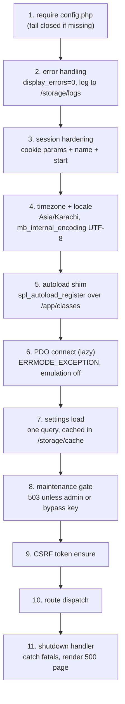
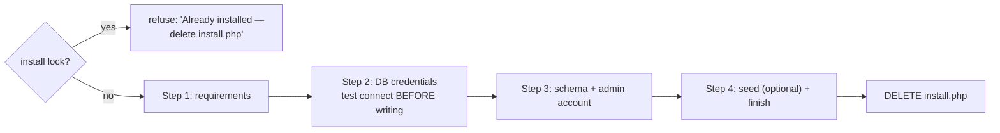

# 02c — Runtime Architecture: Bootstrap, Data, Views, Images, Mail, Install

This document specifies how a Sky Fragrances request actually executes on Hostinger shared
hosting: the fixed order in which `bootstrap.php` brings the application up, the thin PDO
wrapper that is the *only* way anything touches MySQL, the view layer and its escaping rule,
CSRF, the GD-only image pipeline, transactional email through a vendored PHPMailer, and the
one-time `install.php` that a non-developer runs from a browser after uploading a ZIP through
hPanel File Manager. It is a specification, not an implementation: signatures, orders,
algorithms and file layouts are binding; page-level code is not written here. Where it names a
table or column it uses the cross-stream contract in `07-seed-seo-quality.md` §0.2, and where
it disagrees with a sibling document the conflict is flagged inline rather than silently
resolved.

---

## 0. Inherited constraints and the two open conflicts

Constraints carried from `00-brief.md` and restated because every section below depends on
them: PHP 8.2 + PDO only; no Composer, no Node, no build step, no framework; third-party PHP
exists only as vendored plain class files loaded by manual `require`; all SQL must execute on
MySQL 8+ **and** MariaDB 10.4+ (`utf8mb4_unicode_ci`, never `utf8mb4_0900_ai_ci`); money is
`DECIMAL(10,2)` PKR, displayed `Rs. 4,950`; enumerations are short strings, not MySQL `ENUM`.

Two cross-document conflicts this stream has found and is **not** authorised to settle alone:

| # | Conflict | This document's position |
|---|---|---|
| 1 | `03-storefront-pages.md` §1.4 says prices are "unsigned integers in whole rupees"; `07` §0.2 and the task constraint say `DECIMAL(10,2)`. | **`DECIMAL(10,2)` wins.** Every money value is fetched as a string, formatted by one helper, and never cast to `float`. Doc 03 §1.4 must be amended. |
| 2 | `03` route table presets `gender=men` / `gender=women`; `07` §0.2 stores `products.gender` as `him` \| `her` \| `unisex`. | **`him`/`her`/`unisex` wins** (it is the storage contract). The listing controller maps the URL preset to the stored token in one place, `App\Filters::GENDER_MAP`. |

Assumption stated inline for the whole document: the site is a **single front controller**
(`/index.php`) exactly as `03` §1.1 specifies, running under LiteSpeed which reads `.htaccess`.
Where a Hostinger behaviour is assumed rather than verified it is marked *(assumption)*.

> Superseded by 08-decisions-register.md §2 — C-01, C-29, C-28: both conflicts are settled — `DECIMAL(10,2)`; route presets carry `him`/`her`/`unisex` directly, so there is no `GENDER_MAP` and no `App\Filters` class (first-party code is plain functions, 02a §6).

---

## 1. Bootstrap order

`/index.php` is nine lines: it requires `app/bootstrap.php` (08 C-23), then calls
`Router::dispatch()`. Everything below happens inside `bootstrap.php`, in this exact order.
The order is not cosmetic — each step depends on the one above it, and getting it wrong is how
a shared-hosting PHP site leaks a stack trace containing DB credentials onto a product page.



**Step 1 — config.** `require_once __DIR__ . '/../config.php'`. If the file is absent,
bootstrap does not continue: it emits a plain, styled "Sky Fragrances is not configured yet —
run `/install.php`" page with HTTP 503 and stops. A missing config must never fall through to
a PDO connect with empty credentials, because the resulting exception text contains the
server's hostname.

**Step 2 — error handling, before anything can throw.**

- `ini_set('display_errors', $config['env'] === 'production' ? '0' : '1')` and
  `ini_set('display_startup_errors', ...)` identically.
- `error_reporting(E_ALL)` in both environments — production still *reports*, it just does not
  *display*.
- `ini_set('log_errors', '1')`, `ini_set('error_log', APP_ROOT . '/storage/logs/php-error.log')`.
- `set_error_handler()` converts warnings/notices into `ErrorException` so they cannot be
  swallowed; `set_exception_handler()` logs the exception with a short random **incident id**
  and renders the friendly 500 page showing only that id; `register_shutdown_function()` catches
  `E_ERROR`/`E_PARSE` that bypass the exception handler and does the same.
- In development both handlers additionally print the message and trace.

**Step 3 — session hardening, before `session_start()`.**

```php
session_name('SFSHOP');   // 08 C-26 (was sf_sess); admin uses SFADMIN with path /admin
session_set_cookie_params([
    'lifetime' => 0,
    'path'     => '/',
    'domain'   => '',              // host-only cookie; never a leading-dot domain
    'secure'   => $config['env'] === 'production',
    'httponly' => true,
    'samesite' => 'Lax',           // Lax, not Strict: the payment-proof return trip and
                                   // emailed order links must still see the session
]);
ini_set('session.use_strict_mode', '1');    // reject attacker-supplied session ids
ini_set('session.use_only_cookies', '1');
ini_set('session.cookie_httponly', '1');
session_save_path(APP_ROOT . '/storage/sessions');   // 08 C-26: app-owned, denied tree
ini_set('session.gc_maxlifetime', '259200');           // 08 C-26: 3 days (06a §1.1), was 7200
session_start();
```

> Amended by 08-decisions-register.md §2.4 — C-53. Three changes to the block above:
> 1. **Two save paths.** `session_save_path(APP_ROOT . '/storage/sessions/shop')` here and `.../storage/sessions/admin` in `admin/index.php` (05a §2.3). PHP's file handler garbage-collects the whole save path with the *current* request's `gc_maxlifetime`, so one shared directory with a 12 h admin lifetime would silently trim the 3-day cart to 12 h. `install.php` creates both directories with `index.php` stubs.
> 2. **GC actually runs.** `ini_set('session.gc_probability', '1'); ini_set('session.gc_divisor', '100')` in both bootstraps — Hostinger's own sweeper never touches a custom path, and every crawler hit would otherwise leave a file against the inode quota. Session files past their lifetime are also removed by the opportunistic purge (C-56).
> 3. **Lazy storefront session.** `session_start()` runs only when an `SFSHOP` cookie is present, or the request is a `POST`, or the path is `/api/cart/*`, `/checkout` or `/track`. A first-time GET of a product page by a crawler creates no session file and no cookie; the first *Add to cart* does. `csrf_token()` starts the session on demand for forms rendered on cookie-less pages.

Regeneration rules (the only three places `session_regenerate_id(true)` is called):

1. Immediately after a successful admin login.
2. Immediately after an admin password change.
3. On any storefront session older than 30 minutes that is about to be handed a new CSRF
   token — tracked by `$_SESSION['born']`, refreshed on regeneration.

The storefront cart lives in `$_SESSION['cart']` and **survives** regeneration (regeneration
carries session data forward; `true` deletes only the old file). Logout uses
`session_unset()` + `session_destroy()` + an expired cookie, in that order.

**Step 3a — client IP (08 C-50).** `client_ip(): string` in `app/lib/request.php` is the only source of the visitor's address for every rate limit and every `ip_hash` column: if `REMOTE_ADDR` is inside one of the CIDRs in `config['trusted_proxies']` (written by `install.php` from the `REMOTE_ADDR` it saw on its own requests, editable in Settings › Advanced as `trusted_proxies`), return the **rightmost** `X-Forwarded-For` entry that is not itself a trusted proxy; otherwise return `REMOTE_ADDR` and ignore the header. `ip_hash = hash('sha256', client_ip() . config['security']['app_key'])`. An empty proxy list means "trust nobody" — with Hostinger's edge in front, that collapses every visitor into one bucket, which is why the installer's Step 1 shows a *Client IP detection — PASS / WARN* row and 07 B.4.1 tests it on the live host.

**Step 4 — timezone and encoding.** `date_default_timezone_set('Asia/Karachi')` — set in PHP,
never relied upon from `php.ini`, because Hostinger defaults to UTC *(assumption)* and every
order timestamp, coupon `expires_at` comparison and "24 Sep 2026" render depends on it.
`mb_internal_encoding('UTF-8')`, and `setlocale(LC_ALL, 'C')` so `number_format` and float-to-
string never emit a comma as a decimal separator.

**Step 5 — autoload shim.** No Composer means one `spl_autoload_register` that maps
   Superseded by 08-decisions-register.md §2 — C-28: no autoloader and no first-party classes; step 5 is a fixed list of `require_once` for the `app/lib/*.php` function files. `Db::`, `Router::` below read as `db_*()`, `router_*()`.
`App\Foo\Bar` to `/app/classes/Foo/Bar.php`, plus explicit `require_once` for the flat helper
files (`helpers.php`, `money.php`, `view.php`). Vendored libraries (PHPMailer) are **not**
autoloaded — they are `require`d at the point of use, so a storefront page never pays for them.

**Step 6 — PDO connect.** Lazily: `Db::pdo()` opens the connection on first use, so
`/robots.txt`, the 404 page and static-ish content pages can serve without a DB round trip.
DSN and options are fixed in §2.1.

**Step 7 — settings load.** One `SELECT setting_key, setting_value FROM settings` into an
array keyed by `setting_key`, exposed through `setting('whatsapp', $default)`. Cached as a
`var_export`ed PHP array in `/storage/cache/settings.php` and invalidated by the admin on every
settings write (delete the file). If the cache file exists and is newer than 300 seconds it is
`include`d and the query is skipped entirely — this removes one query from every page.
> Superseded by 08-decisions-register.md §2.4 — C-70: the cache is **`/storage/cache/settings.json`**, read with `file_get_contents` + `json_decode`, never `include`d. lsphp's OPcache keeps serving the old opcodes of a rewritten `.php` file for up to its revalidate window, so an `include`d cache made "the announcement bar I just changed" stay old for a minute. Runtime-written state is never PHP source.

**Step 8 — maintenance gate.** §8.2 (08 C-70: reads `settings.maintenance_mode` from the step-7 cache, or the presence of the flag file `storage/MAINTENANCE` — never `config.php`).

**Step 9 — CSRF token ensure.** §4.

**Step 10 — dispatch.** The router normalises the path (strip query, lowercase, strip trailing
slash, 301 if the normalised form differs), matches the §2 route table of `03`, and includes
exactly one controller from `/app/controllers/`. No match → `notfound.php` with a real
`http_response_code(404)`.

---

## 2. Data access — the thin PDO helper

There is exactly one class that talks to MySQL: `App\Db`, a static facade over a single lazy
PDO handle. No controller, view or helper ever constructs a `PDO`, and no SQL string is built
anywhere except inside a repository class under `/app/repositories/`.

### 2.1 Connection

```php
$dsn = sprintf('mysql:host=%s;port=%d;dbname=%s;charset=utf8mb4',
               $cfg['db']['host'], $cfg['db']['port'] ?? 3306, $cfg['db']['name']);

new PDO($dsn, $user, $pass, [
    PDO::ATTR_ERRMODE            => PDO::ERRMODE_EXCEPTION,
    PDO::ATTR_DEFAULT_FETCH_MODE => PDO::FETCH_ASSOC,
    PDO::ATTR_EMULATE_PREPARES   => false,   // real server-side prepares
    PDO::ATTR_STRINGIFY_FETCHES  => false,
    PDO::MYSQL_ATTR_FOUND_ROWS   => true,    // UPDATE affected rows = matched, not changed
]);
```

Immediately after connecting, two session statements run in this order (08 C-55): `SET time_zone = '+05:00'` (01c §4.2) and `SET SESSION sql_mode = 'STRICT_ALL_TABLES,NO_ZERO_DATE,NO_ZERO_IN_DATE,ERROR_FOR_DIVISION_BY_ZERO'`. The second is what makes C-03's `INT UNSIGNED` a loud failure: without strict mode a MariaDB image shipped with a permissive `sql_mode` clamps `stock - 5` on `3` to `0` with a warning instead of raising 1264. The app owns its `sql_mode`; it never depends on the host's `my.cnf`. `SET SESSION TRANSACTION ISOLATION LEVEL READ COMMITTED` (06b §1.1) is likewise issued from PHP at checkout, never from a `.sql` file.

`ATTR_EMULATE_PREPARES => false` is the load-bearing one: it makes `LIMIT :n` bind as an
integer and makes injection through a bound parameter structurally impossible. `charset=utf8mb4`
in the DSN is the third leg of the encoding discipline in `07` §0.3. On connect failure the
`PDOException` is caught, logged in full, and re-thrown as a generic `RuntimeException` whose
message contains no credentials.

`DECIMAL` columns arrive as **strings** (`"4950.00"`). That is correct and deliberate; §3.4
covers formatting. `PDO::ATTR_STRINGIFY_FETCHES => false` gives native ints for `INT` columns,
which keeps `stock` and `sort_order` comparisons honest.

### 2.2 The complete API

```php
final class Db
{
    public static function pdo(): PDO;

    public static function query(string $sql, array $params = []): PDOStatement;
    public static function fetch(string $sql, array $params = []): ?array;
    public static function fetchAll(string $sql, array $params = []): array;
    public static function fetchColumn(string $sql, array $params = [], int $col = 0): mixed;
    public static function fetchPairs(string $sql, array $params = []): array;

    public static function insert(string $table, array $data): int;          // returns new id
    public static function update(string $table, array $data, array $where): int;  // rows matched
    public static function delete(string $table, array $where): int;

    public static function transaction(callable $fn): mixed;
    public static function lastInsertId(): int;
    public static function exists(string $sql, array $params = []): bool;
}
```

Binding rules, without exception:

1. **Every** call goes through `PDO::prepare()` + `execute($params)`. `Db::query()` has no
   branch that executes a raw string; there is no `Db::raw()`. Even parameterless statements
   are prepared, so no future edit can introduce a concatenation path.
2. Named placeholders only (`:slug`), never `?`. Names match the array keys.
3. `insert()`/`update()`/`delete()` take the table name as a PHP literal from the calling
   repository — **never** from user input. The column names come from the `$data` array keys,
   which are validated against a per-table whitelist constant on the repository before the call;
   any key not in the whitelist throws. This is what makes "column names cannot be bound" safe.
4. `transaction()` wraps `beginTransaction`/`commit`, rolls back and re-throws on any
   exception, and is **not** nestable — a nested call throws rather than silently joining the
   outer transaction. Checkout (§stock decrement, order + order_items + coupon usage) is the
   only storefront path that uses it; admin bulk operations are the others.

### 2.3 Dynamic filter SQL — the shop page

`/shop` accepts collection, gender, scent family, price range, `on_sale`, search text, sort and
page. This is the one place where the SQL shape varies with user input, so it gets an explicit
algorithm. The rule is: **user input only ever becomes a bound value; the SQL skeleton only ever
comes from constants in the code.**

1. Start with `$where = ['p.is_active = 1']` and `$params = []`. Both grow together; neither is
   ever a string.
2. For each recognised filter key, look the request value up against a fixed whitelist and append
   a fixed fragment:
   - `collection` → `SELECT id FROM collections WHERE slug = :collection AND is_active = 1`
     first; if no row, the page is a 404, not an empty grid. Then
     `$where[] = 'p.collection_id = :collection_id'`.
   - `gender` → value must be in `['him','her','unisex']` after `GENDER_MAP`; otherwise the
     filter is dropped silently. Then `$where[] = 'p.gender = :gender'`.
   - `family` → matched against the distinct `scent_family` values (cached); dropped if unknown.
   - `price_min` / `price_max` → cast with `filter_var(..., FILTER_VALIDATE_INT)`; a failure
     drops the bound. Applied against the effective price expression in step 4.
   - `on_sale` → literal fragment, no parameter:
     `EXISTS (SELECT 1 FROM product_sizes s2 WHERE s2.product_id = p.id AND s2.sale_price IS NOT NULL AND s2.sale_price > 0)`.
   - `q` → `$where[] = '(p.name LIKE :q OR p.short_description LIKE :q OR p.scent_family LIKE :q)'`
     with `$params['q'] = '%' . strtr($raw, ['%' => '\%', '_' => '\_']) . '%'`. Escaping the
     LIKE wildcards matters: an unescaped `%` turns a search into a full scan that matches
     everything.
3. `$sql .= ' WHERE ' . implode(' AND ', $where);` — the only concatenation, and every element
   of `$where` is a literal from the code above.
4. **Sort** is the classic injection hole, so it is a lookup, never interpolation:

```php
private const SORT = [
    'featured' => 'p.is_featured DESC, p.sort_order ASC, p.id DESC',
    'newest'   => 'p.is_new DESC, p.created_at DESC, p.id DESC',
    'price_asc'=> 'eff_price ASC, p.id DESC',
    'price_desc'=> 'eff_price DESC, p.id DESC',
    'best'     => 'sold_qty DESC, p.id DESC',
];
$orderBy = self::SORT[$req['sort'] ?? 'featured'] ?? self::SORT['featured'];
```

   `eff_price` is a derived column computed once in the SELECT as
   `MIN(COALESCE(NULLIF(s.sale_price,0), s.price))` over the joined active `product_sizes`,
   so "cheapest active size" is what both the card price and the price filter mean. There is no
   MySQL-only syntax here and no window function — MariaDB 10.4 runs it unchanged.
5. **Pagination** binds as integers, made possible by disabled emulation:
   `... LIMIT :limit OFFSET :offset` with `bindValue(':limit', $perPage, PDO::PARAM_INT)`.
   `$page` is clamped to `1..500`; `$perPage` is a constant (24), never from the query string.
6. The count query reuses the identical `$where` / `$params` via one private method returning
   `[$whereSql, $params]`, so the total and the page can never disagree about the filter.

The same builder serves routes 4–11 of the `03` route table by seeding `$where` with the
**preset** before reading the request, and marking those preset keys as locked so a query string
cannot remove them.

---

## 3. View layer

### 3.1 Files

```
/app/views/
├── layouts/
│   ├── storefront.php      header/footer chrome from 03 §1.5
│   ├── admin.php
│   └── bare.php            invoice / packing slip / email-preview, no chrome
├── partials/
│   ├── head.php            title, meta, canonical, OG, JSON-LD  (§3.3)
│   ├── header.php  footer.php  announcement.php
│   ├── cart-drawer.php  whatsapp-button.php  toasts.php
│   ├── product-card.php    the PRODUCT_CARD of 03 §1.3
│   ├── flash.php           (§3.5)
│   └── pagination.php  breadcrumbs.php  price.php  rating-stars.php
└── pages/                  one file per row of the 03 route table
```

A controller ends with exactly one call:

```php
render('pages/product.php', ['product' => $p, 'sizes' => $sizes], $head);
```

`render()` extracts the data array into local scope, `ob_start()`s the page file, then includes
the layout with `$content` already captured. Views therefore never `require` each other except
through `partial('partials/product-card.php', ['p' => $p])`, which is the same mechanism with an
isolated scope. No view opens a DB connection; a view that needs data the controller did not
pass is a bug in the controller.

### 3.2 The escaping rule

```php
function e(?string $v): string {
    return htmlspecialchars($v ?? '', ENT_QUOTES | ENT_SUBSTITUTE | ENT_HTML5, 'UTF-8');
}
```

**Every** value printed in a view passes through `e()`. Not "every user-supplied value" —
*every* value, including product names, settings, and strings the seed put there, because the
admin panel can edit all of them and a rule with an exception is a rule nobody applies.
`ENT_SUBSTITUTE` matters: without it one malformed UTF-8 byte in a pasted product description
returns an empty string and the product name silently vanishes from the page.

Context-specific companions, because `e()` is only correct inside HTML text and quoted
attributes:

| Context | Helper | Notes |
|---|---|---|
| HTML text, quoted attribute | `e($v)` | the default |
| URL path segment / query value | `eu($v)` = `rawurlencode` | then `e()` if it lands in an attribute |
| Inside `<script>` (JSON-LD, JS config) | `ejs($v)` = `json_encode` with `JSON_HEX_TAG\|JSON_HEX_AMP\|JSON_HEX_APOS\|JSON_HEX_QUOT\|JSON_UNESCAPED_UNICODE\|JSON_UNESCAPED_SLASHES` | prevents `</script>` breakout |
| Admin rich text (product description) | `sanitize_html($v)` | allowlist of `p, br, strong, em, ul, ol, li, a[href]`, `a` forced to `rel="nofollow noopener"`; everything else stripped. This is the **only** place unescaped markup reaches the page, and only from an authenticated admin. (08 C-62: the product description is **plain text** (05a §4.3) and is `e()`d. The one HTML sink is `content_pages.body`, and `sanitize_html()` is defined as: `DOMDocument::loadHTML` on a UTF-8-declared fragment; walk the tree and unwrap every element not in `p, br, strong, em, b, i, ul, ol, li, a, h2, h3, blockquote`; strip **every** attribute except `href` on `a`; keep `href` only when `parse_url` gives scheme `http`/`https`/`mailto` or a site-relative path starting with `/` and not `//`; force `rel="nofollow noopener"`; `saveHTML()` the body children. `strip_tags()` is never used — it keeps `onmouseover` and `javascript:` attributes. Applied on **save and on render**, so a row written by any other path is still safe.) |
| CSS value | never interpolated | no user input reaches CSS |

Enforcement: a `grep -n '<?= *\$' app/views` in the pre-launch checklist must return nothing —
every echo is `<?= e($x) ?>` or a named helper.

### 3.3 Head / meta / OG / JSON-LD

Per `03` §1.2 the controller fills one array and the layout consumes it; **no view emits a meta
tag directly.** The shape:

```php
$head = [
  'title'            => 'Azure Oud — Woody Oud Perfume | Sky Fragrances',  // truncated to 60
  'meta_description' => '…',                                              // truncated to 155
  'canonical'        => 'https://skyfragrances.com/product/azure-oud',
  'robots'           => 'index,follow',
  'body_class'       => 'product',
  'og'               => ['type' => 'product', 'image' => '…/og/azure-oud.jpg'],
  'jsonld'           => [$productSchema, $breadcrumbSchema],
];
```

`head.php` applies defaults before rendering: title falls back to the site name, description to
`settings.meta_description`, `og:title`/`og:description` to the page title/description,
`og:image` to `settings.og_default_image`, `og:url` to the canonical, plus the constants
`og:site_name`, `og:locale = en_PK` and `twitter:card = summary_large_image`. `Organization`
JSON-LD is appended to every page's `jsonld` array by the layout, not by controllers.

Truncation is word-boundary aware and happens in `head.php`, once, so no controller can ship a
72-character title. Each JSON-LD block is emitted as its own
`<script type="application/ld+json">` with `ejs()`.

### 3.4 Money rendering

One helper, used everywhere, taking the PDO string straight through:

```php
function money(string $v, bool $withDecimals = false): string {   // 08 C-02: 01c §1.3 signature; "4950.00" -> "Rs. 4,950"
    return 'Rs.' . "\u{00A0}" . number_format((float)$v, 0, '.', ',');
}
```

The single `(float)` cast lives inside this function and its output is a display string that is
never read back. All arithmetic (subtotals, percentage coupons, shipping thresholds) happens in
integer **paisa** — multiply the `DECIMAL` string by 100 with `bcmul`-free integer maths
(`(int) round($v * 100)` at the boundary), sum as ints, round half-up once, divide back for
storage. Rounding is half-up to the whole rupee, server-side, at the moment of calculation, per
`03` §1.4.

### 3.5 Flash messages

`flash('success', 'Your order has been placed.')` pushes onto `$_SESSION['_flash']`;
`flash_take()` returns and clears the whole array. `partials/flash.php` renders it inside
`<main>`, above page content, with `role="status"` for success/info and `role="alert"` for
error. Types: `success`, `error`, `info`. Flashes survive exactly one redirect and are cleared
even if the destination template forgets to render them (the layout always calls
`flash_take()`), so a stale message can never reappear three pages later. The AJAX cart returns
its message in the JSON body instead and never writes a flash, otherwise the next full page load
would replay a toast the customer already dismissed.

---

## 4. CSRF

**One token per session, not per form.** Per-form tokens break the two things this site does
most: a customer with the cart drawer open in one tab and a product page in another, and an
owner leaving the admin order list open on a phone all afternoon. A single rotating-on-privilege-
change session token is the right trade here.

```php
function csrf_token(): string;                   // ensures + returns $_SESSION['_csrf']
function csrf_field(): string;                   // '<input type="hidden" name="_csrf" value="…">'
function csrf_check(?string $t = null): void;    // throws HttpException(419) on failure
function csrf_rotate(): void;                    // login, logout, password change
```

- Generation: `bin2hex(random_bytes(32))`, created in bootstrap step 9 if absent. `random_bytes`
  only — never `uniqid`, `mt_rand` or `session_id()`.
- Validation: `hash_equals($_SESSION['_csrf'], $submitted)`. Constant-time, and the comparison
  is on the raw strings, not a trimmed/lowercased copy.
- **Every** `POST`, and every state-changing `GET` (there are none by design — `/unsubscribe`
  uses an HMAC token in `?t=`, not the session token, because it is clicked from an email).
- Failure behaviour differs by surface: a storefront form failure re-renders the form with the
  posted values, a fresh token and an "your session expired, please try again" flash — never a
  bare 419 page that loses a checkout the customer just typed on a phone. An admin failure
  redirects to the admin login. An AJAX failure returns `{"ok":false,"error":"csrf"}` with
  HTTP 419 and the JS reloads the page.
- Rotation: `csrf_rotate()` runs alongside every `session_regenerate_id(true)` from §1 step 3.
  It does **not** run on ordinary navigation.

**AJAX (cart drawer, newsletter, search-suggest).** The token is published once, in the layout:

```html
<meta name="csrf-token" content="<?= e(csrf_token()) ?>">
```

`app.js` reads it at load into a module-scoped constant and sends it as the
`X-CSRF-Token` header on every `fetch` to `/api/*`. `api/*.php` accepts the token from either
the header or a `_csrf` body field, so a form degrading to a normal POST without JS still works.
The API also requires `Content-Type: application/json` **and** rejects requests whose `Origin`
header is present and is not the site origin — belt and braces, since a cross-origin form post
cannot set a custom header but can set `Content-Type` in a few legacy shapes.
> Amended by 08-decisions-register.md §2.4 — C-49: "the site origin" is the **request's own origin** — `request_origin()` = scheme (from the 02b §2.3 three-signal HTTPS detection) + `://` + `$_SERVER['HTTP_HOST']` (lower-cased, port stripped) — **never `config['base_url']`**. The same rule applies to the admin POST check in 05a §2.5. `base_url` is written once at install and is wrong on the preview host, before the DNS switch, or after an http→https change; comparing against it killed the cart drawer and 419'd every admin form in every realistic go-live order. `base_url` is used only for canonical/OG/sitemap/email links, is editable on Settings › Advanced, and the dashboard shows *"You opened the panel at https://X but the site address is set to Y"* whenever the two differ. Cart endpoints are
POST-only; `GET /api/cart` is read-only and therefore exempt from the token but still returns
`Cache-Control: no-store`.

---

## 5. Image pipeline (GD only)

No ImageMagick, no CLI, no Composer library. GD ships with Hostinger PHP 8.2 and is confirmed
present locally (`00-brief.md` §Verified local environment). Uploads are admin-only, but they are
treated as hostile anyway — a compromised admin password must not become PHP execution.

### 5.1 Validation ladder (all five must pass; extension is never consulted)

1. `$_FILES[...]['error'] === UPLOAD_ERR_OK` and `is_uploaded_file()`.
2. Size ≤ **8 MB** per file, ≤ 10 files per request. Checked against the actual byte count, and
   the form also carries `MAX_FILE_SIZE` purely as a client courtesy.
   > Superseded by 08-decisions-register.md §2.4 — C-46: **6 MB** per admin image, **5 MB** per customer proof, **one file per request** (05a §4.3 is the uploader contract; the non-JS fallback is a single-file form). `CONTENT_LENGTH` is compared with `ini_get('post_max_size')` before `$_FILES` is read.
3. `finfo_file(finfo_open(FILEINFO_MIME_TYPE), $tmp)` ∈ `{image/jpeg, image/png, image/webp}`.
4. `getimagesize($tmp)` returns a truthy array whose `[2]` ∈
   `{IMAGETYPE_JPEG, IMAGETYPE_PNG, IMAGETYPE_WEBP}` **and whose type agrees with the finfo
   result**. A polyglot file that satisfies one check rarely satisfies both.
5. Dimensions: `50 ≤ w,h ≤ 8000`, and `w*h ≤ 40_000_000` — the decompression-bomb guard, checked
   *before* any `imagecreatefrom*` call, because GD allocates `w*h*4` bytes and a 30k×30k PNG
   would exhaust the shared-hosting memory limit and take the site down with a fatal.
   > Amended by 08-decisions-register.md §2.4 — C-46: edge cap **10,000 px** (an 8000×6000 phone frame is the normal case, not an attack), and the pixel cap is computed at runtime: `max_pixels = (ini_bytes('memory_limit') − 48·2^20) / 5`. The installer's requirements screen prints the effective `memory_limit` and the resulting megapixel budget. Rejection copy: *"This photo is too large for the server to process. Choose 'Medium' or 'Large' when sharing from your gallery."*

The original upload is **never** stored or served. It is decoded into a GD resource and every
delivered file is re-encoded from that resource. This is the EXIF strip: GD's encoders write no
EXIF/IPTC/XMP block, so re-encoding discards the camera GPS data, any embedded thumbnail and any
appended PHP payload in one step. Before decoding, `imagecreatefromjpeg()` is wrapped so a GD
warning becomes a rejection rather than a half-built resource. PNG alpha is preserved with
`imagealphablending(false)` + `imagesavealpha(true)`; JPEG output composites onto `#0A0A0A`
first, so a transparent bottle render never lands on black-on-black.

### 5.2 Generated sizes

Every accepted upload produces **six** files: three sizes × (WebP + JPEG fallback). Product
imagery is 4:5 per `03` §1.3; the OG image is 1.91:1 and generated only for the primary image.

| Key | Pixels (w×h) | Ratio | Used by | JPEG q | WebP q |
|---|---|---|---|---|---|
| `thumb` | 200 × 250 | 4:5 | admin lists, cart drawer lines, gallery strip | 80 | 78 |
| `card` | 600 × 750 | 4:5 | PRODUCT_CARD (`srcset` 400/600/900w → `card` + `zoom`) | 82 | 80 |
| `zoom` | 1400 × 1750 | 4:5 | PDP main image and its zoom | 84 | 82 |
| `og` | 1200 × 630 | 1.91:1 | `og:image`, primary image only | 85 | — (JPEG only; crawlers) |

> Superseded by 08-decisions-register.md §2.4 — C-45: the product derivative set is **400 / 600 / 900 / 1400 px wide** (4:5, so 400×500, 600×750, 900×1125, 1400×1750), named `w400`, `w600`, `w900`, `w1400`, each as WebP + JPEG, plus `og` (1200×630, JPEG) for the primary image — nine files per accepted upload. `srcset` lists all four widths; `w1400` is the zoom/LCP source and the regeneration source. The 200 px `thumb` is struck (admin lists and the drawer use `w400`). Collection images get **one ratio, 3:4** (`w600` 600×800 and `w1400` 1400×1867), reused under a scrim on the collection hero; 05a §4.4's 16:9 is struck (F-15).

Resizing is cover-crop to the target ratio then `imagescale($img, $w, $h, IMG_BICUBIC_FIXED)`;
an upload smaller than a target is **not** upscaled — that size simply reuses the next one down
and the `srcset` omits the missing width. `imageinterlace($img, true)` on JPEG so a slow Pakistani
mobile connection paints progressively.

### 5.3 WebP fallback when GD lacks it

Check once, at bootstrap-free cost: `function_exists('imagewebp') && (imagetypes() & IMG_WEBP)`.
The result is stored in the `settings` row `images_webp_enabled` (`1`/`0`) by `install.php` and
re-checked by the admin "Re-scan server capabilities" button.

- WebP available → both formats written; the view emits
  `<picture><source type="image/webp" srcset="…"></picture>`.
- WebP unavailable → only JPEG is written, and `partials/product-card.php` omits the `<source>`
  element entirely. Nothing 404s, no broken image, the page is simply a little heavier.
- The check is per-server, so a site that starts on a WebP-less host and is later migrated can
  backfill by running the admin "Regenerate all image derivatives" job (08 C-73: batched — it processes rows from `?offset=` for ~20 s of wall-clock, then self-redirects to the next offset with a progress line, so it never meets `max_execution_time`; `install.php` Step 4 seeds images the same way), which walks
  `product_images` and re-derives from… nothing, because originals are not kept. **Accepted
  trade-off, stated explicitly:** regeneration re-derives from the largest surviving derivative
  (`zoom`), which is lossy-from-lossy but visually acceptable at these sizes. Keeping originals
  would double storage on a shared plan for a case that may never occur.

### 5.4 Filenames and storage paths

Deterministic, collision-free, and containing nothing the uploader controls:

```
{entity}-{entity_id}-{sha1(entity_id|original_basename|upload_microtime) : first 10}-{size}.{ext}
e.g.  product-7-9f3c1ab204-card.webp
```

`product_images.filename` stores **only the stem** (`product-7-9f3c1ab204`); the size suffix and
extension are appended by the URL helper, so adding a fourth size later needs no data migration.

```
/uploads/
├── products/{product_id}/  product-7-9f3c1ab204-{thumb|card|zoom}.{webp|jpg}
├── og/                     product-7-9f3c1ab204-og.jpg
├── collections/            collection-4-…-{card|zoom}.{webp|jpg}
(payment proofs are NOT under uploads — storage/proofs/{YYYY}/{MM}/{32hex}.{ext}; 08 C-25)
└── .htaccess
```

`/uploads/.htaccess` disables execution rather than trusting the filename (08 C-72: the block below is **void** — 02b §5 is the single canonical text and the literal `install.php` embeds):

```apache
# (php_flag engine off removed — LiteSpeed ignores it and some Apache builds 500; 08 C-37. See 02b §5.)
RemoveHandler .php .phtml .php3 .php4 .php5 .php7 .php8 .phar
<FilesMatch "\.(?i:php\d?|phtml|phar|cgi|pl|py|htaccess)$">
  Require all denied
</FilesMatch>
Options -Indexes -ExecCGI
AddType text/plain .php .phtml
<IfModule mod_headers.c>
  Header set X-Content-Type-Options "nosniff"
  Header set Content-Disposition "inline"
</IfModule>
```

Payment-proof screenshots (§brief, manual payment methods) are customer uploads and get the same
validation ladder plus one extra rule: they are **not** served from `/uploads` directly. The
admin views them through `/admin/orders/{order_number}/proof` (08 C-25), which checks the admin session and
streams the bytes with `Content-Type: image/jpeg`, `Content-Disposition: inline` and `nosniff`.
A proof filename is a 16-byte random, so the path is unguessable even if the directory rule is
ever lost during a File-Manager copy.

---

## 6. Email — vendored PHPMailer over SMTP

### 6.1 Why not `mail()`

Bare `mail()` on Hostinger shared hosting hands the message to a shared sendmail queue with the
envelope sender set to a `u123456789@srvNNN.hostinger.com`-style local account. The `From:` header
then says `orders@skyfragrances.com` while the envelope says something else: SPF fails (the
sending IP is shared and is not in the domain's SPF record), DKIM is absent entirely because
nothing signs the message, and DMARC alignment therefore fails on both legs. Gmail's response to
that is the spam folder, and the shared IP's reputation is the sum of every other tenant's
behaviour. Authenticated SMTP to the domain's own mailbox fixes all three: the envelope sender is
the authenticating mailbox, Hostinger's mail servers are in the domain's SPF record, and they DKIM-
sign outbound mail. Order confirmations are the one email a customer actually looks for — this is
not a nicety.

### 6.2 What to vendor

PHPMailer 6.9.x, source only, at `app/lib/vendor/PHPMailer/`, four files:

```
app/lib/vendor/PHPMailer/PHPMailer.php
app/lib/vendor/PHPMailer/SMTP.php
app/lib/vendor/PHPMailer/Exception.php
app/lib/vendor/PHPMailer/POP3.php        # not used; include it only if the host ever needs POP-before-SMTP
```

Loaded by manual `require_once` inside `Mailer::send()` only — never autoloaded, never required
by `bootstrap.php`, so a storefront page never parses them. `/lib/.htaccess` carries
`Require all denied` + `Deny from all`. Transport settings: `isSMTP()`, `SMTPAuth = true`,
host/port/user/pass from `config.php`, `SMTPSecure = 'tls'` on 587 (Hostinger's documented
submission port *(assumption — verify in hPanel at deploy time)*), `CharSet = 'UTF-8'`,
`Encoding = 'base64'`, `Timeout = 15` (08 C-56: **`Timeout = 5`** — the one SMTP timeout in the codebase). `From` is forced to the SMTP username regardless of what a
template asks for, with `addReplyTo()` carrying the customer address — a mismatched `From` is the
same DMARC failure by another route.

### 6.3 Templates

Plain PHP files in `/app/views/emails/`, rendered through the same `render()` with `layouts/
email.php` (table-based, inlined CSS, 600px, black/champagne, logo as a hosted `` — no
embedded CID attachments, which trip spam filters). Every template also produces a plain-text
alternative via a matching `.txt.php`, set on `AltBody`; a multipart/alternative message scores
better and is the only thing a smartwatch shows.

| Template | To | Trigger | Must contain |
|---|---|---|---|
| `order-confirmation` | customer | order placed | order number, line items with size and price, subtotal/discount/shipping/total, payment method and (if manual) the bank/JazzCash/Easypaisa details to pay into, delivery address, track link `/track`, WhatsApp number |
| `order-admin-alert` | `settings.admin_email` | order placed | order number, total, payment method, customer name + phone as a `tel:` link, items, direct link to `/admin/orders/{id}` |
| `order-status` | customer | admin changes status | new status, human sentence per status, courier + tracking number when `shipped`, track link. Not sent for `pending`→`confirmed` if the admin unticks "notify customer" |
| `contact-autoreply` | sender | contact form saved | acknowledgement, expected reply window from `settings.reply_time`, WhatsApp number. Sent **once per address per hour** (a `contact_messages` timestamp check) so a bot cannot use it as an amplifier. (08 C-63: **never** the message body or any sender-supplied text beyond the subject line; only after honeypot and time-trap pass; skipped when the address has a `contact_messages` row in the last 24 h; site-wide cap 30 per hour, beyond which the row is queued and never sent.) |

### 6.4 Failure — the order is never lost

Mail is sent **after** the checkout transaction has committed, never inside it. The sequence:

1. `Db::transaction()` writes the order, items, coupon usage and stock decrement. Commit.
2. Redirect target is computed. Only then is `Mailer::send()` called, inside its own
   `try/catch`, with a 15-second SMTP timeout (08 C-56: 5 s, and at checkout only the customer confirmation is attempted inline; the admin alert waits for the next admin page load).
3. On any exception: log at error level with the order number, write a row into
   `email_outbox(id, to_email, template, payload_json, attempts, last_error, created_at, sent_at)`,
   and **continue**. The customer still reaches the confirmation page; the page shows the order
   number and a "we've also sent this to your email" line only when sending succeeded.
4. The admin dashboard shows a red "N emails failed to send" tile linking to a retry screen, and
   the admin order detail always shows the customer's phone — because in Pakistan the WhatsApp
   message is the real notification and email is the receipt.
5. Retry: the admin retry button, and optionally an hPanel cron hitting
   `/cron.php?key={settings.cron_key}` every 15 minutes, which drains `email_outbox` with
   exponential backoff, max 5 attempts. The cron is optional by design — nothing breaks without
   it *(assumption: the client may never configure cron)*.
   > 08 C-56 states the drain rule once: **every admin page load**, after the response is flushed, only due rows, at most 2 sends and 12 s per load, `Timeout = 5`, 6 attempts then `failed`; dashboard shows *"{n} emails waiting"* whenever queued rows exist. `cron.php` (key from `config['security']['cron_key']`, or CLI) is the optional accelerator and is in 02a's tree.

`email_outbox` is a new table this document introduces; it is a **cross-stream contract addition**
   Superseded by 08-decisions-register.md §2 — C-16: the table is `email_outbox` with the 06b §0.2 DDL (this document originally called it `email_queue`).
and must be added to the schema document and to `install.php`'s DDL.

---

## 7. `config.php` and `install.php`

### 7.1 `config.php` shape

One file at the application root, returning an array — not a pile of `define()`s, so it can be
`var_export`ed by the installer and diffed by a human.

```php
<?php return [
  'env'      => 'production',          // 'production' | 'development'  — the ONE line that differs (§9)
  'base_url' => 'https://skyfragrances.com',   // no trailing slash; used for canonical, OG, email links
  'db' => [
    'host' => 'localhost', 'port' => 3306,
    'name' => 'u123456789_skyfrag', 'user' => 'u123456789_sky', 'pass' => '…',
  ],
  'smtp' => [
    'host' => 'smtp.hostinger.com', 'port' => 587, 'secure' => 'tls',
    'user' => 'orders@skyfragrances.com', 'pass' => '…',
    'from_name' => 'Sky Fragrances',
  ],
  'security' => [
    'app_key'      => '…64 hex…',      // HMAC key: unsubscribe links, order-confirmation tokens
    'cron_key'     => '…32 hex…',
    'maintenance'  => false,
    'maintenance_bypass' => '…16 hex…',
  ],
];
```

> Amended by 08-decisions-register.md §2.4 — C-49 / C-50 / C-70: `base_url` is written by `install.php` as **`https://` + the canonical host** (`skyfragrances.com`, or the host the installer was opened on when that is not a `*.hostingersite.com` preview) regardless of the scheme the installer was opened on, and is **never** used for Origin/Referer checks (§4). It can be overridden by the `base_url` key on Settings › Advanced. `security.maintenance` and `security.maintenance_bypass` are **removed** — maintenance mode is `settings.maintenance_mode` plus the `storage/MAINTENANCE` flag file (§8.2). `'trusted_proxies' => ['…/24']` is added (C-50). After install the file is `0400` and nothing in the application writes it again.

It ships as `config.sample.php`; `install.php` writes the real one. `/.htaccess` denies direct
access to `config*.php` as a second line of defence behind PHP's own "a `.php` file is executed,
not listed" behaviour — which fails the moment PHP is misconfigured, which is exactly when you
need the rule.

### 7.2 `install.php` design

A single self-contained file at the web root, running a four-step wizard, each step a POST to
itself with CSRF.



**Refusing to run twice — three independent guards, any one of which stops it.** A single guard
is not enough because the failure mode is catastrophic: a second run that recreated the admin
account would hand the store to whoever ran it.

1. `config.php` exists **and** is parseable **and** its DB credentials connect **and** the
   `settings` table contains `install_completed_at` → refuse, with the "delete install.php now"
   banner and nothing else on the page.
2. A lock file `/storage/.installed` exists → refuse.
3. If `config.php` exists but the DB is empty (a half-finished install), the installer offers a
   single explicit "resume — my database is empty" button that is disabled unless **zero**
   application tables are present. It never drops a table. There is no "reinstall" path; a real
   reinstall means dropping the database in phpMyAdmin by hand.

**Step 1 — requirements.** PHP ≥ 8.2; extensions `pdo_mysql`, `mbstring`, `fileinfo`, `gd`,
`openssl`, `curl`; `imagewebp` present (warning, not a blocker — §5.3); writable `/storage`,
`/storage/logs`, `/storage/cache`, `/uploads`; `.htaccess` rewrites actually working (tested by
fetching `{base_url}/__rewrite-probe` and checking for the sentinel the router returns). Each row
is pass/warn/fail with a plain-English fix. Failures block Next.
> Amended by 08-decisions-register.md §2.4 — C-47 / C-46 / C-50. Only the **local** checks (PHP version, extensions, writable directories) can block Next. Every self-fetch probe (`__rewrite-probe`, `uploads/.probe.php`, `GET /db/schema.sql`, `GET /storage/.htaccess`) is advisory: 5 s `curl`, no redirect following, a 301/302 to `https://` counts as a pass, and an unreachable host prints *"Could not verify — open this URL on your phone and confirm …"*. Step 1 also prints the effective `memory_limit` and the image megapixel budget derived from it; warns when `public_html/default.php` (Hostinger's placeholder) or a nested `public_html/public_html/` exists; shows *Client IP detection — PASS / WARN* and records `REMOTE_ADDR` into `trusted_proxies`; and creates every `storage/*` directory (incl. `sessions/shop`, `sessions/admin`) plus the `.htaccess` files for `app/`, `db/`, `storage/`, `uploads/`, `assets/` and `admin/{controllers,views,partials}/` from string literals.

**Step 2 — database, validated before anything is written.** The form takes host, name, user,
password. On submit the installer opens a PDO connection with the same options as §2.1, runs
`SELECT VERSION()`, and asserts the server is MySQL ≥ 8.0 or MariaDB ≥ 10.4. It then creates and
drops a throwaway `sf_install_probe` table to prove CREATE/DROP rights. **Only after all of that
succeeds** is `config.php` written — with `app_key`, `cron_key` and `maintenance_bypass` generated
by `random_bytes` — via a write-to-temp + `rename()` so a half-written config can never exist. If
the directory is not writable the installer shows the exact file contents in a `<textarea>` with a
"copy this and create config.php in File Manager" instruction, because on some plans the web user
cannot write to the root and the non-developer must not be stranded there.

**Step 3 — schema and admin account.** The DDL is executed statement-by-statement from an array of
strings embedded in the installer (not a `.sql` file read at runtime, so nothing can be truncated
by an upload), inside a loop that reports which statement failed. All DDL is the portable subset:
`ENGINE=InnoDB DEFAULT CHARSET=utf8mb4 COLLATE=utf8mb4_unicode_ci`, no functional defaults, no
`JSON_TABLE`, `TIMESTAMP` columns given explicit `DEFAULT CURRENT_TIMESTAMP` only where MariaDB
10.4 allows it, all `DECIMAL(10,2)` for money. The same DDL is also shipped as `db/schema.sql` for
a phpMyAdmin import path (08 C-55: `CREATE TABLE IF NOT EXISTS … ROW_FORMAT=DYNAMIC` only — no `CREATE DATABASE`, no `USE`, no `DROP`, no `SET SESSION`; `db/seed.sql` is `INSERT IGNORE` keyed on the sample slugs/SKUs/codes so a re-import six months later is a no-op that cannot touch orders). Then the admin form: email, password (≥ 12 chars, confirmed, strength
meter), store name, WhatsApp number. (08 C-47 / F-10: the entered email is written into `settings.order_notify_email` **and** `contact_email` when those are blank, so the owner's "new order" alert has a recipient on day one; the SMTP credentials entered on this screen are verified by a **Send test email** button that must succeed or be explicitly skipped, and the guide requires the `@skyfragrances.com` mailbox to exist in hPanel → Emails *before* this step.) The password is stored with `password_hash($p, PASSWORD_DEFAULT)`
and the plaintext is never logged, never echoed back into the form, and never put in a flash.

**Step 4 — seed.** A checkbox, default **on**, labelled "Install 12 sample perfumes, 5 collections
and the WELCOME10 coupon (recommended — you can delete them later)". It runs the `07` Part A
inserts. Unchecking it produces an empty but fully working store. The installer also inserts the
non-negotiable `settings` rows (shipping fee, free-shipping threshold, payment-method toggles,
meta description, `images_webp_enabled` from the §5.3 probe) regardless of the checkbox, because
the storefront reads them unconditionally.

**Finish.** Write `install_completed_at` into `settings` and the `/storage/.installed` lock, then
render a page whose entire top third is one red panel (08 C-47: first try `unlink(__FILE__)`; the panel below is shown **only if that fails**, otherwise the page says *"install.php has deleted itself"*. C-52: Finish also runs the https self-check and, on success, flips the root `.htaccess` HTTPS rule from `R=302` to `R=301`; otherwise it says *"HTTPS is not confirmed yet — Settings › Advanced › Make HTTPS permanent once the padlock shows"*. Finish sets `site_indexable = 0` when the host is not `skyfragrances.com`):

> **⚠ Delete `install.php` now.** Anyone who can reach
> `https://skyfragrances.com/install.php` while this file exists can see your server details.
> Open hPanel → File Manager → `public_html` → right-click `install.php` → Delete.
> Then reload this page to confirm it is gone.

with a "Check now" button that fetches `/install.php` and reports 404/200. The admin dashboard
additionally renders a permanent red banner while the file is still present — detected by
`file_exists()`, checked on every admin page load, not once.

---

## 8. Logging and maintenance mode

### 8.1 Logging

One helper, four levels, one destination family:

```php
log_write(string $level, string $message, array $context = []): void;   // debug|info|warning|error
```

Files live in `/storage/logs/`, which sits **outside** `public_html` where the plan allows it and,
because `03` §1.1 puts everything under `public_html` for File-Manager reasons, is additionally
protected by `/storage/.htaccess` with `Require all denied` + `Deny from all`. Files:
`php-error.log` (the PHP handler), `app-{Y-m}.log` (application events, monthly rotation by
filename so nothing ever needs a rotation script), `mail.log`. Each line is
`[2026-09-25 14:03:11 +05:00] error incident=9f3c1ab2 message | {"order":"SF-2609-0142"}` —
one line, JSON context, so `grep` works on a phone over SSH-less File Manager preview.

Thresholds: `production` writes `warning` and above; `development` writes everything. Consequence
worth stating loudly, because it is the exact trap recorded for the Bright Future backend: on
production **`log_write('info', …)` is discarded**, so any diagnostic that must survive a real
incident is `warning` or higher. Never log a password, a full card-like number, an SMTP password,
a session id or a CSRF token. Customer phone numbers are logged only in the order context and
nowhere else. `log_write` truncates any single line at 4 KB so a pasted HTML blob cannot fill the
disk quota.

### 8.2 Maintenance mode

`config['security']['maintenance'] = true`, toggled from Admin → Settings (which rewrites
`config.php` through the same temp+rename as the installer) or by editing the file in File Manager
— both paths must work, because the reason to enable it is often that the admin panel is broken.
> Superseded by 08-decisions-register.md §2.4 — C-70: the panel **never writes `config.php`**. Maintenance is on when `settings.maintenance_mode = '1'` (Settings › Advanced, 05a §4.9) **or** the file `storage/MAINTENANCE` exists — the File-Manager fallback for when the panel is down (create an empty file with that name; delete it to reopen). The bypass secret is `settings.maintenance_bypass` (generated at install, shown on the Advanced tab). C-76: it is entered in a small **POST form on the maintenance page itself**, never as `?bypass=` in a URL, so it never lands in access logs, browser history or a Referer header; success sets the 12-hour `sf_bypass` cookie. The settings cache is JSON (step 7), so the change is visible on the next request without an OPcache window.

Behaviour, at bootstrap step 8, before routing and before any DB-heavy work:

1. Request path starts with `/admin` → allowed through. The owner must be able to work.
2. Request carries `?bypass={maintenance_bypass}` → sets a 12-hour `sf_bypass` cookie and is
   allowed through, for showing the client a staging state.
3. `/cron.php`, `/robots.txt`, `/sitemap.xml` → allowed through (`sitemap.xml` returns 503 too,
   so Google does not cache an empty map; robots is served normally).
4. Everything else → `http_response_code(503)`, `Retry-After: 3600`, `X-Robots-Tag: noindex`, and
   a branded maintenance page rendered from `layouts/bare.php` with the logo, the WhatsApp button
   and `settings.maintenance_message`. It must not touch the database beyond the settings cache,
   because "the database is down" is a common reason to be in maintenance mode at all; if the
   settings cache is unavailable the page falls back to hard-coded copy.

**A standing rule from prior production experience on this account:** maintenance mode must never
503 an inbound payment or webhook callback. This site takes no online gateway in v1, so the rule
currently costs nothing — but if a gateway is added, its callback path joins the allow-list in
rule 3 *before* the gateway goes live, not after the first lost payment.

---

## 9. Running locally vs on Hostinger

Local development uses PHP's built-in server, which has no `.htaccess` and therefore no rewrite
engine. That gap is closed by a router script, **not** by changing application code:

```bash
php -S 127.0.0.1:8080 -t . router.php
```

`router.php` is six lines of logic: if the requested path maps to an existing file that is not a
`.php` file, return `false` so the built-in server serves it directly; otherwise `require
__DIR__ . '/index.php'`. It also denies `/app`, `/includes`, `/lib`, `/storage` and `/config.php`
so the local environment enforces the same boundaries LiteSpeed does — otherwise the first time
anyone discovers `/includes/bootstrap.php` is readable is on the live site.

`router.php` is a **development-only file**. It is excluded from the deployment ZIP; if it is
uploaded anyway it is inert, because LiteSpeed never invokes it.

### The file that differs

Exactly **one** file differs between local and Hostinger: **`config.php`**, and within it four
values — `env` (`development` vs `production`), `base_url` (`http://127.0.0.1:8080` vs
`https://skyfragrances.com`), the `db` block, and the `smtp` block (locally the mailer is pointed
at a catch-all inbox or, if `smtp.host` is empty, `Mailer::send()` writes the rendered message to
`/storage/logs/mail-preview/{timestamp}-{template}.html` and returns success, so checkout can be
tested end to end without sending anything to a real customer).

Everything else is byte-identical: the same `.htaccess` (LiteSpeed reads it, `php -S` ignores it),
the same `/uploads/.htaccess`, the same DDL, the same code. Nothing is generated, compiled or
minified, so there is no build output to differ. The pre-launch verification is therefore short and
mechanical:

| Check | Local | Hostinger |
|---|---|---|
| `config['env']` | `development` | `production` — verify `display_errors` is off by requesting a deliberately broken URL |
| Rewrites | `router.php` | `.htaccess` — verify `/product/azure-oud` resolves, not `/index.php?...` |
| HTTPS + www redirect | n/a | verify all four of `http`, `https`, `www.`, trailing-slash forms 301 to one canonical URL |
| `/uploads/x.php` | n/a | must download or 403, never execute |
| `/includes/bootstrap.php`, `/config.php` | 403 via router | 403 via `.htaccess` |
| `install.php` | present | **must 404** |
| Mail | file preview | real SMTP — place one live test order and confirm inbox, not spam |
| Charset | `SET NAMES utf8mb4` | product name with an em dash renders correctly on the live PDP |
