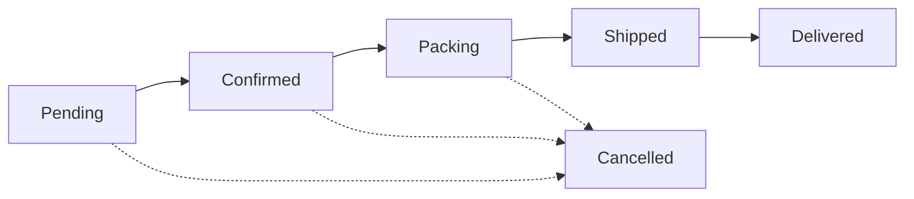

# 03 — Storefront Information Architecture & Page Specifications

Sky Fragrances (skyfragrances.com) — plain PHP 8.2 / PDO / MySQL-MariaDB on Hostinger
shared hosting. No Composer, no Node, no framework, no build step.

Source of truth: `00-brief.md`. This document specifies **what the storefront is** —
every URL, every page, every section, in order, with its data, its empty state and its
375px behaviour. It does not contain application code.

**Status of the numbers and names in here:** every table name, column name and settings
key used below is a *requirement this document places on the schema*. The consolidated
list is in §16 (Data contract). If the schema document disagrees, §16 wins for storefront
needs or the schema must be amended.

---

## 1. Conventions that apply everywhere

### 1.1 Request flow

Single front controller. All pretty URLs rewrite to `/index.php`, which matches the
request path against the route table (§2), includes one controller, and the controller
renders one view inside the shared layout.

```apache
RewriteEngine On
RewriteCond %{HTTPS} !=on
RewriteRule ^ https://%{HTTP_HOST}%{REQUEST_URI} [L,R=301]
RewriteCond %{HTTP_HOST} ^www\.(.+)$ [NC]
RewriteRule ^ https://%1%{REQUEST_URI} [L,R=301]
RewriteRule ^(.+)/$ /$1 [L,R=301]
RewriteCond %{REQUEST_FILENAME} !-f
RewriteCond %{REQUEST_FILENAME} !-d
RewriteRule ^ index.php [L]
ErrorDocument 404 /index.php
```

Directory layout assumed (confirm against doc 01): everything lives under `public_html`
because the client uploads through hPanel File Manager. Application code sits in
`/app` and `/includes`, each carrying its own `.htaccess` with `Require all denied`
plus a `Deny from all` fallback for pre-2.4 Apache; `/uploads` carries an `.htaccess`
that disables PHP execution (`php_flag engine off` + `RemoveHandler`/`SetHandler` guard)
and allows only image MIME responses.

> Superseded by 08-decisions-register.md §2 — C-23/C-37: there is no `/includes` (code is `app/`; denied directories are `app/`, `db/`, `storage/`), and `uploads/.htaccess` never uses `php_flag engine off` — LiteSpeed ignores it; see 02b §5 for the four working layers.

**URL rules**
- Lowercase, hyphenated, no trailing slash, no file extensions.
- A slug that no longer matches the record's current slug 301s to the current slug
  (product/collection slug history table, `slug_redirects`). This protects links the
  client has already sent on WhatsApp.
- Paths are case-insensitively matched then 301'd to the canonical lowercase form.

### 1.2 Page head contract

Every controller populates one array before rendering; the layout consumes it. Nothing
in a view sets meta tags directly.

| Key | Rule |
|---|---|
| `title` | Per-route pattern in §2. Hard-capped at 60 chars; longer values truncate on a word boundary. |
| `meta_description` | Per-route pattern. Capped at 155 chars. Falls back to `settings.meta_description`. |
| `canonical` | Absolute `https://skyfragrances.com/...`. Rules in §5.4. |
| `robots` | `index,follow` by default; `noindex,follow` for the URLs listed in §15.2. |
| `og` | `og:type`, `og:title`, `og:description`, `og:image` (1200×630), `og:url`, `og:site_name`, `og:locale=en_PK`, plus `twitter:card=summary_large_image`. |
| `jsonld` | Array of blocks, each emitted as its own `<script type="application/ld+json">`. |
| `body_class` | Route slug, for CSS scoping. |

Every page emits `Organization` (from settings) and, where a trail exists,
`BreadcrumbList`. `WebSite` + `SearchAction` is emitted on the home page only.

### 1.3 Shared display components

These are specified once and referenced by name throughout.

**`PRODUCT_CARD`**
- Image: primary image at 4:5, `loading="lazy"` (except the first row of the first
  grid on a page, which is `loading="eager"` + `fetchpriority="high"`), `srcset` at
  400/600/900w (08 C-45: the generated set is **400/600/900/1400** w; cards list the first three, the PDP all four), `<picture>` with WebP source and JPEG fallback, `alt` =
  `"{product name} — {size range} perfume by Sky Fragrances"`.
- Hover (pointer devices only): cross-fades to the second image over 350ms and scales
  to 1.04. No hover effect on touch.
- Badges, top-left, max two, priority order: `SOLD OUT` > `SALE −{n}%` > `NEW`.
  `NEW` shows while `products.is_new = 1` **or** `published_at` is within 30 days.
- Text block: product name (Cormorant Garamond, 2-line clamp), scent family name +
  available sizes (`50ml · 100ml`), price.
- Price: if the cheapest active size has a sale price →
  `Rs. 5,450` in gold with `Rs. 6,950` struck through in muted ivory. Multi-size
  products show `From Rs. 4,950`.
- Rating: 5 gold glyphs + `(n)` shown only when `rating_count >= 1`.
- Action: if the product has exactly one active size → `Add to Cart` (AJAX, §7.3).
  If more than one → `Choose Size`, which opens the size sheet (bottom sheet on
  mobile, inline popover on desktop) listing each size with price and stock, then adds.
  Sold-out products show a disabled `Sold Out` button.
- The whole card except the button is one `<a>` to the product page.

**`PRODUCT_GRID`** — 2 columns at ≤767px (12px gutter), 3 at 768–1199px, 4 at ≥1200px.
Cards are equal height; names clamp so buttons align.

**`SECTION_HEADER`** — eyebrow (small caps, gold, letter-spaced), serif H2, optional
one-line subtitle, optional right-aligned `View all →` link. On mobile the link moves
below the subtitle, left-aligned.

**`RAIL`** — the mobile treatment for any horizontally-scrollable set: `overflow-x:auto`,
`scroll-snap-type: x mandatory`, 78vw card width, 16px page padding preserved as
scroll-padding, no visible scrollbar, no JS.

### 1.4 Money, dates, language

- Prices are stored as `DECIMAL(10,2) UNSIGNED` PKR; PHP arithmetic is integer paisa; retail values are whole rupees.
  Superseded by 08-decisions-register.md §2 — C-01: this line said "unsigned integers in whole rupees".
- Every displayed amount goes through one helper producing `Rs. 4,950`
  (`Rs.` + non-breaking space + thousands separator, no decimals).
- Any percentage maths rounds half-up to the nearest rupee, server-side, at the moment
  of calculation. The browser never computes a price that is later trusted.
- Dates render in Asia/Karachi as `24 Sep 2026`.
- Site language is English (`<html lang="en">`). No Urdu/RTL in v1 — see §17.

### 1.5 Global chrome (present on every storefront page)

Order in the DOM, top to bottom:

1. **Announcement bar** — §4.1.
2. **Header** — §1.6.
3. `<main>` — page content.
4. **Footer** — §1.7.
5. **Cart drawer** — §7.1, rendered collapsed on every page.
6. **Floating WhatsApp button** — bottom-right, 56px, `z-index` below the drawer and
   below the mobile sticky add-to-cart bar; on product pages it sits 72px higher so it
   never overlaps the sticky bar. Links to `wa.me/{settings.whatsapp}` with the
   page-context message from §6.9. Hidden while the drawer or any modal is open.
7. **Toast region** — `aria-live="polite"`, bottom-centre on mobile, top-right desktop.

### 1.6 Header

- Desktop (≥1024px): left = nav (`Shop`, `Collections ▾`, `For Him`, `For Her`,
  `Unisex`, `Scent Finder`); centre = logo; right = search icon, track-order icon,
  cart icon with count bubble.
- `Collections ▾` opens a mega-panel listing every active collection with its thumbnail
  (from `collections.image`), max 8, plus `View all collections`.
- Search icon expands an inline overlay with an input, submitting to `/search?q=`.
  Live suggestions after 3 characters, 250ms debounce, from `/api/search-suggest`
  (max 5 products + up to 3 collection names); keyboard navigable; degrades to a plain
  form submit with JS off.
- Mobile (<1024px): 56px bar — hamburger left, logo centre, cart right. Search moves
  into the drawer menu as a full-width field at the top. The menu is a full-height
  left slide-in with the same links, then `Track Order`, `Contact`, and the WhatsApp
  number as a tap-to-chat row.
- Header is sticky on scroll-up only (translateY transition), solid `#0A0A0A` with a
  1px gold-tinted bottom border. On the home page it starts transparent over the hero
  and turns solid after 80px of scroll.
- Cart count comes from the session cart, rendered server-side into the bubble so it is
  correct before JS runs, and updated by the cart API's `count`.

### 1.7 Footer

Four columns desktop, stacked accordions on mobile (first column always open):
1. Brand — logo, tagline, one-sentence blurb (`settings.footer_blurb`), social icons
   (only those with a non-empty settings value).
2. Shop — Shop All, New Arrivals, Best Sellers, For Him, For Her, Unisex, Sale.
3. Help — Track Order, Shipping, Returns & Exchange, FAQ, Contact.
4. About — About Us, Privacy Policy, Terms, plus the newsletter field (compact variant
   of §4.12) and the payment-method strip (COD / Bank / JazzCash / Easypaisa icons —
   only methods enabled in settings).

Bottom bar: `© {year} Sky Fragrances. All rights reserved.` and
`{settings.address_line}` (omitted if empty).

---

## 2. Route table

`{slug}` = `[a-z0-9-]+`. All routes are GET unless marked. "Idx" = indexable
(`index,follow`); `no` = `noindex,follow`.

| # | URL pattern | Controller | View | Purpose | Title pattern | Idx |
|---|---|---|---|---|---|---|
| 1 | `/` | `home.php` | `home.php` | Brand entry, merchandising | `Sky Fragrances — Luxury Perfumes in Pakistan` | yes |
| 2 | `/shop` | `listing.php` | `listing.php` | All products + full filter set | `Shop All Perfumes \| Sky Fragrances` (+ ` — Page {n}`) | yes |
| 3 | `/collections` | `collections.php` | `collections-index.php` | Index of all collections | `Our Collections \| Sky Fragrances` | yes |
| 4 | `/collections/{slug}` | `listing.php` (preset `collection`) | `listing.php` | Collection landing + filters | `{collection} Collection — Perfumes \| Sky Fragrances` | yes |
| 5 | `/for-him` | `listing.php` (preset `gender=him`) | `listing.php` | Gender landing | `Perfumes For Him \| Sky Fragrances` | yes |
| 6 | `/for-her` | `listing.php` (preset `gender=her`) | `listing.php` | Gender landing | `Perfumes For Her \| Sky Fragrances` | yes |
| 7 | `/unisex` | `listing.php` (preset `gender=unisex`) | `listing.php` | Gender landing | `Unisex Perfumes \| Sky Fragrances` | yes |
| 8 | `/scent/{slug}` | `listing.php` (preset `family`) | `listing.php` | Scent-family landing | `{family} Perfumes in Pakistan \| Sky Fragrances` | yes |
| 9 | `/new-arrivals` | `listing.php` (preset `sort=newest`) | `listing.php` | Merch landing | `New Arrivals \| Sky Fragrances` | yes |
| 10 | `/best-sellers` | `listing.php` (preset `sort=best`) | `listing.php` | Merch landing | `Best Selling Perfumes \| Sky Fragrances` | yes |
| 11 | `/sale` | `listing.php` (preset `on_sale=1`) | `listing.php` | Discounted stock | `Sale — Perfume Offers \| Sky Fragrances` | yes |
| 12 | `/search` | `search.php` | `listing.php` | Keyword results | `Search: "{q}" \| Sky Fragrances` | no |
| 13 | `/product/{slug}` | `product.php` | `product.php` | Product detail + buy | `{seo_title \|\| name — family perfume} \| Sky Fragrances` | yes |
| 14 | `POST /product/{slug}/review` | `review-submit.php` | redirect | Submit review (goes to moderation) | — | — |
| 15 | `/scent-finder` | `quiz.php` | `quiz.php` | 5-question quiz | `Scent Finder — Find Your Perfume \| Sky Fragrances` | yes |
| 16 | `/scent-finder/result` | `quiz.php` (`?a=`) | `quiz-result.php` | Recommendations | `Your Scent Match \| Sky Fragrances` | no |
| 17 | `/cart` | `cart.php` | `cart.php` | Full cart page | `Your Cart \| Sky Fragrances` | no |
| 18 | `/checkout` | `checkout.php` | `checkout.php` | Guest checkout form | `Checkout \| Sky Fragrances` | no |
| 19 | `POST /checkout` | `checkout-submit.php` | redirect | Place order | — | — |
| 20 | `/order/{order_number}` | `confirmation.php` | `confirmation.php` | Thank-you page (token-gated) | `Order {number} Confirmed \| Sky Fragrances` | no |
| 21 | `/track` | `track.php` | `track.php` | Track-order form | `Track Your Order \| Sky Fragrances` | yes |
| 22 | `POST /track` | `track.php` | `track.php` | Track-order result | `Order {number} — Status \| Sky Fragrances` | no |
| 23 | `/about` | `page.php` | `page.php` | DB content page | `{page.seo_title \|\| page.title} \| Sky Fragrances` | yes |
| 24 | `/faq` | `page.php` | `page-faq.php` | DB content page, accordion + FAQ schema | `Frequently Asked Questions \| Sky Fragrances` | yes |
| 25 | `/shipping` | `page.php` | `page.php` | DB content page | `Shipping & Delivery \| Sky Fragrances` | yes |
| 26 | `/returns` | `page.php` | `page.php` | DB content page | `Returns & Exchange \| Sky Fragrances` | yes |
| 27 | `/privacy` | `page.php` | `page.php` | DB content page | `Privacy Policy \| Sky Fragrances` | yes |
| 28 | `/terms` | `page.php` | `page.php` | DB content page | `Terms & Conditions \| Sky Fragrances` | yes |
| 29 | `/contact` | `contact.php` | `contact.php` | Static template + form | `Contact Us \| Sky Fragrances` | yes |
| 30 | `POST /contact` | `contact.php` | `contact.php` | Save message, notify | — | — |
| 31 | `/unsubscribe` | `newsletter.php` | `simple.php` | One-click unsubscribe (`?e=&t=`) | `Unsubscribed \| Sky Fragrances` | no |
| 32 | `GET /api/cart` | `api/cart.php` | JSON | Drawer state refresh | — | — |
| 33 | `POST /api/cart/add` | `api/cart.php` | JSON | Add line | — | — |
| 34 | `POST /api/cart/update` | `api/cart.php` | JSON | Change qty | — | — |
| 35 | `POST /api/cart/remove` | `api/cart.php` | JSON | Remove line | — | — |
| 36 | `POST /api/cart/coupon` | `api/cart.php` | JSON | Apply / remove coupon | — | — |
| 37 | `GET /api/search-suggest` | `api/search.php` | JSON | Header autocomplete | — | — |
| 38 | `POST /api/newsletter` | `api/newsletter.php` | JSON | Subscribe | — | — |
| 39 | `/sitemap.xml` | `sitemap.php` | XML | Crawl map | — | — |
| 40 | `/robots.txt` | static file | text | Crawl policy | — | — |
| 41 | `*` (unmatched) | `notfound.php` | `404.php` | Custom 404, HTTP 404 | `Page Not Found \| Sky Fragrances` | no |

Routes 4–11 all run the same listing controller with a **preset** — a fixed filter the
visitor cannot remove, plus its own copy block, H1 and SEO fields. This is one code path,
not eight.

Superseded by 08-decisions-register.md §2 — C-29: routes 5–6 presets were written `gender=men`/`women`; they carry the stored tokens `him`/`her` (07 §0.2) and no mapping exists.

**Reserved for later, deliberately not routed in v1:** `/blog`, `/gift-sets`,
`/account`, `/wishlist`.

---

## 3. How the page specs are written

Each section below is given as: **what it is → data it needs → empty state → 375px
behaviour → what the admin can edit**. Where a behaviour is not mentioned for mobile, it
is identical to desktop. "Editable" always means a field in the admin panel; anything
not marked editable is hard-coded in the template and requires a developer.

---

## 4. Home page — `/`

H1 is the hero heading (there is exactly one H1). Every other section heading is an H2.
The page makes **at most 9 queries**; all product sets are fetched with the same
`product_card_fields` select so a single row-to-card mapper is reused.

### 4.1 Announcement bar

- One line of centred text, gold on black, 36px tall, above the header.
- Data: `settings.announcement_enabled` (0/1), `announcement_text`, `announcement_link`
  (optional; whole bar becomes a link), `announcement_bg` (hex, default `#D4B084`),
  `announcement_fg` (hex, default `#0A0A0A`).
  > Superseded by 08 Q-15 / §2.4 (F-14): there are **no `announcement_bg` / `announcement_fg` keys** — gold-on-black is a design token (04a). Only the three keys in 05a §4.9 exist ("all six fields" below reads as three).
- Dismissible: an × on the right sets `localStorage.sf_ann_v` to a hash of the text.
  Changing the text in admin re-shows it to everyone automatically.
  > Superseded by 08 Q-15: **`sessionStorage`**, keyed on a hash of the text — the bar returns on the next browser session, and a text change re-shows it within one.
- Empty state: `announcement_enabled = 0` or empty text → the bar is not rendered at
  all (no empty strip, no layout shift).
- 375px: font drops to 12px, text truncates to one line with ellipsis; if the text is
  over 60 chars it marquees at 30s linear infinite only when
  `prefers-reduced-motion` is not set, otherwise it wraps to two lines and the bar
  grows to 52px.
- Editable: all six fields.

### 4.2 Hero

- Full-viewport section (`100svh` minus header, capped at 900px), black, with a
  background image at 60% opacity over a bottom-weighted gradient; centred logo mark,
  H1, subheading, primary CTA, secondary text link.
- Data: `settings.hero_image_desktop` (1920×1080), `hero_image_mobile` (1080×1440),
  `hero_heading` (default `More Than Just A Scent`), `hero_subheading`, `hero_cta_label`
  (default `Shop The Collection`), `hero_cta_url` (default `/shop`),
  `hero_secondary_label` / `hero_secondary_url` (default `Take the Scent Finder` →
  `/scent-finder`), `hero_overlay_opacity` (0–100, default 60).
- Images are preloaded via `<link rel="preload" as="image" imagesrcset>` and are the
  only eager images above the fold. They are the LCP element — they must ship as WebP
  ≤180KB desktop / ≤110KB mobile, generated at upload.
- Below the CTA: one muted line of trust microcopy, `settings.hero_trust_line`
  (default `Cash on Delivery nationwide · Free delivery above Rs. {threshold}`), with
  the threshold interpolated from `settings.free_shipping_threshold`.
- Animation: heading and CTA fade-up 24px over 600ms, staggered 120ms, once, on load.
  A scroll-cue chevron at the bottom fades out after the first scroll event.
- Empty state: no hero image set → solid `#0A0A0A` with a subtle gold radial gradient;
  the text and CTA still render. The section never collapses.
- 375px: uses `hero_image_mobile`; height `88svh` so the next section peeks; H1 clamps
  at `clamp(2rem, 11vw, 3.25rem)`; CTA is full-width minus 32px padding, 52px tall.
- Editable: all of the above.

### 4.3 Shop by collection

- `SECTION_HEADER` (eyebrow `Curated`, H2 `Shop by Collection`, link `All collections →`),
  then a 5-tile mosaic: one large tile (2×2) + four small, desktop.
- Data: `collections` where `is_active = 1` and `show_on_home = 1`, ordered by
  `position`, limit 5. Each tile needs `name`, `slug`, `image`, `tagline`,
  and a product count (`SELECT collection_id, COUNT(*) ... GROUP BY` in one query over
  the pivot, restricted to active products) rendered as `12 fragrances`.
- Tile: image with a 1.06 hover zoom under a black gradient, name in serif, tagline in
  small caps gold, product count muted.
- Empty state: fewer than 3 collections flagged for home → fall back to all active
  collections ordered by position, limit 5. Zero active collections → the section is
  omitted entirely (do not render an empty header).
- 375px: mosaic becomes a `RAIL` of 78vw tiles at 3:4, first tile's title larger; the
  `All collections →` link sits under the rail, full-width bordered button.
- Editable: which collections appear (`show_on_home`), their order, image, tagline.

### 4.4 Best sellers

- `SECTION_HEADER` (eyebrow `Loved most`, H2 `Best Sellers`, link `View all →` →
  `/best-sellers`) + `PRODUCT_GRID` of 8 (2 rows of 4 desktop).
- Data: active products ordered by `products.sales_count DESC, rating_avg DESC, id DESC`,
  limit 8. `sales_count` is a denormalised counter incremented when an order reaches
  `Confirmed` and decremented if it is later cancelled (owner: order-status code).
- Manual override: `products.is_featured = 1` products are pinned to the front of this
  set, in `position` order, before the sales-count tail. This is how the client
  merchandises a new product that has no sales yet.
- Empty state: a brand-new store has all-zero `sales_count` — the ordering then
  degrades to featured-first, newest-next, which is correct and needs no special case.
  If there are fewer than 4 active products in total, the section is omitted.
- 375px: `RAIL` of 6 cards at 62vw (so the next card peeks), not a 2-col grid — keeps
  the page short. New Arrivals below it uses the grid, giving visual contrast.
- Editable: `is_featured` per product, and `settings.home_bestsellers_count` (4–12).

### 4.5 New arrivals

- `SECTION_HEADER` (eyebrow `Just landed`, H2 `New Arrivals`, link → `/new-arrivals`)
  + `PRODUCT_GRID` of 8.
- Data: active products ordered by `published_at DESC, id DESC`, limit 8. Cards show
  the `NEW` badge per §1.3.
- Empty state: omitted if fewer than 4 active products exist (same guard as above).
- 375px: 2-column grid, 4 cards visible, then a `View all new arrivals` outlined
  full-width button.
- Editable: `published_at` per product, `settings.home_new_count`.

### 4.6 For Him / For Her / Unisex

- Three equal panels, each a tall image (3:4) with a centred serif label and a thin
  gold underline that widens on hover; links to `/for-him`, `/for-her`, `/unisex`.
- Data: `settings.gender_tile_men_image`, `..._women_image`, `..._unisex_image`, plus
  optional per-tile caption (`gender_tile_men_caption`, default `Bold. Grounded. Warm.`).
  Labels are fixed strings (`For Him`, `For Her`, `Unisex`).
- Empty state: a tile with no image renders as black with a gold hairline border and the
  label only — never a broken image. All three are always rendered even if a gender has
  zero products; the destination listing handles its own empty state.
- 375px: stacked full-width panels at 16:9 instead of 3:4, so all three fit in roughly
  one screen.
- Editable: the three images and three captions.

### 4.7 Scent Finder band

- Full-bleed band, black with a faint gold noise/gradient, centred: eyebrow
  `Not sure where to start?`, H2 `Find your signature scent in 60 seconds`, one line of
  copy, CTA `Start the Scent Finder` → `/scent-finder`.
- Data: `settings.quiz_band_enabled` (default 1), `quiz_band_heading`, `quiz_band_text`,
  `quiz_band_cta_label`.
- Empty state: disabled → omitted.
- 375px: 48px vertical padding, full-width CTA.
- Editable: all four fields.

### 4.8 Why choose us

- Four items in a row: line icon (inline SVG sprite, no image request), title, one line
  of copy. Defaults, per the brief: `Long-Lasting Fragrance`, `Cash on Delivery
  Nationwide`, `Fast Delivery ({settings.delivery_time})`, `Easy Exchange`.
- Data: table `usp_items` (`icon_key`, `title`, `text`, `position`, `is_active`), seeded
  with those four. `icon_key` maps to one of a fixed sprite set (`droplet`, `cash`,
  `truck`, `refresh`, `shield`, `star`, `gift`, `leaf`) — the client picks from a
  dropdown, never uploads an icon.
- Empty state: zero active items → section omitted. 1–3 items → they centre, the grid
  adapts (no blank cells).
- 375px: 2×2 grid, icon above text, centred, 13px copy.
- Editable: title, text, icon, order, active.

### 4.9 Customer voices (addition beyond the brief — recommended, default on)

- A three-card strip of real approved reviews. In the Pakistan market this is the single
  strongest conversion element after COD, and the data already exists.
- Data: `reviews` where `status = 'approved' AND is_sample = 0 AND rating >= 4 AND CHAR_LENGTH(body) >= 60`,
  newest first, limit 3, joined to the product for name, slug and thumbnail. Each card:
  stars, review title or first line, 3-line body clamp, reviewer first name + city,
  `Verified` chip when `reviews.is_verified = 1`, product mini-link.
  Superseded by 08-decisions-register.md §2 — C-41: no `is_verified` column and no Verified chip in v1; the §5.0 rename `is_approved`→`status='approved'` is applied above.
- Empty state: fewer than 3 qualifying reviews → the section is omitted entirely. It
  will simply appear once the store has reviews; no placeholder, no fake content
  (the brief is explicit: no fake reviews).
- 375px: `RAIL` of 88vw cards.
- Editable: `settings.home_reviews_enabled` toggle only; content comes from moderation.

### 4.10 Instagram

- `SECTION_HEADER` (H2 `@skyfragrances`, link → the Instagram profile) + a 6-tile
  square grid, each tile linking out to its post permalink with `rel="noopener"`.
- **Data is admin-managed, not live.** Table `instagram_posts` (`image`, `caption`,
  `permalink`, `position`, `is_active`). A live Instagram feed needs the Graph API, a
  long-lived token and a refresh cron — none of which survive the no-Composer,
  shared-hosting constraint reliably, and a dead token would silently empty the section.
  The client uploads 6 squares and pastes 6 links; it takes two minutes a month.
  Superseded by 08-decisions-register.md §4 — no `instagram_posts` table: the six tiles are `settings.instagram_tile_{1..6}_image` / `_url` on the admin Home tab; captions are not shown.
- Empty state: fewer than 6 active rows → render what exists, minimum 3, as a 3-up row.
  Fewer than 3 → omit the section.
- 375px: 3×2 grid, no gaps larger than 4px, edge-to-edge (breaks the page gutter
  deliberately).
- Editable: all tiles, plus `settings.instagram_url` and `settings.instagram_handle`.

### 4.11 Newsletter

- Centred block on ivory (`#F5F0E8`) — the one light section on the page, used as a
  visual break before the footer. H2 `Join the Sky List`, one line of copy, email field
  + gold submit button, micro-legal line.
- Data: `settings.newsletter_heading`, `newsletter_text` (default mentions an
  early-access benefit, **not** a discount code unless the client sets one),
  `newsletter_cta_label`.
- Submission: `POST /api/newsletter` with CSRF token, honeypot and time-trap (§14.3).
  Responses: success → the form is replaced in place by `You're on the list.` with a
  gold check; already-subscribed → the same success message (never disclose membership);
  invalid email → inline red helper text under the field, field keeps focus.
- With JS disabled the form posts to `/contact#newsletter` and returns a full page with
  the same states.
  > Corrected by 08 §2.4 (F-17): the non-JS form posts to **`POST /api/newsletter`** itself, which detects a non-JSON `Accept`/`Content-Type` and answers with a 303 back to the referring page plus a flash (`?newsletter=ok|invalid`) rendered in the block; there is no `/contact#newsletter` route.
- Empty state: none (static copy).
- 375px: full-width stacked field then button (not side-by-side), 52px tall each.
- Editable: heading, text, CTA label.

### 4.12 Footer

Per §1.7.

### 4.13 Home page JSON-LD

`Organization` (name, url, logo, sameAs from social settings, `contactPoint` with the
WhatsApp number and `areaServed: PK`) and `WebSite` with a `SearchAction` pointing at
`/search?q={search_term_string}`.

---

## 5. The listing family — `/shop`, collections, gender, scent, merch landings, search

One controller (`listing.php`), one view, one query builder. Routes 2–12 differ only by the
**preset** they start from and the copy block above the grid. Everything in this section
applies to all of them unless a sub-section narrows it.

### 5.0 Naming reconciliation (read before anything below)

This document defers to the cross-stream contract in `07-seed-seo-quality.md` §0.2. Where
earlier sections of *this* file used a different name, the contract name is authoritative and
is what §16 records:

| Used earlier here | Authoritative name | Notes |
|---|---|---|
| `collections.position` | `collections.sort_order` | Same meaning, seeded in tens. |
| `reviews.is_approved = 1` | `reviews.status = 'approved'` | Short string, not `ENUM`, not boolean. |
| `gender=men` / `women` | `products.gender` ∈ `him` \| `her` \| `unisex` | The URL stays `/for-him`; the filter param value is `him`. |

Columns the storefront needs that are **not** in §0.2 and are therefore additions this
document requests (all carried into §16): `collections.show_on_home`,
`products.published_at`, `products.sales_count`, `products.rating_avg`,
`products.rating_count`, `product_sizes.is_active`.

### 5.1 The filter set

Four filter groups, in this order on screen. All are multi-select except price.

| Filter | Source of options | Values | Combination |
|---|---|---|---|
| Collection | `collections WHERE is_active = 1 ORDER BY sort_order` | slug | OR within the group |
| Gender | fixed list | `him`, `her`, `unisex` | OR within the group |
| Scent family | `SELECT DISTINCT scent_family FROM products WHERE is_active = 1 ORDER BY scent_family` | slugified family | OR within the group |
| Price | fixed bands + custom | see §5.2 | single range |

**Combination rule, stated once:** values inside one group are `OR`-ed; groups are `AND`-ed
together. `collection=midnight-meridian,golden-hour` + `gender=her` + `price=5000-8000`
means *(Midnight Meridian **or** Golden Hour) **and** For Her **and** priced Rs. 5,000–8,000*.

Two further filters exist but are not exposed as checkboxes:

- `on_sale=1` — the preset behind `/sale`. Also offered as a single toggle chip labelled
  `On Sale Only` in the filter panel.
- `in_stock=1` — toggle chip `In Stock Only`, off by default. Sold-out products are shown
  by default because a sold-out hero product is still brand-building; the chip lets a
  ready-to-buy customer hide them.

**Preset lock.** On `/collections/{slug}`, `/for-him`, `/for-her`, `/unisex`,
`/scent/{slug}` and `/sale` the preset dimension is *removed from the filter UI entirely* —
it is not rendered as a pre-ticked box the visitor can untick. Narrowing further inside the
preset is allowed (e.g. gender on a collection page). A query-string value that contradicts
the preset is ignored, not honoured.

### 5.2 Price bands

Bands are computed from live data at page build, not hard-coded, so they stay sane when the
client re-prices. Take `MIN(effective_price)` and `MAX(effective_price)` across the *current
result set before the price filter is applied*, then offer four bands with round Rs. 1,000
boundaries covering that span, plus `Under Rs. {b1}` and `Rs. {b4}+` endpoints. Seed data
yields: `Under Rs. 5,000`, `Rs. 5,000–7,000`, `Rs. 7,000–9,000`, `Rs. 9,000+`.

Each band shows its own count. A band with zero products is rendered disabled, not hidden —
a shifting option list is more confusing than a greyed one.

A band maps to `price=min-max` where either end may be blank: `price=-5000`, `price=9000-`.
Custom values are accepted from the URL (someone may share `price=6000-6500`) and validated:
integers only, min ≤ max, both clamped to 0–999999, otherwise the filter is dropped.

### 5.3 URL encoding of filter state

State lives entirely in the query string. No cookies, no session, no hash fragment — a
filtered URL pasted into WhatsApp must reproduce the exact page.

```
/shop?collection=midnight-meridian,golden-hour&gender=her&family=rose-oud-amber&price=5000-8000&sort=price-asc&page=2
```

Rules:
1. One parameter per filter group; multiple values are **comma-separated**, never `[]`
   array syntax (LiteSpeed and copy-paste both handle commas better, and it reads).
2. Values are slugs, never numeric IDs. IDs change between the client's test import and
   production; slugs do not, and slugs are human-readable in a shared link.
3. Canonical parameter **order** is fixed: `collection, gender, family, price, on_sale,
   in_stock, q, sort, page`. Values inside a group are sorted alphabetically. Any request
   arriving with a different order or unsorted values is 301'd to the canonical form. This
   is what stops the same result set existing under a dozen URLs.
4. Defaults are omitted, never emitted: `sort=featured`, `page=1`, `in_stock=0` and empty
   groups never appear in a URL the site generates.
5. Unknown parameters are dropped on the 301. Unknown *values* within a known parameter
   (a deleted collection slug) are dropped; if that empties the group, the group is dropped.
6. JS updates the URL with `history.replaceState` as filters change, so Back leaves the
   listing rather than walking through filter states, and the address bar always holds a
   shareable URL.

**Indexation, since this is where thin duplicate URLs come from (§15.2 owns the full list):**

| URL shape | Robots | Canonical |
|---|---|---|
| Preset landing, no filters, page 1 | `index,follow` | self |
| Preset landing, page ≥ 2 | `index,follow` | self (paginated pages are distinct, not canonicalised to page 1) |
| **One** filter group active with **one** value | `index,follow` | self |
| Two or more groups active, or any group with 2+ values | `noindex,follow` | to the same URL minus all filters |
| Any `sort` other than the route's default | `noindex,follow` | to the same URL minus `sort` |
| `price` active (any value) | `noindex,follow` | to the URL minus `price` |
| `/search` (any) | `noindex,follow` | self |

Single-value filter combinations that deserve to rank already have a dedicated pretty route
(`/scent/{slug}`, `/for-him`, `/sale`). Where a filtered URL and a pretty route describe the
same set, the filtered URL 301s to the pretty route — `/shop?gender=him` → `/for-him`.

### 5.4 Canonical rules (referenced by §1.2)

- Always absolute, always `https://skyfragrances.com`, never with a trailing slash.
- Built from the canonical parameter set of §5.3 rule 3, after the noindex table above has
  stripped what it strips.
- A product reachable from several collections still has exactly one canonical:
  `/product/{slug}`. There are no collection-scoped product URLs.
- `/` canonicalises to `https://skyfragrances.com/` (the one URL that keeps its slash).
- Old slugs never self-canonicalise; they 301 via `slug_redirects`.

### 5.5 Sort options

| Label | `sort` value | Ordering |
|---|---|---|
| Featured | `featured` *(default)* | `is_featured DESC, sort_order ASC, id DESC` |
| Newest | `newest` | `published_at DESC, id DESC` |
| Price: Low to High | `price-asc` | cheapest active size's effective price ASC |
| Price: High to Low | `price-desc` | that same value DESC |
| Best Selling | `best` | `sales_count DESC, rating_avg DESC, id DESC` |
| Top Rated | `rating` | `rating_avg DESC, rating_count DESC, id DESC` |

Every ordering ends with `id DESC` so paging is deterministic — without a unique tie-break,
two products sharing a `sales_count` of 0 can appear on both page 1 and page 2.

`/new-arrivals` defaults to `newest`, `/best-sellers` to `best`, `/sale` to `price-asc`;
everything else defaults to `featured`. Choosing the route's own default removes `sort` from
the URL rather than writing it in.

**Sold-out products sort last within whatever ordering is chosen.** The sort key is always
prefixed by `(total_stock = 0)` ascending. A sold-out product at the top of "Price: Low to
High" is the fastest way to look out of stock as a shop.

### 5.6 Pagination

Classic numbered pagination with `LIMIT/OFFSET`, 24 products per page (divisible by 2, 3 and
4, so the last row is never ragged at any breakpoint). Not infinite scroll: infinite scroll
needs JS to reach page 2, is unshareable, and hides the footer — where Track Order and the
WhatsApp number live.

- Controls: `← Previous`, first page, an ellipsis window of ±2 around the current page, last
  page, `Next →`. At 375px only `←`, `Page 3 of 7`, `→` render.
- `rel="prev"` / `rel="next"` link tags on every paginated page.
- Page 1 is `/shop`, never `/shop?page=1`; `?page=1` 301s to the bare URL.
- `page` out of range (`0`, `-1`, `99`, non-numeric) → 404, not an empty page. An empty
  page 99 that returns 200 is a crawl trap.
- Titles and meta descriptions on page ≥ 2 get ` — Page {n}` appended (§2), and the H1 does
  **not** change.
- A `Load more` button is explicitly rejected for the same reasons as infinite scroll.

The count query and the row query are separate statements against the same WHERE clause.
`SQL_CALC_FOUND_ROWS` is deprecated in MySQL 8 and behaves differently on MariaDB — it is
banned. Two prepared statements sharing one built WHERE fragment and one bound parameter
array is the pattern.

### 5.7 Result count and active-filter chips

- Above the grid, left: `{n} fragrances` (`1 fragrance` singular, `No fragrances` zero).
  On page ≥ 2 it reads `Showing 25–48 of 71`.
- Right: the sort `<select>` (a real `<select>`, styled — a custom dropdown here buys
  nothing and breaks on Android keyboards).
- Below that, a row of removable chips, one per active filter *value*, each with an `×`
  that removes only that value and resets to page 1, plus `Clear all` when two or more are
  active. Preset-locked dimensions are not chips.
- With JS off every chip is a plain link to the URL minus that value, and the sort
  `<select>` sits in a `<form method="get">` with a `Sort` submit button that is hidden by
  CSS only when JS has run.

### 5.8 Empty state

Never a bare "no results". The empty state renders, in order:

1. Serif line: `No fragrances match that combination.`
2. One line of help naming what was narrowest: `Try removing the price filter` — chosen by
   dropping each active group in turn and re-running the count; the group whose removal
   returns the most products is the one named. One extra cheap count query per active group,
   and only on the empty path.
3. `Clear all filters` gold button → the route's own preset URL.
4. `SECTION_HEADER` + `PRODUCT_GRID` of 8 best sellers under the heading `Popular right now`.
5. The Scent Finder band (§4.7), repeated.

Search has its own variant — §5.15.

### 5.9 Mobile filter drawer (<1024px)

- The filter panel is a left sidebar at ≥1024px, sticky under the header, always open.
  Below that it is a bottom-anchored full-height drawer opened by a sticky
  `Filter & Sort ({n})` bar pinned to the bottom of the viewport while the grid is in view.
- The drawer contains sort first (radio list, not a select), then each filter group as a
  collapsible accordion with its counts, then the price bands.
- **Changes are staged, not live.** The drawer footer has `Clear all` and a full-width gold
  `Show {n} results` button whose count updates live from `/api/cart`-style lightweight
  count endpoint as boxes are ticked, debounced 200ms. The results only re-render when the
  button is tapped. Live-applying behind an open drawer on a 375px screen means the customer
  can never see what they did.
- Drawer opening locks body scroll, traps focus, closes on Escape, on the × and on backdrop
  tap. The URL is only rewritten on apply.
- With JS off the drawer is a plain `<details>` block containing a GET form with checkboxes
  and an `Apply filters` submit button. Every filter works without JS.

### 5.10 SQL shape and indexing

The query builder produces one `WHERE` fragment plus one bound array, used by both the count
and the row query.

Which filters need a join:

| Filter | Join needed | Why |
|---|---|---|
| Collection | **No** | `products.collection_id` is a direct FK. Slug → id resolved in one prior lookup of the (small, cacheable) collections table. |
| Gender | No | `products.gender` |
| Scent family | No | `products.scent_family` (slug matched against a slugified form — see below) |
| On sale / price / in stock / sort by price | **Yes** — `product_sizes` | Price and stock live per size, not per product. |
| Search `q` | No | `products` text columns only (§5.15) |

The per-size aggregate is computed once as a derived table and joined, rather than with
correlated subqueries per row:

```sql
SELECT p.id, p.name, p.slug, p.gender, p.scent_family, p.is_featured, p.is_new,
       p.published_at, p.sales_count, p.rating_avg, p.rating_count, p.sort_order,
       s.min_price, s.max_price, s.total_stock, s.size_count, s.on_sale
FROM products p
JOIN (
    SELECT product_id,
           MIN(CASE WHEN sale_price IS NOT NULL AND sale_price > 0
                     AND sale_price < price THEN sale_price ELSE price END) AS min_price,
           MAX(CASE WHEN sale_price IS NOT NULL AND sale_price > 0
                     AND sale_price < price THEN sale_price ELSE price END) AS max_price,
           SUM(stock)                                                        AS total_stock,
           COUNT(*)                                                          AS size_count,
           MAX(CASE WHEN sale_price IS NOT NULL AND sale_price > 0
                     AND sale_price < price THEN 1 ELSE 0 END)               AS on_sale
    FROM product_sizes
    WHERE is_active = 1
    GROUP BY product_id
) s ON s.product_id = p.id
WHERE p.is_active = 1
ORDER BY (s.total_stock = 0) ASC, p.is_featured DESC, p.sort_order ASC, p.id DESC
LIMIT 24 OFFSET 0;
```

The effective-price `CASE` is written identically to the `effective_price()` helper in doc
07 — those two must never drift. With a catalogue in the low hundreds this plan is fine on
shared hosting; it is a derived table, not a correlated subquery, so it is evaluated once.

Primary images are fetched in a **second** query (`WHERE product_id IN (…) AND is_primary = 1`
plus the `sort_order = 2` image for hover) and mapped in PHP. Joining images into the main
query multiplies rows and breaks `LIMIT`.

Indexes this page requires:

```sql
ALTER TABLE products
  ADD INDEX idx_products_active_featured (is_active, is_featured, sort_order),
  ADD INDEX idx_products_active_published (is_active, published_at),
  ADD INDEX idx_products_collection (collection_id, is_active),
  ADD INDEX idx_products_gender (gender, is_active),
  ADD INDEX idx_products_family (scent_family, is_active),
  ADD INDEX idx_products_sales (is_active, sales_count);

ALTER TABLE product_sizes
  ADD INDEX idx_sizes_product (product_id, is_active),
  ADD UNIQUE INDEX uq_sizes_sku (sku);

ALTER TABLE product_images
  ADD INDEX idx_images_product (product_id, is_primary, sort_order);
```

Index names are explicit and prefixed so a non-developer reading phpMyAdmin can tell them
apart. No index exceeds three columns — on MariaDB 10.4 wider composites here buy nothing.

**Scent family slugs.** `products.scent_family` stores display text (`Woody Oud`). `/scent/{slug}`
matches on a slugified comparison. Slugifying in SQL is not portable, so the controller
resolves the slug to the display string using a `DISTINCT scent_family` list loaded once per
request and slugified in PHP, then filters on equality. This keeps the index usable.

### 5.11 `/shop`

The unrestricted listing. No preset, no hero image. H1 `Shop All Fragrances`, one muted
line under it (`settings.shop_intro`, optional, ≤160 chars, omitted if empty). Grid starts
immediately — a big image banner here pushes the product a full screen down on mobile for no
gain. All four filter groups exposed.

### 5.12 `/collections` — collection index

- H1 `Our Collections`, one paragraph of intro (`settings.collections_intro`).
- A 2-up (desktop) / 1-up (375px) set of wide cards, one per active collection ordered by
  `sort_order`: 16:9 image, name in serif over it, `tagline` in gold small caps, the
  `description` paragraph below, product count, and the three cheapest product thumbnails as
  a 3-up strip with a `Explore {name} →` link.
- Data: `collections WHERE is_active = 1 ORDER BY sort_order`, plus one grouped count query,
  plus one query fetching three products per collection (fetch all candidate rows ordered by
  collection then min price, slice in PHP — no per-collection query in a loop).
- Empty state: zero active collections → redirect 302 to `/shop`. The page never renders empty.
- JSON-LD: `BreadcrumbList` + `CollectionPage` with an `ItemList` of the collections.

### 5.13 `/collections/{slug}` — collection landing

Listing behaviour per §5.1–§5.10, preset `collection_id`, with a header block above it:

- Hero strip (not full-viewport): `collections.image` at 21:9 desktop / 3:2 mobile, black
  gradient, H1 = collection `name`, `tagline` as the eyebrow above it, `description` as one
  paragraph below, product count.
- `mood` renders as a single italic serif line under the description — it is the line that
  makes this read as a perfume house rather than a catalogue.
- Filter panel hides Collection; Gender, Scent family and Price remain.
- Title/meta from `collections.seo_title` / `seo_description`, falling back to the §2 pattern.
- Unknown or inactive slug → check `slug_redirects` (entity_type `collection`) → 301 if hit,
  otherwise 404.
- Empty state: an active collection with zero active products renders the hero, then
  `This collection is being restocked.` plus best sellers. It stays `index,follow` — the
  client will fill it.

### 5.14 `/for-him`, `/for-her`, `/unisex` — gender landings

Same controller, preset `gender`. These are shopping fronts, not brand pages, so the header
block is deliberately lighter than a collection's:

- Banner at 21:9 desktop / 16:9 mobile from `settings.gender_hero_him` (…`_her`, `_unisex`),
  falling back to the `settings.gender_tile_*_image` used on the home page (§4.6), falling
  back to flat black with a gold hairline.
- H1 `Perfumes For Him` / `For Her` / `Unisex Fragrances`.
- One editable paragraph each: `settings.gender_intro_him` / `_her` / `_unisex`. Default
  copy for `him`: *"Grounded, warm and built to last through a Karachi evening — oud,
  leather, vetiver and spice."* These three paragraphs are the only real body text on the
  page and are what make it rank; they must never ship empty.
- Filter panel hides Gender; Collection, Scent family and Price remain.
- `/unisex` additionally shows a one-line note that unisex products also appear under For
  Him and For Her, so the counts not adding up is not read as a bug.
- Empty state: a gender with zero active products renders the banner, intro, then
  `Nothing here yet — these are landing soon.` plus a grid of best sellers, and stays
  `index,follow`.

### 5.15 `/search`

- Route: `GET /search?q=`. Always `noindex,follow`. H1 `Search results for "{q}"` with `q`
  escaped; the raw string is never echoed unescaped anywhere including the title.
- Input handling: trim, collapse internal whitespace, cap at 60 characters, strip control
  characters. Empty or <2 characters after trimming → render the search landing state
  (the input, `Try "oud", "rose" or "fresh"` as clickable example chips, and best sellers)
  rather than an error.
- Matching, in one query, scored in SQL with a `CASE` so the ordering is meaningful rather
  than alphabetical:

  | Match | Score |
  |---|---|
  | `products.name` exactly equals `q` | 100 |
  | `products.name` starts with `q` | 80 |
  | `products.name` contains `q` | 60 |
  | `scent_family` contains `q` | 40 |
  | any of `notes_top` / `notes_heart` / `notes_base` contains `q` | 30 |
  | `short_description` contains `q` | 20 |
  | `description` contains `q` | 10 |
  | `product_sizes.sku` equals `q` (uppercased) | 100 |

  Results order by score DESC, then the sold-out-last rule, then `sales_count DESC, id DESC`.
  A single `SKU` match with score 100 and a result count of 1 redirects straight to the
  product page — the client uses SKUs on WhatsApp.

- `LIKE '%term%'` cannot use an index. This is accepted: the catalogue is in the low
  hundreds of rows, a full scan of `products` on shared hosting is sub-millisecond, and
  `FULLTEXT` behaves differently enough between MySQL 8 and MariaDB 10.4 (and needs a
  minimum word length tweak for "oud") that it is not worth the portability risk. If the
  catalogue passes ~2,000 products, revisit — that is recorded in §17.
- Multi-word queries are `AND`-ed across terms (each term must match somewhere), max 5
  terms, so "rose oud" finds Halo Rose rather than everything rose-ish.
- Filters and sort are available on search results exactly as on `/shop`, preserving `q`.
- Empty state: `No fragrances match "{q}".` then, in order — the misspelling hint
  (`Check the spelling, or try a scent note like "amber"`), a `Browse all fragrances`
  button, the Scent Finder band, and best sellers. Every search that returns zero rows is
  logged to `search_queries` (`term`, `results_count`, `created_at`) so the client can see
  what people ask for and cannot buy. That table is the cheapest merchandising input there is.
- The header autocomplete (`/api/search-suggest`, §1.6) uses the same scorer with `LIMIT 5`.

---

## 6. Product detail page — `/product/{slug}`

The page the whole site exists to serve. Two columns at ≥1024px (gallery left 58%, buy
column right 42%, buy column sticky until the notes section), stacked below that.

Resolution: `products WHERE slug = ? AND is_active = 1`. Miss → `slug_redirects`
(entity_type `product`) → 301 if hit, else 404. An inactive product 404s; it is never shown
with a "discontinued" notice, because the client uses `is_active = 0` as a draft state.

### 6.1 Gallery

- Data: `product_images WHERE product_id = ? ORDER BY is_primary DESC, sort_order ASC`.
  Expect 3; handle 1 to 8.
- Desktop: one large 4:5 main image with a vertical thumbnail strip to its left (max 6
  visible, scrolls). Thumbnails switch on click **and** on keyboard focus.
- **Desktop hover-zoom:** on pointer devices with a fine pointer, hovering the main image
  shows a 2× magnified region following the cursor, rendered by translating a
  `background-image` at 200% size inside the same box — no second overlay panel, no library.
  Implementation note: the zoom source is the 1600px derivative (08 C-45: **1400 px**, `w1400`); if it has not finished
  loading the hover does nothing rather than showing a blurred upscale. Suppressed entirely
  under `prefers-reduced-motion` and on coarse pointers.
- **Mobile:** a swipeable `RAIL` of full-width 4:5 images with scroll-snap and dot
  indicators (dots, not numbers — 3 images). Tapping an image opens a full-screen lightbox
  with native pinch-zoom (`touch-action: pinch-zoom`), double-tap to zoom 2×, swipe between
  images, × to close, Escape to close, body scroll locked. No custom pinch maths — the
  browser's own gesture handling is better than anything hand-rolled here.
- First image: `loading="eager"`, `fetchpriority="high"`, explicit `width`/`height`. All
  others lazy. `<picture>` with WebP + JPEG, `srcset` at 600/900/1600w (08 C-45: **400/600/900/1400w**).
- `alt` per image from `product_images.alt_text`; never blank (doc 07 §B.1.8 seeds it).
- Empty state: zero image rows → `/assets/img/placeholder-bottle.webp` at the same
  aspect ratio, and the gallery still renders its frame. No broken image, ever.
- Badges overlay the main image top-left using the `PRODUCT_CARD` priority order (§1.3).

### 6.2 Buy column — order of elements

1. Collection name (small caps gold, links to the collection).
2. H1 — product `name`.
3. Gender · scent family, muted, the family linking to `/scent/{slug}`.
4. Rating: gold glyphs + `{rating_avg} ({rating_count} reviews)` anchor-linking to §6.7.
   Hidden entirely when `rating_count = 0` — no "0 reviews", no empty stars.
5. Price block (reacts to the size selector, §6.3).
6. `short_description` — one or two sentences.
7. Size selector.
8. Quantity stepper (1–10, `−` / value / `+`; the field is `inputmode="numeric"`).
9. `Add to Cart` (full-width, gold, 52px).
10. `Order on WhatsApp` (full-width, outlined, 52px) — §6.9.
11. Trust row: `Cash on Delivery` · `Free delivery above Rs. {threshold}` ·
    `{settings.delivery_time}` — three items with the icon sprite from §4.8.
12. Accordions, closed by default except the first: `Description`, `How to wear it`
    (`settings.pdp_howto`, static across products), `Shipping & Returns`
    (`settings.pdp_shipping_blurb`).

### 6.3 Size selector and price wiring

- Data: `product_sizes WHERE product_id = ? AND is_active = 1 ORDER BY sort_order`.
- Rendered as a segmented row of radio-like buttons showing `size_label` and, under it, the
  effective price in small text. Real `<input type="radio">` elements inside a `<fieldset>`
  with a visually-hidden legend `Choose size` — keyboard and screen-reader correct for free.
- Initial selection: the row with `is_default = 1`; if none, the first in stock; if all are
  out of stock, the first row.
- Every size's `price`, `sale_price`, `stock` and `sku` is emitted once into a single JSON
  block in the page (`<script type="application/json" id="sf-sizes">`), read by JS. Nothing
  is fetched on size change — a size change must be instant.
- On change, four things update: the price block, the stock line, the add-to-cart button
  state, and the sticky bar (§6.8). The URL does **not** change; `?size=` is accepted on
  entry (so a WhatsApp link can point at 100ml) but is not written by the UI.
- Price block states:
  - Not on sale: `Rs. 8,950` in ivory, 28px.
  - On sale: `Rs. 7,950` in gold, `Rs. 9,450` struck through in muted ivory beside it, and a
    `SAVE 16%` gold pill. The percentage is computed **server-side** per size and shipped in
    the JSON block; the browser never does price arithmetic.
  - Below the price, always: `Inclusive of all taxes.` in 12px muted.
- Stock line under the selector:
  - `stock >= 10` → `In stock` with a small gold dot.
  - `1 ≤ stock ≤ 9` → `Only {n} left` in gold. This is honest scarcity, not a fake timer.
  - `stock = 0` → `Out of stock` in muted red.
- **The browser is never trusted.** The size id is what is posted to the cart; the server
  re-reads `price`, `sale_price` and `stock` from `product_sizes` and ignores any price the
  client sends (§7.4).

### 6.4 Out-of-stock behaviour

- A sold-out size stays selectable — the customer must be able to see its price, and
  disabling it looks like a bug.
- With a sold-out size selected: `Add to Cart` is replaced (not merely disabled) by a
  `Notify me when back in stock` button opening an inline single-field email form, posting
  to `POST /api/restock-alert` with the same CSRF + honeypot + time-trap as every other form
  (§14.3), writing to `restock_alerts` (`product_size_id`, `email`, `created_at`,
  `notified_at`). Success replaces the form with `We'll email you the moment it lands.`
  > Superseded by 08-decisions-register.md §4 / §2.4 — C-67: `restock_alerts` is **cut** and there is no `/api/restock-alert` and no "Notify me". With a sold-out size selected, `Add to Cart` is replaced by a disabled `Sold out` button and the WhatsApp button becomes the primary action, carrying the out-of-stock message from §6.9 (*"…is {size} coming back in stock?"*). A back-in-stock email capture is a v2 item (PLAN §14).
- The WhatsApp button stays enabled and its message changes (§6.9) — for an out-of-stock
  size a WhatsApp conversation is exactly what the client wants.
- Every size out of stock → a `SOLD OUT` badge on the gallery, the quantity stepper hidden,
  and the related-products block promoted above the notes pyramid so there is somewhere to go.
- Sold-out products remain indexable with `ItemAvailability` `OutOfStock` in JSON-LD. They
  keep their rankings and come back into stock.

### 6.5 Notes pyramid, meters, season and occasion

**Notes pyramid** — full-width band below the two columns, black, generous padding.
`notes_top` / `notes_heart` / `notes_base` are comma-separated `VARCHAR(255)` (doc 07), split
in PHP. Rendered as three stacked rows, widest at the top, narrowing — a literal pyramid in
CSS via three centred flex rows at 100% / 76% / 56% max-width:

```
TOP NOTES     Calabrian Bergamot · Juniper Berry · Violet Leaf · Pink Pepper
HEART NOTES   Laotian Oud · Turkish Rose · Nutmeg
BASE NOTES    Amberwood · Cedarwood · Labdanum · Vetiver
```

Each tier: gold small-caps label left (above, at 375px), notes as gold-hairline pills,
separated by a thin gradient rule. Pills are **not** links in v1 (there is no note taxonomy);
they are `<li>` in a `<ul>`. Any tier whose column is empty is omitted along with its label —
a two-tier pyramid still renders correctly. All three empty → the whole band is omitted.

**Longevity and sillage meters** — `products.longevity` / `sillage`, `TINYINT` 1–5. Each is a
labelled 5-segment bar: filled segments in gold gradient, empty in 12% ivory, with the word
form beside it so the bar is not the only signal:

| Value | Longevity word | Sillage word |
|---|---|---|
| 1 | Up to 2 hours | Intimate |
| 2 | 3–4 hours | Soft |
| 3 | 5–6 hours | Moderate |
| 4 | 7–9 hours | Strong |
| 5 | 10+ hours | Very strong |

Rendered as `<meter>`-semantics via `role="img"` with an `aria-label` reading
`Longevity: 5 out of 5, 10+ hours`. A `NULL` or `0` value omits that meter rather than
showing an empty bar.

**Season and occasion** — `products.best_season` and `products.occasion`, free-text in the
schema (`'Autumn & Winter'`, `'Evening, Signature'`). Rendered as two labelled chip rows,
`occasion` split on commas. Season chips get a matching icon from the §4.8 sprite where the
text matches a known word (`summer`, `winter`, `autumn`, `spring`, `monsoon`), otherwise no
icon. Unmatched free text is displayed verbatim — this field must never validate the client
into a corner.

These four blocks sit in one section under the heading `The Composition`, in the order:
pyramid → meters → season/occasion.

### 6.6 Related products

Heading `You May Also Like`, `PRODUCT_GRID` of 4 (a `RAIL` of 4 at 375px).

**The exact rule.** Score every other active product against the current one and take the top
4, computed in a single query with a `CASE` sum:

| Condition | Points |
|---|---|
| Same `collection_id` | 5 |
| Same `scent_family` (exact string) | 4 |
| Shares at least one word ≥ 4 characters with any of the current product's `notes_heart` or `notes_base` entries | 3 |
| Same `gender`, or either product is `unisex` | 2 |
| `min_price` within ±25% of the current product's `min_price` | 2 |
| Currently on sale | 1 |
| `total_stock = 0` | −6 |

Ties break on `sales_count DESC, rating_avg DESC, id DESC`. The current product is excluded.
The note-overlap term is the expensive one: the controller builds it as up to six literal
`LIKE` fragments bound as parameters (capped at six so the query stays small) from the
current product's own heart and base notes, which are already in memory.

If fewer than 4 products score above 0, the shortfall is filled with best sellers, excluding
anything already listed. There is always exactly 4, or the section is omitted (a catalogue of
fewer than 5 products). There is no admin-curated override in v1 — the rule is good enough at
this catalogue size, and a manual cross-sell table is recorded in §17.

### 6.7 Reviews

- Heading `Customer Reviews`, with the summary block: big `4.8`, gold glyphs,
  `Based on {rating_count} reviews`, and a 5-bar histogram of counts per star.
- List: `reviews WHERE product_id = ? AND status = 'approved' ORDER BY created_at DESC`,
  8 shown, then a `Show all {n} reviews` button that reveals the rest (already in the DOM —
  the counts are small; no second request).
- **Approved-only, everywhere.** `status = 'approved'` is applied in the query, not filtered
  in the view, and the same condition drives `rating_avg` / `rating_count`. `pending` and
  `rejected` rows are invisible to the storefront and contribute nothing to the average.
  `reviews.is_sample = 1` rows are seeded demo content and are **excluded from the storefront
  by the same WHERE clause** until the client deletes them (doc 07 §A.7 makes that a launch
  blocker).
- Each review: gold stars, `title` in serif, `body` (escaped, newlines to `<br>`, 6-line
  clamp with `Read more`), then `{customer_name} — {customer_city}` and the date.
  A `Verified Purchase` chip renders when the reviewer's name and city match a delivered
  order for that product; if that check is not wired, the chip is simply not shown — it is
  never shown speculatively.
- Empty state: `No reviews yet. Be the first to review {name}.` and the form opens expanded
  instead of collapsed.

**Submission form** — `POST /product/{slug}/review` (route 14).

| Field | Rules |
|---|---|
| `rating` | Required, 1–5, radio stars, keyboard operable |
| `customer_name` | Required, 2–60 chars, letters/spaces/`.`/`'`/`-` only |
| `customer_city` | Required, 2–60 chars, free text (no city dropdown here — see §10.3) |
| `title` | Optional, ≤80 chars |
| `body` | Required, 20–1500 chars |
| — | CSRF token, honeypot, time-trap (§14.3) |

On success: server-side redirect (POST/Redirect/GET) back to
`/product/{slug}#review-thanks`, which renders a gold panel:
`Thank you — your review has been sent for approval and will appear once checked.` The review
is written with `status = 'pending'` and **never appears immediately**, not even to its
author. One review per product per IP-hash per 24 hours, enforced server-side; a second
attempt gets the same thank-you panel (never "you already reviewed this") and is discarded.
On validation failure the form re-renders with values preserved and per-field errors.

### 6.8 Sticky mobile add-to-cart bar

- Appears at <1024px only, pinned to the bottom, once the main `Add to Cart` button has
  scrolled out of view (IntersectionObserver on that button; no scroll listener).
- Contents: 48px product thumbnail, product name (1-line clamp) with the current size under
  it, current price, and a gold `Add` button sized ≥44px.
- Tapping the size text opens the size bottom-sheet; choosing a size updates both the bar and
  the main selector, which are bound to the same state object.
- 64px tall, `env(safe-area-inset-bottom)` respected, `z-index` above the WhatsApp button
  (which shifts up 72px per §1.5) and below the cart drawer.
- Out-of-stock size → the button reads `Notify Me` and scrolls to the form in §6.4.
  > Superseded by 08 C-67: the bar's button reads **`WhatsApp`** and opens the §6.9 out-of-stock message.
- Hidden while the cart drawer, the lightbox or any bottom-sheet is open.

### 6.9 WhatsApp order button

Links to `https://wa.me/{settings.whatsapp}?text={urlencoded}`, target `_blank`,
`rel="noopener"`. `settings.whatsapp` is stored digits-only with country code (`923001234567`).

Exact prefilled message, in-stock size (`\n` = a real newline, then URL-encoded):

```
Assalam-o-Alaikum! I'd like to order from Sky Fragrances.

Product: Azure Oud
Size: 50ml
Price: Rs. 8,950
Link: https://skyfragrances.com/product/azure-oud

Please confirm availability and delivery.
```

Out-of-stock size, the same block with the price line replaced by
`Size: 100ml (shown as out of stock)` and the closing line replaced by
`Please let me know when this size is back in stock.`

Floating global button (§1.5), non-product pages:

```
Assalam-o-Alaikum! I have a question about Sky Fragrances.
```

Rules: the message is built **server-side** and written into the `href`, so it is correct
with JS off and the size-specific variant is regenerated by JS only when the selector
changes. Product name, size label and price come from the DB and are escaped for the query
string with `rawurlencode`. The message is never longer than ~300 characters — WhatsApp
truncates long prefills on some Android builds.

### 6.10 Product JSON-LD

One `Product` block: `name`, `image` (all gallery URLs, absolute), `description`
(`short_description`, stripped), `sku` (default size), `brand` `Sky Fragrances`,
`offers` as an `AggregateOffer` when there is more than one size (`lowPrice`, `highPrice`,
`priceCurrency: PKR`, `offerCount`) or a single `Offer` otherwise, each with
`availability` `InStock` / `OutOfStock`, `itemCondition` `NewCondition`, and
`priceValidUntil` set to 12 months out. `aggregateRating` is emitted **only** when
`rating_count >= 1`, from approved reviews only, and `review` carries at most the 5 most
recent approved reviews. Plus `BreadcrumbList`: Home → Collection → Product.

---

## 7. Cart — drawer (`/api/cart*`) and page (`/cart`)

### 7.1 Cart drawer

Right-hand slide-in, 420px desktop / 92vw mobile, full height, rendered collapsed in the
layout on every page (§1.5) so it opens with no request. Opens on: add-to-cart success, the
header cart icon, and `#cart` in the URL. Closes on ×, backdrop, Escape. Focus trapped, body
scroll locked, `aria-modal="true"`.

Contents top to bottom: `Your Cart ({n})` + ×; the free-shipping progress bar (§7.5); the
line list; subtotal; `Checkout` (gold, full-width); `View Cart` (text link); a muted line
`Shipping and any discount are calculated at checkout.`

Line row: 72px image, name (2-line clamp, links to the product), size label, unit price,
quantity stepper, line total right-aligned, a `Remove` text button under the stepper. Sale
lines show the struck original beside the unit price.

Empty state: a line-icon bag, `Your cart is empty.`, `Shop All Fragrances` gold button, and
a `RAIL` of 4 best sellers headed `Start here`. The checkout button is not rendered at all.

### 7.2 Cart page `/cart`

The same data, two columns at ≥1024px: lines left (larger rows, 120px images, the notes
pyramid teaser omitted), summary card right (sticky) with subtotal, coupon field, shipping
estimate line, total, `Proceed to Checkout`, payment-method strip, and the trust row. Below
the lines: `You May Also Like` (§6.6 scored against the highest-priced item in the cart).
At <1024px the summary moves below the lines and the checkout button also appears as a
sticky bottom bar. Empty state as §7.1, full-page.

### 7.3 Client-side vs server-side

| Concern | Where | Why |
|---|---|---|
| The cart itself | **Server** — `$_SESSION['cart']`, a map of `product_size_id => qty` and nothing else | The session is the only place a quantity is believed |
| Prices, names, images, stock | **Server**, re-read from the DB on every render and every mutation | See §7.4 |
| Totals, discount, shipping | **Server** | The browser never computes money (§1.4) |
| Open/close, animation, focus, optimistic spinner | Client | |
| Quantity stepper display | Client, immediately; corrected by the server response | |

Every mutation is a POST to `/api/cart/*` carrying the CSRF token, returning one JSON
envelope: `{ ok, count, lines[], subtotal, subtotal_display, discount, shipping,
free_shipping_remaining, total, messages[] }`. The drawer re-renders **entirely** from that
response — there is no client-side patching of individual rows, so the DOM cannot drift from
the server's truth. With JS off, `/cart` handles the same operations as plain POST forms
with a redirect back.

### 7.4 The re-price-from-DB rule

Stated once, applies everywhere: **the session stores only `product_size_id` and `qty`.**
On every cart render, every checkout render and again inside the order transaction, the
server joins `product_sizes` + `products` and rebuilds each line from scratch:

1. Row missing, `product_sizes.is_active = 0`, or `products.is_active = 0` → the line is
   dropped and a message is shown: `Azure Oud (50ml) is no longer available and has been
   removed.`
2. `qty > stock` → the quantity is clamped down and a message is shown: `Only 3 left of
   Azure Oud (50ml) — your quantity has been reduced.` `stock = 0` → dropped as in (1).
3. The unit price is `effective_price()` (doc 07) as it is **right now**. A price the
   customer saw an hour ago is not honoured, and no price is ever read from the request.
4. Line total = `unit_price × qty`, integer rupees, rounded half-up at the moment of
   calculation. Subtotal = sum of line totals.

The same routine runs one final time inside the order-placement transaction (§8.7), so a
price or stock change between the checkout render and the submit cannot be exploited.

### 7.5 Free-shipping progress bar

Inputs: `settings.free_shipping_threshold` (integer rupees) and `settings.shipping_fee`.
Computed server-side against the **subtotal after any coupon discount** — a coupon that
drops the order below the threshold must re-add shipping, and saying so before checkout is
the honest behaviour.
> Superseded by 08-decisions-register.md §2.4 — C-43: the bar, the fee and the order are all computed against the **pre-discount** subtotal (06a §4.1, PLAN §7.3). Read `discounted_subtotal` below as `subtotal`. A coupon never moves the bar backwards and never re-adds shipping.

- `threshold = 0` or empty → the bar is not rendered anywhere, and the trust lines that
  interpolate it (§4.2, §6.2) fall back to copy without the threshold.
- `remaining = max(0, threshold − discounted_subtotal)`.
- `remaining > 0` → `You're Rs. 1,050 away from free delivery` with the bar filled to
  `min(100, round(discounted_subtotal / threshold × 100))`%.
- `remaining = 0` → `Free delivery unlocked.` with a gold check, bar at 100%.
- Empty cart → the bar is hidden, not shown at 0%.
- The bar animates its width over 300ms on change; under `prefers-reduced-motion` it snaps.

### 7.6 Quantity changes and removal

- Stepper range 1–10 per line, and additionally capped at that size's `stock`. Hitting
  either cap disables `+` and shows `Max {n}` beside it.
- Reducing to 0 via `−` removes the line (the `−` at quantity 1 becomes a trash glyph
  rather than silently doing nothing).
- Removal is immediate, with a 6-second `Removed Azure Oud (50ml). Undo` toast; `Undo`
  re-posts an add with the same size and quantity, and fails gracefully with the normal
  stock message if it sold out in between. Nothing is soft-deleted server-side; undo is a
  fresh add.
- Adding a size already in the cart increments rather than creating a second line.
- A cart is capped at 20 distinct lines; the 21st add returns `ok: false` with
  `Your cart is full. Please check out first.`

### 7.7 Coupon apply / remove

Field sits in the cart page summary and on checkout (not in the drawer — the drawer is for
confirming, not for hunting discounts). `POST /api/cart/coupon` with `{action, code}`.
Codes are uppercased and trimmed server-side; comparison is case-insensitive. One coupon per
order; applying a second replaces the first and says so.

Validation order and the exact message for each failure:

| # | Condition | Message |
|---|---|---|
| 1 | Field empty | `Enter a coupon code.` |
| 2 | No row matching `code` | `That coupon code isn't valid.` |
| 3 | `is_active = 0` | `That coupon code isn't valid.` (deliberately identical to 2 — never confirm a code exists but is switched off) |
| 4 | `starts_at > NOW()` | `This coupon isn't active yet.` |
| 5 | `expires_at < NOW()` | `This coupon has expired.` |
| 6 | `usage_limit` reached (`used_count >= usage_limit`, limit not null) | `This coupon has reached its limit.` |
| 7 | `subtotal < min_order_total` | `Add Rs. 640 more to use this coupon.` (the shortfall is computed and shown) |
| 8 | Cart empty | `Add something to your cart first.` |
| 9 | Valid | success — see below |

Success: the field is replaced by a gold chip `WELCOME10 applied — you saved Rs. 745` with
an × to remove, the summary gains a `Discount` row in gold showing `− Rs. 745`, and the
free-shipping bar recomputes. `type = 'percent'` → `round(subtotal × value / 100)`;
`type = 'fixed'` → `min(value, subtotal)` — a coupon can never produce a negative total.
Discount is never applied to the shipping fee.

Removal (`action: remove`) clears it from the session, restores the summary and shows
`Coupon removed.` Nothing is written to `coupons.used_count` at apply time; the counter is
incremented **only** inside the order transaction (§8.7), so an abandoned cart never burns a
usage. The coupon is re-validated from the DB at that moment, and if it has since expired or
hit its limit the order still places, with the discount dropped and a clear message on the
confirmation page.

Rate limit: 10 coupon attempts per session per hour, then `Too many attempts. Please try
again later.` — this is a brute-forceable surface.
> Superseded by 08 C-66: the limit is per **`ip_hash`** in `rate_limits` bucket `coupon` — 10 per hour and 50 per 24 h (a session is a cookie a guesser discards) — and row 4 (`not_started`) returns the row-2 message `That coupon code isn't valid.`, so a scheduled launch code cannot be confirmed before it starts. The `NOW()` comparisons in rows 4–5 bind a PHP Asia/Karachi `:now` (06a §0). Rows 4–9 are the 06a §3.4 checks; 06a's messages are the canonical strings.

---

## 8. Checkout — `/checkout` (GET) and `POST /checkout`

Guest only. No account, no password, no "create an account?" checkbox. One page, one column
at 375px, two columns at ≥1024px (form left, sticky summary right). No multi-step wizard:
six fields do not need three screens, and every step boundary is an abandonment point.

Entry guard: an empty cart 302s to `/cart`. The cart is re-priced on render (§7.4) and any
message from that is shown at the top of the page before the customer starts typing.

### 8.1 Field list and validation

All validation is server-side; the client copies are hints only. Errors render inline under
the field, in red, with the field outlined gold-to-red, and the first error receives focus.

| Field | Name | Required | Rules |
|---|---|---|---|
| Full name | `customer_name` | Yes | 3–60 chars; letters, spaces, `.`, `'`, `-`; rejects strings with no letter |
| Phone | `customer_phone` | Yes | §8.2 |
| Email | `customer_email` | No | If present: `FILTER_VALIDATE_EMAIL`, ≤120 chars. Blank is accepted and stored `NULL` |
| City | `customer_city` | Yes | §8.3 |
| Address | `customer_address` | Yes | 10–255 chars, must contain at least one digit (a house or block number), newlines allowed |
| Order notes | `customer_notes` | No | ≤500 chars, plain text |
| Payment method | `payment_method` | Yes | Must be one of the methods enabled in settings (§8.4) |
| Transaction ID | `payment_reference` (08 C-07) | Conditional | §8.5 |
| Payment screenshot | `payment_proof` | Conditional | §8.5 |
| — | `csrf_token`, honeypot, time-trap | Yes | §14.3 |

An email address is optional because a large share of Pakistani COD customers do not have
one to hand, and a mandatory email field costs more orders than the confirmation email is
worth. Where no email exists, the confirmation is WhatsApp-able from the admin panel and the
order link is shown on screen (§9).

### 8.2 Pakistani phone format

Accepted on input, all normalised to one stored form:

```
03001234567          local, 11 digits
0300 123 4567        with spaces or dashes
+923001234567        E.164
00923001234567       international prefix
923001234567         bare country code
```

Algorithm: strip everything that is not a digit or a leading `+`; drop a leading `+`; drop a
leading `00`; if it starts `92` and is 12 digits, drop the `92`; if it starts `0` and is 11
digits, drop the `0`. What must remain is **exactly 10 digits starting with `3`** (every
Pakistani mobile is `03xx`). Store as `923001234567` (12 digits, no `+`) in
`orders.customer_phone`; display as `0300 1234567`.

Landlines are rejected: `Please enter a mobile number — we confirm every order by call or
WhatsApp.` This is deliberate; the delivery courier needs a mobile.
Generic failure: `Enter a valid Pakistani mobile number, like 0300 1234567.`
The same normaliser is used by Track Order (§10) so a customer who typed `+92` at checkout
and `0300` at tracking still matches.

### 8.3 City handling

A `<datalist>`-backed text input, not a `<select>`. Pakistan has hundreds of deliverable
towns; a dropdown either excludes customers or becomes unusable.

- The input suggests from a seeded `cities` table (`name`, `is_popular`, `sort_order`)
  carrying ~40 major cities — Karachi, Lahore, Islamabad, Rawalpindi, Faisalabad,
  Multan, Peshawar, Quetta, Gujranwala, Sialkot, Hyderabad, and so on.
- **Free text is accepted.** A value not in the list is stored verbatim, trimmed, 2–60
  chars. The stored string is what prints on the packing slip.
- The matched city id, when the typed value matches a row case-insensitively, is stored in
  `orders.city_id` alongside the text, so the admin can report by city later without
  cleaning free text retrospectively.
- Shipping is flat nationwide in v1 (`settings.shipping_fee`), so city does not alter the
  total. Per-city rates are recorded in §17.

### 8.4 Payment method selection

Rendered as a radio card list. **Only methods enabled in settings appear**, in this order:

| Method | `payment_method` | Settings gate |
|---|---|---|
| Cash on Delivery | `cod` | `settings.cod_enabled` |
| Bank Transfer | `bank` | `settings.bank_enabled` |
| JazzCash | `jazzcash` | `settings.jazzcash_enabled` |
| Easypaisa | `easypaisa` | `settings.easypaisa_enabled` |

Each card: icon, label, one line of copy. COD's line is
`Pay the courier when your parcel arrives.` Selecting COD shows nothing further. If the
posted method is not currently enabled, the submit is rejected with
`That payment method is no longer available. Please choose another.`

If **no** method is enabled, `/checkout` renders a full-width gold panel:
`Online ordering is paused. Please order on WhatsApp.` with the WhatsApp button, and the
form is not rendered at all. This is the state a mis-configured settings page produces, and
it must not look like a crash.

### 8.5 The manual-payment branch (`bank` / `jazzcash` / `easypaisa`)

Selecting one of the three expands an inline panel (no page change):

1. **Account details**, from settings, each rendered as a copy-to-clipboard row with a
   `Copied` toast: `settings.bank_account_title`, `bank_name`, `bank_account_number`,
   `bank_iban`; `jazzcash_account_title`, `jazzcash_number`;
   `easypaisa_account_title`, `easypaisa_number`. Rows with an empty settings value are
   omitted. If **all** rows for the chosen method are empty, the method behaves as disabled.
2. **Amount to transfer**: the exact order total, repeated in gold, 20px.
3. **Transaction ID** (`orders.payment_reference`, 08 C-07) — required for these methods. 4–40 chars,
   `A-Z a-z 0-9 -` only, uppercased on save. Error: `Enter the transaction ID from your
   payment receipt.`
4. **Payment screenshot** (`payment_proof`) — required. Validation:
   - Extension and real MIME (via `finfo`) must both be JPEG, PNG or WebP. The extension
     alone is never trusted.
   - `getimagesize()` must succeed and return sane dimensions (≥200×200, ≤8000×8000; 08 C-46: edge cap 10,000 and the runtime pixel budget from 02c §5.1).
   - ≤5 MB, one file.
   - Saved under `storage/proofs/{YYYY}/{MM}/` (08 C-25) with a generated name
     `{32hex}.{ext}` (one `payment_proofs` row per upload) — the original filename is never used in a path.
   - Re-encoded through GD on save, which strips EXIF and any embedded payload, and resized
     to a 1600px long edge. (08 C-57: the re-encode and the write to `storage/proofs/` happen **after** the order transaction commits, from PHP's temporary file; Phase A only validates. A failed write never loses the order.)
   - `/uploads` already blocks PHP execution (§1.1); `/uploads/payments/` additionally gets
     `Require all denied` — a payment screenshot is not public. The admin panel serves it
     through an authenticated PHP reader.
     Superseded by 08-decisions-register.md §2 — C-25: proofs live under `storage/proofs/` (a denied tree, never `/uploads`), streamed by `GET /admin/orders/{order_number}/proof`.
   - Errors: `Please upload a screenshot of your payment.` /
     `That file isn't an image. Upload a JPG, PNG or WebP screenshot.` /
     `That image is too large — please upload one under 5 MB.`
5. A muted line: `Your order is confirmed once we verify the payment — usually within a few
   hours.`

An order placed this way is created with `payment_status = 'awaiting_verification'` (08 C-09) and order status
`Pending`; nothing is marked paid by the storefront. Stock is still decremented at placement
(§8.7) — the client would rather hold stock for a few hours than oversell.

### 8.6 Order summary

Sticky at ≥1024px; at <1024px it is a collapsed `<details>` at the top reading
`Order summary — Rs. 9,695` that expands in place, with the full summary also repeated below
the form above the submit button. Rows: each line (thumbnail, name, size, `× qty`, line
total), then Subtotal, Discount (gold, only if a coupon applies, with its code), Shipping
(`Free` in gold when the threshold is met, else `Rs. {fee}`), and **Total** in gold, 22px.
The coupon field lives here, behaving exactly as §7.7. Below the total: the free-shipping
bar if still short of the threshold, and the trust row.

### 8.7 Submit, and the double-submit guard

From the customer's point of view: tapping `Place Order` immediately disables the button,
replaces its label with a spinner and `Placing your order…`, and dims the form. Nothing else
on the page is clickable. A second tap does nothing. If they hit Back from the confirmation
page, they land on `/checkout` and see `This order has already been placed.` with a button
to the confirmation page — not a re-submitted form, and never a duplicate order.

The mechanism: the GET render writes a single-use `order_token` into the session and into a
hidden field. `POST /checkout` opens a transaction, and inside it: re-validates CSRF;
re-checks the token against the session and **deletes it immediately**;
> Superseded by 08-decisions-register.md §2.4 — C-61: the key is `orders.idempotency_key` (C-11) and 06b §1.6 / §2 own the semantics. The session key is checked with `hash_equals` but is **cleared only after `COMMIT`**, so a stock-race loser keeps its key and retries normally instead of being told *"This order has already been placed"* for an order that does not exist. A replay with a different cart re-renders checkout with a fresh key and *"Your previous order {number} was already placed. This is a new order."* re-prices the cart
(§7.4) with `SELECT ... FOR UPDATE` on the size rows; re-validates the coupon; decrements
stock with `UPDATE product_sizes SET stock = stock - ? WHERE id = ? AND stock >= ?` and
requires `rowCount() = 1` for every line (this is what makes overselling structurally
impossible — a lost race fails the guard rather than writing a negative); inserts `orders`
and `order_items`; increments `coupons.used_count`; commits; clears the cart and the coupon
from the session; then 303s to `/order/{order_number}?t={token}`.

A missing or already-used token, a re-priced cart that changed, or a failed stock guard all
roll the transaction back and return to `/checkout` with the specific message at the top —
never a partial order. Emails (customer if an address was given, plus admin) are sent
**after** the commit; a mail failure is logged and never fails the order or shows an error.

`orders.order_number` is `SF-{YYMM}-{5 random uppercase base32 chars}` (e.g. `SF-2609-K4T9M`)
— unguessable, unique-indexed, retried up to 5 times on collision, and short enough to read
over the phone. Never a sequential id: a sequential order number tells a competitor the
month's volume and makes every other order guessable on the track page.

---

## 9. Order confirmation — `/order/{order_number}`

- **Token-gated.** The URL is only valid with `?t={order_token}` matching
  `orders.access_token` (32 random hex, generated at placement). Without it, or with a wrong
  one, the page renders the Track Order form pre-filled with the order number instead — not
  a 404 and not the order. The token also makes the link safe to send by WhatsApp or email.
  It never expires; the page is the customer's receipt.
  (08 C-76: a **non-existent** order number renders the identical pre-filled track form — never a 404 — and every `GET /order/{n}` counts in the `track` rate bucket, so the URL is not an existence oracle. 08 C-59: the payment re-upload form (§8.5 fields) is shown on this page, and its POST accepted, **only while `payment_status IN ('unpaid','failed') AND status = 'pending'`**; once `paid`, the page is the receipt only, so a forwarded link can never drop a paid order back into the review queue. Thirty days after `delivered_at`/`cancelled_at` the street address and phone are no longer rendered — items, totals and status only.)
- `noindex,nofollow`, and `Referrer-Policy: no-referrer` on this response.
- Content, in order: a gold check mark; `Thank you, {first name}.`; the order number in 24px
  serif with a copy button; `We've sent a confirmation to {email}` (omitted entirely when no
  email was given, replaced by `Save this page — it's your receipt.`); an
  `Order on WhatsApp`-style button reading `Message us about this order`, prefilled with
  `Assalam-o-Alaikum! I've just placed order SF-2609-K4T9M.`; the item list; the money
  summary identical to §8.6; the delivery address; the payment method.
- **Manual-payment orders** additionally show a gold panel:
  `We're verifying your payment. You'll get a confirmation once it clears — usually within a
  few hours.` plus the transaction ID they entered. The uploaded screenshot is **not**
  displayed back.
- **COD orders** show: `Please keep Rs. 9,695 ready for the courier.`
- A `Track your order` button linking to `/track` pre-filled, and a `Continue shopping`
  link. No cross-sell grid here — the moment belongs to the order.
- If the coupon was dropped at placement (§7.7), a muted line says so with the reason.
- 375px: everything single column, the order number block full-width and tappable to copy.

---

## 10. Track order — `/track`

- Form: `Order number` (text, uppercased, trimmed) and `Phone number` (the §8.2 normaliser,
  so any format the customer remembers works). Both required. CSRF + time-trap.
- Lookup: `WHERE order_number = ? AND customer_phone = ?` on the normalised phone. Both must
  match; the order number alone is never enough.
- Failure message, identical for wrong number, wrong phone and non-existent order:
  `We couldn't find an order with those details. Check the order number and the phone number
  you ordered with, or message us on WhatsApp.` plus the WhatsApp button. Differentiating
  the two would turn this into an order-number oracle.
- Rate limit: 8 attempts per IP-hash per 15 minutes, then a cool-down message.
- Result renders on the same URL via POST (route 22), `noindex`.

### 10.1 Status timeline

A vertical timeline (horizontal at ≥768px), five fixed stages, driven by `orders.status`:



- Completed stages: filled gold dot, gold connector, stage label in ivory, and the timestamp
  from `order_status_history` (`order_id`, `status`, `note`, `created_at`) as `24 Sep 2026`.
- Current stage: larger gold dot with a soft gold ring, label in gold, and a one-line
  description from a fixed map (`Packing` → `Your parcel is being packed.`).
- Future stages: hollow 12% ivory dot, muted label, no date.
- `Cancelled` replaces the whole timeline with a single muted panel:
  `This order was cancelled.` plus the date and the WhatsApp button. It is not drawn as a
  sixth stage.
- When `status = 'Shipped'` and `orders.courier_name` / `tracking_number` are set, a card
  appears: courier name, tracking number with a copy button, and — only if
  `settings.courier_track_url_{slug}` holds a URL pattern — a `Track with {courier}` outbound
  link with the number interpolated. No pattern, no link; a broken courier link is worse
  than none.
  > Superseded by 08 Q-09 / C-75 (F-12): the link is **`orders.tracking_url`**, pasted by the admin per order and rendered only when it begins with `https://`; there are no `courier_track_url_*` settings.

### 10.2 What is deliberately not shown

The track page shows the order number, the status timeline, the item names and sizes, the
order total, the delivery city, and the courier/tracking when shipped. It does **not** show:

- The full delivery address, the phone number or the email (the phone was the key; echoing
  it back turns a guessed order number into a data leak).
- The customer's own name beyond `Hello, {first name}`.
- Payment method, transaction ID, payment status or the uploaded screenshot.
- Per-line prices or the coupon code — only the total.
- Any admin note. `order_status_history.note` is internal; only the date is used here.
- Any link to the confirmation page (which is the token-gated, fuller view).

Anyone holding the confirmation token gets the full receipt; anyone holding an order number
and a phone number gets progress only. That split is the whole design of these two pages.

---

## 11. Scent Finder — `/scent-finder` and `/scent-finder/result`

One question per screen, 5 screens, a gold progress bar (`Question 3 of 5`), a `Back` link,
and no submit until the last answer. Works without JS as five plain POST steps carrying the
answers so far in hidden fields; with JS it is a single page with client-side step switching
and no requests until the end. Answers are carried in the URL on the result page
(`/scent-finder/result?a=2-1-4-3-2`) so the result is shareable and re-runnable; nothing is
stored in the session, and nothing personal is collected. `noindex` on the result,
`index,follow` on the quiz itself.

### 11.1 The five questions

Each answer option is an image-less card with an icon, a bold label and one line of copy.
Values are the 1-based option index, in the order listed.

**Q1 — Who is this fragrance for?**
1. For him  2. For her  3. Doesn't matter — surprise me

**Q2 — Where will you wear it most?**
1. Work and daytime  2. Evenings and dinners  3. Weddings and big occasions
4. Every day, all day

**Q3 — Which of these smells best to you?**
1. Citrus, sea air, clean linen  2. Rose, jasmine, soft petals
3. Oud, leather, incense  4. Vanilla, amber, warm spice  5. Rain, grass, cut wood

**Q4 — How much presence do you want?**
1. Close to the skin — only people near me notice
2. Noticeable, not loud  3. I want to be remembered

**Q5 — When do you wear fragrance most?**
1. Karachi summer heat  2. Winter and cold evenings  3. All year round

### 11.2 Scoring algorithm

Every active product with stock is scored; the top 3 are shown. Scoring uses only fields
that already exist (§0.2 of doc 07) — no new taxonomy table.

1. **Gender (Q1)** — `him`/`her` answer: `+6` if `products.gender` matches, `+3` if
   `unisex`, `−8` otherwise (a strong penalty, not an exclusion, so the quiz can still
   return three results for a thin catalogue). Answer 3: `+3` for `unisex`, `+1` otherwise.
2. **Occasion (Q2)** — map each answer to keywords and award `+5` if any keyword appears
   case-insensitively in `products.occasion`: 1 → `office, day, daily`; 2 → `evening,
   dinner, date`; 3 → `wedding, occasion, special, signature`; 4 → `daily, everyday,
   signature`.
3. **Scent family (Q3)** — `+8` if any keyword appears in `products.scent_family`, and a
   further `+4` if it appears in the concatenated notes columns:
   1 → `fresh, citrus, aquatic, marine, musk`; 2 → `floral, rose, jasmine, white floral`;
   3 → `oud, leather, smoky, woody, incense`; 4 → `amber, gourmand, oriental, vanilla,
   spicy`; 5 → `green, vetiver, petrichor, aromatic, woody`. This is the heaviest term —
   Q3 is the question that actually decides the answer.
4. **Presence (Q4)** — target `sillage`: answer 1 → 2, answer 2 → 3, answer 3 → 5. Award
   `+4 − (2 × |sillage − target|)`, floored at `−4`.
5. **Season (Q5)** — `+4` if a keyword appears in `products.best_season`:
   1 → `summer, spring, all`; 2 → `winter, autumn, all`; 3 → `all, year`. Answer 1
   additionally awards `+2` when `longevity <= 3` (heavy scents are punishing in the heat)
   and answer 2 awards `+2` when `longevity >= 4`.
6. **Tie-breakers, in order:** `is_featured DESC`, `sales_count DESC`, `rating_avg DESC`,
   `id DESC` — deterministic, so the same answers always give the same result.
7. Products with `total_stock = 0` are excluded outright, not penalised.

The whole thing is one query: the keyword lists become bound `LIKE` fragments inside a
single `CASE`-sum expression, ordered and limited to 3. No PHP loop over the catalogue.

### 11.3 Result page

- H1 `Your Scent Match`, one line naming what was read from the answers
  (`Warm, long-lasting and built for evenings.` — assembled from the Q3 and Q4 labels, not
  from the score).
- The top match as a large hero card: image, name, collection, the pyramid in one line, both
  meters, price, `Add to Cart` and `View Details`.
- Matches 2 and 3 as standard `PRODUCT_CARD`s under `Also worth trying`.
- `Share your match` (copies the URL), `Retake the quiz`, and the newsletter block (§4.11).
- Empty state — fewer than 3 products score above zero: show whatever scored, and fill to 3
  from best sellers under a separate heading `Popular right now`, never silently mixed in.
- Zero results at all (empty catalogue) → the `/shop` empty state copy plus the WhatsApp
  button.

---

## 12. Content pages

### 12.1 DB-editable vs static template

| Page | URL | Source | Why |
|---|---|---|---|
| About | `/about` | **DB** — `content_pages` | Brand story changes often; the client must be able to rewrite it |
| Shipping & Delivery | `/shipping` | **DB** | Rates and timings change with the courier |
| Returns & Exchange | `/returns` | **DB** | Policy wording changes |
| Privacy Policy | `/privacy` | **DB** | Must be editable without a developer |
| Terms & Conditions | `/terms` | **DB** | Same |
| FAQ | `/faq` | **DB** — `faqs` table, not `content_pages` | It is structured Q&A driving `FAQPage` schema, not prose |
| Contact | `/contact` | **Static template** + settings + a form | It is a form and a set of settings values, not an article |

`pages(id, slug, title, body, seo_title, seo_description, is_active, updated_at)`. `body` is
a restricted HTML subset — the admin editor allows `p, h2, h3, ul, ol, li, strong, em, a,
br, blockquote` and nothing else, sanitised on save against an allow-list (never on output
only, and never a full WYSIWYG that pastes Word markup).
> 08 C-62 names the sanitiser: `sanitize_html()` in 02c §3.2 — `DOMDocument`, this tag list (plus `b`/`i` mapped to `strong`/`em`), every attribute dropped except `href` on `a` (http/https/mailto or site-relative only, `rel="nofollow noopener"` forced), applied on save **and** on render. Never `strip_tags()`. This is the only HTML sink in the application. Seeded with real starting copy for
all five so the site is never live with a blank Privacy Policy.

Rendering: a shared narrow-measure template (max 720px, 18px body, generous leading), H1 from
`title`, `updated_at` shown as `Last updated 24 Sep 2026` on `/privacy`, `/terms` and
`/returns` only. Missing or `is_active = 0` slug → 404. `content_pages` rows are `index,follow`.

FAQ: `faqs(id, question, answer, category, sort_order, is_active)`, rendered as
`<details>`/`<summary>` accordions grouped by `category` (Ordering, Delivery, Payment,
Products, Returns), first item of the first group open, plus `FAQPage` JSON-LD built from the
same rows — the schema and the page can never disagree because there is one source. Empty
`faqs` → the page 302s to `/contact` rather than rendering an empty accordion.

### 12.2 Contact page

Static template, three parts: a short intro; a details column reading `settings.phone`,
`settings.whatsapp` (as a tap-to-chat row), `settings.email`, `settings.address_line` and
`settings.business_hours`, each row omitted when its setting is empty; and the form. No map
embed (a third-party iframe for a business with no walk-in counter costs more than it gives).

Form fields, posting to `POST /contact`:

| Field | Required | Rules |
|---|---|---|
| `name` | Yes | 2–60 chars, must contain a letter |
| `email` | Yes here | Valid email, ≤120 chars — unlike checkout, a reply needs an address |
| `phone` | No | If present, the §8.2 normaliser; invalid → error, not silent discard |
| `subject` | Yes | `<select>`: Order enquiry, Product question, Return or exchange, Wholesale, Other |
| `order_number` | No | Shown only when subject is Order enquiry or Return; `SF-` pattern |
| `message` | Yes | 10–2000 chars |

Saved to `contact_messages(id, name, email, phone, subject, order_number, message,
ip_hash, is_read, created_at)` and emailed to `settings.email`. Success is a
POST/Redirect/GET to `/contact#sent` rendering a gold panel:
`Thanks — we've got your message and will reply within one working day.` plus the WhatsApp
button for anyone who wants an answer sooner. A mail failure never loses the message: the row
is already written, and the customer still sees success.

### 12.3 Anti-spam (referenced as §14.3 by earlier sections)

No third-party captcha. reCAPTCHA needs an external script and a Google account the client
does not have, hCaptcha is the same trade, and both punish real customers on slow mobile
connections. Four layers instead, applied to **every** public form — contact, newsletter,
review, restock alert, track, and coupon apply:

1. **Honeypot.** A field named plausibly (`website`) inside a wrapper hidden by the single
   CSS file (`position:absolute;left:-9999px`), with `tabindex="-1"` and
   `autocomplete="off"`. Non-empty → the submission is accepted with a normal success
   response and silently discarded. Never an error — a bot that sees an error learns.
2. **Time-trap.** A hidden `ts` field holding an HMAC of the render timestamp (signed with a
   per-install secret, so it cannot be forged or replayed from another page). Submission
   sooner than **3 seconds** after render → discarded like the honeypot. Later than
   **2 hours** → a real error, `This form expired. Please try again.`, with the values
   preserved.
3. **CSRF token**, per-session, rotated on order placement, compared with `hash_equals`.
4. **Rate limit** per IP-hash (`sha256(ip . install_secret)`, never the raw IP — and `ip` is `client_ip()`, 02c §1, 08 C-50) per form:
   contact 5/hour, newsletter 5/hour, review 3/day, restock 10/day, track 8/15min,
   coupon 10/hour (08 C-66: coupon is a real `rate_limits` bucket, 10/hour and 50/24 h; `restock` is void, C-67). Exceeded → `Too many attempts. Please try again later.` Counters live in
   a `rate_limits(bucket, ip_hash, window_start, hits)` table with a unique index on
   `(bucket, ip_hash, window_start)` — no APCu, no Redis, neither exists on shared hosting.

A submission discarded by (1) or (2) is still written to a `spam_log` row (bucket, reason,
ip_hash, timestamp) so a false positive is diagnosable rather than invisible.

---

## 13. Custom 404 — any unmatched path

- Returns a real `404` status. This is the single most commonly broken detail in a
  File-Manager deployment — a 404 page served with `200` gets every junk URL indexed.
- Content: `404` in large muted serif, `This page has drifted off.`, one line of copy, a
  search field (submitting to `/search`), four link buttons (`Shop All`, `Collections`,
  `Track Order`, `Contact`), and a `PRODUCT_GRID` of 4 best sellers headed
  `Popular right now`.
- The requested path is **never echoed** onto the page, escaped or not.
- Full header, footer, cart drawer and WhatsApp button — a 404 is still a shop.
- `noindex,follow`. Missing product and collection slugs check `slug_redirects` for a 301
  before reaching here (§5.13, §6). Missing images are handled by the placeholder fallback
  (doc 07), not by this page.
- `ErrorDocument 404 /index.php` (§1.1) routes Apache's own 404s here so a bad path to a
  non-PHP file lands on the same page rather than LiteSpeed's default.

---

## 14. Forms, spam and abuse

The anti-spam contract is §12.3 above; it is referenced elsewhere in this document as §14.3
and the two are the same specification. Additionally, across every form on the storefront:

- Every POST is followed by a redirect. No page in this site re-renders a POST body.
- Every error state preserves what the customer typed, including the payment branch.
- Every input has a real `<label>`; placeholders are never the only label.
- `autocomplete` is set correctly on checkout (`name`, `tel`, `email`, `address-level2`,
  `street-address`) — on a 375px phone this is the difference between a 40-second checkout
  and a 3-minute one.
- `inputmode="tel"` on phone, `inputmode="numeric"` on quantity, `type="email"` on email.
- No field is disabled to prevent a double submit except the one described in §8.7.

---

## 15. Indexation summary

### 15.1 Indexable
`/`, `/shop`, `/collections`, `/collections/{slug}`, `/for-him`, `/for-her`, `/unisex`,
`/scent/{slug}`, `/new-arrivals`, `/best-sellers`, `/sale`, `/product/{slug}`,
`/scent-finder`, `/track`, `/about`, `/faq`, `/shipping`, `/returns`, `/privacy`, `/terms`,
`/contact`, plus single-value filtered listings and paginated pages per §5.3. These are what
`sitemap.xml` contains (doc 07 owns the sitemap itself).

### 15.2 `noindex,follow` (referenced by §1.2)
`/search` and anything with `q`; any listing with two or more active filter groups, a
multi-value group, an explicit `sort`, or a `price` filter; `/scent-finder/result`; `/cart`;
`/checkout`; `/order/{number}` (also `nofollow`); the POST result of `/track`;
`/unsubscribe`; the 404 page. `robots.txt` additionally disallows `/api/`, `/storage/` (08 C-25)
and `/admin/`, but the meta tag is the primary control — `robots.txt` alone does not
de-index.

---

## 16. Data contract — what the storefront requires of the schema

Authoritative names come from `07-seed-seo-quality.md` §0.2. This section lists **only the
additions and the settings keys** this document depends on. If the schema stream cannot
provide one of these, the section that uses it must be re-specified, not quietly dropped.

**Columns added to contract tables**

```
collections   : show_on_home TINYINT(1) NOT NULL DEFAULT 0
products      : published_at DATETIME NULL,
                sales_count  INT UNSIGNED NOT NULL DEFAULT 0,
                rating_avg   DECIMAL(3,2) NOT NULL DEFAULT 0.00,
                rating_count INT UNSIGNED NOT NULL DEFAULT 0
product_sizes : is_active TINYINT(1) NOT NULL DEFAULT 1
reviews       : is_verified TINYINT(1) NOT NULL DEFAULT 0
```

**Tables this document requires**

```
content_pages(id, slug, title, body, seo_title, seo_description, is_active, updated_at)
faqs(id, question, answer, category, sort_order, is_active)
usp_items(id, icon_key, title, text, sort_order, is_active)
instagram_posts(id, image, caption, permalink, sort_order, is_active)
cities(id, name, is_popular, sort_order)
orders(id, order_number, access_token, customer_name, customer_phone, customer_email,
       customer_city, city_id, customer_address, customer_notes, payment_method,
       payment_status, payment_txn_id, payment_proof, subtotal, discount, coupon_code,
       shipping_fee, total, status, courier_name, tracking_number, created_at, updated_at)
order_items(id, order_id, product_id, product_size_id, product_name, size_label, sku,
            unit_price, qty, line_total)
order_status_history(id, order_id, status, note, created_at)
contact_messages(id, name, email, phone, subject, order_number, message, ip_hash,
                 is_read, created_at)
newsletter_subscribers(id, email, token, is_active, created_at, unsubscribed_at)
restock_alerts(id, product_size_id, email, created_at, notified_at)
search_queries(id, term, results_count, created_at)
rate_limits(bucket, ip_hash, window_start, hits)
spam_log(id, bucket, reason, ip_hash, created_at)
```

`order_items` deliberately **copies** `product_name`, `size_label`, `sku` and `unit_price` at
placement. An order must print correctly after the product is renamed, re-priced or deleted.
All money columns are `DECIMAL(10,2)`; all enumerations are short strings; every table is
`utf8mb4` / `utf8mb4_unicode_ci`.

> Superseded by 08-decisions-register.md §1.2 / §2 / §4 — `orders`, `order_items`, `order_status_history` follow 01b as amended (C-07: `quantity` not `qty`, `status`, `customer_note`, `phone_normalized`); `pages`→`content_pages` (C-19); `rate_limits` uses the 06b shape `(id, bucket, subject_hash, attempted_at, was_success)` (C-17); `contact_messages` / `newsletter_subscribers` use the 05a DDL (C-20); `reviews.is_verified` is cut (C-41); `faqs`, `usp_items`, `instagram_posts`, `cities`, `restock_alerts`, `search_queries`, `spam_log` are CUT (§4).

**Settings keys used by the storefront** (group in brackets)

`announcement_enabled, announcement_text, announcement_link, announcement_bg,
announcement_fg` [announcement] · `hero_image_desktop, hero_image_mobile, hero_heading,
hero_subheading, hero_cta_label, hero_cta_url, hero_secondary_label, hero_secondary_url,
hero_overlay_opacity, hero_trust_line` [home] · `shop_intro, collections_intro,
gender_hero_him/_her/_unisex, gender_intro_him/_her/_unisex, gender_tile_men_image,
gender_tile_women_image, gender_tile_unisex_image, gender_tile_men_caption,
home_bestsellers_count, home_new_count, home_reviews_enabled, quiz_band_enabled,
quiz_band_heading, quiz_band_text, quiz_band_cta_label, newsletter_heading, newsletter_text,
newsletter_cta_label, instagram_url, instagram_handle, footer_blurb` [content] ·
`pdp_howto, pdp_shipping_blurb` [product] · `shipping_fee, free_shipping_threshold,
delivery_time` [shipping] · `cod_enabled, bank_enabled, jazzcash_enabled,
pay_easypaisa_enabled, bank_account_title, bank_name, bank_account_number, bank_iban,
jazzcash_account_title, jazzcash_number, easypaisa_account_title, easypaisa_number`
[payment] · `contact_phone, whatsapp, contact_email, address_line, business_hours, meta_description,
courier_track_url_*` [store].
Superseded by 08-decisions-register.md §1.4 — key spellings follow 05a §4.9 (`contact_phone`, `contact_email`, `cod_enabled`…); `courier_track_url_*` is not a key (Q-09).

---

## 17. Deliberately deferred (not in v1)

Customer accounts and order history · wishlist · blog · gift sets and bundles ·
Urdu / RTL · per-city shipping rates · `FULLTEXT` search (revisit past ~2,000 products) ·
admin-curated cross-sell overrides · live Instagram feed · product comparison ·
back-in-stock automation beyond capturing the email · multi-currency.

---

## 18. Storefront page checklist — "done" criteria

A page is done when every line against it is true, verified at 375px **and** 1440px, with
JS enabled and disabled.

| Page | Done when |
|---|---|
| `/` | All 12 sections render or correctly omit themselves on an empty catalogue; hero LCP image is WebP under its budget and preloaded; ≤9 queries; announcement dismiss persists; `Organization` + `WebSite` JSON-LD validate |
| `/shop` | All four filter groups combine per §5.1; a filtered URL pasted fresh reproduces the page; canonical parameter order is 301-enforced; counts are correct; page 99 404s; empty state names the narrowest filter; drawer stages changes and applies once |
| `/collections` | Every active collection appears with a correct product count and three thumbnails in a fixed number of queries; zero collections redirects to `/shop` |
| `/collections/{slug}` | Hero, tagline, description and mood render; collection filter is absent from the panel; old slug 301s; empty collection stays indexable with a restock message |
| `/for-him` `/for-her` `/unisex` | Gender filter absent from the panel; the editable intro paragraph is non-empty; `/shop?gender=him` 301s here |
| `/scent/{slug}` | Slug resolves to the display family without a SQL slugify; unknown family 404s |
| `/new-arrivals` `/best-sellers` `/sale` | Each defaults to its own sort with no `sort` in the URL; sold-out products sort last |
| `/search` | Scorer ranks name matches above note matches; a unique SKU match redirects to the product; zero results are logged to `search_queries`; `q` is escaped in the title, H1 and page; always `noindex` |
| `/product/{slug}` | Desktop hover-zoom and mobile pinch lightbox both work; size change updates price, stock, button and sticky bar with no request; out-of-stock shows a disabled Sold out button and promotes WhatsApp with the out-of-stock message (08 C-67 — no notify form); pyramid omits empty tiers; meters carry text equivalents; only `approved` non-sample reviews appear and drive the average; related products return exactly 4 or the section is omitted; the WhatsApp message matches §6.9 character for character; `Product` JSON-LD validates with correct availability |
| `/cart` + drawer | Every price comes from the DB on every render; a deactivated product is removed with a message; quantity clamps to stock; the progress bar uses the **pre-discount** subtotal (08 C-43); all nine coupon states produce their exact message; removal undo works |
| `/checkout` | All five phone formats normalise to one stored value; a landline is rejected; free-text city is accepted and stored; only enabled payment methods render; no enabled method shows the WhatsApp panel instead of the form; the manual branch requires both txn ID and a real image, stores it in the denied `storage/proofs/` tree after commit and re-encodes it; a double tap creates one order; a stock race fails the guard and the customer can retry with the same key (08 C-61); a second transfer order from a phone with one still awaiting verification is refused (08 C-58); Back with an unchanged cart shows the already-placed message |
| `/order/{number}` | Without the token it shows the track form, never the order; `noindex,nofollow`; the no-email variant shows the save-this-page copy; COD shows the cash-ready line, manual payment shows the verification panel and never the screenshot |
| `/track` | Order number alone never returns an order; wrong-phone and non-existent give the identical message; the timeline matches `orders.status`; cancelled replaces the timeline; nothing from §10.2 appears in the HTML source |
| `/scent-finder` | Completes in five steps with JS off; the result URL is shareable and deterministic; no product is recommended that is out of stock; fewer than three matches fills from best sellers under its own heading |
| Content pages | All five `content_pages` rows seeded with real copy and editable; `body` sanitised against the allow-list on save; FAQ accordions and `FAQPage` JSON-LD come from the same rows; an empty FAQ redirects |
| `/contact` | Every settings row omits cleanly when empty; a valid submission is stored, emailed and redirected; honeypot and time-trap discard silently and log; a mail failure still shows success |
| 404 | Returns HTTP 404, not 200; never echoes the path; full chrome; unknown product and collection slugs reach it only after a `slug_redirects` miss |
