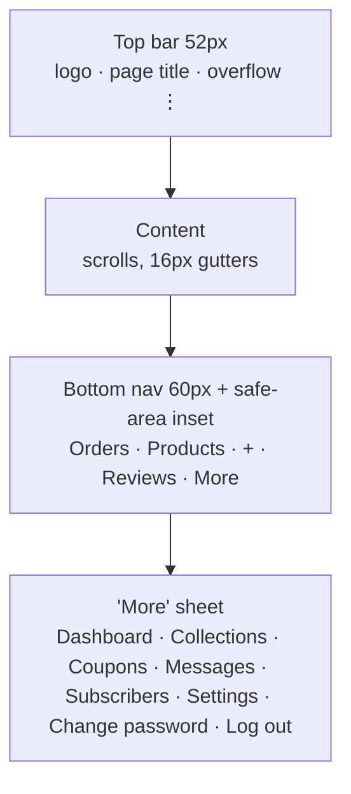

# 05a — Admin Panel: Foundations & Non-Order Screens

This document specifies the Sky Fragrances admin panel's foundations — routing, authentication,
session and CSRF lifecycle, rate limiting, the shell and its mobile ergonomics — and every screen
that is not an order screen (dashboard, products, collections, coupons, reviews, contact messages,
newsletter, settings, change password), plus CSV export rules, the low-stock rule and the list of
things the admin deliberately cannot do. Order list, order detail, status transitions, invoices and
stock restoration live in `05b-admin-orders.md`. The owner runs this shop from an Android phone on
mobile data, so every screen below is specified at 375px first and widened afterwards; where a
desktop behaviour is not stated, it is the mobile behaviour with more columns. No application code
here — DDL, `.htaccess`, route tables and numbered algorithms only.

---

## 0. Inherited ground rules and this document's contract additions

### 0.1 Inherited (non-negotiable)

- Plain PHP 8.2 + PDO, no Composer, no Node, no framework, no build step. Vendored classes only
  (PHPMailer under `app/lib/vendor/PHPMailer/` with manual `require`, 08 C-35), vanilla JS, one CSS file.
- Deployed by a non-developer through hPanel File Manager + phpMyAdmin import.
- All SQL runs on **MySQL 8+ and MariaDB 10.4+**: `CHARACTER SET utf8mb4 COLLATE utf8mb4_unicode_ci`,
  never `utf8mb4_0900_ai_ci`; no functional/expression defaults; no `JSON_TABLE`; no CTE-only syntax.
- Enumerations are short strings, not MySQL `ENUM`.
- Money is `DECIMAL(10,2)` PKR, displayed `Rs. 4,950` via one helper. Never a float.

> **Conflict flagged:** `03-storefront-pages.md` §1.4 says prices are "unsigned integers in whole
> rupees". The hard constraint for this stream is `DECIMAL(10,2)`, matching `07-seed-seo-quality.md`
> §0.2. **`DECIMAL(10,2)` wins**; the storefront helper keeps rendering with no decimals. One line in
> doc 03 needs amending — this is a schema-level disagreement, not a display one.

### 0.2 Names this document assumes from §0.2 of doc 07 (unchanged)

`collections`, `products`, `product_sizes`, `product_images`, `reviews`, `coupons`, `settings`,
`slug_redirects`, `admin_login_attempts`. Column lists are exactly as published there. Where a screen
needs a column that list does not have, it is called out below as a **schema request**, not assumed
silently.

### 0.3 Tables this document introduces (cross-stream contract)

> Superseded by 08-decisions-register.md §2 — C-18/C-20/C-21: `admin_users` uses the 01a §2.2 DDL minus `role` (superset of the one below); `admin_activity_log` uses the 05b §0.2 column set (adds `admin_username`, `before_json`, `after_json`, `user_agent`); `contact_messages` gains `order_number VARCHAR(20) NULL`. The `contact_messages` and `newsletter_subscribers` DDL below is otherwise canonical.

```sql
CREATE TABLE admin_users (
  id              INT UNSIGNED NOT NULL AUTO_INCREMENT,
  username        VARCHAR(64)  NOT NULL,
  email           VARCHAR(190) NOT NULL,
  password_hash   VARCHAR(255) NOT NULL,
  display_name    VARCHAR(100) NOT NULL,
  is_active       TINYINT(1)   NOT NULL DEFAULT 1,
  password_changed_at DATETIME NULL,
  last_login_at   DATETIME     NULL,
  last_login_ip_hash CHAR(64)  NULL,
  created_at      DATETIME     NOT NULL,
  updated_at      DATETIME     NULL,
  PRIMARY KEY (id),
  UNIQUE KEY uq_admin_username (username)
) ENGINE=InnoDB DEFAULT CHARSET=utf8mb4 COLLATE=utf8mb4_unicode_ci;

CREATE TABLE admin_activity_log (
  id          BIGINT UNSIGNED NOT NULL AUTO_INCREMENT,
  admin_id    INT UNSIGNED NULL,
  action      VARCHAR(48)  NOT NULL,   -- 'login.ok','login.fail','product.update','order.status', ...
  entity_type VARCHAR(32)  NULL,       -- 'product','order','coupon','setting', ...
  entity_id   INT UNSIGNED NULL,
  summary     VARCHAR(255) NOT NULL,
  ip_hash     CHAR(64)     NULL,
  created_at  DATETIME     NOT NULL,
  PRIMARY KEY (id),
  KEY ix_log_created (created_at),
  KEY ix_log_entity (entity_type, entity_id)
) ENGINE=InnoDB DEFAULT CHARSET=utf8mb4 COLLATE=utf8mb4_unicode_ci;

CREATE TABLE contact_messages (
  id          INT UNSIGNED NOT NULL AUTO_INCREMENT,
  name        VARCHAR(120) NOT NULL,
  email       VARCHAR(190) NULL,
  phone       VARCHAR(32)  NULL,
  subject     VARCHAR(160) NULL,
  message     TEXT         NOT NULL,
  status      VARCHAR(16)  NOT NULL DEFAULT 'new',  -- new | read | replied | archived
  admin_note  TEXT         NULL,
  ip_hash     CHAR(64)     NULL,
  created_at  DATETIME     NOT NULL,
  read_at     DATETIME     NULL,
  PRIMARY KEY (id),
  KEY ix_contact_status (status, created_at)
) ENGINE=InnoDB DEFAULT CHARSET=utf8mb4 COLLATE=utf8mb4_unicode_ci;

CREATE TABLE newsletter_subscribers (
  id             INT UNSIGNED NOT NULL AUTO_INCREMENT,
  email          VARCHAR(190) NOT NULL,
  status         VARCHAR(16)  NOT NULL DEFAULT 'subscribed', -- subscribed | unsubscribed
  source         VARCHAR(32)  NOT NULL DEFAULT 'footer',     -- footer | home | checkout | admin
  unsub_token    CHAR(40)     NOT NULL,
  subscribed_at  DATETIME     NOT NULL,
  unsubscribed_at DATETIME    NULL,
  PRIMARY KEY (id),
  UNIQUE KEY uq_subscriber_email (email)
) ENGINE=InnoDB DEFAULT CHARSET=utf8mb4 COLLATE=utf8mb4_unicode_ci;
```

`admin_login_attempts` from doc 07 is used as published (`id, ip_hash, username, attempted_at,
was_success`) plus one index this document requires:

```sql
ALTER TABLE admin_login_attempts
  ADD KEY ix_attempt_window (attempted_at),
  ADD KEY ix_attempt_user (username, attempted_at),
  ADD KEY ix_attempt_ip (ip_hash, attempted_at);
```

Two **schema requests** to the schema stream, both needed by screens below:
`products.published_at DATETIME NULL` (doc 03 §4.5 already reads it) and
`product_sizes.low_stock_threshold TINYINT UNSIGNED NULL` (per-size override for §6).

---

## 1. Admin route table

All admin URLs live under `/admin`. A second front controller, `/admin/index.php`, owns them; the
storefront front controller never sees them. Rewrite block, placed in `/admin/.htaccess`:

```apache
# admin/.htaccess — headers only. NO RewriteEngine line (08 C-54): a per-directory
# "RewriteEngine On" replaces the root rule set, so http://…/admin/login would never be
# redirected to HTTPS. /admin is routed by rule 3.6a of the root .htaccess (02b §3).
<IfModule mod_headers.c>
Header always set X-Frame-Options "DENY"
Header always set X-Content-Type-Options "nosniff"
Header always set Referrer-Policy "same-origin"
Header always set Cache-Control "no-store, no-cache, must-revalidate, private"
</IfModule>
```

`admin/controllers/`, `admin/views/` and `admin/partials/` each carry the 02b §4 deny `.htaccess`
and an `index.php` stub, and every file in them starts with the `SKYFR` guard (08 C-54) — they are
included by `admin/index.php`, never requested.

Every route except 1, 2 and 3 requires an authenticated session (§2). Every `POST` requires a valid
CSRF token (§2.5). No admin route is ever indexable: the shell emits
`<meta name="robots" content="noindex,nofollow">` and `/robots.txt` carries `Disallow: /admin`.

| # | Method + URL | Controller | Purpose |
|---|---|---|---|
| 1 | `GET /admin/login` | `auth.php` | Login form |
| 2 | `POST /admin/login` | `auth.php` | Authenticate |
| 3 | `GET /admin/logout` → `POST` | `auth.php` | Destroy session (POST only, CSRF-checked) |
| 4 | `GET /admin` | `dashboard.php` | Dashboard (§4.1) |
| 5 | `GET /admin/products` | `products.php` | Product list, filters, search, bulk (§4.2) |
| 6 | `POST /admin/products/bulk` | `products.php` | Bulk action on checked ids |
| 7 | `GET /admin/products/new` | `product-form.php` | Blank product form (§4.3) |
| 8 | `GET /admin/products/{id}` | `product-form.php` | Edit product |
| 9 | `POST /admin/products/{id}` | `product-form.php` | Save product (`{id}` = `new` on create) |
| 10 | `POST /admin/products/{id}/delete` | `products.php` | Soft-delete (sets `is_active=0`, see §7) |
| 11 | `POST /admin/products/{id}/images` | `api/images.php` | XHR image upload, returns JSON |
| 12 | `POST /admin/products/{id}/images/order` | `api/images.php` | Persist drag-reorder |
| 13 | `POST /admin/products/{id}/images/{img}/delete` | `api/images.php` | Delete one image |
| 14 | `GET /admin/collections` | `collections.php` | Collection list |
| 15 | `GET /admin/collections/new` / `/{id}` | `collection-form.php` | Create / edit |
| 16 | `POST /admin/collections/{id}` | `collection-form.php` | Save |
| 17 | `POST /admin/collections/{id}/delete` | `collections.php` | Delete (blocked if in use, §4.4) |
| 18 | `GET /admin/coupons` | `coupons.php` | Coupon list |
| 19 | `GET /admin/coupons/new` / `/{id}` | `coupon-form.php` | Create / edit |
| 20 | `POST /admin/coupons/{id}` | `coupon-form.php` | Save |
| 21 | `POST /admin/coupons/{id}/toggle` | `coupons.php` | Activate / deactivate |
| 22 | `GET /admin/reviews` | `reviews.php` | Moderation queue (§4.6) |
| 23 | `POST /admin/reviews/{id}/status` | `reviews.php` | Approve / reject / re-queue |
| 24 | `POST /admin/reviews/bulk` | `reviews.php` | Bulk approve / reject |
| 25 | `GET /admin/messages` | `messages.php` | Contact messages (§4.7) |
| 26 | `GET /admin/messages/{id}` | `messages.php` | One message, marks read |
| 27 | `POST /admin/messages/{id}/status` | `messages.php` | Set status / save note |
| 28 | `GET /admin/subscribers` | `subscribers.php` | Newsletter list (§4.8) |
| 29 | `POST /admin/subscribers/{id}/status` | `subscribers.php` | Unsubscribe / resubscribe |
| 30 | `GET /admin/subscribers/export.csv` | `export.php` | CSV download (§5) |
| 31 | `GET /admin/settings` | `settings.php` | Settings, tab via `?tab=` (§4.9) |
| 32 | `POST /admin/settings` | `settings.php` | Save the posted tab only |
| 33 | `GET /admin/password` | `password.php` | Change password (§4.10) |
| 34 | `POST /admin/password` | `password.php` | Save new password |
| 35 | `GET /admin/orders*` | — | Owned by `05b-admin-orders.md` |
| 36 | `GET /admin/orders/export.csv` | `export.php` | CSV download (§5), spec here |
| 37 | `*` unmatched under `/admin` | `notfound.php` | 404 inside the shell |
| 38 | `GET /admin/tools` | `tools.php` | Tools index: sample-data removal, privacy purge, regenerate derivatives, storage usage (08 C-65, C-73) |
| 39 | `POST /admin/tools/remove-sample-data` | `tools.php` | 07 A.7 |
| 40 | `POST /admin/tools/purge` | `tools.php` | Privacy purge (08 C-65): lists what it will delete, then deletes proof files for orders delivered/cancelled > 90 days (`payment_proofs.file_path = NULL`, `purged_at` set), stubs `email_outbox.body_html` on rows sent > 60 days, prunes `rate_limits` / `admin_login_attempts` > 30 days and expired session files; logs one `admin_activity_log` row with the counts. The same routine runs silently on a 1-in-20 admin page load. |
| 41 | `GET|POST /admin/tools/regenerate-images?offset=` | `tools.php` | Batched derivative regeneration (02c §5.3, 08 C-73) |
| 42 | `POST /admin/settings/https-permanent` | `settings.php` | Runs the https self-check and flips the root `.htaccess` redirect from 302 to 301 (08 C-52) |

Design rule: **every mutation is a POST to its own URL and answers with a 303 redirect** back to the
list or form it came from, carrying a one-shot flash message in the session. There is no PRG
exception anywhere in the panel, so the owner can hammer the back button on a flaky mobile
connection without ever re-submitting a save.

---

## 2. Authentication

Single admin account in v1 (`admin_users` holds exactly one row after `install.php`), but the table
and the session carry an `admin_id` so a second staff account is a data change, not a rewrite.

### 2.1 Login form — `GET /admin/login`

Centred card on the black brand ground, logo above. Fields: **Username** (`autocomplete="username"`,
`autocapitalize="none"`, `autocorrect="off"`, `inputmode="text"`), **Password**
(`autocomplete="current-password"`, with a show/hide eye toggle — essential on a phone keyboard),
and a hidden CSRF token. One primary button, full width, 48px tall. No "remember me" (see §2.4), no
sign-up link, no password-reset link (see §2.8). Autofocus is **not** set on mobile widths, because
it opens the keyboard over the card on a 375px screen.

### 2.2 Password storage

`password_hash($plain, PASSWORD_BCRYPT, ['cost' => 12])`. Verified with `password_verify()`.

Cost 12 is the decision: on a Hostinger shared vCPU one bcrypt at cost 12 costs roughly 250–400 ms,
which is an acceptable one-off on login and expensive enough to make offline cracking of a leaked
hash unattractive. Cost 13 was rejected because shared hosting CPU is throttled and a slow login on
mobile data reads as a broken site. `PASSWORD_ARGON2ID` was rejected because its availability on
Hostinger's PHP build is not guaranteed and this stack has no way to add an extension.

On every successful login, if `password_needs_rehash($hash, PASSWORD_BCRYPT, ['cost'=>12])` is true,
the plaintext in hand is re-hashed and stored. This is the only place a rehash can happen.

**Timing:** if the username does not exist, the code still runs `password_verify()` against a fixed
dummy hash constant before failing, so a wrong username and a wrong password take the same time.

### 2.3 Session configuration

Set **before** `session_start()`, in `/admin/bootstrap.php`:

| Directive | Value | Why |
|---|---|---|
| `session.name` | `SFADMIN` | Distinct from the storefront cart session (`SFSHOP`) |
| `session.cookie_path` | `/admin` | The admin cookie is never sent to storefront URLs |
| `session.cookie_httponly` | `1` | No JS access |
| `session.cookie_secure` | `1` | HTTPS is forced site-wide |
| `session.cookie_samesite` | `Strict` | No cross-site POST can ride the session |
| `session.use_strict_mode` | `1` | Rejects an attacker-supplied session id (fixation) |
| `session.use_only_cookies` | `1` | No session id in URLs |
| `session.gc_maxlifetime` | `43200` | Floor only; real expiry is enforced in PHP (§2.4) |
| `session.save_path` | `storage/sessions/admin/` — inside `public_html`, denied tree (08 C-26, **C-53**: its own directory, because PHP's GC sweeps a save path with the *current* request's lifetime and would trim the 3-day shop sessions to 12 h if they shared one) | Shared-hosting `/tmp` is readable by neighbours |
| `session.gc_probability` / `gc_divisor` | `1` / `100` | Hostinger's sweeper never touches a custom path (08 C-53) |

The save path is created by `install.php` and written into `config.php`. If it is not writable the
panel refuses to start with a plain-language error rather than silently falling back to `/tmp`.

Session keys: `admin_id`, `admin_username`, `login_at` (absolute clock), `last_seen` (idle clock),
`ua_hash` (SHA-256 of the User-Agent), `csrf_token`, `csrf_issued_at`, `flash`.

### 2.4 Login sequence and the two timeouts

1. Reject if the request is not POST or the CSRF token fails (§2.5).
2. Trim the username; lowercase it for lookup. Password is used raw, never trimmed.
3. Run the rate-limit gate (§2.6). If locked, fail with the lockout message **without** touching the
   password check at all.
4. Load the `admin_users` row where `username = ?` and `is_active = 1`.
5. `password_verify()` — against the real hash, or the dummy hash if no row.
6. On failure: insert `admin_login_attempts(ip_hash, username, attempted_at, was_success=0)`, log
   `login.fail`, sleep nothing extra (bcrypt already dominates), redirect back with the generic
   message *"Wrong username or password."* — never "no such user".
7. On success: `session_regenerate_id(true)` (destroying the old file), then write the session keys,
   then insert `admin_login_attempts(..., was_success=1)`, then delete that username's failed rows,
   then update `last_login_at` / `last_login_ip_hash`, then log `login.ok`.
   **7a. Known-device cookie (08 C-51):** issue `SFDEV` = `bin2hex(random_bytes(32))` (path `/admin`, Secure, HttpOnly, SameSite=Strict, 365 days) and store `sha256` of it in `admin_users.known_devices` (JSON array, newest first, capped at 5 — the oldest is dropped). A request carrying a cookie whose hash is in that array is exempt from the username delay in §2.6; it is never exempt from the password check or the IP lock.
8. 303 to the `?next=` path if it is a same-host path starting `/admin/` and is not `/admin/login`;
   otherwise to `/admin`.

**Idle timeout — 120 minutes (08 C-06; was 60).** On every authenticated request: if `now - last_seen > 7200`, destroy
the session and redirect to `/admin/login?reason=idle`. Otherwise set `last_seen = now`. Sixty
minutes is chosen for a phone: packing an order, taking a photo and coming back to the tab is a
routine five-to-thirty minute gap, and a 15-minute timeout would train the owner to hate the panel.

**Absolute timeout — 12 hours.** If `now - login_at > 43200`, destroy the session regardless of
activity and redirect with `reason=expired`. This bounds a stolen phone or an unlocked shop tablet
to one working day, and it is why there is no "remember me": a persistent-login cookie would need
its own selector/verifier token table and rotation logic, which is a meaningful amount of security
code for a shop with one operator. Logging in once a day is the cheaper trade.

**User-Agent binding:** if `hash_equals(ua_hash, sha256(current UA))` fails, the session is destroyed
(`reason=changed`). IP binding is deliberately **not** done — Pakistani mobile carriers rotate the
client IP constantly and IP-bound sessions would drop the owner mid-order.

Both timeouts and the UA check run in one `require_admin()` gate included by every controller. The
gate also re-reads `admin_users.is_active` once per request; a deactivated account dies immediately.

### 2.5 CSRF token lifecycle

- **Creation:** on login, `bin2hex(random_bytes(32))` into `$_SESSION['csrf_token']` with
  `csrf_issued_at`. (08 C-76: the login form itself needs a token, so `admin/index.php` starts the `SFADMIN` session and ensures a token on the first request — pre-auth — and **rotates** it on successful login; "on login" above reads as "rotated on login".) One token per session, not per form — per-form tokens break on a phone the moment
  the owner opens a product in a second tab, and the shop has no untrusted co-authors.
- **Emission:** every `<form method="post">` in the panel carries
  `<input type="hidden" name="_token" value="...">`. There are no GET mutations, so no token ever
  appears in a URL. XHR calls (image upload, reorder, delete) send it as the `X-CSRF-Token` header,
  read from a `<meta name="csrf-token">` in the shell.
- **Validation:** `hash_equals($_SESSION['csrf_token'], $posted)` on every POST, before any other
  work including rate limiting. Failure → 419 page inside the shell: *"This form expired. Please go
  back and try again."* plus a button back to the referring section. Never a blank 403.
- **Rotation:** rotated on login and on password change only. Rotating on every submit would destroy
  every other open tab, which the owner does have on a desktop session.
- **Double submit / origin check:** in addition, every POST verifies the `Origin` header (falling
  back to `Referer`) matches the canonical host. (08 C-49: "the canonical host" means the **request's own** scheme + `HTTP_HOST` via `request_origin()` (02c §4), never `config['base_url']` — otherwise every admin form 419s on the preview host, before the DNS switch, or after an http→https change.) Requests with neither header present are allowed —
  some Pakistani carrier proxies strip `Referer` — so the token remains the primary defence and the
  origin check is a cheap second layer.

### 2.6 Login rate limiting

Backed by `admin_login_attempts`. The limiter counts against **two independent keys**, and the
stricter of the two wins:

- `k_ip` = `SHA-256(ip_salt || client_ip)` — `ip_salt` is a per-install random string in `config.php`,
  so the table never stores a raw IP (privacy, and a DB dump does not hand over the owner's home IP).
  `client_ip` is `client_ip()` from 02c §1 (08 C-50), so Hostinger's edge proxy does not put every visitor in one bucket.
- `k_user` = the submitted username, lowercased.

The username key is the important one: on mobile data the attacker's IP rotates for free, so an
IP-only limiter is trivially bypassed. Anyone hammering the single known admin username hits the
username bucket no matter how many IPs they use.

**Algorithm (sliding window, evaluated before the password check):**

1. `now = UTC now`. Window `W = 900` seconds (15 minutes).
2. `fails_user = SELECT COUNT(*) FROM admin_login_attempts WHERE username = :u AND was_success = 0
   AND attempted_at > (now - W)`.
3. `fails_ip` = the same count keyed on `ip_hash`.
4. If `fails_user >= 5` → **locked on the username**.
   > Superseded by 08-decisions-register.md §2.4 — C-51: **there is no username lock.** A hard lock keyed on a guessable username (`admin`, the shop name, the email local part) lets a one-line script posting five wrong passwords every 14 minutes keep the owner out of her own shop from every device, forever — no COD confirmations, no payment reviews. Step 4 becomes: `fails_user >= 5` → progressive delay of **2 s** (step 8 extended), unless the request carries a valid known-device cookie (§2.4 step 7a), in which case no delay applies. The per-IP hard lock in step 5 stays.
5. Else if `fails_ip >= 10` → **locked on the IP**. (The IP ceiling is higher so one shop Wi-Fi with
   the owner and a mistyping family member is not locked by a single bad actor on the same NAT.)
6. If locked, compute `unlock_at = oldest failure inside the window + W` and refuse.
7. If not locked, proceed; on failure insert one row; on success delete that username's failed rows
   so a correct login clears the counter immediately.
8. Progressive delay, applied *before* the bcrypt call, when `1 <= fails_user < 5`:
   `usleep(min(2, fails_user) * 400000)` — 0.4 s then 0.8 s. A human notices nothing; a script loses
   its throughput. No sleep longer than 2 s ever, because shared hosting kills long-running PHP.

**Housekeeping:** each login POST also runs
`DELETE FROM admin_login_attempts WHERE attempted_at < (now - INTERVAL 7 DAY)`. There is no cron on
this stack, so cleanup rides the only request that writes to the table. The `was_success = 1` rows
are kept for the 7 days as a poor-man's login history shown at the bottom of §4.10.

### 2.7 Lockout behaviour and messaging

The lockout is a **soft lock**: it expires by itself when the window slides past. There is no admin
"unlock" button (there is no second admin to press it) and no email unlock link.

| State | HTTP | Message shown |
|---|---|---|
| Wrong credentials, under the limit | 200 on the re-rendered form | "Wrong username or password." |
| Locked (either key) | 429 | "Too many failed attempts. Try again in **{n} minutes**." Password field cleared and disabled; button disabled; a plain-text line underneath: "If you are locked out, you can wait — the lock clears by itself." (08 C-51: only the **IP** key locks; a username under attack slows to one attempt per ~2.5 s but the owner's own phone, carrying its `SFDEV` cookie, is never delayed or locked.) |
| Locked and the credentials were in fact correct | 429 | Same message. Correct credentials never shorten a lock; that would leak validity. |
| Account deactivated | 200 | "Wrong username or password." — same generic text, so the field is not an account oracle. |

`{n}` is `ceil((unlock_at - now)/60)`, minimum 1. The counter is not live-updating; a refresh
recomputes it.

### 2.8 Password reset — deliberately absent

**Decision: there is no self-service password reset in v1.** Justification:

- A reset flow needs a token table, expiry, single use, and reliable outbound mail. Outbound mail on
  Hostinger shared hosting is the least reliable part of this stack (`mail()` frequently lands in
  spam, SMTP credentials go stale). A reset path that silently fails is worse than none.
- A reset link in the owner's inbox is a second, weaker key to the whole shop — the inbox becomes the
  real credential, and it is almost certainly protected by a weaker password than the shop is.
- There is exactly one operator, who owns the hosting account.

**The documented recovery path instead** (belongs in the handover guide, and is repeated as a grey
note on the login page footer: *"Forgot your password? See step 9 of your setup guide."*):
run `/admin/reset-password.php`, a standalone file that ships in the ZIP **renamed to
`reset-password.php.disabled`**. The owner renames it in hPanel File Manager, opens it once, sets a
new password, and renames it back. It refuses to run if `admin_users` has more than one row, it
rate-limits itself to one successful use per hour, and it prints a large red banner telling the owner
to rename it back.
> Superseded by 08-decisions-register.md §2.4 — C-64. A `.disabled` file at a web path is served as text by the exists-guard (its source and the recovery procedure become public), and once renamed it was an **unauthenticated** page anyone who knew the name could race the owner to. Instead: the script ships as **`app/tools/reset-password.php`** (denied tree). Recovery = in File Manager, *copy* it to `public_html/reset-password.php`, open it. It proves File-Manager access before doing anything: it prints a random filename (`storage/reset-{16hex}`) the owner must create as an empty file, then reload; only when that nonce file exists does it show the new-password form (CSRF-protected, ≥ 12 chars). On success it writes the hash, **deletes every `admin_login_attempts` row for the username** (so a lock cannot outlive the reset), deletes the nonce file, unlinks its own copy at the root, and tells the owner to confirm it is gone. It still refuses when `admin_users` has more than one row. Step 9 of the setup guide (07 Part C) carries these steps with screenshots. Physical access to File Manager is already total control of the site, so this adds
no new attack surface — it only avoids an email dependency.

### 2.9 Logout

`POST /admin/logout` only (a `GET /admin/logout` renders a one-button confirm form, so a prefetcher
or an `` can never log the owner out). On POST: validate CSRF, `$_SESSION = []`, delete the
session cookie by re-issuing it with an expiry in the past and the identical path/secure/httponly/
samesite attributes, `session_destroy()`, log `logout`, 303 to `/admin/login?reason=out` with
`Clear-Site-Data: "cache"` on the response.

---

## 3. The admin shell

### 3.1 Sections

Eight, in this order: **Dashboard · Orders · Products · Collections · Coupons · Reviews · Messages ·
Settings**. Subscribers sits inside Messages as a second tab (it is a list the owner touches monthly,
not daily). Change Password sits inside Settings.

### 3.2 Mobile layout — decision: bottom tab bar, five slots



A bottom tab bar beats a hamburger drawer here for one reason: the owner's dominant daily loop is
*orders → product stock → back to orders*, a two-tap round trip that must not cost a drawer open, a
scan and a close each way. Thumb reach on a 6"+ Android phone also favours the bottom edge; a
top-left hamburger is the hardest target on the screen. The drawer pattern only wins when navigation
is broad and shallow, and this panel is narrow and deep.

Slots: **Orders** (badge = count of `pending` + `confirmed`), **Products**, **+** (centre, raised,
gold — a context-aware create action: new product on Products, new coupon on Coupons, otherwise new
product), **Reviews** (badge = pending count), **More**. Dashboard is deliberately *not* a tab: it is
the landing page after login and reachable from the logo, and it is read-only.

The bar is `position: fixed; bottom: 0` with `padding-bottom: env(safe-area-inset-bottom)`. Content
gets `padding-bottom: 76px`. Active tab is gold with a 2px top rule. The bar hides while a text input
has focus (Android resizes the viewport and would otherwise stack the bar on the keyboard).

Desktop (≥1024px): the bottom bar is replaced by a 220px fixed left sidebar listing all eight
sections plus the utility links, and the content area centres at max 1160px.

### 3.3 Tables → cards, the rule

**Below 768px no `<table>` is ever rendered as a table.** Each row becomes a card, and the
transformation is mechanical so every list screen looks alike:

1. The row's **identity** (order number, product name, coupon code) is the card heading, and the
   whole card is the tap target for the row's primary link.
2. **One status chip** floats top-right of the card (colour-coded, text always present — never colour
   alone).
3. At most **three** secondary fields appear as `label: value` lines, chosen per screen below. Every
   other column is dropped on mobile, not shrunk. If a dropped column matters, it belongs on the
   detail screen.
4. **Money and stock go on their own line in a larger weight** — these are the numbers the owner
   scans for.
5. Row actions collapse into one `⋮` button opening a bottom sheet of full-width 48px buttons.
   Destructive actions are last, red, and separated by a rule.
6. The checkbox for bulk selection sits at the card's left edge and is only rendered while
   "Select" mode is on (a toggle in the list header), so a normal tap never selects by accident.

All tap targets are ≥44×44px. All lists are server-paginated at **20 rows** with a
`← Prev / Page n of m / Next →` control at both ends of the list; infinite scroll is not used because
it fights the browser back button.

### 3.4 Shell chrome details

- **Flash messages** render as a dismissible bar directly under the top bar: green (success), amber
  (warning), red (error). They come from the one-shot session `flash` key and are cleared on read.
- **Forms:** one column always, even on desktop, at max 640px. Labels above fields. Required fields
  marked with a gold asterisk and `aria-required`. Errors render inline under the offending field
  *and* as a summary bar at the top listing each error as a link to its field.
- **Unsaved-changes guard:** a `beforeunload` listener arms when any field in a form changes and
  disarms on submit.
- **Save buttons are sticky** at the bottom of long forms on mobile (product form, settings), above
  the tab bar, so the owner never scrolls to save.
- **Numeric inputs** use `inputmode="numeric"` (prices, stock) and `inputmode="tel"` (phone), because
  the Android numeric keypad is the difference between a 3-second and a 15-second edit.
- **Every destructive action requires a typed or double confirmation**, never a bare `confirm()`.

---

## 4. Screen specifications

### 4.1 Dashboard — `GET /admin`

Purpose: answer "what happened today, and what needs me right now" in one screen, above the fold on a
phone. Read-only except for the links out.

Layout on mobile, top to bottom: greeting line (`Good evening — Sunday, 25 Sep 2026`), 2×2 KPI grid,
attention strip, latest orders, low stock, best sellers. Desktop puts KPIs in one row of four.

**KPI tiles (4):** Revenue today · Revenue this month · Orders today · Orders this month. Each shows
the value large, the label small, and a muted comparison line (`vs Rs. 38,200 yesterday`,
`vs Rs. 640,000 last month`) with a ▲/▼ glyph plus a sign — never colour alone.

**Revenue definition (stated once, used everywhere):** revenue counts orders whose status is
`confirmed`, `packing`, `shipped` or `delivered` — i.e. everything the owner has accepted and not
cancelled. `pending` (unverified COD/manual transfer) and `cancelled` are excluded. The figure is
`SUM(orders.grand_total)`, gross of shipping, net of discount. This is deliberately *accepted* rather
than *collected* revenue; a COD-heavy shop that only counted delivered orders would show near-zero
for the first three days of every month.

Query shapes (all parameterised; `:from`/`:to` are Asia/Karachi day boundaries converted to the
storage timezone by PHP, never by MySQL, so DST-free but server-timezone-proof):

> Superseded by 08-decisions-register.md §2.3 / §2.4 (F-05): every `placed_at` in the queries below reads **`created_at`** — the canonical `orders` DDL has no `placed_at`; `idx_orders_status_created (status, created_at)` and `idx_orders_created` already serve them. Query 3's status counts are month-to-date; the chip row is labelled *"This month"* so the number is not read as an all-time count.

1. **Revenue + count, one row per bucket, one query:**
   `SELECT DATE(placed_at) d, COUNT(*) c, COALESCE(SUM(grand_total),0) v FROM orders
    WHERE status IN ('confirmed','packing','shipped','delivered') AND placed_at >= :month_start
    GROUP BY DATE(placed_at)` — PHP folds this single result set into today, yesterday, month-to-date.
   One query serves three tiles plus the comparison lines.
2. **Previous-month comparison:** the same aggregate over the previous calendar month, one row.
3. **Counts by status:**
   `SELECT status, COUNT(*) c FROM orders WHERE placed_at >= :month_start GROUP BY status`,
   rendered as a horizontal chip row: `Pending 4 · Confirmed 9 · Packing 2 · Shipped 11 · Delivered
   38 · Cancelled 3`. Each chip links to the order list pre-filtered. Pending is gold and first
   because it is the only status that needs the owner.
4. **Attention strip** — the only actionable block. Three counters, each a link, each hidden when
   zero: *n orders awaiting confirmation*, *n reviews awaiting moderation*, *n unread messages*.
   Plus, from the hardening review (08 C-56, C-57, C-49, C-65): *n emails waiting to send* (any `email_outbox.status = 'queued'`), *n emails could not be sent* (`failed`, red), *"You opened the panel at {request host} but the site address is set to {base_url}"* when they differ, *n transfer orders unpaid for more than {manual_hold_hours} h* (links to the 05b §1.7 bulk action), and a one-line `storage/` disk-usage figure with a red state above 80 % of the plan's quota when `disk_total_space()` reports it.
5. **Latest orders (5):**
   `SELECT id, order_number, customer_name, city, grand_total, status, placed_at FROM orders
    ORDER BY placed_at DESC LIMIT 5` — card list per §3.3.
6. **Low stock (see §6):** the per-size query in §6.2, `LIMIT 8`, with a "View all" link to the
   product list pre-filtered to `stock=low`.
7. **Best sellers (5, last 30 days):**
   `SELECT p.id, p.name, SUM(oi.quantity) qty, SUM(oi.line_total) rev
    FROM order_items oi JOIN orders o ON o.id = oi.order_id JOIN products p ON p.id = oi.product_id
    WHERE o.status IN ('confirmed','packing','shipped','delivered') AND o.placed_at >= :d30
    GROUP BY p.id, p.name ORDER BY qty DESC LIMIT 5` — rendered as rank · name · units · revenue.
   *Contract note for the orders stream:* `order_items` must carry `product_id`, `quantity` and
   `line_total`, and must retain `product_id` even after a product is deleted (§7).

Eight queries total, all indexed on `orders.placed_at` and `orders.status`. Empty state for a brand
new shop: every tile shows `Rs. 0` and the lists show "No orders yet — share your shop link on
WhatsApp to get started." Never a blank panel.

### 4.2 Products list — `GET /admin/products`

Data per row: primary thumbnail (60px, 4:5), name, collection, gender, price range across active
sizes (`Rs. 4,950 – 7,950`), total stock across sizes, status chip (`Live` / `Hidden`), flags
(`★ Featured`, `NEW`). Mobile card keeps: thumbnail + name (heading), status chip, and three lines —
`Collection`, `Price`, `Stock` (stock in the §3.3 large weight, red when any size is at or below its
threshold).

Controls, in a collapsible "Filters" panel that is closed by default on mobile: search box
(matches `name`, `slug`, and `product_sizes.sku`, `LIKE '%…%'` on an indexed prefix where possible),
`collection_id`, `gender`, `scent_family`, status (`all|live|hidden`), stock (`all|low|out`), flags
(`featured|new|on_sale`), and sort (`Newest`, `Name A–Z`, `Price low→high`, `Price high→low`,
`Stock low→high`, `Best selling 30d`). Every filter is a GET parameter so a filtered view is a
bookmarkable URL — the owner keeps `/admin/products?stock=low` on their home screen.

Actions per row: `Edit` (the card tap), and in the `⋮` sheet: `View on site` (opens the public
product page in a new tab), `Duplicate` (copies the product, its sizes and its image *rows* — the
files are shared by reference until an image is deleted — with `name + " (copy)"`, a uniquified slug,
`is_active = 0`), `Hide` / `Make live`, `Delete`.

Bulk actions (Select mode on, ≥1 checked, action bar docks above the tab bar): `Make live`,
`Hide`, `Feature` / `Unfeature`, `Mark as new` / `Clear new`, `Move to collection…`, `Delete`.
Each is a POST to `/admin/products/bulk` carrying `ids[]`, the action, and the CSRF token. Bulk
delete requires typing the word `DELETE`. The confirmation states the count: *"Hide 7 products?"*.
Success flash names the count and offers nothing else; there is no undo (see §7).

Validation/errors: an id in `ids[]` that does not exist is skipped silently and subtracted from the
reported count; the flash then reads *"5 of 7 products updated — 2 no longer exist."*

### 4.3 Product add / edit — `GET|POST /admin/products/{id|new}`

One long single-column form, split into labelled sections with a sticky save bar. On desktop the
sections become an accordion-free stacked layout at 640px; no two-column forms anywhere.

**Section 1 — Basics.** `name` (required, ≤160), `slug` (auto-derived from name while untouched,
editable after; lowercase `[a-z0-9-]`, unique — on change the old slug is written to
`slug_redirects(entity_type='product', old_slug, new_slug)` and the form warns *"The old link will
redirect here."*), `collection_id` (select, required), `gender` (radio: `him` / `her` / `unisex` —
note the storefront route presets are `gender=him|her|unisex` directly (08 C-29, no mapping); the stored values are the
doc-07 ones), `scent_family` (select from the fixed list in doc 07), `short_description`
(≤200, textarea 2 rows), `description` (textarea 8 rows, plain text with blank-line paragraphs — no
rich text editor, no HTML accepted; stored escaped and rendered with `nl2br` on an escaped string).

**Section 2 — Sizes (repeater).** At least one row required. Each row: `size_label` (e.g. `50ml`),
`size_ml` (int), `sku` (unique across `product_sizes`, auto-suggested as
`SF-{slug initials}-{ml}` and editable), `price` (required, > 0), `sale_price` (optional, must be
`> 0` and `< price`), `stock` (int ≥ 0), `is_default` (radio across rows — exactly one), `sort_order`.
Rows are added by an `+ Add size` button that clones a `<template>`; removal is a per-row `Remove`
that is **disabled on the last remaining row** and, for a row with a persisted id, warns
*"Removing a size deletes it from the shop. Past orders keep their own copy of the price."*
Reordering is by ▲/▼ buttons, not drag — a 40px drag handle inside a scrolling form is unusable on a
phone. On mobile each size row is a bordered card with the label as its heading and fields stacked;
price and sale price sit side by side (the only two-up pair in the panel) because they are read
together.

**Section 3 — Images (uploader).** Drop zone plus a full-width `Choose photos` button that maps to
the phone camera/gallery picker (`accept="image/jpeg,image/png,image/webp"`, `multiple`).
Per file, client side: reject anything not JPEG/PNG/WEBP by extension *and* by the first bytes read
through `FileReader`, reject > 8 MB (08 C-46: **6 MB**), show an immediate local preview with a progress bar. Server
side, per file (`POST /admin/products/{id}/images`, one request per file so a dropped mobile
connection loses one photo, not ten): re-validate with `finfo` MIME **and** `getimagesize()`, reject
anything whose extension disagrees with its real type, strip all metadata by re-encoding through GD,
generate 400/600/900/1200w WebP derivatives plus a JPEG fallback at 900w (08 C-45: **400/600/900/1400 w, each as WebP + JPEG**, plus the 1200×630 OG JPEG for the primary image — 02c §5.2 is canonical), write to
`/uploads/products/{product_id}/{random32}-{w}.webp`, and insert `product_images`. This one-request-per-file XHR is **the** uploader contract for the whole project (08 C-46); the non-JS fallback is a single-file form that posts one image per submit. Filenames are
random, never the user's — an uploaded `shell.php.jpg` can then never be guessed. `/uploads` already
denies PHP execution.
Reorder: drag on desktop (HTML5 drag events), ▲/▼ buttons always present for touch; the new order is
persisted immediately by `POST …/images/order` with the id array, and the response is the
authoritative order (the UI re-renders from it, so a failed write never leaves the screen lying).
The first image is `is_primary`; a `Make primary` action on any tile moves it to position 1.
**Alt text** is a required field under each thumbnail, ≤125 chars, pre-filled with
`"{product name} — {size range} perfume by Sky Fragrances"` and editable. Saving the product with a
blank alt text is a validation error, not a warning — the SEO doc depends on it.

**Section 4 — Scent profile.** `notes_top`, `notes_heart`, `notes_base` (comma-separated text inputs,
each ≤200, with a live chip preview under the field so the owner sees how it renders);
`longevity` and `sillage` (1–5 segmented controls, not sliders — a 5-segment tap target beats a
slider thumb on touch); `best_season` and `occasion` (multi-select checkboxes, stored comma-joined).

**Section 5 — Visibility.** `is_active` (Live / Hidden, default Live), `is_featured`, `is_new`
(with helper text: *"NEW also shows automatically for 30 days after the publish date."*),
`published_at` (date, defaults to now on create), `sort_order` (int, default 0, helper text
*"Lower numbers show first."*).

**Section 6 — SEO.** `seo_title` (≤60, live character counter turning amber at 55, red past 60, with
a Google-style preview using the fallback pattern from doc 03 when blank), `seo_description`
(≤155, same counter). Both optional; blank means the pattern applies.

Validation is server-side and authoritative; the client mirrors it for speed only. On error the form
re-renders with **every** submitted value preserved, including unsaved repeater rows and the
already-uploaded image list, plus the error summary bar. On success: 303 to the list with
*"Azure Oud saved."* and a `View on site` link in the flash; `Save & add another` instead returns to
a blank form. An edit writes `admin_activity_log('product.update')` with a summary naming the fields
that actually changed.

### 4.4 Collections CRUD — `/admin/collections`

List: thumbnail, name, slug, product count (`LEFT JOIN products … GROUP BY`), `sort_order`, status
chip. Sorted by `sort_order`. Mobile card keeps name (heading), status chip, `Products: n`,
`Order: n`. Reordering is by ▲/▼ on each card, persisted immediately; `sort_order` is seeded in tens
(doc 07 §A.1) so a move is a swap, never a renumber of the whole table.

Form fields: `name` (required, ≤80), `slug` (same slug rules and `slug_redirects` behaviour as
products, `entity_type='collection'`), `tagline` (≤120), `description` (textarea), `mood` (≤160),
`image` (single upload, same pipeline as §4.3, 16:9, used on the collection hero and the home tiles — 08 C-45 / F-15: the crop is **3:4** (the storefront card ratio, 03 §4.3, 04b §3); the collection hero reuses it under a scrim; no 16:9 derivative exists),
`sort_order`, `is_active`, `seo_title`, `seo_description`.

Delete is **blocked while any product references the collection**: the button explains
*"3 products are in this collection. Move them first."* and links to the product list filtered to it.
A collection with zero products deletes after a typed `DELETE` confirmation. Hiding
(`is_active = 0`) is always available and is the action the owner actually wants; the UI says so.

### 4.5 Coupons CRUD — `/admin/coupons`

List columns: `code` (monospace, uppercase), type/value rendered as `10%` or `Rs. 500`,
`min_order_total`, usage (`used_count / usage_limit`, or `4 / ∞`), window (`starts_at → expires_at`),
status chip computed at render time: `Active` · `Scheduled` (starts in future) · `Expired` ·
`Used up` · `Disabled` (`is_active = 0`). Mobile card: code (heading), status chip, and
`Discount`, `Min order`, `Used` lines. Filters: status, type, search on code.

Form: `code` (required, ≤32, forced uppercase, `[A-Z0-9-]` only, unique — a duplicate returns the
field error *"That code already exists."*), `type` (`percent` | `fixed`), `value` (percent: 1–90,
integer; fixed: `DECIMAL(10,2)` > 0 and ≤ 100000), `min_order_total` (≥ 0, default 0),
`usage_limit` (blank = unlimited; if set, must be ≥ `used_count`), `starts_at` and `expires_at`
(datetime-local inputs, Asia/Karachi, both optional; if both set, `expires_at > starts_at`),
`is_active`. `used_count` is displayed read-only and is never editable — it is the ledger of what
already happened.

Actions: edit, toggle active (one POST, no confirm — it is reversible), copy code to clipboard,
and a WhatsApp share button that opens `wa.me/?text=` with a pre-filled promo line using the
coupon's own terms. Delete is allowed **only when `used_count = 0`**; otherwise the owner is told to
deactivate instead, because deleting a used coupon orphans the discount rows on past orders.

### 4.6 Reviews moderation — `/admin/reviews`

The brief is explicit: approved reviews only, no fake reviews. Default view is `status = pending`,
oldest first, because a review waiting three days is worse than one waiting an hour.

Per review: product name + thumbnail (links to the product), `customer_name`, `customer_city`,
rating as 5 glyphs + the number, `title`, `body` (full text, never truncated on the detail card —
the owner must read what they are publishing), `created_at` relative (`2 days ago`) with the absolute
date on hover/long-press, status chip, and an `is_sample` badge on seed rows.

Actions: `Approve` (sets `status='approved'`, `approved_at = now`), `Reject`
(`status='rejected'`, stays in the DB for the record), `Return to pending`. Bulk approve/reject via
Select mode. Approving recomputes and caches the product's rating aggregate (see the contract note
below). There is no reply-to-review feature in v1.

Filters: status (`pending` default, `approved`, `rejected`, `all`), product, rating, and a
`Sample data only` toggle that surfaces every `is_sample = 1` row with a **`Delete all sample
reviews`** button — this is the launch-blocker cleanup from doc 07 §A.7 given a real button instead
of a SQL snippet the owner will never run.

*Contract note:* `products` needs `rating_avg DECIMAL(3,2) NOT NULL DEFAULT 0.00` and
`rating_count INT UNSIGNED NOT NULL DEFAULT 0`, recomputed from approved reviews on every moderation
action. Doc 03 §1.3 already renders `rating_count` on the product card; without the cache the
storefront pays an aggregate per card.

### 4.7 Contact messages — `/admin/messages`

List of `contact_messages`, newest first, filtered by status (`new` default, `read`, `replied`,
`archived`, `all`) and searchable on name, email, phone and message body. Card: name (heading),
status chip, `Subject`, `Phone`, received-at; the message body is clamped to two lines in the list
and full on the detail screen. Opening a message sets `status='read'` and `read_at` if it was `new`
(a GET that mutates exactly one non-semantic flag — acceptable, and it is idempotent).

Detail actions, all full-width on mobile: `Reply on WhatsApp` (opens `wa.me/{normalised phone}` with
a greeting pre-filled from a settings template; the phone is normalised to `92XXXXXXXXXX` — leading
`0` dropped, spaces and dashes stripped, `+` stripped), `Reply by email` (`mailto:` with the subject
prefixed `Re:`), `Mark replied`, `Archive`, `Delete` (typed confirmation; this is personal data and
the owner is allowed to erase it). A free-text `admin_note` textarea saves with the status.

No outbound mail is sent from this screen. The reply happens in WhatsApp, which is where Pakistani
customers actually are, and building an in-panel mailer would make the panel responsible for
deliverability it cannot guarantee.

### 4.8 Newsletter subscribers — `/admin/subscribers`

A deliberately thin screen: list of `email`, `status` chip, `source`, `subscribed_at`. Filters:
status, source, and a search on email. Counters at the top: `Subscribed: 412 · Unsubscribed: 18`.
Actions: unsubscribe / resubscribe one row (a POST), `Add subscriber` (a single email field, for
someone who asked in person — `source='admin'`), delete (typed confirmation), and
**Export CSV** (§5.2). There is no compose-and-send feature; the owner exports and pastes the list
into whichever mail tool they use. Sending bulk mail through `mail()` on shared hosting would burn
the domain's sending reputation within one campaign.

Unsubscribing never deletes the row — the `unsub_token` and the `unsubscribed` status are the proof
that the person opted out, which a deleted row cannot provide when they are re-imported later.

### 4.9 Settings — `GET|POST /admin/settings?tab=`

`settings` is a key/value table (`setting_key`, `setting_value`, `setting_group`, `updated_at`). Every
value is stored as a **string**; the type column below is the validation/rendering contract held in a
PHP definition array, which is also the source of the form. Adding a setting is one array entry, not
a migration. **A POST saves only the keys belonging to the posted tab**, so a half-loaded form on a
bad connection can never blank another tab's values.

Tabs: Store · Contact & Social · Home · Shipping · Payments · SEO · Advanced.

| Key | Group | Type | Default |
|---|---|---|---|
| `store_name` | store | text | `Sky Fragrances` |
| `store_tagline` | store | text | `More Than Just A Scent` |
| `logo_path` | store | image | `assets/img/logo.png` |
| `favicon_path` | store | image | `assets/img/favicon.png` |
| `address_line` | store | text | *(blank)* |
| `footer_blurb` | store | textarea | `Luxury fragrance, made for Pakistan.` |
| `currency_prefix` | store | text | `Rs.` |
| `timezone` | store | text (read-only) | `Asia/Karachi` |
| `contact_phone` | contact | phone | *(blank)* |
| `whatsapp` | contact | phone | *(blank)* |
| `contact_email` | contact | email | *(blank)* |
| `order_notify_email` | contact | email | *(blank — falls back to `contact_email`)* |
| `instagram_url` / `instagram_handle` | contact | url / text | *(blank)* |
| `facebook_url`, `tiktok_url`, `youtube_url` | contact | url | *(blank)* |
| `whatsapp_reply_template` | contact | textarea | `Assalam o Alaikum {name}, thank you for contacting Sky Fragrances.` |
| `announcement_enabled` | home | bool | `1` |
| `announcement_text` | home | text | `Free delivery on orders above Rs. 3,000` |
| `announcement_link` | home | url | `/shop` |
| `hero_heading`, `hero_subheading`, `hero_cta_label`, `hero_cta_url` | home | text | brand defaults |
| `hero_image_desktop`, `hero_image_mobile` | home | image | seeded |
| `hero_trust_line` | home | text | `Cash on delivery · Nationwide` |
| `home_bestsellers_count` | home | int 4–12 | `8` |
| `home_new_count` | home | int 4–12 | `8` |
| `home_reviews_enabled` | home | bool | `1` |
| `quiz_band_enabled`, `quiz_band_heading`, `quiz_band_text` | home | bool / text | `1` + defaults |
| `gender_tile_men_image`, `gender_tile_women_image`, `gender_tile_unisex_image` | home | image | seeded |
| `newsletter_heading`, `newsletter_text`, `newsletter_cta_label` | home | text | defaults |
| `shipping_fee` | shipping | money | `250.00` |
| `free_shipping_threshold` | shipping | money | `3000.00` |
| `delivery_time` | shipping | text | `2–4 working days` |
| `cod_enabled` | payments | bool | `1` |
| `cod_max_total` | payments | money | `0` = no cap (08 C-69; the brief asks for COD with no ceiling — a value above 0 disables COD at checkout for larger orders with *"Orders above Rs. {n} are prepaid only."*) |
| `manual_hold_hours` | payments | int 6–240 | `48` — amber badge on unpaid transfer orders after this many hours, and the age threshold for the 05b §1.7 bulk cancel (08 Q-07, C-58) |
| `cod_note` | payments | textarea | `Pay the courier when your parcel arrives.` |
| `bank_enabled`, `bank_name`, `bank_account_title`, `bank_account_number`, `bank_iban` | payments | bool / text | `0` + blanks |
| `jazzcash_enabled`, `jazzcash_account_title`, `jazzcash_number` | payments | bool / text | `0` + blanks |
| `easypaisa_enabled`, `easypaisa_account_title`, `easypaisa_number` | payments | bool / text | `0` + blanks |
| `manual_payment_note` | payments | textarea | `Send your payment screenshot and transaction ID with your order.` |
| `meta_description` | seo | textarea ≤155 | brand default |
| `og_default_image` | seo | image | seeded 1200×630 |
| `google_verification`, `gsc_analytics_id` | seo | text | *(blank)* |
| `low_stock_threshold` | advanced | int 0–999 | `5` |
| `admin_rows_per_page` | advanced | int 10–100 | `20` |
| `maintenance_mode` | advanced | bool | `0` — **this key is the switch** (08 C-70); the panel never writes `config.php`. The Advanced tab also shows the File-Manager fallback: *"If the panel is unreachable, create an empty file named `MAINTENANCE` inside `storage/`."* |
| `maintenance_message` | advanced | textarea | default copy |
| `maintenance_bypass` | advanced | text (read-only, regenerate button) | random 16 hex at install (08 C-70, C-76: entered in a POST form on the maintenance page, never in a URL) |
| `base_url` | advanced | url | blank = use `config['base_url']` (08 C-49). Hint under the field: *"You opened this page at https://{host} — use that unless you know why not."* Used only for canonical, OG, sitemap and email links; never for security checks. |
| `trusted_proxies` | advanced | text (comma-separated CIDRs) | written by `install.php` from its probe (08 C-50); *"Change only if the setup guide tells you to."* |
| `https_permanent` | advanced | bool (read-only, action button) | `0` until the https self-check flips the root redirect to 301 (08 C-52) |
| `site_indexable` | advanced | bool | `1` — added by 08 §1.4; `install.php` writes `0` when the host is not `skyfragrances.com` |
| `business_hours` | contact | text | *(blank)* — added by 08 §1.4 (03 §12.2) |
| `instagram_tile_{1..6}_image`, `instagram_tile_{1..6}_url` | home | image / url | *(blank)* — added by 08 §4; replaces the `instagram_posts` table |

Validation rules by type: `bool` → `0|1`; `int` → range-checked; `money` → matches
`^\d{1,8}(\.\d{1,2})?$` and is stored with two decimals; `email` → `FILTER_VALIDATE_EMAIL`;
`url` → `FILTER_VALIDATE_URL` and must be `https://` or a site-relative path; `phone` → digits, `+`,
spaces and dashes only, normalised to `92XXXXXXXXXX` on save with the raw form kept for display;
`image` → the §4.3 upload pipeline, replacing the previous file only after the new one validates.

Cross-field rules enforced on save: **at least one payment method must remain enabled** (turning off
the last one is refused with *"At least one payment method must stay on, or nobody can check out."*);
enabling `bank_enabled` requires `bank_account_number` and `bank_account_title`; the same for
JazzCash and Easypaisa. `free_shipping_threshold = 0` means "always free" and the UI says so
under the field.

Settings are read once per request into a cached array (a single `SELECT setting_key, setting_value
FROM settings`) exposed as `setting('key')` with the definition-array default as the fallback, so a
key missing from the database never fatals a page. Saving writes an `admin_activity_log('setting.update')`
row naming the keys that changed — never their values, because payment account numbers are in there.

### 4.10 Change password — `GET|POST /admin/password`

Three fields: current password, new password, confirm new password (all
`autocomplete` hinted: `current-password`, `new-password`, `new-password`), each with a show/hide
toggle. Rules: current must verify; new must be ≥ 12 characters, must not equal the current one, must
not equal the username, and must not appear in a small vendored list of the 200 most common
passwords (a flat text file, checked case-insensitively). No composition rules (no "must contain a
symbol") — length is the property that matters and composition rules produce `Sky@123`. A strength
meter renders as a 4-segment bar with plain-language text, advisory only.

On success: rehash at cost 12, write `password_changed_at`, **`session_regenerate_id(true)`**, rotate
the CSRF token, clear `admin_login_attempts` for the username, log `password.change`, and flash
*"Password changed."* The session stays logged in — there is only one operator and one device; forcing
a re-login here would only teach the owner to avoid changing their password. Failures are per-field:
*"Current password is wrong."* / *"Passwords do not match."* / *"Use at least 12 characters."*

At the foot of the screen, read-only: **last login** (`last_login_at`) and the last 10 rows of
`admin_login_attempts` for this username rendered as `25 Sep 2026, 21:14 — success` /
`— failed`. This is the owner's only intrusion signal, and it costs one query.

---

## 5. CSV export

Two exports, one shared writer. Both are authenticated GET routes that stream with
`Content-Type: text/csv; charset=UTF-8`,
`Content-Disposition: attachment; filename="sky-orders-2026-09-25.csv"`, `X-Content-Type-Options:
nosniff`, and no caching. Rows are streamed with `fputcsv` to `php://output` inside an unbuffered PDO
query, so a 20,000-row export never builds a string in memory — shared hosting memory limits are the
binding constraint, not time.

### 5.1 Rules that apply to both files

1. **Encoding.** UTF-8, and the file **starts with the UTF-8 BOM** (`\xEF\xBB\xBF`). Excel on Windows
   assumes the system ANSI code page for a BOM-less CSV and mangles every non-ASCII character; the
   BOM is what makes `Lahore — Gulberg` survive a double-click. (Note the contrast with `db/seed.sql`
   in doc 07 §0.3, which must be BOM-**less** — a BOM breaks the phpMyAdmin import. Same project,
   opposite rule, for different consumers.)
2. **Delimiter** `,`, **enclosure** `"`, escape by doubling the enclosure. Line ending `\r\n`.
3. **Formula-injection prevention.** Any field whose first character (after trimming leading
   whitespace) is one of `=`, `+`, `-`, `@`, TAB (`0x09`) or CR (`0x0D`) is prefixed with a single
   apostrophe `'` before being written. This stops `=HYPERLINK(...)` and `=cmd|…` payloads that a
   customer can plant through the name, address or notes field from executing when the owner opens
   the file. The apostrophe is visible in the cell and that is accepted — a visibly odd cell is
   better than a spreadsheet that dials out.
   *Exception:* a field that is numeric by column definition (totals, quantities) is written raw, and
   a negative total therefore keeps its `-`. Those columns never contain customer-supplied text.
4. **Money** is written as a plain unquoted number with two decimals and **no** `Rs.` prefix and **no**
   thousands separator (`4950.00`), so it sums in Excel. The currency is stated in the filename and
   in the header row (`Grand Total (PKR)`).
5. **Dates** are written as `YYYY-MM-DD HH:MM` in Asia/Karachi, which Excel parses and which sorts
   lexically.
6. **Phone numbers** are written with a leading apostrophe by rule 3's spirit — `'03001234567` — so
   Excel does not eat the leading zero. This is the one place the apostrophe is applied on purpose
   rather than defensively.
7. Newlines inside a field (order notes) are preserved inside the quoted field; a literal `NUL` byte
   is stripped.
8. **Every export writes one `admin_activity_log` row** (`orders.export` / `subscribers.export`) with the filter summary and the row count — never the rows (08 C-65). `before_json` / `after_json` on any entity carry field names and non-PII values only; `customer_phone`, `customer_email`, `address` and account numbers are recorded as `"(changed)"`.

### 5.2 Subscribers — `GET /admin/subscribers/export.csv`

Honours the current filters via the same query parameters as the list. Columns, in order:

`Email, Status, Source, Subscribed At, Unsubscribed At`

Default scope is `status = subscribed`; exporting everything requires `?status=all`, and the
filename then reads `sky-subscribers-all-2026-09-25.csv`.

### 5.3 Orders — `GET /admin/orders/export.csv`

Honours the order list's filters (status, date range, city, payment method, search). **One row per
order**, not per line item — the owner opens this in Excel to count money and courier loads, and a
line-item file makes every total wrong by repetition. Line items are flattened into one text column.

`Order Number, Placed At, Status, Customer Name, Phone, Email, City, Address, Items, Item Count,
Subtotal (PKR), Discount (PKR), Coupon Code, Shipping (PKR), Grand Total (PKR), Payment Method,
Payment Status, Transaction ID, Courier, Tracking Number, Notes`

`Items` is built as `"Azure Oud 50ml ×1 | Cirrus 100ml ×2"` from `order_items`, using the
**historical** name and size label stored on the line, never a join back to the live product (§7).
`Item Count` is the sum of quantities. The export is capped at 5,000 orders per request; beyond that
the screen tells the owner to narrow the date range, because a shared-hosting request that runs past
30 seconds is killed and delivers a truncated file that looks complete.

---

## 6. The low-stock rule

### 6.1 Definition

Stock lives on `product_sizes.stock`, per size, never on the product. A **size** is:

- **Out of stock** when `stock <= 0`.
- **Low stock** when `0 < stock <= threshold`, where `threshold` is
  `COALESCE(product_sizes.low_stock_threshold, setting('low_stock_threshold'))` — a per-size override
  over a global default of 5. The override exists because a 100ml bottle that sells one a week and a
  50ml that sells five a day do not share a sensible floor.
- A **product** is "low" when any of its active sizes is low, and "out" when *all* of its active sizes
  are out. A product with one sold-out size among three is not out — the storefront still sells it.

Setting the global threshold to `0` disables low-stock alerts entirely without disabling the
out-of-stock logic, which is not optional.

### 6.2 The query

```sql
SELECT p.id, p.name, p.slug, ps.id AS size_id, ps.size_label, ps.sku, ps.stock,
       COALESCE(ps.low_stock_threshold, :global_threshold) AS threshold
FROM product_sizes ps
JOIN products p ON p.id = ps.product_id
WHERE p.is_active = 1
  AND ps.stock <= COALESCE(ps.low_stock_threshold, :global_threshold)
ORDER BY (ps.stock <= 0) DESC, ps.stock ASC, p.name ASC
```

Sold-out sizes sort first, then the nearly-gone. Index required:
`ALTER TABLE product_sizes ADD KEY ix_size_stock (stock);`

### 6.3 Where it surfaces

| Surface | Treatment |
|---|---|
| Dashboard (§4.1 block 6) | "Low stock" card list, 8 rows, each `Product — 50ml · 3 left`, red for 0, amber for low; tap goes straight to that product's edit form scrolled to the Sizes section |
| Products list | Stock line turns amber/red; `stock=low` and `stock=out` filters; the count appears on the Products bottom-nav tab as a badge only when ≥ 1 size is **out** |
| Product edit form | Per-size inline warning under the stock field |
| Order detail (doc 05b) | After confirming an order that takes a size to or below its threshold, a one-line notice: *"Azure Oud 50ml is down to 2."* |
| Storefront | `stock <= 0` renders `SOLD OUT` and disables add-to-cart (doc 03 §1.3). The *low* state is never shown to customers — no "only 2 left" urgency copy. It is an operations signal, not a sales tactic, and faking it is the kind of thing a luxury brand gets caught doing |

Stock is only ever decremented by the order pipeline and restored by cancellation (doc 05b). The
admin can type a new stock number on the product form, which is an absolute set, logged as
`product.stock` with the before and after values in the summary.

---

## 7. What the admin explicitly cannot do

These are not missing features. Each one is a deliberate refusal, and the UI says so where the owner
might look for it.

1. **Write, edit or invent a review.** There is no "add review" button anywhere; `reviews` rows are
   created only by the public form. The owner can approve, reject or delete — never author or alter
   the words. The brief says "no fake reviews" and the only way to mean it is to make it
   structurally impossible from the panel. The seeded `is_sample = 1` reviews are the single
   exception, are visibly badged as sample data, and have a one-button purge (§4.6).
2. **Edit the price, size label or product name recorded on a past order.** `order_items` stores its
   own copies of `product_name`, `size_label`, `unit_price` and `line_total` at the moment of
   ordering. Nothing in the admin panel can write to those columns. Changing a product's price today
   must not silently restate what a customer agreed to pay last month — that is the difference
   between a shop's records and a shop's marketing. It also keeps the CSV export, the invoice and
   the customer's confirmation email permanently in agreement. Correcting a genuinely wrong order is
   done by cancelling it and placing a new one, which leaves both records visible.
3. **Change an order's totals directly.** `subtotal`, `discount_total`, `shipping_fee` and
   `grand_total` are computed server-side at checkout and are read-only forever after. The owner
   controls the *status* and the *payment status*, not the arithmetic.
4. **Decrement `coupons.used_count` or delete a used coupon** (§4.5). It is a ledger of events. (Cancelling an order decrements it by exactly one inside the cancel transaction — that is the system, not the owner, 08 C-44. There is no recount button.)
5. **Hard-delete a product that appears on any order.** `POST /admin/products/{id}/delete` sets
   `is_active = 0` and says *"Hidden from the shop. It stays on your past orders."* Only a product
   with zero order lines is removed from the table, and its image files with it. A dangling
   `order_items.product_id` must never become a broken order history.
6. **Delete a collection that still holds products** (§4.4), or **delete the last remaining size** of
   a product (§4.3), or **disable the last payment method** (§4.9).
7. **Create a second admin account, or change another account's password**, in v1. One operator, one
   credential, one recovery path (§2.8).
8. **Send bulk email from the panel** (§4.8) or **reply to a contact message from the panel** (§4.7).
9. **Run raw SQL, upload arbitrary files, or edit templates.** The panel's only file input is the
   image pipeline, which accepts three image types, re-encodes every byte through GD, and writes to a
   directory where PHP execution is denied. There is no file manager, no theme editor, no import
   tool — those are how small PHP shops get owned, and hPanel already gives the owner a real file
   manager when they genuinely need one.
