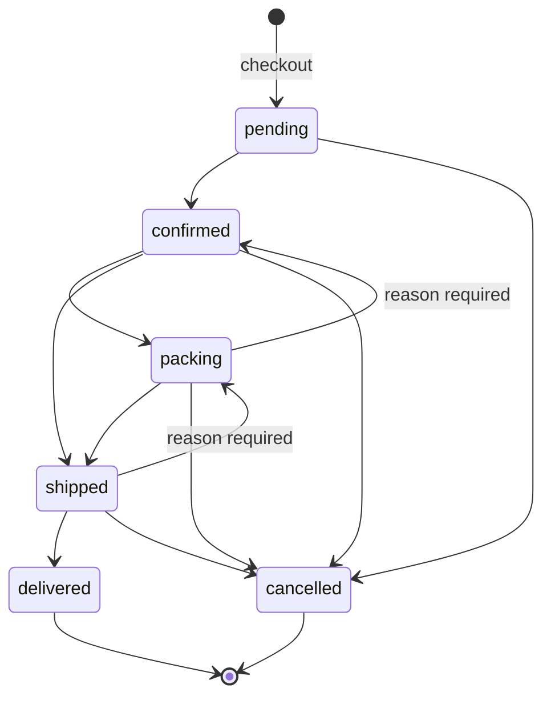
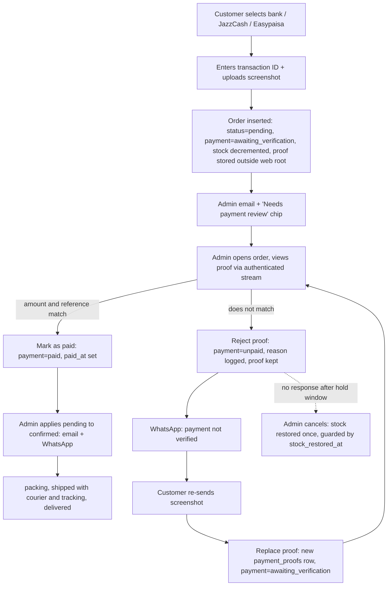

# 05b — Admin Panel: Orders

This document specifies the order-management half of the Sky Fragrances admin panel: the
orders list, the order detail screen, the legal status transitions and their side effects,
the payment-proof viewer, mark-as-paid and restore-stock semantics, the one-click WhatsApp
messages, the printable invoice and packing slip, the audit trail, and the end-to-end
manual-payment review flow. It is a specification, not an implementation: it contains DDL,
route tables, transition tables, exact message strings and numbered algorithms, and no
application code. Everything here assumes plain PHP 8.2 + PDO on Hostinger shared hosting,
no Composer, no Node, no build step, with SQL that runs unchanged on MySQL 8+ and
MariaDB 10.4+.

---

## 0. Ground rules and the schema this document owns

### 0.1 Inherited constraints

| Constraint | Consequence in this document |
|---|---|
| No framework, no ORM | Every query shown is a prepared PDO statement over an explicit column list. |
| No Composer | PDF is **not** generated server-side. "Print invoice" is an HTML page with print CSS and `window.print()`. No Dompdf, no wkhtmltopdf. |
| No Node / no build | The list and detail screens are server-rendered. JS is vanilla, progressive, and optional. |
| MySQL 8 **and** MariaDB 10.4 | `utf8mb4_unicode_ci` only. No `CHECK` with functions, no functional defaults, no `JSON_TABLE`, no window functions in required paths. |
| Non-developer deploys by File Manager | No cron dependency for anything in this document. All side effects happen inside the admin request. |
| Money is `DECIMAL(10,2)` PKR | Displayed as `Rs. 4,950` via one helper. Never a float, never a browser-computed total. |
| Enumerations are short strings | `orders.status`, `orders.payment_method`, `orders.payment_status` are `VARCHAR`, not MySQL `ENUM`. |

> **Conflict noted:** `03-storefront-pages.md` §1.4 says prices are stored as unsigned
> integers in whole rupees; `07-seed-seo-quality.md` §0.2 and the project constraints say
> `DECIMAL(10,2)`. **This document follows `DECIMAL(10,2)`**, which is also what
> `product_sizes.price` / `sale_price` are declared as in §0.2. The storefront helper still
> renders zero decimals. If the schema stream rules otherwise, this document is amended, not
> the schema.

### 0.2 Schema names this document owns (cross-stream contract)

> Superseded by 08-decisions-register.md §2 — C-07/C-09/C-10: `orders` / `order_items` DDL is 01b as amended (08 §2.3): read `customer_notes`→`customer_note`, `address_line`→`address`, `payment_proof_id` is dropped (join `payment_proofs` on `order_id`), `payment_reference` is kept, and `phone_normalized`, `idempotency_key`, `cod_fee`, `item_count`, `coupon_id`, `source` are present. `payment_status` is `unpaid|awaiting_verification|paid|failed|refunded` (`awaiting_verification`→`awaiting_verification`; `failed` = proof rejected). `order_status_history` uses the 01b §3.2 columns — read `actor_type/actor_id/actor_label` as `changed_by/admin_id/admin_username`. Order numbers are `SF-YYMMDD-XXXX` random (C-10). `admin_activity_log` and `payment_proofs` (with 06b's review columns) as listed here ARE canonical.

`07-seed-seo-quality.md` §0.2 defines the catalogue tables and is authoritative for them.
It does **not** define the order tables. This document defines them, in the same style, and
every other stream must use these names:

```
orders(id, order_number, status, payment_method, payment_status,
       customer_name, customer_phone, customer_email,
       city, address_line, postal_code, customer_notes, admin_notes,
       subtotal, discount_total, shipping_fee, grand_total,
       coupon_code, coupon_type, coupon_value,
       payment_reference, payment_proof_id, paid_at,
       courier_name, tracking_number, shipped_at, delivered_at,
       cancelled_at, cancel_reason, stock_restored_at,
       access_token, ip_hash, user_agent, created_at, updated_at)

order_items(id, order_id, product_id, product_size_id,
            product_name, size_label, sku,
            unit_price, quantity, line_total, created_at)

order_status_history(id, order_id, from_status, to_status, note,
                     actor_type, actor_id, actor_label, created_at)

payment_proofs(id, order_id, stored_name, original_name, mime_type,
               byte_size, sha256, uploaded_ip_hash, created_at)

admin_activity_log(id, admin_id, admin_username, entity_type, entity_id,
                   action, summary, before_json, after_json,
                   ip_hash, user_agent, created_at)
```

Enumerations, as short strings:

- `orders.status` → `pending` | `confirmed` | `packing` | `shipped` | `delivered` | `cancelled`
- `orders.payment_method` → `cod` | `bank` | `jazzcash` | `easypaisa`
- `orders.payment_status` → `unpaid` | `awaiting_verification` | `paid` | `refunded`
- `order_status_history.actor_type` → `admin` | `customer` | `system`
- `admin_activity_log.action` → `order.status_change`, `order.mark_paid`,
  `order.payment_rejected`, `order.tracking_set`, `order.stock_restored`,
  `order.note_edited`, `order.contact_edited`, `order.proof_viewed`,
  `order.invoice_printed`, `order.exported`

`payment_status` is deliberately separate from `status`. A COD order can be `delivered` and
`unpaid` until the rider's cash is reconciled; a bank-transfer order can be `paid` while
still `pending`. Collapsing the two into one column is the most common way this kind of
admin panel becomes unusable in month two.

### 0.3 The two DDL fragments this document needs

```sql
CREATE TABLE orders (
  id               INT UNSIGNED NOT NULL AUTO_INCREMENT,
  order_number     VARCHAR(20)  NOT NULL,
  status           VARCHAR(20)  NOT NULL DEFAULT 'pending',
  payment_method   VARCHAR(20)  NOT NULL,
  payment_status   VARCHAR(20)  NOT NULL DEFAULT 'unpaid',
  customer_name    VARCHAR(120) NOT NULL,
  customer_phone   VARCHAR(20)  NOT NULL,
  customer_email   VARCHAR(160) NULL,
  city             VARCHAR(80)  NOT NULL,
  address_line     VARCHAR(400) NOT NULL,
  postal_code      VARCHAR(12)  NULL,
  customer_notes   VARCHAR(600) NULL,
  admin_notes      TEXT         NULL,
  subtotal         DECIMAL(10,2) NOT NULL DEFAULT 0.00,
  discount_total   DECIMAL(10,2) NOT NULL DEFAULT 0.00,
  shipping_fee     DECIMAL(10,2) NOT NULL DEFAULT 0.00,
  grand_total      DECIMAL(10,2) NOT NULL DEFAULT 0.00,
  coupon_code      VARCHAR(40)  NULL,
  coupon_type      VARCHAR(10)  NULL,
  coupon_value     DECIMAL(10,2) NULL,
  payment_reference VARCHAR(80) NULL,
  payment_proof_id INT UNSIGNED NULL,
  paid_at          DATETIME NULL,
  courier_name     VARCHAR(60)  NULL,
  tracking_number  VARCHAR(60)  NULL,
  shipped_at       DATETIME NULL,
  delivered_at     DATETIME NULL,
  cancelled_at     DATETIME NULL,
  cancel_reason    VARCHAR(200) NULL,
  stock_restored_at DATETIME NULL,
  access_token     CHAR(32) NOT NULL,
  ip_hash          CHAR(64) NULL,
  user_agent       VARCHAR(255) NULL,
  created_at       DATETIME NOT NULL,
  updated_at       DATETIME NOT NULL,
  PRIMARY KEY (id),
  UNIQUE KEY uq_orders_number (order_number),
  KEY ix_orders_status_created (status, created_at),
  KEY ix_orders_payment (payment_method, payment_status),
  KEY ix_orders_phone (customer_phone),
  KEY ix_orders_created (created_at)
) ENGINE=InnoDB DEFAULT CHARSET=utf8mb4 COLLATE=utf8mb4_unicode_ci;
```

`order_number` format: `SF-YYMMDD-NNNN` (e.g. `SF-260925-0143`), where `NNNN` is a
zero-padded per-day counter taken inside the same transaction that inserts the order. It is
short enough to read over the phone and sorts chronologically as a string.
Superseded by 08-decisions-register.md §2 — C-10: the suffix is four random characters from `A-HJ-NP-Z2-9` (`SF-260925-K7QF`), not a per-day counter; uniqueness is the `UNIQUE` key plus retry.

```sql
CREATE TABLE order_items (
  id              INT UNSIGNED NOT NULL AUTO_INCREMENT,
  order_id        INT UNSIGNED NOT NULL,
  product_id      INT UNSIGNED NULL,
  product_size_id INT UNSIGNED NULL,
  product_name    VARCHAR(160) NOT NULL,
  size_label      VARCHAR(20)  NOT NULL,
  sku             VARCHAR(40)  NOT NULL,
  unit_price      DECIMAL(10,2) NOT NULL,
  quantity        SMALLINT UNSIGNED NOT NULL,
  line_total      DECIMAL(10,2) NOT NULL,
  created_at      DATETIME NOT NULL,
  PRIMARY KEY (id),
  KEY ix_order_items_order (order_id),
  KEY ix_order_items_size (product_size_id)
) ENGINE=InnoDB DEFAULT CHARSET=utf8mb4 COLLATE=utf8mb4_unicode_ci;
```

`product_name`, `size_label`, `sku` and `unit_price` are **snapshots** written at checkout.
`product_id` / `product_size_id` are nullable pointers kept only for the restore-stock path
and the "view product" link; if a product is later deleted those go `NULL` (`ON DELETE SET
NULL`) and the order still prints correctly five years later. Renaming a product or changing
its price never changes a placed order.

### 0.4 Admin routes covered here

| # | URL | Method | Screen |
|---|---|---|---|
| 1 | `/admin/orders` | GET | Orders list (filters, search, sort, pagination) |
| 2 | `/admin/orders/export.csv` (08 §1.3) | GET | CSV export of the current filter set |
| 3 | `/admin/orders/{order_number}` | GET | Order detail |
| 4 | `/admin/orders/{order_number}/status` | POST | Status transition |
| 5 | `/admin/orders/{order_number}/payment` | POST | Mark paid / reject proof |
| 6 | `/admin/orders/{order_number}/shipping` | POST | Courier + tracking |
| 7 | `/admin/orders/{order_number}/notes` | POST | Internal notes / contact correction |
| 8 | `/admin/orders/{order_number}/restore-stock` | POST | Manual stock restore |
| 9 | `/admin/orders/{order_number}/proof` | GET | Payment-proof image stream |
| 10 | `/admin/orders/{order_number}/invoice` | GET | Printable invoice |
| 11 | `/admin/orders/{order_number}/packing-slip` | GET | Printable packing slip |
| 12 | `/admin/orders/bulk` | POST | Bulk actions |
| 13 | `/admin/orders/cancel-unpaid` | POST | The one bulk cancel (08 C-58): cancels every `bank|jazzcash|easypaisa` order still `pending` with `payment_status IN ('unpaid','awaiting_verification','failed')` and older than `settings.manual_hold_hours`, with one typed reason, restoring stock per order under the §6.2 guard; shows the list and count before the confirm tap. |
| 14 | `/admin/orders/{order_number}/stock-back` | POST | *Parcel received back — restore stock* for an order cancelled from `shipped` (08 C-48); same guard as §6.2. |

Every POST carries a CSRF token and is answered with a 303 redirect back to the detail
screen carrying a flash message — never a rendered response, so a refresh cannot repeat a
side effect.

---

## 1. Orders list — `/admin/orders`

This is the screen the owner opens twenty times a day, usually on a phone. It is optimised
for one question: *what needs my attention right now?*

### 1.1 Attention strip (above the table)

Five tappable counters, each a link that applies a filter. Rendered from one grouped query,
cached for 60 seconds in a file under `/storage/cache/`:

| Chip | Filter applied | Tone |
|---|---|---|
| `Needs payment review (n)` | `payment_status = 'awaiting_verification'` | gold, shown first, hidden at 0 |
| `New orders (n)` | `status = 'pending'` | gold |
| `To pack (n)` | `status = 'confirmed'` | neutral |
| `To ship (n)` | `status = 'packing'` | neutral |
| `In transit (n)` | `status = 'shipped'` | muted |

### 1.2 Columns (desktop, ≥1024px)

| Column | Content | Sortable |
|---|---|---|
| ☐ | Bulk-select checkbox | no |
| Order | `SF-260925-0143`, monospace, links to detail. Second line: item count (`3 items`). | no |
| Date | `25 Sep 2026, 4:12 pm` (Asia/Karachi). Orders under 2h old show `· new` in gold. | yes (default, desc) |
| Customer | Name, second line phone as a `tel:` link + city. | no |
| Total | `Rs. 12,400`, right-aligned. | yes |
| Payment | Method pill (`COD` / `Bank` / `JazzCash` / `Easypaisa`) + payment-status dot: grey `unpaid`, gold pulse `awaiting_verification`, green `paid`, blue `refunded`. A paperclip glyph if a proof is attached. | no |
| Status | Status pill, colour per §2.5. | yes (by workflow rank, not alphabetically) |
| Courier | Courier name + tracking, truncated to 14 chars with a copy button. Blank before shipping. | no |
| — | Row actions: `View`, `WhatsApp`, `Print` | no |

Sorting by status uses a `FIELD()`-free portable expression (a `CASE` returning a rank
integer) so MariaDB and MySQL agree.

### 1.3 Filters

All filters are plain `GET` parameters on a single `<form method="get">` with a `Apply`
button, so the screen works with JS disabled and every filtered view is a shareable URL.

| Control | Parameter | Values |
|---|---|---|
| Status | `status` | `all` (default) or one of the six statuses. Multi-select allowed: `status[]=pending&status[]=confirmed`. |
| Payment method | `method` | `all`, `cod`, `bank`, `jazzcash`, `easypaisa` |
| Paid / unpaid | `pay` | `all`, `unpaid`, `awaiting_verification`, `paid`, `refunded` |
| Date range | `from`, `to` | `YYYY-MM-DD`, inclusive, interpreted in Asia/Karachi and converted to the stored `DATETIME` window. Quick presets: Today, Yesterday, Last 7 days, This month, Last month. |
| Has proof | `proof` | `any`, `yes`, `no` |
| Sort | `sort` | `date_desc` (default), `date_asc`, `total_desc`, `total_asc`, `status` |
| Per page | `per` | 25 (default), 50, 100 |

The active filter set renders as removable chips under the bar (`Status: Pending ×`), plus a
`Clear all` link. Result count is always shown: `Showing 1–25 of 312 orders`.

### 1.4 Search

One input, one parameter `q`, trimmed, max 60 chars. The input is classified before it is
queried — this avoids three `LIKE '%…%'` scans on every keystroke of a phone number:

1. Matches `^SF-\d{6}-\d{4}$` (case-insensitive) → exact `order_number` lookup. A single hit
   redirects straight to the detail screen (303).
2. Matches `^[0-9+\-\s]{7,}$` → phone search. Normalise by stripping everything but digits
   and comparing against a normalised column expression; the stored value is already
   normalised at checkout to `03XXXXXXXXX`, so this is `customer_phone LIKE CONCAT(:d,'%')`
   on the last 10 digits — index-usable.
   > Amended by 08 C-14 / C-75: `customer_phone` is stored **as typed**; the search runs `phone_normalize($q)` and queries `phone_normalized = :p` (exact, indexed by `idx_orders_phone_created`), with a `LIKE CONCAT(:p10, '%')` on the last digits only when fewer than 10 digits were typed.
3. Anything else → name search, `customer_name LIKE CONCAT(:q,'%')` first (prefix, indexed),
   and only if that returns nothing, a second `LIKE CONCAT('%',:q,'%')` pass.

Search combines with the filters (AND). There is no full-text index; at the scale of a
single-brand Pakistani store (low thousands of orders a year) prefix matching on an indexed
column is correct and cheap, and it does not depend on MyISAM/InnoDB FT differences between
MySQL and MariaDB.

### 1.5 Pagination

Offset pagination, `LIMIT :per OFFSET :off`, with a separate `COUNT(*)` over the same
`WHERE`. Controls: `‹ Prev`, page numbers windowed to ±2 around the current page with
first/last always shown, `Next ›`. Page number is clamped to `[1, ceil(total/per)]`; an
out-of-range page renders page 1 rather than an empty table. Every pagination link carries
the full filter query string.

### 1.6 Mobile card layout (<768px)

The table is not made scrollable; it is replaced. Each order is a card, full width, 12px
gap, tappable anywhere to open the detail:

```
┌──────────────────────────────────────────┐
│ SF-260925-0143            ● Pending      │  ← number left, status pill right
│ 25 Sep, 4:12 pm · 3 items                │
│ Ahmed Raza · Lahore                      │
│ Rs. 12,400        [Bank] ◉ Review needed │  ← total left, payment right
│ ────────────────────────────────────────  │
│ [ Call ]  [ WhatsApp ]  [ Open ]         │  ← 44px tap targets
└──────────────────────────────────────────┘
```

Rules at 375px: the filter bar collapses into a single `Filters (2)` button opening a
full-height bottom sheet; the attention strip becomes a horizontally scrolling rail of chips
(same `RAIL` pattern as the storefront); search stays visible and sticky at the top; bulk
selection is off by default and enabled by a `Select` button in the header, which turns the
cards into checkbox rows and pins an action bar to the bottom of the viewport.

### 1.7 Bulk actions

Selection is per-page only (no "select all 312 matching") — an irreversible action across an
unseen set is a footgun on a phone. The action bar shows `n selected` and offers:

| Action | Behaviour | Guard |
|---|---|---|
| Mark as Confirmed | Applies the `pending → confirmed` transition to every selected order | Skips any order not currently `pending`; reports `4 updated, 1 skipped (not pending)` |
| Mark as Packing | `confirmed → packing` | Same skip-and-report pattern |
| Mark as Shipped | Opens a small form for one courier name applied to all; tracking numbers are **not** settable in bulk | Refuses the whole batch if any selected order is not `confirmed` or `packing` |
| Print packing slips | Opens one print view containing all selected slips, one per page | none |
| Export selected to CSV | §1.8 | none |

**Cancel is deliberately not a bulk action.** Cancelling touches stock and is irreversible;
it requires the detail screen, a reason, and one deliberate confirmation each.
> One deliberate exception (08 C-58): **Cancel unpaid transfer orders older than {manual_hold_hours} h** (route 13). Transfer orders hold stock from placement and are never auto-cancelled (Q-07), so a run of never-paid orders — accidental or a denial-of-inventory attempt — would otherwise cost the owner one detail screen, one reason and two taps per order while the storefront shows *Sold out*. The action lists the orders it will cancel, takes one reason for all, runs the §6.2 restore per order in its own transaction, and emails each customer the standard cancellation. COD orders are never included.

Every bulk run is wrapped in a single transaction per order (not per batch) so one failure
cannot half-apply the rest, and it writes one `admin_activity_log` row per order plus one
`order_status_history` row per order.

### 1.8 CSV export

`/admin/orders/export` re-runs the current filter set with no `LIMIT`, streams with
`fputcsv` to `php://output`, and sends `Content-Type: text/csv; charset=utf-8` with a UTF-8
BOM (Excel on Windows mangles Urdu city names and the `Rs.` glyph without it) and
`Content-Disposition: attachment; filename="sky-orders-2026-09-25.csv"`.

One row per order (not per item), columns: order number, created at, status, payment method,
payment status, paid at, customer name, phone, email, city, address, postal code, item count,
items summary (`Azure Oud 50ml ×1 | Cirrus 100ml ×2`), subtotal, discount, coupon code,
shipping, grand total, courier, tracking, customer notes, admin notes. Amounts are exported
as bare decimals (`12400.00`), never as `Rs. 12,400` — the owner sums this column in a
spreadsheet. Rows are flushed every 200 records to keep memory flat on shared hosting. A
cell whose value begins with `=`, `+`, `-` or `@` is prefixed with a single quote to defuse
CSV formula injection.

---

## 2. Order detail — `/admin/orders/{order_number}`

The order is addressed by `order_number`, not by `id`: the number is what the owner reads off
WhatsApp, and it keeps sequential-id guessing out of the URL bar. A 404 is returned for an
unknown number, with the same timing and body as any other admin 404.

### 2.1 Desktop layout (≥1024px)

Two columns, 2:1, inside the standard admin shell.

```
┌─ Sticky header ───────────────────────────────────────────────────────────┐
│ ‹ Orders   SF-260925-0143   [Pending]  [Bank · Review needed]             │
│ Placed 25 Sep 2026, 4:12 pm            [WhatsApp ▾] [Print ▾] [Status ▾]  │
└───────────────────────────────────────────────────────────────────────────┘
┌──────────────────────────── main (2fr) ─────────┐ ┌──── side (1fr) ───────┐
│ 1. Items                                        │ │ A. Customer           │
│ 2. Totals                                       │ │ B. Delivery address   │
│ 3. Payment (method, reference, proof thumbnail) │ │ C. Shipping / courier │
│ 4. Status timeline                              │ │ D. Internal notes     │
│ 5. Admin activity (collapsed, last 10)          │ │ E. Danger zone        │
└─────────────────────────────────────────────────┘ └───────────────────────┘
```

The header is `position: sticky; top: 0` so the three action menus are always reachable
while scrolling a 12-item order.

### 2.2 Mobile layout (<768px)

Single column, in this order — the sequence matches what the owner does with a new order:
header (number, status, total) → **Payment block** (because for a manual payment this is the
decision) → Items → Totals → Customer + address (with `Call` and `Copy address` buttons) →
Shipping → Timeline → Notes → Danger zone. The three action menus collapse into a bottom
action bar pinned to the viewport: `[ Status ]  [ WhatsApp ]  [ ⋯ ]`, each 48px tall. The
`⋯` sheet holds Print invoice, Print packing slip, Copy address, and Restore stock.

### 2.3 Customer block

| Field | Rendering |
|---|---|
| Name | `customer_name`, escaped. |
| Phone | `tel:` link, plus a `Copy` button and a `WhatsApp` button (§5). |
| Email | `mailto:` link, or `— not provided` in muted text (email is optional at checkout). |
| City | Plain text. |
| Address | `address_line` rendered with `nl2br(htmlspecialchars())`, in a bordered block with a `Copy address` button that copies `name, address_line, city, postal_code, phone` as five lines. |
| Customer notes | Verbatim, quoted, in an ivory callout. Empty → the block is not rendered. |
| Order meta | Placed-at, IP country omitted, `user_agent` shown only as `Mobile` / `Desktop`. |
| Repeat customer | If the same normalised phone appears on other orders: `3rd order · previous: SF-260812-0031, SF-260901-0087` as links. One indexed query on `customer_phone`. |

### 2.4 Items block

One row per `order_items` record. Columns: thumbnail (primary image of `product_id`, or a
grey placeholder if the product was deleted), name + size label, SKU, unit price, qty, line
total.

**The prices shown are the snapshot, always.** `unit_price` and `line_total` come from
`order_items`, never from a join to `product_sizes`. The product row is joined only for the
thumbnail and the link. If the live price now differs from the snapshot, the admin sees a
small muted annotation under the unit price — `now Rs. 5,450` — which is informational and
never affects a total. If `product_id` is `NULL` the name still renders (it is snapshotted)
with a muted `product deleted` tag and no link.

### 2.5 Totals block

Right-aligned, in this fixed order, each line omitted only where noted:

```
Subtotal                                   Rs. 14,400
Discount (WELCOME10 · 10%)               − Rs.  1,440
Shipping                                   Rs.    250
                                          ──────────
Grand total                                Rs. 13,210
Paid                                       Rs. 13,210   ← only when payment_status='paid'
Balance due                                Rs.      0
```

- `Discount` is rendered only when `discount_total > 0`, and its label is built from the
  snapshotted `coupon_code` / `coupon_type` / `coupon_value` on the order, not from the
  `coupons` table — deleting or editing a coupon must never change a historical order.
- `Shipping` shows `Free` in gold when `shipping_fee = 0.00`.
- For a COD order that is not yet paid, `Balance due` renders in gold as
  `Rs. 13,210 — collect on delivery`.
- A consistency guard runs on render: if
  `subtotal − discount_total + shipping_fee ≠ grand_total`, a red banner appears at the top
  of the order — `Totals do not reconcile. Do not ship. Contact the developer.` — and the
  status control is disabled. This is cheap and it catches a corrupted order before it
  becomes a shipped corrupted order.

### 2.6 Status timeline

Rendered from `order_status_history` ascending, as a vertical rail with a gold dot per entry
and a 1px line between. Each entry:

```
● Shipped                                      25 Sep 2026, 6:40 pm
  by Admin (sky-admin) · TCS · 7241 8890 3312
  "Handed over at Gulberg drop-off"
```

- Line 1: the `to_status`, title-cased, in the status colour.
- Line 2: actor — `by Admin ({actor_label})`, `by Customer`, or `by System`.
- Line 3: the free-text `note`, quoted, omitted when empty.
- The first entry is always the `system` row written at checkout (`from_status` `NULL`,
  `to_status` `pending`, note = payment method chosen).
- Payment events (`marked paid`, `proof rejected`) are written into the same table with
  `to_status` equal to the current order status and a note, so the owner reads one
  chronological story rather than two lists. They render with a coin glyph instead of a dot.
- Future statuses are **not** shown as greyed-out steps. This is a history, not a progress
  bar; a cancelled order would otherwise render three fictional future steps.

Status pill colours (shared with the list): `pending` gold on black, `confirmed` ivory on
deep green, `packing` ivory on slate, `shipped` black on champagne, `delivered` ivory on
forest green, `cancelled` ivory on muted maroon. Colour is never the only signal — every
pill also carries its word, for accessibility and for a black-and-white print.

---

## 3. Status transitions

### 3.1 The legal-transition table

Rows are the current status, columns the target. `✔` legal, `—` illegal (the option is not
rendered at all, and is re-checked server-side).

| from ↓ / to → | pending | confirmed | packing | shipped | delivered | cancelled |
|---|---|---|---|---|---|---|
| **pending**   | — | ✔ | — | — | — | ✔ |
| **confirmed** | — | — | ✔ | ✔ | — | ✔ |
| **packing**   | — | ✔ | — | ✔ | — | ✔ |
| **shipped**   | — | — | ✔ | — | ✔ | ✔ |
| **delivered** | — | — | — | — | — | — |
| **cancelled** | — | — | — | — | — | — |

Notes on the shape of that table:

- `confirmed → shipped` skips packing on purpose: a one-item order often goes out the same
  hour, and forcing a meaningless click trains the owner to click without reading.
- `packing → confirmed` and `shipped → packing` exist as the only two *backward* steps, for
  the real mistakes ("I marked it shipped on the wrong order"). Both require a reason note.
- **`delivered` and `cancelled` are terminal and irreversible.** No transition leaves either.
  A wrongly-delivered order is corrected by a note, not by a rewind; a wrongly-cancelled
  order is re-entered as a new order. This is stated in the confirmation dialog.

### 3.2 Side effects per transition

| Transition | Stock | Email | Timestamp written | Confirmation required |
|---|---|---|---|---|
| `pending → confirmed` | none | customer: *Order confirmed* | — | no |
| `confirmed → packing` | none | none | — | no |
| `packing → confirmed` | none | none | — | yes + reason |
| `* → shipped` | none | customer: *Shipped* (includes courier + tracking) | `shipped_at` | no — but courier + tracking are required first (§4) |
| `shipped → packing` | none | none | clears `shipped_at`, `courier_name`, `tracking_number` | yes + reason |
| `shipped → delivered` | none | customer: *Delivered* + review request | `delivered_at` | yes ("this cannot be undone") |
| `any → cancelled` | **restores stock** (§6) | customer: *Cancelled* | `cancelled_at`, `cancel_reason` | yes ("this cannot be undone") + reason required |
| | > 08 C-48: automatic restore applies to cancel from **`pending`, `confirmed`, `packing`** only. `shipped → cancelled` writes `cancelled_at` + reason and leaves `stock_restored_at NULL`; a parcel with the courier or refused at the door is not on the shelf, and putting it back into `product_sizes.stock` would sell it before it returns. Stock comes back only through *Parcel received back — restore stock* (route 14, §6.2). | | | |

Stock is decremented **once, at checkout**, inside the order transaction. No forward status
transition ever touches stock again. Only cancellation gives it back. This single rule is why
the stock ledger stays sane.

Email is best-effort and never blocks the transition: vendored PHPMailer, SMTP credentials
from settings, a 6-second timeout, failures caught and written into `order_status_history` as
a system note (`email to customer failed: <reason>`) plus an amber banner on the next render.
An order with no `customer_email` silently skips the send and the note records `no email on
file`. The admin copy of every customer email goes to `settings.admin_email`.
> 08 §1.4 / C-56: the key is `settings.order_notify_email` (falls back to `contact_email`; `install.php` writes the owner's email into both). The timeout is the single 5 s SMTP timeout; status emails go through `email_outbox` like every other mail.

### 3.3 The status control

A single `<form method="post">` in a dropdown: a `<select>` listing **only** the legal targets
for the current status, an optional note field (required and labelled `Reason` for the
backward and terminal transitions), and one submit button. With JS on, choosing a terminal
transition swaps the button label to `Cancel this order — permanent` and requires a second
tap; with JS off, the server renders an interstitial confirmation page carrying a one-time
token. Server-side, in order:

1. Verify CSRF token and admin session.
2. Re-read the order `FOR UPDATE` inside a transaction.
3. Reject if `to_status` is not in the legal set for the *freshly read* `status` — this is
   what stops a double-submitted or stale tab from re-firing a transition. The flash message
   names the real current status.
4. Reject if the target is `shipped` and `courier_name` is empty.
5. Apply the status, timestamps and any side effects (stock restore for `cancelled`).
6. Insert `order_status_history` and `admin_activity_log`.
7. Commit, then send email outside the transaction, then 303 redirect.



---

## 4. Courier and tracking

A small form in the Shipping block: `Courier` (a `<datalist>` seeded with TCS, Leopards,
M&P, BlueEx, PostEx, Trax, Daewoo, Pakistan Post, plus free text for anything else) and
`Tracking number` (free text, trimmed, max 60, `[A-Za-z0-9\- ]` only).

- Both may be set before or after the `shipped` transition, but `shipped` is refused while
  `courier_name` is empty. Tracking number is optional — some riders give it an hour later.
- Saving tracking after shipping does **not** re-send the shipped email; it enables a
  `Send tracking on WhatsApp` button instead, which is the channel that actually gets read.
- Editing either field on a shipped order writes an `order_status_history` note
  (`tracking updated: TCS 7241…`) and an `admin_activity_log` row with before/after.
- The tracking number renders with a `Copy` button. No deep links into courier tracking
  sites: those URLs change without notice and a dead link in a customer message is worse
  than no link.

---

## 5. Payment proof viewer

### 5.1 Where the file lives

Uploaded proofs are **never** written under the web root. Checkout stores them at
`/storage/proofs/YYYY/MM/<32-hex>.<ext>`, outside `public_html`, `0644`, with a
random `stored_name` that carries no customer data. `/storage` also ships the standard
`.htaccess` deny pair as a second line of defence in case a future host maps it. The
original filename is kept only in `payment_proofs.original_name`, for display, escaped.

Validation at upload time (specified here because the viewer depends on it): JPG/PNG/WEBP
only, decided by `finfo` MIME **and** `getimagesize()` agreeing, max 5 MB, max 6000px on a
side, and the image is re-encoded through GD to a new file — the bytes that reach disk are
GD's output, so an image with a PHP payload appended does not survive. The extension is
derived from the detected type, never from the upload name. `sha256` is stored so a
re-uploaded identical proof is recognised.

### 5.2 How it is served

Only through `/admin/orders/{order_number}/proof`, a PHP endpoint that:

1. Requires an authenticated admin session; anonymous requests get 404 (not 403 — an
   attacker learns nothing about which orders exist).
2. Loads `payment_proofs` by `order_id` and verifies it belongs to that order number.
3. Resolves the path with `realpath()` and refuses anything not inside the proofs directory.
4. Sends `Content-Type` from the **stored** `mime_type` (one of three allowed values, taken
   from a whitelist map, never echoed from the DB blindly), `Content-Length`,
   `Content-Disposition: inline; filename="proof-SF-260925-0143.jpg"`,
   `X-Content-Type-Options: nosniff`, `Cache-Control: private, no-store`, and
   `Content-Security-Policy: default-src 'none'; img-src 'self'`.
5. Streams with `readfile()`.
6. Writes one `admin_activity_log` row with action `order.proof_viewed`, rate-limited to one
   row per admin per order per hour so the log is not flooded by thumbnail loads.

There is no public URL, no signed link, no direct file path anywhere in the HTML. The
customer cannot retrieve their own proof after upload; the confirmation page only states
that it was received.

### 5.3 How it is displayed

In the Payment block: a 160px thumbnail (the same endpoint with `?w=320`, which streams a
GD-resized copy cached beside the original as `<hex>-320.jpg`), the original filename, the
upload time, the file size, and the customer-entered `payment_reference` in monospace with a
`Copy` button. Clicking the thumbnail opens a lightbox — a plain `<dialog>`, image at
`max-width:92vw; max-height:88vh`, with `Zoom`, `Rotate 90°` (CSS transform only, the file is
never rewritten), `Open in new tab` and `Close`. On mobile the lightbox is full-screen with
pinch-zoom enabled. If no proof exists the block shows `No payment proof uploaded` and, for a
bank/JazzCash/Easypaisa order, a gold `Request proof on WhatsApp` button.

---

## 6. Mark as paid, and restore stock

### 6.1 Mark as paid

One button in the Payment block, shown whenever `payment_status ∈ {unpaid, awaiting_verification}`.
It opens a two-field confirmation: `Amount received` (pre-filled with `grand_total`, editable
but warned on mismatch) and an optional `Reference / notes`.

What it does, in one transaction: sets `payment_status = 'paid'`, sets `paid_at = NOW()`,
appends the note to `admin_notes`, writes an `order_status_history` coin entry
(`Payment marked as received — Bank, ref 884120993`) and an `admin_activity_log` row with
action `order.mark_paid` and before/after JSON.

What it explicitly does **not** do:

- It does not change `orders.status`. A paid order can still be `pending`; confirming it is a
  separate, deliberate click.
- It does not send any email or WhatsApp message.
- It does not touch stock, totals, the coupon, or `order_items`.
- It does not reserve or verify anything with a bank. It is a human assertion, which is why
  the audit row records who asserted it.
- It is not the same as `refunded`. Refunds are recorded by setting `payment_status =
  'refunded'` with a mandatory reason; money movement happens outside this system.

If the entered amount differs from `grand_total`, the confirmation shows
`Short by Rs. 400 — record anyway?` and, on save, the difference is written into the history
note. Partial payment does not create a new state; it creates a sentence in the timeline.

`Reject proof` sits beside it: sets `payment_status` back to `unpaid`, requires a reason,
keeps the proof file (never deletes evidence), writes both log rows, and offers the
"payment not verified" WhatsApp message.

### 6.2 Restore stock on cancel

**Semantics.** Cancelling an order returns, for every `order_items` row with a non-null
`product_size_id`, `quantity` units to `product_sizes.stock`. Rows whose size was deleted
(`product_size_id IS NULL`) are skipped and named in the result message.

**Idempotency.** `orders.stock_restored_at` is the guard, and it is set inside the same
transaction as the increments:

1. `BEGIN`
2. `SELECT stock_restored_at FROM orders WHERE id = :id FOR UPDATE`
3. If it is non-null → `ROLLBACK`, report `Stock was already restored on 25 Sep, 7:02 pm`,
   change nothing. The cancellation itself still proceeds if it has not happened yet.
4. Otherwise, for each item: `UPDATE product_sizes SET stock = stock + :qty WHERE id = :sid`
   — a relative update, never a read-modify-write from PHP, so two concurrent tabs cannot
   lose an increment.
5. `UPDATE orders SET stock_restored_at = NOW() WHERE id = :id AND stock_restored_at IS NULL`
6. Insert history + activity rows listing every SKU and quantity returned.
7. `COMMIT`

The `AND stock_restored_at IS NULL` in step 5 means that even if two requests somehow pass
step 3 together, exactly one commits the restore; the other's `UPDATE` affects zero rows and
the transaction is rolled back.

**What the admin sees.** After a cancel: a green flash — `Order cancelled. Stock restored:
Azure Oud 50ml +1, Cirrus 100ml +2.` If stock had already been restored: an amber flash —
`Order cancelled. Stock was already restored on 25 Sep 2026, 7:02 pm — nothing changed.` The
Danger-zone block on a cancelled order permanently displays either
`Stock restored 25 Sep 2026, 7:02 pm` or, for the manual path, a `Restore stock` button that
is present only when `status = 'cancelled' AND stock_restored_at IS NULL` (the escape hatch
for an order cancelled before this feature existed, or one whose restore failed).
> 08 C-48: that button is labelled **Parcel received back — restore stock** and is the *normal* path for an order cancelled from `shipped`, whose stock is deliberately not restored automatically (§3.2). It is route 14 and runs steps 1–7 above unchanged.

Cancelling never deletes an order. There is no delete button for orders anywhere in the admin
panel — the accounting history of the business is not an editable list.

---

## 7. One-click WhatsApp

### 7.1 URL construction and encoding

```
https://wa.me/<digits>?text=<encoded>
```

- `<digits>` is the customer phone in international form with **no** `+`, spaces or dashes:
  a stored `03001234567` becomes `923001234567`. The rule: strip non-digits; if it starts
  `0`, replace the leading `0` with `92`; if it starts `92`, leave it; if it already starts
  `+92`, drop the `+`. Anything that does not resolve to 12 digits disables the button and
  shows `Phone number cannot be dialled`.
  (08 C-75: `<digits>` is `orders.phone_normalized` without its `+` — the shared `phone_normalize()` helper, not a second rule here. `{tracking_url}`, when rendered in a message or on the track page, is emitted only if it begins with `https://` (05a §4.9 `url` rule); otherwise the number alone is shown.)
- `<encoded>` is `rawurlencode()` of the message — **not** `urlencode()`. `urlencode` emits
  `+` for a space, which WhatsApp renders literally as a plus sign. Newlines must survive as
  `%0A`, which `rawurlencode` produces from `"\n"`.
- The link is built server-side into an `<a target="_blank" rel="noopener">`. No JS is needed,
  which matters because the owner uses this from a phone browser where clipboard APIs are
  unreliable.
- Placeholders are filled from the order and escaped for HTML only at render; the `href` value
  is the rawurlencoded string.

Placeholders used below: `{name}` first word of `customer_name`, `{number}` `order_number`,
`{total}` formatted `Rs. 13,210`, `{items}` newline-joined `Name Size ×Qty`, `{courier}`,
`{tracking}`, `{days}` `settings.delivery_time`, `{store}` `Sky Fragrances`, `{site}`
`skyfragrances.com`, `{track_url}` `https://skyfragrances.com/track`.

### 7.2 The five messages (exact text)

**Confirmed**

```
Assalam-o-Alaikum {name},

Thank you for your order with Sky Fragrances.

Order: {number}
{items}
Total: {total}

Your order is confirmed and we are preparing it now. Delivery usually takes {days} working days.

You can track it any time at {track_url}

Sky Fragrances — More Than Just A Scent
```

**Packing**

```
Assalam-o-Alaikum {name},

Good news — your Sky Fragrances order {number} is being packed today and will be handed to the courier shortly.

We will send you the tracking number as soon as it ships.

Sky Fragrances — More Than Just A Scent
```

**Shipped (with tracking)**

```
Assalam-o-Alaikum {name},

Your Sky Fragrances order {number} has been shipped.

Courier: {courier}
Tracking number: {tracking}
Amount: {total}

Please keep your phone available so the rider can reach you. Track your order at {track_url}

Sky Fragrances — More Than Just A Scent
```

If `tracking_number` is empty the `Tracking number:` line is dropped entirely and the
sentence `The tracking number will follow shortly.` is inserted after the courier line. For a
COD order, `Amount: {total}` becomes `Amount to pay on delivery: {total}`.

**Delivered**

```
Assalam-o-Alaikum {name},

Your Sky Fragrances order {number} has been delivered. We hope you love it.

If you have a moment, a short review on {site} genuinely helps us — and if anything is not right, just reply here and we will sort it out.

Thank you for choosing Sky Fragrances.
```

**Cancelled**

```
Assalam-o-Alaikum {name},

Your Sky Fragrances order {number} has been cancelled.

If this was not what you expected, please reply to this message and we will help you place it again.

Sorry for the inconvenience.

Sky Fragrances — More Than Just A Scent
```

Two extra messages live on the same menu but are not status-driven: **Request payment proof**
(`We have received your order {number} for {total}. Please send the payment screenshot and
transaction ID here so we can confirm it.`) and **Payment not verified** (`We could not verify
the payment for order {number}. Could you please check the transaction ID and send the
screenshot again?`).

The WhatsApp menu on the detail screen defaults to the message matching the current status and
lists the others under `Other messages`. Sending is manual — the admin taps, WhatsApp opens
with the text pre-filled, and they press send. Nothing is sent automatically, and the system
records only that the link was opened (`order.whatsapp_opened`, with the template name).

---

## 8. Printing: invoice and packing slip

Both are ordinary admin routes returning a full HTML page that uses the **same single
stylesheet** as the rest of the site plus a `@media print` block. No PDF library exists on
this stack, and none is needed: every browser and every phone can print or "save as PDF" from
an HTML page.

### 8.1 Triggers

`Print ▾` in the detail header offers `Invoice` and `Packing slip`. Each opens
`/admin/orders/{order_number}/invoice` (or `/packing-slip`) in a new tab, which calls
`window.print()` on load and prints the current page. With JS off the page still renders with
a visible `Print` button. Bulk packing slips come from `/admin/orders/bulk` with
`action=packing_slips`, which renders one slip per selected order separated by
`page-break-after: always`.

### 8.2 Invoice contents

For the customer and for the books. Logo + `SKY FRAGRANCES` wordmark, store address, phone,
email and NTN if `settings.ntn` is set; `INVOICE` heading; invoice number = order number;
order date and print date; `Bill to` block (name, phone, email, full address); a line-item
table (SKU, product, size, unit price, qty, line total) using the **snapshotted** values;
the totals block exactly as §2.5 including the coupon label; payment method and payment
status (`PAID 25 Sep 2026` in a gold-outlined stamp, or `CASH ON DELIVERY — Rs. 13,210 TO BE
COLLECTED` in a heavy box); courier and tracking if present; the returns/exchange one-liner
from `settings.returns_summary`; and a closing line `Thank you for shopping with Sky
Fragrances — More Than Just A Scent.` Amounts print in `Rs. 13,210` form. Nothing internal
appears: no admin notes, no cost, no IP, no activity log.

### 8.3 Packing slip contents

For the person putting things in a box. Large order number (24pt, top-right, also as a
`CODE128`-free plain string — no barcode library on this stack), a big ship-to block in
16pt with the phone on its own line, the item table reduced to **SKU, product, size, qty**
with a wide `☐` tick column and no prices at all — except when the order is COD, where a
single heavy banner reads `COLLECT Rs. 13,210 — CASH ON DELIVERY`. Customer notes print
verbatim in a boxed callout because they usually say "please call before delivery". Courier
and tracking print at the bottom, with a signature line.

Prices are omitted from the packing slip by default so a gift order does not arrive with the
price inside the parcel; the COD banner is the deliberate exception.

### 8.4 Print CSS approach

One `@media print` block inside the existing stylesheet, no separate file:

```css
@media print {
  header, nav, .admin-sidebar, .actions, .no-print, .toast { display: none !important; }
  body { background: #fff; color: #000; font-size: 11pt; }
  a[href]::after { content: ""; }            /* never print URLs after links */
  .sheet { width: 100%; max-width: 190mm; margin: 0 auto; }
  table { page-break-inside: auto; }
  tr, .item-row { page-break-inside: avoid; }
  thead { display: table-header-group; }     /* headers repeat on page 2 */
  tfoot { display: table-footer-group; }
  .slip + .slip { page-break-before: always; }
}
@page { size: A4; margin: 12mm; }
```

**A4 and thermal together.** The sheet is a single flowing column with no fixed pixel widths
and no multi-column layout, so an 80mm thermal roll prints the same markup legibly. A second
narrow rule handles the roll explicitly — `@media print and (max-width: 100mm) { @page { size:
80mm auto; margin: 3mm; } body { font-size: 9pt; } .logo { width: 40mm; } .hide-narrow {
display: none; } }` — which drops the address header and the signature line and keeps the
order number, items and the COD banner. Colour is never load-bearing: every status and stamp
also carries its word and a border, so a monochrome thermal print is complete.

Each print render writes one `admin_activity_log` row (`order.invoice_printed`, with which
document), which answers "did we already send an invoice for this?" a month later.

---

## 9. Audit trail

Every admin action on an order writes exactly one `admin_activity_log` row, in the same
transaction as the change it describes. Nothing is logged after a commit that could fail
silently; if the log insert fails, the change rolls back.

| Recorded | Detail |
|---|---|
| Who | `admin_id`, plus `admin_username` **snapshotted** so a renamed or deleted admin account does not erase the history. |
| When | `created_at`, Asia/Karachi, second precision. |
| What | `entity_type = 'order'`, `entity_id = orders.id`, `action` from the fixed list in §0.2 plus `order.whatsapp_opened` and `order.payment_rejected`. |
| Before / after | `before_json` and `after_json` hold only the changed keys, as `LONGTEXT` holding JSON (`TEXT`, not the `JSON` type — MariaDB 10.4 treats `JSON` as an alias and comparison semantics differ; we only ever read these for display). |
| Human summary | `summary`, one pre-rendered sentence: `Status changed from Packing to Shipped (TCS 7241889033)`. The list screen renders this and never re-derives meaning from the JSON. |
| Where from | `ip_hash` = `SHA256(ip + settings.ip_salt)` — enough to spot "someone else is logged in", without storing a customer- or staff-identifying address in clear. `user_agent` truncated to 255. |

The last 10 rows for an order render in a collapsed `Activity` panel on the detail screen,
full history at `/admin/activity?entity=order&id=…`. Rows are never editable and never
deletable from the UI. Retention: rows older than 24 months may be pruned by a manual admin
action; there is no cron on this host.

---

## 10. What an admin may change after placement

| Field | After placement | Rule |
|---|---|---|
| `customer_name`, `customer_phone`, `customer_email` | **Editable** until `shipped` | Typos and wrong digits are the single most common data problem. Every edit is logged with before/after. After `shipped` the fields freeze — the parcel is already labelled. (08 C-75: the route-7 handler **recomputes `phone_normalized`** with `phone_normalize()` whenever `customer_phone` changes and logs both columns; otherwise the customer can no longer track the order and the per-phone coupon ledger diverges. The activity-log row records `"(changed)"`, not the numbers — 05a §5.1 rule 8.) |
| `city`, `address_line`, `postal_code` | **Editable** until `shipped` | Same rule, same logging. A post-shipping address change is handled by talking to the courier, not by editing history. |
| `customer_notes` | **Frozen forever** | It is the customer's words. Admin observations go in `admin_notes`. |
| `admin_notes` | **Always editable** | Append-friendly textarea; each save logs a diff summary, not the whole text. |
| `courier_name`, `tracking_number` | Editable at any time | §4. |
| `status` | Only via the transition control | §3. Never a free `<select>` writing an arbitrary value. |
| `payment_status`, `paid_at`, `payment_reference` | Via the payment controls only | §6.1. |
| `order_items` — any row, any field | **Frozen forever** | No adding, removing, re-pricing or re-quantifying a line. Stock was already moved against these exact rows and the totals were computed from them. A changed order is a new order; the old one is cancelled with a reason. |
| `subtotal`, `discount_total`, `shipping_fee`, `grand_total` | **Frozen forever** | Never editable from any screen. The reconcile guard in §2.5 exists precisely because these must always equal what was charged. |
| `coupon_code`, `coupon_type`, `coupon_value` | **Frozen forever** | Snapshotted; editing the coupon in the catalogue does not reach back. |
| `order_number`, `created_at`, `access_token` | **Frozen forever** | The number is on the customer's WhatsApp; the token gates their confirmation page. |
| The order row itself | **Never deletable** | Cancellation is the only removal, and it is a state, not a deletion. |

A frozen field is not merely disabled in the form — the POST handler has no branch that can
write it. Freezing that lives only in the template is not freezing.

---

## 11. The manual-payment review flow, end to end

Applies to `payment_method ∈ {bank, jazzcash, easypaisa}`. COD orders skip it entirely and
start at `unpaid`, staying `unpaid` until the owner records collection.

1. **Checkout.** The customer picks Bank Transfer / JazzCash / Easypaisa. The page renders the
   account details for that method from `settings` (title, number, IBAN where relevant) with
   a `Copy` button, and shows two fields: `Transaction ID` (required, 4–40 chars) and
   `Payment screenshot` (required, JPG/PNG/WEBP, ≤5 MB).
2. **Order insert.** One transaction: insert `orders` with `status='pending'`,
   `payment_status='awaiting_verification'`, `payment_reference = <transaction id>`; insert
   `order_items` with snapshotted prices; decrement `product_sizes.stock` with a guarded
   `UPDATE … SET stock = stock - :q WHERE id = :s AND stock >= :q` (zero affected rows aborts
   the whole order with "sorry, that size just sold out"); validate and re-encode the upload
   through GD, write it under `/storage/proofs/…`, insert `payment_proofs`, set
   `orders.payment_proof_id`; insert the opening `order_status_history` row; commit.
3. **Notify.** Customer confirmation email (if an address was given) states *payment under
   review*. Admin email to `settings.admin_email` subject `New order SF-260925-0143 — Bank
   Rs. 13,210 — proof attached (review needed)` linking to the detail screen. The proof is
   **not** attached to the email; the link is.
4. **The queue.** The order appears under `Needs payment review` on the list, with a gold
   pulsing payment dot and a paperclip. This chip is the first thing on the admin dashboard.
5. **Review.** The owner opens the order, taps the proof thumbnail, compares the amount and
   the transaction ID against the bank/JazzCash app, and checks the reference against
   `payment_reference` (a duplicate `payment_reference` on another order raises an amber
   warning: `This transaction ID is already on SF-260921-0098`).
6. **Accept.** `Mark as paid` → `payment_status='paid'`, `paid_at` set, coin entry in the
   timeline, activity row. The status is still `pending`; the owner then applies
   `pending → confirmed`, which sends the confirmation email, and taps the WhatsApp
   *Confirmed* message.
7. **Reject.** `Reject proof` with a reason → `payment_status='unpaid'`, proof retained,
   timeline coin entry, and the *Payment not verified* WhatsApp message offered immediately.
   The order stays `pending` and stays in stock-held state.
8. **Re-submission.** The customer sends a new screenshot on WhatsApp. The owner attaches it
   by re-uploading from the detail screen (`Replace proof`), which inserts a **new**
   `payment_proofs` row, repoints `orders.payment_proof_id`, keeps the old row and file, and
   sets `payment_status` back to `awaiting_verification`. Evidence is never overwritten.
9. **Abandonment.** An order still `pending` + not `paid` after `settings.manual_payment_hold_hours`
   (default 48) is flagged in the list with an amber `Unpaid 3 days` badge. It is **not**
   auto-cancelled — there is no cron on this host, and silently releasing a customer's stock
   is worse than a manual decision. The owner cancels it, which restores stock per §6.2.


