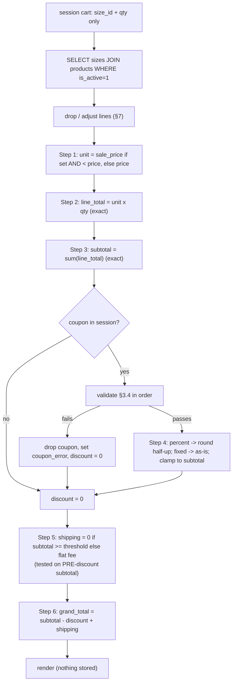

# 06a — Commerce: Pricing, Cart and Coupon Logic

This document is the money specification for Sky Fragrances. It defines where the cart
lives, what it is allowed to store, the exact ordered algorithm that turns a bag of
size ids and quantities into a grand total in PKR, the complete coupon rule set with
its validation order and customer-facing messages, how the free-shipping threshold and
its progress bar are computed, how shipping is priced and frozen onto an order, and
every edge case that could otherwise let a customer pay the wrong amount. The governing
principle throughout: **the browser is an input device, never a source of truth.** No
price, discount, shipping fee or total ever arrives from the client; all of them are
recomputed from the database on every render and recomputed a final time, inside a
transaction, at order placement. It is a specification — DDL, tables, numbered
algorithms and diagrams, not application code.

---

## 0. Contract notes and assumptions

**Schema names.** This document is written against the cross-stream naming contract in
`07-seed-seo-quality.md` §0.2: `products`, `product_sizes`, `coupons`, `settings`. Names
introduced here and owed to the schema stream are `orders`, `order_items` and
`coupon_redemptions` (§5.4, §3.7).

**Money type — one conflict resolved.** `03-storefront-pages.md` §1.4 says prices are
stored as unsigned integers in whole rupees. `07-seed-seo-quality.md` §0.2 and the
project constraints say `DECIMAL(10,2)`. **`DECIMAL(10,2)` wins**, everywhere, including
`orders` and `order_items`. Rationale: a percent coupon on an odd subtotal produces a
fractional intermediate, and DECIMAL lets the database itself carry that safely; the
`.00` costs nothing and display already drops decimals. Doc 03 §1.4's *display* rule
(`Rs. 4,950`, no decimals) is unchanged and correct.

**Arithmetic in PHP.** PHP has no decimal type and floats are forbidden near money.
The rule for this codebase:

1. Read DECIMAL columns from PDO as strings (PDO returns them as strings by default;
   `PDO::ATTR_STRINGIFY_FETCHES` is left at its default and `ATTR_EMULATE_PREPARES` is
   off — do not cast to float).
2. Do all arithmetic in **integer paisa** (`int`), obtained as
   `paisa = (int) round(((float) $decimalString) * 100)` once, at the boundary, on a
   value that came from the database and is therefore at most 8 integer digits — well
   inside 64-bit integer range.
3. Convert back to a DECIMAL string once, at the boundary, with
   `number_format($paisa / 100, 2, '.', '')`.
4. Never let a paisa value meet a float again after step 2.

Every "round" instruction below means: round the integer-paisa value half-up to a whole
rupee, i.e. to a multiple of 100 paisa.

**Currency.** PKR only. No multi-currency, no FX, no tax line. Pakistani retail prices
for this category are quoted inclusive of any applicable tax and the client does not
issue a tax invoice; a `tax_total` column is still written to `orders` as `0.00` so a
future tax rule does not require a migration.
Superseded by 08-decisions-register.md §2 — C-13: no `tax_total` column is written; `orders` carries `shipping_fee` and `cod_fee` (`0.00`), per 01b §1.1.

**Timezone.** All coupon window comparisons happen in `Asia/Karachi`. `date_default_timezone_set('Asia/Karachi')` is set in the bootstrap, and MySQL comparisons use a PHP-computed `Y-m-d H:i:s` bound as a parameter rather than `NOW()`, because shared-hosting MySQL is usually on UTC and MariaDB and MySQL differ on session timezone defaults.

---

## 1. The cart model

### 1.1 Where the cart lives — decision

**The cart lives in the PHP session. There is no `carts` database table.**

Justification, given this exact project:

- Checkout is **guest-only** (brief §5). There is no account to attach a persistent cart
  to, so a DB cart would be keyed by a cookie id that is exactly as durable as the
  session cookie — the same lifetime, with an extra table and an extra garbage-collection
  cron that shared hosting makes awkward.
- A DB cart's only real wins are cross-device resume and abandoned-cart email. Both need
  an identified customer. Neither is in scope for v1.
- The cart carries **no prices** (§1.3), so there is nothing valuable to persist and
  nothing that can go stale in storage — staleness is re-resolved on every render.
- Sessions on Hostinger shared hosting are files in the account's own tmp path. A cart of
  a handful of integers is a few hundred bytes. This is well within what the default
  handler handles.

Consequences accepted: the cart is lost when the session expires or the customer switches
device or browser. Mitigation: `session.gc_maxlifetime` is raised to **259200 seconds
(3 days)** and the session cookie is issued with a matching 3-day `Max-Age`, so a cart
survives a normal shopping gap. Because shared hosting runs a shared session GC that may
sweep on the default lifetime, the application writes its own session files into an
application-owned directory via `session_save_path()` (a non-web-readable
`/storage/sessions` with its own `.htaccess Require all denied`), so the host's GC of
`/tmp` cannot delete Sky Fragrances carts early.

Session cookie parameters: `HttpOnly`, `Secure`, `SameSite=Lax`, `path=/`. `Lax` (not
`Strict`) because a customer returning from a WhatsApp link must still see their cart.

### 1.2 Exact data shape

```
$_SESSION['cart'] = [
    'items'  => [                  // list, ordered by insertion (oldest first)
        ['size_id' => 14, 'qty' => 2],
        ['size_id' => 7,  'qty' => 1],
    ],
    'coupon_code' => 'WELCOME10',  // string|null — the CODE only, never an amount
    'updated_at'  => 1758790000,   // unix ts, for the "cart updated" notice in §7.7
];
```

That is the whole cart. Three keys. `items` is a list of `{size_id:int, qty:int}` pairs
and nothing else.

**Key by `product_sizes.id`, not by product id.** Each size has its own price, sale price,
SKU and stock (brief §3), so the size is the sellable unit. A product id in the cart would
be ambiguous. There is exactly one line per `size_id`; adding a size already present
increments its `qty` rather than appending a second line.

`coupon_code` stores the **code string**, uppercased and trimmed. It never stores the
coupon's id, type, value or the discount amount. Storing the code means the coupon is
re-validated and re-valued from `coupons` on every render, so an expired, exhausted or
admin-deactivated coupon cannot survive in a session.

### 1.3 What is never stored

The cart must never contain, in the session or in any client-visible place:

- a unit price, sale price, line total, subtotal, discount, shipping fee or grand total;
- a product name, size label, image path or stock number;
- a coupon type, value, or computed discount;
- a free-shipping flag or "amount remaining" figure.

All of those are **derived**. Anything derived that is stored is a bug waiting to become
a refund.

### 1.4 The re-pricing rule

> **The cart is re-priced from the database on every single render, and again — under a
> transaction with row locks — at order placement. A price is never carried between two
> requests.**

"Every render" means literally every one: the drawer, the `/cart` page, the header count
bubble, the `GET /api/cart` refresh, every `POST /api/cart/*` response, the checkout page
GET, and the checkout POST. There is one function that turns `$_SESSION['cart']` into a
priced cart structure and every one of those call sites uses it. There is no second path.

The priced structure returned by that function (in memory only, never stored) is:

```
[
  'lines' => [
      [ 'size_id', 'product_id', 'product_name', 'product_slug', 'size_label',
        'image', 'unit_price_paisa', 'compare_at_paisa'|null, 'qty',
        'line_total_paisa', 'stock', 'qty_adjusted'=>bool, 'in_stock'=>bool ],
      ...
  ],
  'removed'        => [ ['name'=>..., 'reason'=>'unavailable'|'deleted'], ... ],
  'subtotal_paisa' => int,
  'coupon'         => null | ['code','type','value','discount_paisa'],
  'coupon_error'   => null | string,   // customer-facing, from §3.5
  'discount_paisa' => int,
  'shipping_paisa' => int,
  'free_shipping'  => bool,
  'threshold_paisa'=> int,
  'remaining_paisa'=> int,             // for the progress bar, §4.3
  'grand_total_paisa' => int,
  'item_count'     => int,             // sum of qty, for the header bubble
]
```

---

## 2. The pricing pipeline

### 2.1 The one query

Re-pricing starts with a single query over the session's size ids. Anything not returned
by this query is no longer purchasable and is handled by §7.

```sql
SELECT  ps.id            AS size_id,
        ps.product_id,
        ps.size_label,
        ps.price,
        ps.sale_price,
        ps.stock,
        p.name           AS product_name,
        p.slug           AS product_slug,
        p.is_active
FROM    product_sizes ps
JOIN    products p ON p.id = ps.product_id
WHERE   ps.id IN (:ids)          -- bound individually, never interpolated
  AND   p.is_active = 1;
```

Results are re-ordered in PHP to match the session's insertion order; the SQL order is
not relied upon.

### 2.2 The ordered algorithm

Every step below is server-side. Steps are executed in this order and no other.

> Confirmed by 08-decisions-register.md §2.4 — C-43: this algorithm is implemented **once**, as `cart_price(array $lines, ?array $coupon, array $settings, string $now): array` in `app/lib/cart.php`, and called from every cart/drawer/checkout render **and** from inside the order transaction on the `FOR UPDATE`-locked rows (§5.3 step 2). 06b §1.4 steps 3–8, which re-implemented pricing inline with a post-discount shipping test and paisa rounding, are struck. `$now` is always bound from PHP in Asia/Karachi (§0).

**Step 1 — Unit price.**
```
if sale_price IS NOT NULL AND sale_price > 0 AND sale_price < price:
        unit_price = sale_price
        compare_at = price          # shown struck through
else:
        unit_price = price
        compare_at = null
```
`sale_price` is only honoured when it is strictly **lower** than `price`. A sale price
equal to or above the price is a data-entry mistake and is ignored rather than trusted —
the admin panel also blocks it, but the storefront does not depend on that.

Rounding: **none.** `price` and `sale_price` are already whole-rupee DECIMALs written by
the admin. They are converted to paisa (always a multiple of 100) and used as-is.

**Step 2 — Line total.**
```
line_total = unit_price_paisa * qty        # integer multiply, exact
```
Rounding: **none, and rounding here would be wrong.** Both operands are exact integers.

**Step 3 — Subtotal.**
```
subtotal = Σ line_total   over all in-stock, purchasable lines
```
Rounding: **none.** A sum of exact integers is exact. Lines removed by §7 contribute
nothing. `subtotal` is the number the free-shipping threshold and the coupon minimum are
both tested against (§3, §4).

**Step 4 — Coupon discount.** Only after the subtotal exists. Only if a coupon is present
and passes every check in §3.4.

```
if coupon.type == 'percent':
        raw      = subtotal * coupon.value        # value is 1..100, integer percent
        discount = round_half_up_to_rupee(raw / 100)
else:                                             # 'fixed'
        discount = coupon.value_in_paisa          # already whole rupees

discount = min(discount, subtotal)                # clamp — see §2.4
```
Rounding: **this is the only place rounding occurs in the whole pipeline.** The percent
branch rounds half-up to the nearest whole rupee. Worked example: subtotal
`Rs. 4,955.00` = 495500 paisa, coupon 10% → raw 4955000, /100 = 49550 paisa = `Rs. 495.50`
→ rounds to 49600 paisa = **`Rs. 496`**. The customer is never shown a paisa figure and
never charged one.

Rounding direction is **half-up on the discount**, which rounds in the customer's favour
on a tie. This is deliberate: a customer disputing a two-rupee rounding costs more in
WhatsApp minutes than it saves.

**Step 5 — Shipping.** Computed after the discount, but tested against the **pre-discount**
subtotal (§4.1).
```
if subtotal == 0:            shipping = 0        # empty cart shows no shipping line
elif subtotal >= threshold:  shipping = 0;  free_shipping = true
else:                        shipping = settings.shipping_fee
```
Rounding: **none.** Both values are whole-rupee settings.

**Step 6 — Grand total.**
```
grand_total = subtotal - discount + shipping
```
Rounding: **none** — every input is already a whole-rupee integer. Because `discount` was
clamped at step 4, `subtotal - discount >= 0`, so `grand_total >= shipping >= 0`.

### 2.3 Pipeline diagram



### 2.4 What the coupon applies to — the three explicit answers

1. **Does a percent coupon touch shipping?** **No.** A percent coupon is computed on the
   merchandise subtotal only. Shipping is added after the discount and is never
   discounted. A customer with a 10% coupon and a `Rs. 250` delivery fee pays 10% off the
   goods plus the full `Rs. 250`. Reason: the shipping fee is a real courier cost the
   client pays out of pocket; discounting it turns a margin promotion into a cash loss.
   The *free-shipping threshold* is the only mechanism that ever zeroes shipping.
2. **Does a fixed coupon exceeding the subtotal clamp to the subtotal?** **Yes.**
   `discount = min(discount, subtotal)`. A `Rs. 1,000` coupon on a `Rs. 600` cart
   discounts `Rs. 600`. It does not pay for shipping, and the remainder is not carried
   forward or refunded — there is no store credit in v1.
3. **Can the total go below zero?** **No, and it is structurally impossible**, not merely
   checked: the clamp at step 4 makes `subtotal - discount >= 0`, and shipping is never
   negative. The order-placement path additionally asserts `grand_total_paisa >= 0` and
   aborts the transaction with a `500` if it is not, because a negative total means the
   pipeline has been altered incorrectly and no order should be written.

---

## 3. Coupons

### 3.1 The coupon record

Per the §0.2 contract, extended with the columns this logic needs. Portable DDL —
`utf8mb4_unicode_ci`, no functional defaults, runs on MySQL 8+ and MariaDB 10.4+.

```sql
CREATE TABLE coupons (
  id              INT UNSIGNED NOT NULL AUTO_INCREMENT,
  code            VARCHAR(40)  NOT NULL,
  type            VARCHAR(10)  NOT NULL,            -- 'percent' | 'fixed'
  value           DECIMAL(10,2) NOT NULL,           -- percent: 1..100 ; fixed: PKR
  min_order_total DECIMAL(10,2) NOT NULL DEFAULT '0.00',
  usage_limit     INT UNSIGNED NULL,                -- NULL = unlimited
  used_count      INT UNSIGNED NOT NULL DEFAULT 0,
  per_phone_limit INT UNSIGNED NULL,                -- NULL = unlimited
  starts_at       DATETIME     NULL,                -- NULL = active since forever
  expires_at      DATETIME     NULL,                -- NULL = never expires
  is_active       TINYINT(1)   NOT NULL DEFAULT 1,
  created_at      DATETIME     NOT NULL,
  PRIMARY KEY (id),
  UNIQUE KEY uq_coupons_code (code)
) ENGINE=InnoDB DEFAULT CHARSET=utf8mb4 COLLATE=utf8mb4_unicode_ci;
```

`code` is stored **uppercase**. Input is `strtoupper(trim($input))` before lookup, and the
unique index plus a case-insensitive collation means `welcome10`, `Welcome10` and
` WELCOME10 ` all resolve to the same row. Codes are restricted to `A-Z0-9-` by the admin
panel; the storefront rejects anything longer than 40 characters before it reaches the
database.

`per_phone_limit` is the new column this document adds to the §0.2 contract, together with
the redemption ledger in §3.7 that makes it enforceable.

### 3.2 Percent vs fixed

- `type = 'percent'` — `value` is an integer percentage `1..100`, applied to the subtotal
  per §2.2 step 4. `value = 100` is legal and yields a free-goods order (shipping still
  charged unless the threshold is met).
- `type = 'fixed'` — `value` is a whole-rupee PKR amount, clamped to the subtotal.

No other type exists in v1. No free-shipping coupon type, no buy-X-get-Y, no
product-scoped or collection-scoped coupons. If the client asks for a free-shipping code,
the answer is a `fixed` coupon equal to the shipping fee — which is not the same thing and
should be said out loud rather than quietly approximated.

### 3.3 Stacking — decision

**Coupons do not stack. Exactly one coupon code may be applied to a cart.** The session
holds a single `coupon_code` string, so the data model itself forbids a second.

Applying a code while one is already applied **replaces** it, and the UI says so:
*"WELCOME10 was replaced by SKY500."* This is friendlier than an error and matches what
customers expect from every Pakistani storefront they already use. Stacking is refused
because two percent coupons compound in ways the client cannot reason about, and because
the ordering of a percent-then-fixed pair changes the total — a business decision that has
no obviously right answer and would be made accidentally by whoever wrote the loop.

### 3.4 Validation order

Validation runs on **every render** of the cart, the drawer and the checkout page, and
again at order placement. It is not a one-time check at apply-time. The order below is
fixed, because the first failure is the message shown and the sequence determines which
message a customer sees when two things are wrong at once. The sequence goes from "this
code is not a thing" to "this code is a thing but not for this cart", because a customer
who mistyped should never be told about a minimum order value.

| # | Check | Condition to pass | Message key |
|---|---|---|---|
| 1 | Format | non-empty after trim, ≤ 40 chars, matches `^[A-Z0-9-]{1,40}$` | `invalid` |
| 2 | Exists | a `coupons` row with this `code` | `invalid` |
| 3 | Active | `is_active = 1` | `invalid` |
| 4 | Started | `starts_at IS NULL OR starts_at <= now` | `not_started` → returned to the customer as `invalid` (08 C-66: a scheduled launch code must not be confirmable before it starts) |
| 5 | Not expired | `expires_at IS NULL OR expires_at >= now` | `expired` |
| 6 | Global limit | `usage_limit IS NULL OR used_count < usage_limit` | `exhausted` |
| 7 | Cart not empty | at least one purchasable line | `empty_cart` |
| 8 | Minimum order | `subtotal >= min_order_total` | `below_min` |
| 9 | Per-phone limit | checkout only — see §3.6 | `phone_limit` |
| 10 | Produces a discount | computed `discount > 0` | `no_effect` |

Checks 1–8 and 10 run on every cart render. Check 9 needs a phone number and therefore
runs only at the checkout POST, where a phone has been entered.

`POST /api/cart/coupon` is rate-limited in `rate_limits` bucket `coupon`, subject `ip_hash`: 10 attempts per hour and 50 per 24 hours (08 C-66); over the limit the response is the `invalid` message. Per-session limits (03 §7.7) are struck — a session is a cookie a guesser discards.

A deactivated coupon (check 3) deliberately returns the same message as a non-existent one.
Distinguishing them tells a code-guesser that they found a real code.

### 3.5 Customer-facing messages

Exact strings. Sentence case, no exclamation marks, no blame. `{x}` placeholders are
filled server-side and the amount uses the `Rs. 4,950` helper.

| Key | Message |
|---|---|
| `invalid` | `That code isn't valid. Please check the spelling and try again.` |
| `not_started` | `This code isn't active yet. It starts on {date}.` |
| `expired` | `This code expired on {date}.` |
| `exhausted` | `This code has reached its usage limit.` |
| `empty_cart` | `Add something to your cart before applying a code.` |
| `below_min` | `This code needs a minimum order of {min}. Add {shortfall} more to use it.` |
| `phone_limit` | `This code has already been used with this phone number.` |
| `no_effect` | `This code doesn't change your total.` |
| `replaced` | `{old} was replaced by {new}.` |
| `dropped` | `{code} is no longer valid and has been removed from your order. Your total has been updated.` |
| `applied` | `{code} applied — you saved {amount}.` |

`below_min` computes `shortfall = min_order_total - subtotal` server-side, which turns a
rejection into an upsell; this is the single highest-value message on the list.

### 3.6 Per-phone limit

> Superseded by 08-decisions-register.md §2 — C-14: the per-phone key is `coupon_redemptions.phone_normalized` (`+92XXXXXXXXXX`, 01b §1.1) — one shared `phone_normalize()` helper, no hash.

A guest checkout has no account, so the only identity available is the phone number the
customer types. `per_phone_limit` is enforced against the normalised phone.

Normalisation (one helper, used by orders, tracking and this check): strip everything but
digits; drop a leading `0`; drop a leading `92`; the remaining 10 digits are the canonical
form (`3001234567`). `0300 123 4567`, `+92 300 1234567` and `03001234567` all normalise
identically, which is the whole point — otherwise the limit is defeated by a space.

At the checkout POST, with the normalised phone in hand:

```sql
SELECT COUNT(*) FROM coupon_redemptions
WHERE coupon_id = :coupon_id AND phone_normalised = :phone;
```

If that count `>= per_phone_limit`, the coupon fails check 9 and the order is re-priced
without it (§3.8).

> Amended by 08-decisions-register.md §2.4 — C-44: the count is `... AND status = 'applied'` on the 01b §6 columns (`phone_normalized`), and it runs **inside the transaction after the coupon row is locked `FOR UPDATE`** (06b §1.5 step 5a), so two concurrent checkouts with the same phone cannot both redeem a 1-per-phone code. The ledger is the only per-phone check; it is never used for the global limit.

This is honest about its own limit: a determined customer with two SIMs defeats it. It
exists to stop the ordinary case — one person reusing a welcome code weekly — not fraud.

### 3.7 The redemption ledger

`used_count` alone cannot answer "has this phone used this code", and incrementing a
counter is not an audit trail the client can inspect when a customer disputes a discount.

```sql
CREATE TABLE coupon_redemptions (
  id               INT UNSIGNED NOT NULL AUTO_INCREMENT,
  coupon_id        INT UNSIGNED NOT NULL,
  order_id         INT UNSIGNED NOT NULL,
  code             VARCHAR(40)  NOT NULL,      -- denormalised, survives coupon deletion
  phone_normalised VARCHAR(20)  NOT NULL,
  discount_amount  DECIMAL(10,2) NOT NULL,
  created_at       DATETIME     NOT NULL,
  PRIMARY KEY (id),
  UNIQUE KEY uq_redemption_order (order_id),
  KEY idx_redemption_coupon_phone (coupon_id, phone_normalised)
) ENGINE=InnoDB DEFAULT CHARSET=utf8mb4 COLLATE=utf8mb4_unicode_ci;
```

A row is inserted, and `coupons.used_count` incremented, in the **same transaction** that
writes the order (§5.3). `uq_redemption_order` makes double-counting impossible even if the
checkout POST is submitted twice.

**Cancellation.** When an admin cancels an order, stock is restored (brief §Admin/Orders)
and the redemption is released: the `coupon_redemptions` row is deleted and `used_count` is
decremented with a floor (`used_count = GREATEST(used_count - 1, 0)`), in the same
transaction as the stock restore. Without this, a cancelled order permanently consumes a
limited code.
> Superseded by 08-decisions-register.md §2.4 — C-44: the row is **not deleted** — it is set to `status = 'reverted'` (01b §6) so the audit trail survives; `used_count` is decremented with the same floor, in the same transaction as the cancel. A reverted row no longer counts toward the per-phone limit.

### 3.8 When a coupon dies between cart and checkout

This is the case that quietly loses money, because the customer saw a discount on one
screen and it must not silently persist into the order.

The rule: **the coupon is never carried; it is re-validated on every render and at
placement. If it fails, it is dropped, the cart is re-priced without it, and the customer
is told before they can submit.**

Concretely:

1. On any cart/drawer/checkout **render** where validation fails, the session's
   `coupon_code` is set to `null`, the priced structure carries `coupon_error`, and the
   page shows the `dropped` message in the totals block, highlighted, with the new total
   already displayed. The customer cannot see a stale total.
2. On the checkout **POST**, validation runs again inside the transaction (§5.3). If it
   fails there, the transaction is **rolled back, no order is written**, and the customer
   is returned to `/checkout` with their form input repopulated and the `dropped` message
   at the top of the summary. They must press *Place Order* again against the new total.
   Re-showing a form is annoying; charging a total the customer did not agree to is worse,
   and taking an order at a discount the client did not authorise is worse still.
3. The limited-code race (two customers, one remaining use) is resolved by the row lock in
   §5.3, not by hope: the loser is told `exhausted` and re-prices.

---

## 4. Free shipping and the progress bar

### 4.1 Pre-discount or post-discount — decision

**The free-shipping threshold is tested against the PRE-discount subtotal** (§2.2 step 3),
i.e. the merchandise total before any coupon.

Justification:

- It is the number the progress bar was showing while the customer filled the cart. If a
  coupon could push them back below the line, applying a discount would *add* `Rs. 250` to
  the total in the same keystroke — the discount appears to cost money. That interaction
  generates complaints and cancelled orders.
- It makes the bar monotonic: the bar only ever moves forward as items are added, and a
  coupon never moves it backwards. The customer's mental model stays intact.
- The client's cost logic is about parcel value and courier economics, which are driven by
  what is in the box, not by what was discounted off it.
- The abuse case (a big coupon on a threshold-grazing cart) is bounded by one shipping fee
  per order and is far cheaper than the support cost of the alternative.

Worked example, threshold `Rs. 5,000`, fee `Rs. 250`, coupon `WELCOME10` (10%):
subtotal `Rs. 5,200` → threshold met on the pre-discount figure → shipping `Rs. 0`;
discount `Rs. 520`; grand total **`Rs. 4,680`**. Under a post-discount rule the same cart
would total `Rs. 4,930` and the customer would watch their coupon make things worse.

### 4.2 Settings keys

Read from `settings` (`setting_key` / `setting_value`), both whole-rupee strings:

| Key | Group | Meaning | Seed |
|---|---|---|---|
| `shipping_fee` | `shipping` | Flat nationwide delivery fee in PKR | `250` |
| `free_shipping_threshold` | `shipping` | Subtotal at or above which shipping is `0` | `5000` → **`3000`** (08 §1.4, C-43; the Rs. 5,000 in the §4.1 worked example is illustrative only) |

Both are read once per request into the settings cache. A missing, non-numeric or negative
value falls back to the seed constant rather than to `0` — a `shipping_fee` that silently
becomes free because someone cleared a field is a real loss, whereas a fallback is visible
and fixable. `free_shipping_threshold = 0` is meaningful and honoured: it means shipping is
always free, and the progress bar is hidden entirely.

### 4.3 The progress bar maths

All computed server-side and rendered into the HTML; the JS only re-renders from the
`GET /api/cart` JSON, using the same server-computed numbers.

```
threshold   = settings.free_shipping_threshold   (paisa)
subtotal    = §2.2 step 3                        (paisa, PRE-discount)

if threshold <= 0:            hide the bar entirely
elif subtotal >= threshold:   percent = 100 ; message = "You've unlocked free delivery."
else:
    remaining = threshold - subtotal
    percent   = floor(subtotal * 100 / threshold)     # integer, 0..99
    percent   = max(percent, 2) when subtotal > 0     # a sliver of gold is visible
    message   = "You're {remaining} away from free delivery."
```

`{remaining}` uses the `Rs. 4,950` helper. `percent` is clamped to `0..100` and used as a
CSS width; it is never allowed to exceed 100 even if the numbers are absurd. `floor` (not
round) is used so the bar never reads 100% while the fee is still charged — a full bar next
to a delivery charge is the single most reported bug in this pattern.

The bar appears in the cart drawer and on `/cart`. On the checkout page it is **not**
shown: the customer has finished adding items, and inviting them back to the shop mid-
checkout costs more orders than it adds items.

---

## 5. Shipping and how it is frozen onto the order

### 5.1 Does the city affect the fee — decision

**No. One flat nationwide fee.** The recommendation is the simple answer and it is the
right one here: the client's own copy promises "COD nationwide" (brief §1), the courier
rate the client actually pays is negotiated per-parcel not per-city, and a city-rate table
means a `cities` table, an admin CRUD screen, a matching-by-typed-city problem (Karachi /
karachi / Karachi City), and a checkout that recomputes shipping when a dropdown changes.
That is a meaningful amount of surface area for a fee difference the client does not
currently charge. City remains a free-text-with-datalist field captured on the order for
the courier's benefit only; it has **no** effect on any number.

If the client later wants zone pricing, the extension point is a `shipping_zones` table and
one branch in §2.2 step 5. Nothing else in this document changes.

### 5.2 Storage on the order

Every money figure is **frozen** onto the order at placement. An order is a historical
record and must render identically in two years, after prices have changed, the coupon has
been deleted and the shipping fee has been raised.

```sql
CREATE TABLE orders (
  id               INT UNSIGNED NOT NULL AUTO_INCREMENT,
  order_number     VARCHAR(20)  NOT NULL,
  -- customer, address, payment and status columns: see doc 06
  subtotal         DECIMAL(10,2) NOT NULL,
  discount_total   DECIMAL(10,2) NOT NULL DEFAULT '0.00',
  coupon_code      VARCHAR(40)  NULL,
  shipping_fee     DECIMAL(10,2) NOT NULL DEFAULT '0.00',   -- 08 C-13: was shipping_total; shipping_is_free and tax_total removed (fee 0.00 = free)
  cod_fee          DECIMAL(10,2) NOT NULL DEFAULT '0.00',
  grand_total      DECIMAL(10,2) NOT NULL,
  created_at       DATETIME     NOT NULL,
  PRIMARY KEY (id),
  UNIQUE KEY uq_orders_number (order_number)
) ENGINE=InnoDB DEFAULT CHARSET=utf8mb4 COLLATE=utf8mb4_unicode_ci;

CREATE TABLE order_items (
  id            INT UNSIGNED NOT NULL AUTO_INCREMENT,
  order_id      INT UNSIGNED NOT NULL,
  product_id    INT UNSIGNED NULL,     -- nullable: product may be deleted later
  size_id       INT UNSIGNED NULL,
  product_name  VARCHAR(160) NOT NULL, -- frozen copy
  size_label    VARCHAR(40)  NOT NULL, -- frozen copy
  sku           VARCHAR(60)  NULL,     -- frozen copy
  unit_price    DECIMAL(10,2) NOT NULL,
  compare_at    DECIMAL(10,2) NULL,
  qty           SMALLINT UNSIGNED NOT NULL,
  line_total    DECIMAL(10,2) NOT NULL,
  PRIMARY KEY (id),
  KEY idx_order_items_order (order_id)
) ENGINE=InnoDB DEFAULT CHARSET=utf8mb4 COLLATE=utf8mb4_unicode_ci;
```

`shipping_is_free` is stored as its own flag rather than inferred from
`shipping_total = 0`, so the invoice can print *"Free delivery"* instead of *"Rs. 0"*, and
(Superseded by 08-decisions-register.md §2 — C-13: no flag; the invoice prints "Free delivery" when `shipping_fee = 0.00`. The invariant is `grand_total = subtotal - discount_total + shipping_fee + cod_fee`.)
so a future waived-fee case is distinguishable from a threshold-met case.

Invariant checked before commit and asserted by any reporting query:
`grand_total = subtotal - discount_total + shipping_total + tax_total`, and
`subtotal = SUM(order_items.line_total)`.

### 5.3 Order placement transaction

> Confirmed by 08-decisions-register.md §2.4 — C-43 / C-44: this is the canonical placement sequence; 06b §1.5 supplies the statement-level detail (order number retry, idempotency replay, lock ordering) and 06b §1.5 step 5a the per-phone check. Step 4 applies to **every** difference, favourable or not, and to quantity clamps.

```
BEGIN
 1. SELECT ... FROM product_sizes ps JOIN products p ...
    WHERE ps.id IN (:ids) FOR UPDATE            -- locks the rows being sold
 2. Re-run the FULL §2.2 pipeline on the locked rows.
 3. Re-run the FULL §3.4 validation, including check 9 (per-phone) and a
    SELECT ... FROM coupons WHERE id = :id FOR UPDATE.
 4. If any line vanished, any qty had to be reduced, the coupon was dropped,
    or grand_total differs from the total last rendered to this customer
    (carried as a signed re-price token, §6.2)  ->  ROLLBACK and return to
    /checkout with the §7.7 notice. No order is written.
 5. UPDATE product_sizes SET stock = stock - :qty
    WHERE id = :size_id AND stock >= :qty       -- affected rows MUST be 1
 6. INSERT orders, INSERT order_items (frozen copies)
 7. INSERT coupon_redemptions ; UPDATE coupons SET used_count = used_count + 1
    WHERE id = :id AND (usage_limit IS NULL OR used_count < usage_limit)
    -- affected rows MUST be 1, else ROLLBACK with `exhausted`
COMMIT
then: clear $_SESSION['cart'], regenerate the session id, redirect 303 to /order/{number}
```

`FOR UPDATE` and the `stock >= :qty` guard are what make oversell impossible under two
simultaneous checkouts; the affected-rows assertions are what make the guard meaningful.
The `303` redirect plus the cleared cart makes a browser refresh harmless.

---

## 6. Every path a client number could take, and its block

| # | Path a number could arrive on | Rule that stops it |
|---|---|---|
| 1 | `POST /api/cart/add` body containing `price`, `unit_price` or `total` | The handler reads **only** `size_id` and `qty`. Unknown keys are ignored, never merged, never logged into the session. |
| 2 | A hidden `<input name="price">` in the cart or checkout form | No price input exists in any form. The checkout POST reads only customer fields, `payment_method`, `notes` and the CSRF token. Totals come from the session cart re-priced server-side. |
| 3 | A tampered `size_id` pointing at a cheaper size of another product | Legitimate: the customer simply bought that size. Price always follows the id, so there is nothing to exploit — the pipeline resolves `size_id -> price` from the DB. |
| 4 | A `size_id` for an inactive or deleted product | The §2.1 query's `p.is_active = 1` and the `JOIN` exclude it; the line is dropped by §7.4/§7.5. |
| 5 | Negative or zero `qty` in the add/update payload | §7.2 — coerced via `(int)`, then `qty < 1` deletes the line. |
| 6 | Enormous `qty` (`99999`) | §7.3 — clamped to `min(10, stock)` before anything is priced. |
| 7 | A discount amount posted with the coupon | `POST /api/cart/coupon` reads only `code` (and an `action=remove`). There is no field in which an amount could be sent. |
| 8 | A coupon code applied by direct POST, bypassing the UI | Irrelevant — the UI is not the validator. §3.4 runs server-side on the same handler. |
| 9 | Editing the displayed grand total in DevTools, then submitting | The submitted total is not read. §5.3 recomputes and writes its own figure. |
| 10 | Replaying an old checkout POST after a price rise | §6.2 re-price token mismatch → rollback → §7.7 notice. |
| 11 | A shipping fee or `free_shipping` flag posted from the client | Never read. Shipping is derived at §2.2 step 5 from settings alone. |
| 12 | Currency or locale parameters in the query string | No such parameter is routed. PKR is a constant. |
| 13 | Two tabs, two carts, one session | The session is the single cart; the last write wins and every render re-prices, so the two tabs converge on the next refresh. |
| 14 | Double-submitted checkout (double-click, refresh) | Idempotency: `uq_redemption_order`, the `303` redirect, the cleared cart, and a one-shot submit token in the session. |

**§6.2 — the re-price token.** The checkout page renders a hidden token
`hash_hmac('sha256', grand_total_paisa . '|' . item_fingerprint, APP_SECRET)` where
`item_fingerprint` is the sorted `size_id:qty` list. It is **not** a price the server
trusts — the server recomputes the total regardless. It exists solely so §5.3 step 4 can
detect *"the number this customer agreed to is not the number I just computed"* and show
the §7.7 notice instead of silently charging a different amount.

---

## 7. Edge cases

**7.1 Empty cart.** Subtotal `0`, discount `0`, shipping `0` (not the flat fee), grand total
`0`. The progress bar is hidden. `/cart` renders the empty state with a *Shop All* CTA.
`/checkout` is not reachable: a GET with an empty cart `302`s to `/cart` with the notice
*"Your cart is empty."* A coupon cannot be applied (check 7 → `empty_cart`).

**7.2 Quantity zero or negative.** `qty` is coerced with `(int)`; non-numeric input becomes
`0`. Any `qty < 1` after coercion **removes the line** rather than erroring — that is what
a customer typing `0` into a quantity box means. `POST /api/cart/update` with `qty=0` is the
documented way the UI removes a line.

**7.3 Absurd quantities.** `qty` is clamped to `MAX_QTY_PER_LINE = 10` and then to the
current `stock`, whichever is lower, before pricing. When the clamp bites, the line is
flagged `qty_adjusted` and the customer sees *"Only {n} left — we've updated your
quantity."* The 10-unit cap is a retail-fraud and stock-hoarding guard; a genuine bulk
buyer is directed to the WhatsApp button, which is the client's preferred channel anyway.
A cart is also capped at `MAX_LINES = 20` (08 C-39; was 30); further adds are refused with *"Your cart is
full."*

**7.4 A size deleted mid-session.** Its `size_id` is not returned by §2.1. The line is
dropped, added to `removed` with reason `deleted`, and the customer sees *"{product} ({size})
is no longer available and has been removed from your cart."* The cart re-prices without it;
this may drop the subtotal below a coupon minimum or below the free-shipping threshold, and
both of those consequences are shown in the same render.

**7.5 A product deactivated mid-session.** Identical handling — `p.is_active = 1` excludes
every size of that product. All its lines are dropped with reason `unavailable` and one
message per product (not per size). An admin hiding a product mid-session is a normal
operation, not an error, and it must never result in an order for a hidden product.

**7.6 A size that went out of stock.** The row still exists but `stock = 0`. The line is
kept and shown greyed with a `SOLD OUT` tag, is **excluded from the subtotal**, and blocks
checkout: the *Place Order* button is disabled with *"Remove the sold-out items to
continue."* Silently deleting an item the customer chose is worse than making them
acknowledge it.

**7.7 A price changed between add-to-cart and checkout.** Because nothing is stored, the new
price is simply what the pipeline computes — the customer is never shown a stale figure on
any render. The only moment worth a message is the checkout POST, where the customer
consented to a specific total:

- **§5.3 step 4 detects the mismatch and rolls back. No order is written.**
- The customer is returned to `/checkout`, form fields repopulated, with a highlighted
  notice at the top of the order summary:
  *"Some prices in your cart have changed. Your new total is Rs. 5,450 (was Rs. 5,950).
  Please review your order and place it again."*
- The changed lines are marked in the summary with the old price struck through beside the
  new one, so the customer can see exactly what moved.
- Direction is not special-cased: a price **drop** produces the same notice and the same
  re-confirmation. Quietly charging less is still charging a total the customer did not see,
  and the client would rather explain a discount than discover one in the ledger.
- The customer pressing *Place Order* a second time proceeds normally against the new total.

---

## 8. What other streams owe this document

1. **Schema stream** — add `coupons.per_phone_limit`, create `coupon_redemptions`, and use
   `DECIMAL(10,2)` for every money column in `orders` and `order_items` (§0, §3.1, §3.7).
2. **Storefront stream** — doc 03 §1.4's "unsigned integers in whole rupees" is superseded
   by `DECIMAL(10,2)`; the *display* rule is unchanged.
3. **Checkout stream (doc 06)** — owns the customer, address, payment-method and status
   columns of `orders`; this document owns only the money columns and the transaction shape
   in §5.3.
4. **Admin stream** — order cancellation must release the redemption and decrement
   `used_count` with a floor, in the same transaction as the stock restore (§3.7).
5. **Settings stream** — `shipping_fee` and `free_shipping_threshold` in group `shipping`,
   with the fallback behaviour in §4.2.
