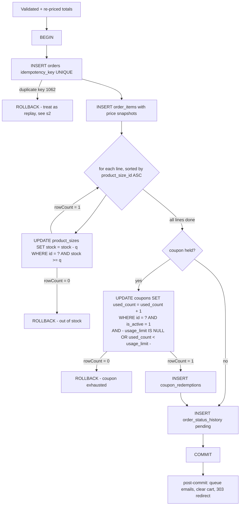
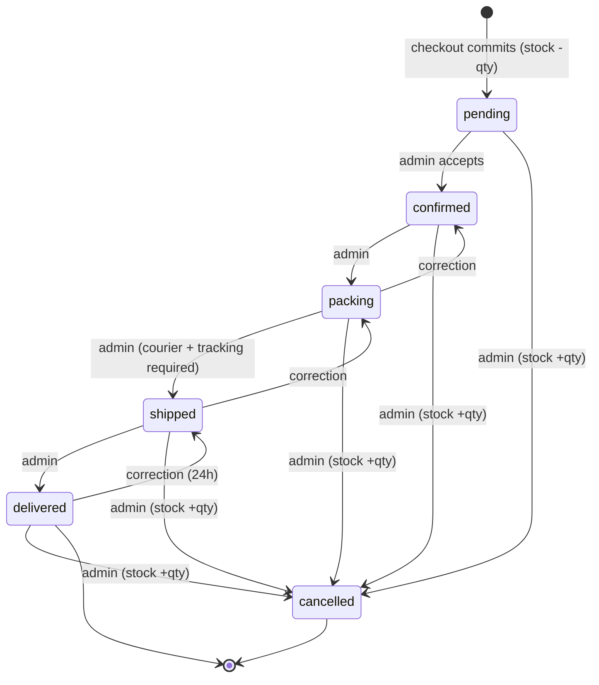

# 06b — Commerce: Order Placement, State Machine, Payments & Email

**Sky Fragrances — skyfragrances.com**
Status: specification. No application code. DDL, route tables, numbered algorithms and
diagrams only.

This document owns everything that happens between the moment a guest presses **Place
Order** and the moment that order reaches a terminal state. It specifies the placement
transaction (validation, server-side re-pricing, stock decrement, coupon redemption,
rollback), the idempotency mechanism that survives a double-tap on a Pakistani mobile
connection, the six-state order lifecycle and its transition rules, both payment
families (Cash on Delivery and manual Bank/JazzCash/Easypaisa with proof upload), every
transactional email, the security model for the public track-order lookup, and the
abuse and race-condition cases that a single-server shared-hosting deployment must
still get right. Companion documents: `00-brief.md` (source of truth),
`03-storefront-pages.md` (routes 17–22 and the money/display conventions),
`07-seed-seo-quality.md` §0.2 (the cross-stream naming contract).

---

## 0. Contracts this document inherits and adds

### 0.1 Inherited, unchanged

- Plain PHP 8.2 + PDO, no Composer, no Node, no build step, no framework.
- MySQL 8+ **and** MariaDB 10.4+. Every table below is
  `ENGINE=InnoDB DEFAULT CHARSET=utf8mb4 COLLATE=utf8mb4_unicode_ci`.
  No `utf8mb4_0900_ai_ci`, no functional defaults, no `JSON_TABLE`, no CTEs,
  no `RETURNING`.
- Enumerations are short `VARCHAR` strings, never MySQL `ENUM`.
- Money is `DECIMAL(10,2)` PKR, displayed `Rs. 4,950`.
- Table and column names from `07-seed-seo-quality.md` §0.2 are used verbatim:
  `products`, `product_sizes`, `coupons(code, type, value, min_order_total,
  usage_limit, used_count, starts_at, expires_at, is_active)`, `settings(setting_key,
  setting_value, setting_group)`.

**One inherited conflict, resolved here.** `03-storefront-pages.md` §1.4 says prices are
stored as unsigned integers in whole rupees; `07-seed-seo-quality.md` §0.2 and the
project constraints say `DECIMAL(10,2)`. **`DECIMAL(10,2)` wins.** Every money column in
this document is `DECIMAL(10,2) NOT NULL`. The display helper still renders zero
decimals, so nothing visible changes. This must be reflected back into doc 03 §1.4.

### 0.2 Schema this document requires (new cross-stream contract)

> Superseded by 08-decisions-register.md §2 — C-07/C-08/C-09/C-14/C-16/C-17: `orders` is 01b as amended (08 §2.3): read `phone_hash`→`phone_normalized`, `notes`→`customer_note`, `placed_at`→`created_at`, `courier_name`/`tracking_number` unchanged, `cod_fee`/`item_count`/`source` present. `order_payment_proofs`→`payment_proofs` (01b §5.1 name, keyed on `order_id`, keeping this document's review columns). `coupon_redemptions` uses the 01b §6 columns (`amount`→`discount_amount`, `phone_hash`→`phone_normalized`, plus `order_subtotal`, `status`). `payment_status` `awaiting_verification`→`awaiting_verification`. `email_outbox` and `rate_limits` as defined here ARE canonical.

Order storage is not defined in doc 03 or doc 07. These names are a **requirement this
document places on the schema stream**; if the schema stream has already chosen other
names, the schema wins and everything below is renamed to match.

```sql
CREATE TABLE orders (
  id                 INT UNSIGNED NOT NULL AUTO_INCREMENT,
  order_number       VARCHAR(20)  NOT NULL,
  access_token       CHAR(32)     NOT NULL,
  idempotency_key    CHAR(32)     NOT NULL,
  status             VARCHAR(20)  NOT NULL DEFAULT 'pending',
  payment_method     VARCHAR(20)  NOT NULL,
  payment_status     VARCHAR(20)  NOT NULL DEFAULT 'unpaid',
  customer_name      VARCHAR(120) NOT NULL,
  customer_phone     VARCHAR(20)  NOT NULL,
  phone_hash         CHAR(64)     NOT NULL,
  customer_email     VARCHAR(190)     NULL,
  city               VARCHAR(80)  NOT NULL,
  address            VARCHAR(500) NOT NULL,
  notes              VARCHAR(500)     NULL,
  subtotal           DECIMAL(10,2) NOT NULL,
  discount_total     DECIMAL(10,2) NOT NULL DEFAULT 0.00,
  shipping_fee       DECIMAL(10,2) NOT NULL DEFAULT 0.00,
  grand_total        DECIMAL(10,2) NOT NULL,
  coupon_id          INT UNSIGNED     NULL,
  coupon_code        VARCHAR(40)      NULL,
  courier_name       VARCHAR(80)      NULL,
  tracking_number    VARCHAR(80)      NULL,
  stock_committed    TINYINT(1)   NOT NULL DEFAULT 1,
  ip_hash            CHAR(64)     NOT NULL,
  user_agent         VARCHAR(255)     NULL,
  placed_at          DATETIME     NOT NULL,
  paid_at            DATETIME         NULL,
  cancelled_at       DATETIME         NULL,
  cancel_reason      VARCHAR(255)     NULL,
  updated_at         DATETIME     NOT NULL,
  PRIMARY KEY (id),
  UNIQUE KEY uq_orders_number (order_number),
  UNIQUE KEY uq_orders_idem (idempotency_key),
  KEY ix_orders_status_placed (status, placed_at),
  KEY ix_orders_phone (phone_hash),
  KEY ix_orders_ip_placed (ip_hash, placed_at)
) ENGINE=InnoDB DEFAULT CHARSET=utf8mb4 COLLATE=utf8mb4_unicode_ci;
```

`orders.status` ∈ `pending | confirmed | packing | shipped | delivered | cancelled`.
`orders.payment_method` ∈ `cod | bank | jazzcash | easypaisa`.
`orders.payment_status` ∈ `unpaid | awaiting_verification | paid | refunded`.

```sql
CREATE TABLE order_items (
  id              INT UNSIGNED NOT NULL AUTO_INCREMENT,
  order_id        INT UNSIGNED NOT NULL,
  product_id      INT UNSIGNED     NULL,
  product_size_id INT UNSIGNED     NULL,
  product_name    VARCHAR(160) NOT NULL,
  size_label      VARCHAR(40)  NOT NULL,
  sku             VARCHAR(40)  NOT NULL,
  unit_price      DECIMAL(10,2) NOT NULL,
  quantity        SMALLINT UNSIGNED NOT NULL,
  line_total      DECIMAL(10,2) NOT NULL,
  PRIMARY KEY (id),
  KEY ix_items_order (order_id),
  KEY ix_items_size (product_size_id),
  CONSTRAINT fk_items_order FOREIGN KEY (order_id)
    REFERENCES orders(id) ON DELETE CASCADE
) ENGINE=InnoDB DEFAULT CHARSET=utf8mb4 COLLATE=utf8mb4_unicode_ci;

CREATE TABLE order_status_history (
  id           INT UNSIGNED NOT NULL AUTO_INCREMENT,
  order_id     INT UNSIGNED NOT NULL,
  from_status  VARCHAR(20)      NULL,
  to_status    VARCHAR(20)  NOT NULL,
  changed_by   VARCHAR(80)  NOT NULL,
  note         VARCHAR(255)     NULL,
  created_at   DATETIME     NOT NULL,
  PRIMARY KEY (id),
  KEY ix_hist_order (order_id, created_at)
) ENGINE=InnoDB DEFAULT CHARSET=utf8mb4 COLLATE=utf8mb4_unicode_ci;

CREATE TABLE order_payment_proofs (
  id              INT UNSIGNED NOT NULL AUTO_INCREMENT,
  order_id        INT UNSIGNED NOT NULL,
  method          VARCHAR(20)  NOT NULL,
  transaction_ref VARCHAR(60)  NOT NULL,
  sender_name     VARCHAR(120)     NULL,
  amount_claimed  DECIMAL(10,2)    NULL,
  file_path       VARCHAR(255)     NULL,
  file_mime       VARCHAR(60)      NULL,
  file_bytes      INT UNSIGNED     NULL,
  review_status   VARCHAR(20)  NOT NULL DEFAULT 'pending',
  reviewed_by     VARCHAR(80)      NULL,
  reviewed_at     DATETIME         NULL,
  review_note     VARCHAR(255)     NULL,
  submitted_ip_hash CHAR(64)   NOT NULL,
  created_at      DATETIME     NOT NULL,
  PRIMARY KEY (id),
  KEY ix_proof_order (order_id),
  KEY ix_proof_review (review_status, created_at)
) ENGINE=InnoDB DEFAULT CHARSET=utf8mb4 COLLATE=utf8mb4_unicode_ci;

CREATE TABLE coupon_redemptions (
  id          INT UNSIGNED NOT NULL AUTO_INCREMENT,
  coupon_id   INT UNSIGNED NOT NULL,
  order_id    INT UNSIGNED NOT NULL,
  code        VARCHAR(40)  NOT NULL,
  amount      DECIMAL(10,2) NOT NULL,
  phone_hash  CHAR(64)     NOT NULL,
  created_at  DATETIME     NOT NULL,
  PRIMARY KEY (id),
  UNIQUE KEY uq_redemption_order (order_id),
  KEY ix_redemption_coupon (coupon_id),
  KEY ix_redemption_phone (coupon_id, phone_hash)
) ENGINE=InnoDB DEFAULT CHARSET=utf8mb4 COLLATE=utf8mb4_unicode_ci;

CREATE TABLE email_outbox (
  id           INT UNSIGNED NOT NULL AUTO_INCREMENT,
  template     VARCHAR(40)  NOT NULL,
  recipient    VARCHAR(190) NOT NULL,
  subject      VARCHAR(190) NOT NULL,
  body_html    MEDIUMTEXT   NOT NULL,
  order_id     INT UNSIGNED     NULL,
  status       VARCHAR(20)  NOT NULL DEFAULT 'queued',
  attempts     TINYINT UNSIGNED NOT NULL DEFAULT 0,
  last_error   VARCHAR(255)     NULL,
  next_try_at  DATETIME     NOT NULL,
  sent_at      DATETIME         NULL,
  created_at   DATETIME     NOT NULL,
  PRIMARY KEY (id),
  KEY ix_outbox_due (status, next_try_at)
) ENGINE=InnoDB DEFAULT CHARSET=utf8mb4 COLLATE=utf8mb4_unicode_ci;

CREATE TABLE rate_limits (
  id          INT UNSIGNED NOT NULL AUTO_INCREMENT,
  bucket      VARCHAR(40)  NOT NULL,
  subject_hash CHAR(64)    NOT NULL,
  attempted_at DATETIME    NOT NULL,
  was_success TINYINT(1)   NOT NULL DEFAULT 0,
  PRIMARY KEY (id),
  KEY ix_rl (bucket, subject_hash, attempted_at)
) ENGINE=InnoDB DEFAULT CHARSET=utf8mb4 COLLATE=utf8mb4_unicode_ci;
```

`coupon_redemptions.usage_limit` enforcement uses `coupons.used_count`; the redemption
row is the audit trail and the per-phone guard. `rate_limits` is shared by track-order,
checkout submit, contact and proof upload — one table, four `bucket` values.
(08 §1.2 / C-66: the canonical bucket list is `checkout|track|proof|contact|newsletter|review|coupon` — seven values; `subject_hash` is `sha256` of `client_ip()` or of the phone/order id as each bucket specifies.)

### 0.3 Order number format

`SF-<YYMMDD>-<4 random base32 chars>` → `SF-260925-K7QF`. Alphabet excludes `0 O 1 I`
so a customer can read it over the phone. It is **not** sequential: a sequential number
leaks daily volume and makes enumeration trivial. Collisions are handled by the
`UNIQUE` key plus retry (§1.6 step 5).

`access_token` is 16 random bytes hex-encoded, generated with `random_bytes()`. It gates
the confirmation page (`/order/{order_number}?t={token}`) so that knowing an order
number is not enough to read an address.

`phone_hash` = `hash_hmac('sha256', $normalised_phone, PEPPER)` where `PEPPER` lives in
`config.php`. Normalisation: strip everything non-digit, drop a leading `0`, drop a
leading `92`, keep the last 10 digits. `03001234567`, `+92 300 1234567` and
`92-300-1234567` all hash identically.
Superseded by 08-decisions-register.md §2 — C-14: no HMAC and no pepper for phones; store `phone_normalized = '+92' . <10 digits>` (01b §1.1) and match on it. `ip_hash` keeps its pepper.

---

## 1. The order placement transaction

`POST /checkout` → `checkout-submit.php` (route 19). One request, one transaction, one
of exactly three outcomes: a 303 redirect to the confirmation page, a re-render of
checkout with field errors, or a re-render of checkout with a recoverable-conflict
message. There is no fourth outcome and no partial order.

### 1.1 Isolation level and why

The connection runs `SET SESSION TRANSACTION ISOLATION LEVEL READ COMMITTED;` at
checkout only (set in the checkout controller, not globally, so reporting queries keep
the default). Rationale: under InnoDB's default `REPEATABLE READ`, a `SELECT` taken
before the `UPDATE` returns the snapshot value while the `UPDATE` itself sees the
current row — the classic way a stock check reads 5, another order takes 5, and the
decrement still "succeeds" against a stale read. `READ COMMITTED` also releases
non-matching row locks earlier, which matters when two orders touch overlapping sizes.
Correctness does **not** depend on the isolation level: it depends on the conditional
`UPDATE` in step 7, which is atomic at any level. The isolation level only reduces
lock contention and removes a class of confusing stale reads.

### 1.2 Lock-ordering rule (deadlock prevention)

**Every statement that locks more than one row locks them in ascending primary-key
order, always.** Concretely:

1. Cart lines are sorted by `product_size_id ASC` before the loop begins, and the
   stock decrements run in that order.
2. The coupon row is locked **after** all stock rows, never before.
3. No statement in the transaction locks a `products` row; only `product_sizes`.

Two concurrent orders containing sizes 41 and 17 would otherwise lock {41,17} and
{17,41} and deadlock. Sorting makes both lock 17 then 41, so the second waits and
proceeds. Deadlocks are still possible in principle (MariaDB can pick a victim under
gap-lock interactions), so the whole transaction body is wrapped in a retry: on
SQLSTATE `40001` (serialization failure) or MySQL error `1213`, roll back, sleep
100 ms, and retry the entire transaction at most **2** times. After the third failure
the customer sees the generic conflict message (§1.7).

### 1.3 Phase A — validate (before any transaction)

Nothing below opens a transaction. All of it runs on the request's own data.

1. **CSRF**: `hash_equals($_SESSION['csrf'], $_POST['csrf'])`. Failure → 419-style
   re-render, message: *"Your session expired. Please review your order and try
   again."* The cart is preserved.
2. **Rate limit**: bucket `checkout`, subject = `ip_hash` (of `client_ip()`, 02c §1 — 08 C-50). Max 10 submissions per IP
   per 10 minutes. Over limit → *"Too many attempts. Please wait a few minutes and try
   again, or message us on WhatsApp to place this order."*
3. **Idempotency key** present and 32 hex chars (§2). Missing/malformed → treated as a
   CSRF failure.
   > Amended by 08-decisions-register.md §2.4 — C-61: the check is `hash_equals($_SESSION['idem'] ?? '', $_POST['idem_key'])`, not a format check alone; a mismatch is treated as a CSRF failure and the form re-renders with a fresh key.
4. **Cart non-empty**. Empty → 303 to `/cart` with *"Your cart is empty."*
5. **Field validation**, all server-side, all with `filter_var`/regex:
   - `customer_name` 2–120 chars after `trim`, must contain a non-digit.
   - `customer_phone` normalises (§0.3) to exactly 10 digits beginning `3`.
     Otherwise: *"Please enter a valid Pakistani mobile number, e.g. 0300 1234567."*
   - `customer_email` optional; if non-empty must pass `FILTER_VALIDATE_EMAIL`,
     max 190 chars.
   - `city` 2–80 chars, from the free-text field (no city whitelist in v1 — see §8).
   - `address` 10–500 chars.
   - `notes` optional, max 500 chars.
   - `payment_method` must be one of the methods **currently enabled in settings**
     (§4.4). A disabled method submitted anyway → *"That payment method is no longer
     available. Please choose another."*
6. **Bank/JazzCash/Easypaisa only**: `transaction_ref` and the uploaded file are
   validated here, before the transaction, per §4.2. A failed upload must never leave a
   half-written order.
   > Amended by 08-decisions-register.md §2.4 — C-57: Phase A validates the upload (error code, size, `finfo`, `getimagesize`) but keeps **only the PHP temporary path**. Nothing is written under `storage/proofs/` until after `COMMIT` (§1.6 rule 1).
7. **Manual methods only — one outstanding transfer at a time** (08 C-58): if any order with the same `phone_normalized` **or** the same `ip_hash` has `payment_method IN ('bank','jazzcash','easypaisa')`, `status = 'pending'` and `payment_status IN ('awaiting_verification','failed')`, the submit is refused: *"You already have a transfer order waiting for verification ({number}). Once it is verified you can place another, or message us on WhatsApp."* COD is never blocked by this rule (§7.1).

Field errors re-render checkout with every value repopulated (except the file input,
which browsers will not repopulate — the page says so explicitly).

### 1.4 Phase B — re-price (authoritative, server-side)

> Superseded by 08-decisions-register.md §2.4 — C-43: steps 3–8 below are **struck**. Phase B runs inside the transaction on the `FOR UPDATE`-locked rows and calls the single 06a §2.2 pricing function plus the 06a §3.4 validation (all ten checks, `now` bound from PHP in Asia/Karachi — never SQL `NOW()`). There is no second pricing pipeline: no post-discount shipping test, no `ROUND(...,2)`, no per-phone gate behind a settings key. Steps 1–2 (the one query, dropping vanished/inactive lines) stand.

The browser's prices are **read and discarded**. For each cart line, keyed by
`product_size_id`:

1. `SELECT ps.id, ps.product_id, ps.sku, ps.size_label, ps.price, ps.sale_price,
   ps.stock, p.name, p.is_active FROM product_sizes ps JOIN products p ON
   p.id = ps.product_id WHERE ps.id IN (...)` — one query for all lines.
2. A line whose size row is missing, or whose `products.is_active = 0`, is **dropped**
   and reported (§7.4).
3. `unit_price = (sale_price IS NOT NULL AND sale_price > 0 AND sale_price < price)
   ? sale_price : price`.
4. `quantity` is clamped to `1..10` per line and to `20` items across the order (§7.5).
5. `line_total = unit_price * quantity`; `subtotal = SUM(line_total)`.
6. **Coupon** (if a code is held in the session): revalidate from scratch against
   `coupons` — `is_active = 1`, `starts_at IS NULL OR starts_at <= NOW()`,
   `expires_at IS NULL OR expires_at >= NOW()`, `min_order_total <= subtotal`,
   `usage_limit IS NULL OR used_count < usage_limit`. Discount:
   `percent` → `ROUND(subtotal * value / 100, 2)`; `fixed` → `MIN(value, subtotal)`.
   `discount_total` never exceeds `subtotal`. A coupon that fails here is silently
   dropped from the session and surfaced as a notice, not an error (§7.2) — the
   customer is not blocked from buying.
7. **Shipping**: `subtotal - discount_total >= settings.free_shipping_threshold`
   → `0.00`, else `settings.shipping_fee`. Both read fresh from `settings`.
8. `grand_total = subtotal - discount_total + shipping_fee`.

If Phase B changed anything the customer could see — a price, an availability, the
shipping fee or the discount — and the change is **unfavourable**, the request stops
here with no order written and the customer is returned to checkout with a diff panel:
*"Some details changed while you were checking out. Please review and confirm."* A
favourable change (a price dropped, shipping became free) proceeds silently at the
better price.
> Superseded by 08-decisions-register.md §2.4 — C-43: direction is **not** special-cased. Any difference between the re-priced `grand_total` (or any quantity, or the coupon) and the total the customer last saw (06a §6.2 re-price token) rolls back, writes no order and re-confirms with the 06a §7.7 notice — a favourable change included.

### 1.5 Phase C — the transaction



**Numbered, exactly:**

1. `BEGIN` (`$pdo->beginTransaction()`).
2. `INSERT INTO orders (...)` with the totals from Phase B, `status = 'pending'`,
   `payment_status = 'unpaid'`, `stock_committed = 1`, the generated `order_number`,
   `access_token`, `idempotency_key`, `phone_hash`, `ip_hash`, `placed_at = NOW()`.
   Capture `lastInsertId()`.
3. `INSERT INTO order_items` — one multi-row insert. Every line carries a **snapshot**:
   `product_name`, `size_label`, `sku`, `unit_price`, `quantity`, `line_total` are
   copied as values, not referenced. Renaming a product or changing its price next
   month must never alter a historical order or its invoice.
4. **Stock decrement, per line, in ascending `product_size_id` order:**
   ```sql
   UPDATE product_sizes
      SET stock = stock - :qty
    WHERE id = :size_id
      AND stock >= :qty;
   ```
   The check is in the `WHERE`, not in PHP. Immediately assert
   `$stmt->rowCount() === 1`. **Zero affected rows means someone else took the stock
   between Phase B and now** — roll back at once. The column is
   `stock INT NOT NULL` (unsigned would also work); the predicate is what guarantees it
   never goes negative, and it holds under any number of concurrent requests because
   the `UPDATE` takes an exclusive row lock for the duration of its own evaluation.
5. **Coupon redemption, inside the same transaction, after all stock rows:**
   ```sql
   UPDATE coupons
      SET used_count = used_count + 1
    WHERE id = :coupon_id
      AND is_active = 1
      AND (expires_at IS NULL OR expires_at >= NOW())
      AND (usage_limit IS NULL OR used_count < usage_limit);
   ```
   `rowCount() === 0` → the coupon was exhausted or expired in the seconds since
   Phase B → roll back. The limit check is **in this statement**, inside the
   transaction; checking `used_count` with a prior `SELECT` and then incrementing is
   the bug this design exists to prevent. Then
   `INSERT INTO coupon_redemptions (coupon_id, order_id, code, amount, phone_hash,
   created_at)`, whose `UNIQUE (order_id)` makes a double-count structurally
   impossible.
   > Amended by 08-decisions-register.md §2.4 — C-44: this guarded `UPDATE` is the **only** global-limit check in the system (01b §6's ledger `COUNT(*)` for the global limit is struck). The `expires_at` comparison binds a PHP-computed Asia/Karachi `:now`, not `NOW()`.
   **5a. Per-phone check (check 9), between the stock decrements and the coupon `UPDATE`:** with the coupon row held `FOR UPDATE` (06a §5.3 step 3), `SELECT COUNT(*) FROM coupon_redemptions WHERE coupon_id = :id AND phone_normalized = :phone AND status = 'applied'`; `>= per_phone_limit` → roll back with `phone_limit` (06a §3.5). Because the coupon row is locked, two concurrent checkouts with the same phone cannot both pass. The ledger row is then inserted with the 01b §6 columns (`phone_normalized`, `discount_amount`, `order_subtotal`, `status = 'applied'`).
6. `INSERT INTO order_status_history (order_id, from_status = NULL, to_status =
   'pending', changed_by = 'system', created_at = NOW())`.
7. `COMMIT`.

### 1.6 The rollback path

There is exactly one: `catch (Throwable $e) { if ($pdo->inTransaction())
$pdo->rollBack(); }` wrapping the whole of Phase C, plus an explicit
`throw new CheckoutConflict(...)` at each `rowCount() === 0` site so those flow through
the same handler. Rules:

1. **Nothing outside the database happens inside the transaction.** No mail, no file
   write, no session mutation, no HTTP call. The uploaded proof image is written to
   disk **before** `BEGIN` under a temporary name and only *linked* to the order after
   `COMMIT`; an orphaned temp file is swept by the same cron that drains the outbox
   (§5.6), which deletes unlinked proof files older than 24 hours.
   > Superseded by 08-decisions-register.md §2.4 — C-57: nothing is written to `storage/proofs/` before `COMMIT`. The GD re-encode and the write to `storage/proofs/{YYYY}/{MM}/{32hex}.{ext}` happen in the **post-commit step**, inside the same `try/catch` as the `email_outbox` insert, from the PHP temporary file validated in Phase A. A write failure never loses the order: the `payment_proofs` row is written with `file_path = NULL` and the admin order page shows *"Proof missing — request it on WhatsApp"*. Orphaned files (a `storage/proofs/` file with no `payment_proofs` row after 24 h) are removed by the opportunistic purge that runs on admin page loads (C-56, C-65); there is no §5.6 and no cron dependency. The dashboard shows `storage/` disk usage.
2. **The cart is never cleared on failure.** `unset($_SESSION['cart'])` happens after
   `COMMIT` returns true, never before.
3. **The idempotency key is not consumed on failure.** Because the key lives in the
   `orders` row itself, a rolled-back attempt leaves no key behind and the customer's
   retry with the same key succeeds normally.
   > Confirmed by 08-decisions-register.md §2.4 — C-61: this rule wins over 03 §8.7 (which deleted the session key inside the transaction). `$_SESSION['idem']` is cleared only after `COMMIT` returns true.
4. A duplicate-key error on `uq_orders_number` is not a failure: catch SQLSTATE `23000`
   on that specific key, regenerate the random suffix and retry the insert, up to 5
   times. A duplicate on `uq_orders_idem` is a **replay**, handled by §2, not an error.
5. On deadlock (`1213` / `40001`): roll back, sleep 100 ms, retry the whole
   transaction, max 2 retries (§1.2).
6. Every rollback writes one `error_log()` line with the order-less context (cart
   fingerprint, failure reason, `ip_hash`). Nothing is echoed: `display_errors = 0` in
   production, always.

### 1.7 Customer-facing message per failure mode

| Failure | HTTP | Where the customer lands | Message |
|---|---|---|---|
| CSRF mismatch / missing idempotency key | 200 re-render | `/checkout` | "Your session expired. Please review your order and try again." |
| Rate limit exceeded | 200 re-render | `/checkout` | "Too many attempts. Please wait a few minutes, or message us on WhatsApp to place this order." |
| Empty cart | 303 | `/cart` | "Your cart is empty." |
| Field validation | 200 re-render | `/checkout`, focus first bad field | Per-field text, e.g. "Please enter a valid Pakistani mobile number, e.g. 0300 1234567." |
| Payment method disabled since page load | 200 re-render | `/checkout` | "That payment method is no longer available. Please choose another." |
| Proof upload rejected | 200 re-render | `/checkout` | Per §4.2, e.g. "Please upload a JPG, PNG or WEBP screenshot under 5 MB." |
| Product deactivated between cart and submit | 200 re-render | `/checkout` | "{Product} is no longer available and has been removed from your order. Your new total is Rs. X." |
| Unfavourable price/shipping change | 200 re-render | `/checkout` | "Some details changed while you were checking out. Please review and confirm." |
| Stock gone (rowCount 0 on decrement) | 200 re-render | `/checkout` | "Sorry — {Product} {size} sold out while you were checking out. Only {n} left. Adjust the quantity to continue." |
| Coupon exhausted/expired (rowCount 0) | 200 re-render | `/checkout` | "Coupon {CODE} has just reached its usage limit. Your order total is now Rs. X." Coupon is removed; nothing else changes. |
| Deadlock after retries / unexpected exception | 200 re-render | `/checkout` | "We couldn't complete your order just now. Nothing has been charged and your cart is safe. Please try again, or message us on WhatsApp." |

No message ever contains a SQL string, a file path, an exception class or a stack trace.

---

## 2. Double-submit protection (idempotency)

The mechanism is the `UNIQUE` index `uq_orders_idem` — **the order row is its own
idempotency record**. No second table, no lock file, nothing to expire or clean up.

1. Rendering `/checkout` generates `$_SESSION['idem'] = bin2hex(random_bytes(16))` if
   absent, and emits it as `<input type="hidden" name="idem_key">`.
2. The key is **not** rotated on a validation failure — the retry must carry the same
   key, so a re-submitted-after-fixing-a-typo attempt still collapses with a racing
   duplicate.
3. `INSERT INTO orders` either succeeds or raises `23000` on `uq_orders_idem`.
4. On that duplicate: roll back, `SELECT id, order_number, access_token FROM orders
   WHERE idempotency_key = :key`, and 303 to that order's confirmation URL. The
   customer sees their order, once, exactly as the winning request left it.
   > Amended by 08-decisions-register.md §2.4 — C-61: before redirecting, compare the existing order's line fingerprint (`sha256` of sorted `product_size_id:quantity` pairs) with the current session cart. **Same** → clear the cart and 303 to the receipt (the double-tap case). **Different** (a stale tab submitted after the customer built a new cart) → do not redirect: rotate `$_SESSION['idem']`, re-render `/checkout` with *"Your previous order {number} was already placed. This is a new order — please review and place it."* The cart is never silently lost on the replay path.
5. `COMMIT` is followed by `unset($_SESSION['idem'])` and `unset($_SESSION['cart'])`,
   so the next checkout starts a fresh key.

**Double-tap on "Place Order".** The button is disabled on `submit` by JS and the label
changes to "Placing your order…"; that is cosmetic only. Two requests that both reach
PHP race on the unique index: one commits, the other gets `23000`, rolls back
(releasing its stock locks without having decremented anything it keeps) and redirects
to the same order. Stock is decremented exactly once because only the committed
transaction's decrements survive.

**Refreshing the confirmation page.** `/order/{number}?t={token}` is a plain idempotent
`GET` that reads the order. The redirect after `POST` is 303 (See Other), so a refresh
re-issues the `GET`, never the `POST`, and no browser shows a resubmit dialog.

**Back button to checkout, then submit again.** The session key is gone (step 5), so the
form posts an empty `idem_key` → treated as CSRF failure → "Your session expired." with
an empty cart, which redirects to `/cart`. The customer is never able to accidentally
place the same order twice.

---

## 3. Order state machine

### 3.1 States

| State | Meaning | Terminal |
|---|---|---|
| `pending` | Placed. COD awaiting confirmation, or bank order awaiting payment review. | no |
| `confirmed` | Owner has accepted the order (and, for prepaid, verified the payment). | no |
| `packing` | Being assembled and packed. | no |
| `shipped` | Handed to the courier; `courier_name` + `tracking_number` set. | no |
| `delivered` | Customer has it. | yes |
| `cancelled` | Dead. Stock returned if it was committed. | yes |

### 3.2 Transition table

| From → To | Who | Stock | Email | Reversible |
|---|---|---|---|---|
| ∅ → `pending` | system (checkout) | **−qty** (committed in §1.5) | customer confirmation + admin alert | via cancel |
| `pending` → `confirmed` | admin | none | customer "Order confirmed" | → `cancelled` only |
| `pending` → `cancelled` | admin | **+qty restore** | customer "Order cancelled" | no |
| `confirmed` → `packing` | admin | none | none (internal) | → `confirmed` allowed |
| `confirmed` → `cancelled` | admin | **+qty restore** | customer "Order cancelled" | no |
| `packing` → `shipped` | admin | none | customer "On its way" (+ tracking) | → `packing` allowed |
| `packing` → `cancelled` | admin | **+qty restore** | customer "Order cancelled" | no |
| `shipped` → `delivered` | admin | none | customer "Delivered" | → `shipped` allowed (correction window, 24 h) |
| `shipped` → `cancelled` | admin | **+qty restore** | customer "Order cancelled" | no |
| `delivered` → `cancelled` | admin | **+qty restore** | customer "Order cancelled" | no |

> Superseded by 08-decisions-register.md §2.4 — C-48: **05b §3.1 is the canonical transition table.** `delivered` and `cancelled` are terminal (no `delivered → shipped`, no `delivered → cancelled`); `confirmed → shipped` is allowed (courier + tracking still required). Stock is restored automatically **only** on cancel from `pending`, `confirmed` or `packing`. `shipped → cancelled` records `cancelled_at` + reason and leaves `stock_restored_at NULL`; stock comes back only through the explicit 05b §6.2 *"Parcel received back — restore stock"* action, still under the C-12 guard. A parcel with the courier is not on the shelf.

Rules the admin controller enforces:

- Any transition not in the table is rejected server-side with "That status change
  isn't allowed." The dropdown only offers legal targets, but the check is server-side.
- `→ shipped` requires non-empty `courier_name` and `tracking_number`.
- Stock restore runs in its own transaction and is guarded by `orders.stock_committed`:
  `UPDATE orders SET stock_committed = 0 WHERE id = ? AND stock_committed = 1`, and the
  per-line `UPDATE product_sizes SET stock = stock + qty` only runs if that affected one
  row. Cancelling twice therefore cannot inflate stock. A cancelled order that is later
  re-opened is **not** supported in v1 — the owner places a new order instead.
- Every transition writes `order_status_history` with `changed_by` = admin username.
- `payment_status` is independent of `status`. A COD order reaches `delivered` and is
  then marked `paid` by the owner; a bank order is marked `paid` at review time and may
  still be `pending`.



---

## 4. Payment flows

### 4.1 Cash on Delivery (`payment_method = 'cod'`)

Flow: customer selects COD → no extra fields → order is placed with
`payment_status = 'unpaid'` → confirmation page shows **"Pay Rs. 6,400 in cash when your
parcel arrives."** → the COD amount equals `grand_total`, restated in the confirmation
email and on the packing slip.

- COD is capped at `settings.cod_max_total` (default Rs. 30,000). Above the cap the COD
  radio is disabled at checkout with "Orders above Rs. 30,000 are prepaid only." and
  the server rejects a forced submit with the same text.
  > Amended by 08-decisions-register.md §2.4 — C-69: `cod_max_total` is a real Settings › Payments key (05a §4.9), **default `0` = no cap**, because the brief asks for COD with no ceiling. The disabled-radio behaviour above applies only when the owner sets a non-zero value; the message interpolates the configured amount.
- `payment_status` moves `unpaid → paid` only by an explicit admin "Mark as paid"
  action, normally at `delivered`. It is never inferred from `status`.
- COD orders carry a repeat-abuse check (§7.1) but are never auto-blocked; the owner
  decides.

### 4.2 Manual prepaid — Bank Transfer / JazzCash / Easypaisa

All three share one code path; only the account block differs.

**What the customer sees.** Selecting a prepaid method expands a panel rendered from
settings — nothing is hard-coded:

| Method | Settings keys shown |
|---|---|
| `bank` | `bank_name`, `bank_account_title`, `bank_account_number`, `bank_iban` |
| `jazzcash` | `jazzcash_account_title`, `jazzcash_number` |
| `easypaisa` | `easypaisa_account_title`, `easypaisa_number` |

Above the block: **"Transfer Rs. 6,400 to the account below, then enter the transaction
ID and upload your receipt."** Each account number has a **Copy** button (vanilla
`navigator.clipboard` with a `document.execCommand` fallback) because customers are on
phones. Below it: `settings.manual_payment_note`, e.g. the number of hours in
which payment must arrive.

**Transaction ID field** (`order_payment_proofs.transaction_ref`), required:

- Server rule: `preg_match('/^[A-Za-z0-9\-]{5,30}$/', $ref)` after trimming and
  collapsing internal whitespace. Rejection: *"Please enter the transaction ID from your
  transfer receipt (5–30 letters or digits)."*
- Stored uppercased for comparison. A `transaction_ref` already present on another order
  in the last 90 days is **accepted but flagged** — the admin order list shows a
  "Duplicate TXN" badge. It is not rejected, because JazzCash receipts genuinely repeat
  short IDs and blocking a real customer is worse than a manual check.
- Optional companions: `sender_name`, `amount_claimed`.

**Screenshot upload** (required for prepaid):

1. Accepted: `image/jpeg`, `image/png`, `image/webp`, and `application/pdf` (many
   Pakistani banking apps share receipts as PDF). Max **5 MB**; max 4000×4000 px for
   Superseded by 08-decisions-register.md §3 Q-08: **images only** (JPG/PNG/WEBP) — every proof is re-encoded through GD, which a PDF cannot be; PDF is refused with the "upload a screenshot" message.
   images.
2. Validation order, all server-side: `$_FILES['proof']['error'] === UPLOAD_ERR_OK` →
   size → `finfo_file()` MIME on the **temporary file** (never
   `$_FILES['type']`, which is client-supplied) → for images, `getimagesize()` must
   return a type matching the MIME → extension is **derived from the verified MIME**,
   the uploaded filename is discarded entirely.
3. Storage path: `/storage/proofs/{YYYY}/{MM}/{64 hex chars}.{ext}`. `/storage` sits
   **outside `public_html`** where the hosting plan allows it; on plans where it cannot,
   it is `public_html/storage/` carrying `.htaccess` with `Require all denied` +
   `Deny from all` + `RemoveHandler .php .phtml .php8` (no `php_flag` — LiteSpeed ignores it, 08 C-37), and
   `index.html` in every directory. Either way the file is **never** served by a direct
   URL.
4. Filename rule: `bin2hex(random_bytes(32))` — non-guessable, no customer data, no
   order number, no sequence. Directory listing is off, so enumeration gains nothing.
5. Serving to the admin only: `/admin/orders/{order_number}/proof?id={proof_id}` (08 C-25) — admin session required,
   `readfile()` with `Content-Type` from `order_payment_proofs.file_mime`,
   `Content-Disposition: inline; filename="proof-{order_number}.jpg"`,
   `X-Content-Type-Options: nosniff`, and `Content-Security-Policy: default-src 'none'`
   so a crafted SVG-ish payload cannot execute. SVG is not an accepted type.
6. The file is written **before** `BEGIN` (§1.6). `order_payment_proofs` is inserted
   after `COMMIT`, in its own small transaction, with `review_status = 'pending'` and
   `orders.payment_status = 'awaiting_verification'`.
   > Superseded by 08-decisions-register.md §2.4 — C-57 / C-59: the file is re-encoded and written **after** `COMMIT` (§1.6 rule 1). The `payment_status` move is a guarded statement — `UPDATE orders SET payment_status = 'awaiting_verification' WHERE id = :id AND payment_status IN ('unpaid','failed')` with `rowCount() === 1` — so a proof can never move a `paid` order backwards.

**Admin review.** `/admin/orders/{id}` shows the proof inline next to the order total,
the claimed amount and the transaction ID, with two buttons:

- **Approve payment** → `payment_status = 'paid'`, `paid_at = NOW()`,
  `review_status = 'approved'`; the owner is prompted (not forced) to also move
  `pending → confirmed`. Sends the customer the payment-received email.
- **Reject payment** → `review_status = 'rejected'` with a required short note,
  `payment_status` back to `unpaid`. Sends the customer an email naming the reason and
  inviting a re-upload via `/order/{number}?t={token}`, which re-opens the upload form
  while `status = 'pending'`.
  > Amended by 08-decisions-register.md §2.4 — C-59 (and C-09: reject sets `failed`, not `unpaid`). The re-upload form **and** its POST are reachable only while `payment_status IN ('unpaid','failed') AND status = 'pending'`. Once `paid`, the confirmation link renders the receipt only — no form, no POST accepted (403 with the receipt). The proof insert uses the guarded `UPDATE` in step 6. Thirty days after `delivered_at`/`cancelled_at` the confirmation page stops rendering the street address and phone; it shows the item list, totals and status only.

**Anti-abuse rules for prepaid:** re-uploads are limited to 3 per order (bucket
`proof`, subject `order_id`) and 5 per IP per hour (IP = `client_ip()`, C-50); a phone or IP with a transfer order still awaiting verification cannot place a second transfer order (§1.3 step 7, C-58); the owner can clear a backlog with the bulk *Cancel unpaid transfer orders older than {hold_hours}* action (05b §1.7, C-58); an order with a rejected proof
cannot be re-submitted after it is `cancelled`; approving a proof is logged in
`order_status_history` with `changed_by`; a proof whose `amount_claimed` is below
`grand_total` renders a red "Short payment" warning — the system never auto-approves
anything, and no code path sets `payment_status = 'paid'` without an admin action.

### 4.3 Enabling and disabling methods

Settings keys: `cod_enabled`, `bank_enabled`, `jazzcash_enabled`,
(Superseded by 08-decisions-register.md §1.4 — spellings follow 05a §4.9; this document originally used `pay_*_enabled`, `admin_email`, `payment_instructions_note`.)
`easypaisa_enabled`, each `'0'|'1'`. Checkout builds the method list from these at
render time **and revalidates at submit** (§1.3 step 5) — the window between the two is
exactly the hole a stale radio button would leave.

- **Exactly one enabled:** the radio group renders as a single non-interactive row
  with its panel already expanded. No choice is presented.
- **None enabled:** checkout does not render a payment section or a Place Order button.
  It shows a full-width notice — *"Online ordering is paused right now. Message us on
  WhatsApp to place your order and we'll set it up for you."* — with the WhatsApp
  deep-link carrying the cart contents. `POST /checkout` returns the same page; no order
  can be created. This is the state the site is in if the owner mis-clicks in settings,
  so the admin settings screen warns before saving with all four off.

---

## 5. Transactional email

Transport: **vendored PHPMailer** (`/lib/PHPMailer/`, manual `require`, per doc 07 §0.1)
over authenticated SMTP using the Hostinger mailbox in `config.php`. `mail()` is not
used — it lands in spam and gives no failure signal.

### 5.1 The catalogue

| # | Template | Trigger | To | Subject | Content outline |
|---|---|---|---|---|---|
| 1 | `order_confirmation` | `COMMIT` of §1.5 | customer (skipped if no email given) | `Order SF-260925-K7QF confirmed — Sky Fragrances` | Thank-you line; order number + date; item table (name, size, qty, unit price, line total); subtotal, discount with coupon code, shipping, **grand total**; payment block (COD amount due on delivery, **or** the account details + "we'll confirm your transfer within {n} hours"); delivery address as entered; delivery estimate from `settings.delivery_time`; Track-order link; WhatsApp link; returns line. |
| 2 | `admin_new_order` | same commit | `settings.order_notify_email` (+ optional `order_notify_email_cc`) | `New order SF-260925-K7QF — Rs. 6,400 — COD — Lahore` | Everything in #1 plus customer phone (tappable), full address, order notes, payment method and transaction ID, deep link to `/admin/orders/{id}`, and any flags: duplicate TXN, repeat COD customer, low stock left on a purchased size. |
| 3 | `payment_received` | admin approves a proof (§4.2) | customer | `Payment received for order SF-260925-K7QF` | Amount received, transaction ID, what happens next, track link. |
| 4 | `payment_rejected` | admin rejects a proof | customer | `We couldn't verify your payment — order SF-260925-K7QF` | The admin's note verbatim, the correct account details again, a link back to re-upload, WhatsApp escape hatch. |
| 5 | `status_confirmed` | `pending → confirmed` | customer | `Order SF-260925-K7QF is confirmed` | Confirmation + expected dispatch window + track link. |
| 6 | `status_shipped` | `packing → shipped` | customer | `Your order SF-260925-K7QF is on its way` | Courier name, tracking number, courier's own tracking URL if `settings.courier_track_url_{slug}` is set, delivery estimate, COD amount to keep ready if COD. (Superseded by 08 Q-09 / §2.4 C-75: the link is `orders.tracking_url`, rendered only when it starts with `https://`; no `courier_track_url_*` settings exist.) |
| 7 | `status_delivered` | `shipped → delivered` | customer | `Delivered — order SF-260925-K7QF` | Thank-you; a review invitation deep-linking each purchased product; exchange window from `settings.returns_days`. |
| 8 | `status_cancelled` | any `→ cancelled` | customer | `Order SF-260925-K7QF has been cancelled` | Cancellation note if the owner supplied one; confirmation that nothing is owed; WhatsApp link to re-order. |
| 9 | `contact_autoreply` | `POST /contact` succeeds | the sender | `We've received your message — Sky Fragrances` | One paragraph, expected response time from `settings.contact_reply_time`, a copy of their message, WhatsApp number, links to FAQ / Shipping / Returns. (Superseded by 08 §2.4 C-63: **no copy of the message and no sender text** in the body — a fixed acknowledgement with the subject line only. Sent only after honeypot + time-trap pass, skipped when the address already has a `contact_messages` row in the last 24 h, and subject to a site-wide cap of 30 auto-replies per hour, after which the row is queued silently and never sent.) |
| 10 | `contact_admin` | same | `settings.order_notify_email` | `Contact form: {subject}` | Name, phone, email, message, `Reply-To` set to the sender. |

`packing` is deliberately silent — customers do not want an email for it, and the track
page shows it. Every email is plain-ish HTML with a text alternative, inline CSS, max
600px, black/gold to match the brand, and a footer with the store address and phone.
`From` is `settings.store_name <settings.from_email>`; `Reply-To` is
`settings.order_notify_email` for customer mail, the customer for admin mail.

### 5.2 Sending never blocks or breaks an order

The rule: **an order is never lost because email failed.** Sequence after `COMMIT`:

1. Render each email body and `INSERT INTO email_outbox` with `status = 'queued'`,
   `next_try_at = NOW()`. This is a fast local write and is the *only* thing the
   checkout request must do for email.
2. Still in-request, opportunistically attempt to send the queued rows once, inside
   `try/catch`, with an SMTP timeout of **8 seconds**.
   > Superseded by 08-decisions-register.md §2.4 — C-56: at checkout only the **customer** confirmation (#1) is attempted inline, with PHPMailer `Timeout = 5`; the admin alert (#2) is left queued for the next admin page load. One SMTP timeout exists in the codebase: **5 s** (`mail.php`), replacing the 6/8/15 s values in 02c §6 and here. On success →
   `status = 'sent'`, `sent_at = NOW()`. On failure → `status = 'queued'`,
   `attempts + 1`, `last_error` truncated to 255 chars,
   `next_try_at = NOW() + INTERVAL (5 * POW(2, attempts)) MINUTE`.
3. **A throw in step 1 or 2 is caught and swallowed** — logged via `error_log()`, never
   surfaced. The customer still gets the 303 to the confirmation page, which is the
   real receipt. The confirmation page does not claim an email was sent; it says
   *"We've sent a confirmation to {email}"* only when the row is `sent`, otherwise
   *"Save your order number: SF-260925-K7QF."*
4. A cron (hourly, hPanel cron → `php /path/cron.php`) drains the outbox:
   `WHERE status = 'queued' AND next_try_at <= NOW() ORDER BY id LIMIT 20`. After
   **6** attempts `status = 'failed'` and the admin dashboard shows a "{n} emails could
   not be sent" banner linking to the list. Same cron deletes `sent` rows older than
   60 days and orphaned proof temp files older than 24 hours.
5. If the hosting plan has no cron, the drain also runs on a 1-in-20 chance at the end
   of any admin page load. Stated as an assumption: Hostinger shared plans do provide
   cron, so the piggyback is a safety net, not the design.
   > Superseded by 08-decisions-register.md §2.4 — C-56 (steps 4–5). **The drain runs at the end of every admin page load**, after the response body is flushed, budgeted by wall-clock not rows: only rows with `next_try_at <= :now`, at most **2** sends and **12 s** total per load (each send `Timeout = 5`), so a dead SMTP server costs one admin click ~10 s and never reaches `max_execution_time`. `next_try_at` back-off stays (5·2^attempts minutes); after 6 attempts the row is `failed` and the dashboard shows the red banner. Whenever queued rows exist the dashboard shows *"{n} emails waiting to send"*. The same hook runs the opportunistic purge (C-65): `sent` rows older than 60 days, orphaned proof files older than 24 h, `rate_limits` and `admin_login_attempts` older than 30 days, session files past their lifetime. `cron.php` **is shipped** (root, allow-listed in 02b §3.6 and present in 02a's tree) as an optional accelerator only — the go-live guide does not require it.

---

## 6. Track-order security

`/track` (GET form) and `POST /track` (routes 21–22). Inputs: order number + phone.
Both are required; neither alone ever returns anything.

### 6.1 Lookup rule

```sql
SELECT ... FROM orders
 WHERE order_number = :num AND phone_hash = :phone_hash
 LIMIT 1;
```

The phone is normalised and HMAC'd (§0.3) before the query, so the plaintext number is
never in a `WHERE`, and the index is on the hash. Two `AND`ed secrets mean guessing a
20-char random-suffix order number is not enough.

### 6.2 No enumeration oracle

- **One response for all misses.** Wrong number, wrong phone, both wrong, order purged
  — all return the identical message: *"We couldn't find an order with those details.
  Please check the order number and the phone number used when ordering, or message us
  on WhatsApp."* Never "order not found" vs "phone doesn't match".
- Same HTTP status (200) and same page for hit and miss; the failure is not a redirect.
- The order number is not echoed back into the failure message, so the page cannot be
  used as a "does this number exist" probe by diffing output.
- Order numbers are random, not sequential (§0.3), so there is no range to walk.

### 6.3 Rate limiting

Bucket `track`, two subjects checked together (`ip_hash` is `sha256(client_ip())`, 02c §1 / 08 C-50 — never `REMOTE_ADDR` alone behind Hostinger's edge proxy):

| Subject | Limit | On breach |
|---|---|---|
| `ip_hash` | 10 attempts / 15 min | Form still renders; submit returns *"Too many attempts. Please wait 15 minutes, or message us on WhatsApp."* |
| `ip_hash` | 40 attempts / 24 h | Same, 24-hour window |
| `phone_hash` | 20 attempts / 24 h | Same |

Successful lookups count toward the limit but at 1/5 weight, so a customer refreshing
their own status is never locked out. Counters are rows in `rate_limits`, pruned by the
same cron. A CSRF token is required on `POST /track` — it costs nothing and blocks the
laziest scripted enumeration.

### 6.4 Timing

The two-secret lookup is a single indexed query, so hit and miss already cost the same
order of magnitude. On top of that: the phone HMAC is computed **before** the query on
every request including rate-limited ones, the comparison happens in SQL on a hashed
column, and the response is padded to a **250 ms floor** with `usleep()` on both paths.
This is not cryptographic-grade constant time and does not need to be — the secret being
protected is a 10-digit phone number the attacker would have to already know.

### 6.5 What is shown, and what is not

**Shown:** order number; placed date; status timeline (the six states with the reached
ones marked and their timestamps from `order_status_history`); courier name and tracking
number once `shipped`; item list with name, size, quantity; the grand total; payment
method and whether it is paid; the delivery **city only**; the estimated delivery window;
WhatsApp contact button.

**Not shown, ever:** the full street address, the email address, the phone number
(not even masked — it is the lookup key), the payment proof image or transaction ID,
the internal `access_token`, `order_status_history` admin notes, `cancel_reason` beyond
a customer-safe sentence, admin usernames, or any other order.

The confirmation page `/order/{number}?t={token}` is the one place the full address is
echoed, gated by the 32-char token, `noindex`, and `Referrer-Policy: no-referrer` so the
token does not leak to Instagram or a WhatsApp preview fetcher.

---

## 7. Abuse and edge cases

### 7.1 Duplicate and abusive orders

- Accidental duplicates are prevented structurally by §2.
- Deliberate repeats: before `BEGIN`, count orders with the same `phone_hash` in the
  last 24 hours. Over `settings.max_orders_per_phone_day` (default 5) the order is
  still **accepted** but stored with an admin flag and the admin alert subject is
  prefixed `[REVIEW]`. Blocking a real customer with three family members ordering
  from one phone is worse than one manual check.
- Same for `ip_hash` over 10 orders/24 h.
- COD fake-order risk is handled by the owner calling to confirm, which is exactly what
  `pending → confirmed` exists for. The system never auto-cancels.
  > Amended by 08-decisions-register.md §2.4 — C-58: the flag-only rule above is for **COD**. For `bank|jazzcash|easypaisa` the cap is **blocking**: one outstanding manual-payment order per phone and per IP at a time (§1.3 step 7). Denial-of-inventory (placing transfer orders for a size's whole stock and never paying) is otherwise only bounded by the owner cancelling each order by hand; the bulk action in 05b §1.7 restores that stock in one tap under the C-12 guard. Still no auto-cancel (Q-07).

### 7.2 Coupon exhausted mid-checkout

Two windows. In Phase B the coupon re-check is advisory: if it fails, the code is
dropped from the session, `discount_total = 0`, shipping is recomputed (it may now be
chargeable) and the customer is returned to checkout with *"Coupon {CODE} is no longer
available. Your total is now Rs. X."* — never a hard error. In Phase C the conditional
`UPDATE coupons` is authoritative: `rowCount() === 0` rolls the whole transaction back
and returns the same message. The customer's second submit succeeds without the coupon.
A per-phone reuse guard uses `coupon_redemptions (coupon_id, phone_hash)` when
`settings.coupon_one_per_phone = 1`.
> Superseded by 08-decisions-register.md §2.4 — C-44: there is no `coupon_one_per_phone` setting. The per-phone limit is `coupons.per_phone_limit` (01b §6) and is enforced in Phase C step 5a on `coupon_redemptions (coupon_id, phone_normalized, status = 'applied')` while the coupon row is locked.

### 7.3 Stock gone mid-checkout

Phase B shows the customer a stock warning if any line now exceeds available stock.
Phase C's conditional `UPDATE ... AND stock >= :qty` is the real guard. On
`rowCount() === 0` the transaction rolls back completely — **no partial order, no
partially decremented stock** — and checkout re-renders with that line highlighted, the
current availability, and a quantity stepper pre-set to what is actually left (or a
Remove button at zero). Overselling is impossible without the decrement succeeding.

### 7.4 Product deactivated between cart and submit

Phase B drops any line whose `products.is_active = 0` or whose `product_sizes` row has
vanished. The cart is rewritten, totals recomputed, and checkout re-renders with
*"{Product} is no longer available and has been removed from your order."* If that
empties the cart the customer goes to `/cart` with the same notice. Existing orders
containing that product are unaffected — `order_items` holds snapshots (§1.5 step 3),
so admin, invoice and email all render correctly forever. `order_items.product_id` and
`product_size_id` are nullable with `ON DELETE SET NULL` for the same reason.

### 7.5 Oversized quantities

Clamped server-side in Phase B, before pricing: **10 per line**, **20 items per order**,
and additionally never above that size's current `stock`. The cart API applies the same
clamps so the customer sees the limit early with *"Maximum 10 per size per order."* The
clamp is silent-but-reported: the quantity is reduced, the order proceeds, and the
customer is told what changed.
> Superseded by 08-decisions-register.md §2.4 — C-43: at the checkout POST a clamp is a **change to the agreed order** — the transaction rolls back, no order is written, and the customer re-confirms the new quantity and total (06a §5.3 step 4, §7.7). "Reduce and proceed" applies only to cart renders before checkout. `quantity` is `SMALLINT UNSIGNED` so a negative or
absurd value cannot be stored even if every check above were bypassed. Negative or
non-integer quantities in the POST are coerced with `filter_var(..., FILTER_VALIDATE_INT)`
and a failure sets the line to 1, not 0 — a 0 would silently drop a line the customer
meant to buy.

### 7.6 Assumptions flagged for the client

1. COD cap Rs. 30,000, max 10/line and 20/order, 5 orders/phone/day — all settings,
   all guessed defaults, all changeable without code.
   Resolved — 08 §2.4 C-69: the COD cap ships **off** (`cod_max_total = 0`) and is a Settings › Payments key; the other caps are constants (Q-06).
2. PDF is accepted as payment proof alongside images. If the owner would rather not,
   Resolved — 08-decisions-register.md Q-08: images only; PDF is not accepted.
   remove `application/pdf` from the allowlist in one place.
3. No customer accounts in v1, so the phone number is the only identity. Every
   per-customer rule above is per-phone and therefore defeatable by a second SIM; this
   is accepted for a first release.
4. `/storage` outside `public_html` depends on the Hostinger plan's directory layout;
   the in-`public_html` fallback with a hardened `.htaccess` is specified because a
   non-developer will be doing the upload.
