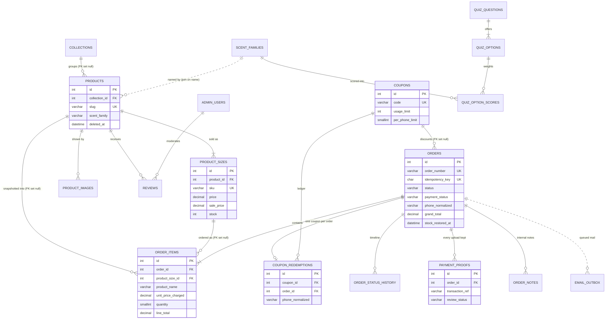
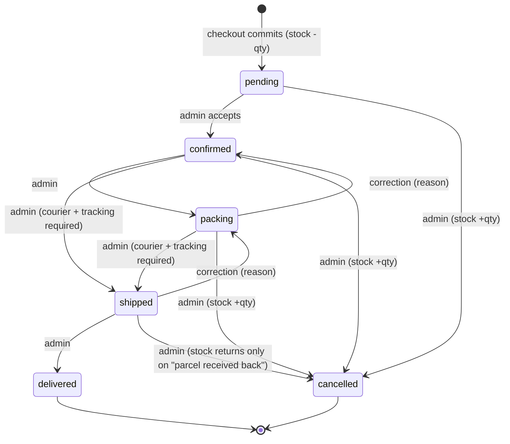

# Sky Fragrances — Build Plan

Status: awaiting client approval — no code has been written

Date: 2026-09-25

This document is the single plan for the Sky Fragrances online store: what will be built, how it will be structured, how money and orders flow, what the admin panel does, and how the work is staged. It was assembled from five specialist parts and a decisions register; where the specialists disagreed, section 15 records the ruling that this plan follows. The plan was then reviewed by three independent critics (hosting operations, security and commerce, completeness against your brief); section 16 records what changed as a result and what was considered and rejected.

## Contents

1. What you are getting
2. Technology decisions — and why
3. Folder structure of the ZIP
4. Database
5. Every page
6. Design at a glance
7. How the money logic works
8. Payment and delivery flows
9. The admin panel, from a phone
10. Security and SEO commitments
11. Sample data that will be seeded
12. Build stages
13. Assumptions
14. Questions for you
15. Decisions made where the specialists disagreed
16. Hardening decisions from review


---

# 1. What you are getting

A finished, self-contained online perfume shop for skyfragrances.com, plus the admin panel that
runs it — delivered as one ZIP you extract into `public_html` through hPanel File Manager, one
database you create in hPanel, and one page (`install.php`) you open in your browser. No
developer tools are involved at any point: nothing to compile, nothing to install, nothing to
schedule. Every page is built for a phone first and tested at 375 px wide (see 07 Part B).

**What a customer experiences**

- A black-and-champagne-gold storefront: full-screen hero, announcement bar, shop-by-collection,
  best sellers, new arrivals, For Him / For Her / Unisex, why-choose-us, newsletter, Instagram
  tiles, and a floating WhatsApp button on every page (see 03 §4).
- A shop page with filters (collection, gender, scent family, price), sort, search with
  suggestions as they type, and pagination; landing pages for `/for-him`, `/for-her`, `/unisex`,
  `/new-arrivals`, `/best-sellers`, `/sale`, each collection and each scent family (see 03 §5).
- A product page with zoomable gallery, size selector (each size with its own price, sale price
  and stock), scent-notes pyramid, longevity and sillage meters, season/occasion, approved
  customer reviews only, related products, a sticky add-to-cart bar on mobile and a WhatsApp
  order button (see 03 §6).
- A slide-out cart drawer, a cart page with a free-shipping progress bar and coupon box.
- Guest checkout — name, phone, email (optional), city, address, note — paying by Cash on
  Delivery, or Bank Transfer / JazzCash / Easypaisa where they see your account details, type
  the transaction ID and upload a screenshot (see 06b §2–4).
- A confirmation page and email, a Track Order page (order number + phone) with a status
  timeline, a Scent Finder quiz, About / Contact / FAQ / Shipping / Returns / Privacy / Terms
  pages, and a branded 404 page.

**What you can do from your phone (the `/admin` panel)**

- Dashboard: today's and this month's revenue, orders by status, low-stock alerts, latest
  orders, best sellers, a note when emails are still waiting to go out and a red warning if any
  email failed to send, plus a line showing how much of your disk space the site is using.
- Products and collections: add, edit, hide, delete; upload several photos at once (auto-resized
  and cropped to the house 4:5 shape); sizes with price, sale price, stock and SKU; notes,
  gender, scent family, featured / new toggles, SEO title and description.
- Orders: filter, search, open one, move it Pending → Confirmed → Packing → Shipped →
  Delivered (or Cancelled, which puts the stock back — automatically before shipping, with one
  extra tap once a parcel has gone out and come back), add courier and tracking, view the
  payment screenshot, mark as paid, print an invoice or packing slip, send a one-tap WhatsApp
  message from a template, add private notes, export CSV, and clear never-paid transfer orders
  in one go (see 05b).
- Coupons, review moderation, contact-form inbox, newsletter subscribers (CSV export), content
  pages, Settings (store info, logo, contact numbers, socials, hero and announcement text,
  shipping fee and free-shipping threshold, delivery time, each payment method on/off, bank /
  JazzCash / Easypaisa details, meta description, maintenance mode), change password (see 05a).
- A "Remove sample data" button for the launch day (see 07 A.7).

**What ships in the ZIP**

| Item | Detail |
|---|---|
| The site and admin code | Plain PHP, one CSS file, five small JS files, self-hosted fonts |
| `install.php` | One-time installer; creates tables, admin account and sample data, then tells you to delete it |
| `db/schema.sql` + `db/seed.sql` | The same tables and sample data, for phpMyAdmin if you ever prefer that route. Neither file can delete anything: re-importing them onto a live shop adds nothing and removes nothing (08 C-55) |
| Sample catalogue | 12 sky-themed perfumes, 5 collections, coupon `WELCOME10` (10% off above Rs. 3,000) |
| Go-live guide | Step-by-step for a non-developer, in the only order that works on Hostinger: point the domain, wait for the padlock, create the database and mailbox, upload, run `install.php`, first hour in the panel, go live. The full outline is 07 Part C; the ZIP it goes with is built to the manifest in 02a §1.2 |

# 2. Technology decisions — and why

Every choice below follows from one fact: the site is deployed by extracting a ZIP inside
`public_html` on Hostinger shared hosting, with no shell, no Composer, no Node and no build step
(see 02a §1, 02b §1). LiteSpeed (Hostinger's web server, which reads Apache-style `.htaccess`
files) is assumed throughout.

| Decision | Choice | Why this is right for Hostinger shared hosting |
|---|---|---|
| Language | Plain PHP 8.2, no framework, no classes, no autoloader — small function files, one per topic (see 02a §6) | A framework needs Composer to install and update; plain files are what File Manager can upload and what you can read. Every included file refuses to run unless opened through `index.php`, so a lost `.htaccess` still leaks nothing (see 02b §4 Layer 3). |
| Database access | PDO (PHP's built-in database layer) with prepared statements everywhere; no raw SQL path exists in the code (see 02c §2) | Prepared statements make SQL injection through user input structurally impossible. Money columns are read as exact strings, never floating-point, so `Rs. 4,950` is always `Rs. 4,950`. |
| Database engine | Written for both MySQL 8+ and MariaDB 10.4+ — portable table definitions only, `utf8mb4_unicode_ci`, no MySQL-only features (see 02c §0, §7.2) | Hostinger usually serves MariaDB while your local test uses MySQL; `install.php` checks the server version before creating anything. |
| Front-end | One stylesheet (`assets/css/site.css`), five small vanilla-JavaScript files loaded after the page, five self-hosted font files (see 04a, 04b Part 5) | No bundler, no Google Fonts request, no third-party script. Every page works with JavaScript off; JS only adds the drawer, zoom, search suggestions and animations. |
| Pretty URLs | `.htaccess` rewrites under LiteSpeed: `/product/azure-oud`, `/shop`, `/cart`; forces HTTPS; strips `www` and trailing slashes; images and CSS never pass through PHP, and a missing image never boots PHP either (see 02b §3, §5) | LiteSpeed reads `.htaccess` on every request with no restart. The HTTPS rule is written to be loop-proof behind Hostinger's edge proxy (see 02b §2.3), and it starts life as a *temporary* redirect that the installer makes permanent only once it has confirmed your certificate works (08 C-52) — so a browser never caches a redirect to a site that has no padlock yet. |
| Private code | Three folders (`app/`, `db/`, `storage/`), the admin panel's own code folders and `config.php` are blocked by three independent layers: `.htaccess` deny, a blank `index.php` in each, and the in-file guard (see 02b §4). Backup, dump and documentation file types are refused by name everywhere (08 C-54) | Nothing can sit "above the web root" when you deploy by File Manager, so the code defends itself in place. |
| Uploaded images | GD (PHP's built-in image library): every upload is validated five ways, re-encoded, EXIF-stripped, cropped 4:5 and saved in four sizes (400/600/900/1400 px) as WebP + JPEG, one photo per request (see 02c §5, 08 C-45, C-46) | GD ships with Hostinger PHP; no ImageMagick, no external service. Re-encoding means an uploaded file can never contain hidden code, and `/uploads` cannot run PHP on either LiteSpeed or Apache (see 02b §5). The size the server can handle is measured from the real memory limit at install, not assumed. |
| Email | PHPMailer (four vendored files) sending over authenticated SMTP to your own `@skyfragrances.com` mailbox (see 02c §6) | Bare PHP `mail()` on shared hosting sends from a `u123456@srv…hostinger.com` account: SPF and DKIM fail and Gmail files it as spam. Authenticated SMTP passes all three checks. |
| Email that fails | Order is saved first; the customer's email is attempted right after (5-second limit). Anything not sent waits in an outbox and is retried every time you open a page in the admin panel — at most two emails and twelve seconds per page, so a dead mail server can never freeze the panel (see 06b §5, 08 C-56) | An order is never lost to a slow mail server, and no scheduled job is needed. |
| Sessions | PHP file sessions in two separate folders: `storage/sessions/shop/` for `SFSHOP` (customer cart, 3 days) and `storage/sessions/admin/` for `SFADMIN` (admin, 120 min idle / 12 h maximum); the storefront only starts a session once a visitor actually does something (see 02c §1 step 3, 05a §2, 08 C-53) | Hostinger's shared session folder is periodically swept; an app-owned folder keeps a customer's cart alive for the promised 3 days. Two folders because PHP cleans a folder using whichever lifetime the current request has — one shared folder would have quietly cut carts to 12 hours. |
| Scheduled jobs | None required. Sitemap caches itself for an hour; the outbox and the housekeeping (old sessions, orphaned files, expired rate-limit rows, 90-day proof purge) run on admin page loads; nothing auto-cancels (see 02c §6.4, 07 B.1.7, 08 C-56, C-65) | You are not asked to set up cron. A `cron.php` ships in case you ever want faster email retries; nothing depends on it. |
| Configuration | One file, `config.php`, a plain PHP array written for you by `install.php` from `config.sample.php`, then locked read-only. Nothing in the site ever rewrites it; every switch you might flip (including maintenance mode) lives in Settings (see 02c §7.1, 08 C-70) | A human can open it in File Manager and read every value; the installer writes it once. A file that is never rewritten cannot be corrupted by a half-finished save or served stale by the server's code cache. |
| Installer | `install.php`: checks PHP version and extensions, tests the database login before writing anything, sends you a test email, creates tables, admin account and sample data, confirms HTTPS, then deletes itself (and tells you to delete it if it cannot). Its network self-checks advise, they never block (see 02c §7.2, 08 C-47) | Everything that would otherwise need a terminal happens in four browser screens. The admin dashboard shows a red banner if the file is still there. |
| Cache-busting | Stylesheet and script URLs carry the file's modification time (see 02a §5) | After any update, browsers fetch the new file with zero work from you. |
| Errors in production | `display_errors` off, everything logged to `storage/logs/`, visitors see a branded page with an incident id (see 02c §1 step 2, §8.1) | The brief's "never expose errors"; the log is readable in File Manager. |
| PHP limits | A shipped `.user.ini` sets upload size (10 MB), memory and timezone; the site caps uploads below that in code — 5 MB for a customer's payment screenshot, 6 MB for a product photo — and processes one image per request (see 02b §8, 08 C-46) | `.htaccess` cannot set PHP values on LiteSpeed; `.user.ini` can. Staying under the limits avoids white screens and the 508 "resource limit" error. |

**Deliberately not chosen**

| Not chosen | Why |
|---|---|
| Laravel / Symfony / WordPress + WooCommerce | All need Composer or carry plugin-update and security-patch chores; none fit "upload a ZIP and forget". |
| React / Vue / Tailwind / any build step | Needs Node; a plain CSS file and a few KB of JS give a faster page on a Pakistani mobile connection. |
| PHP `mail()` | Lands in spam (above). |
| ImageMagick or an image CDN | Not guaranteed on the plan; GD is. |
| Payment gateway (card checkout) | Not in the brief; COD plus manual transfer with screenshot proof. A gateway is a later addition (see 02c §8.2 for the rule that must accompany it). |
| Customer accounts | Guest checkout only; orders are tracked by number + phone. |
| `php_flag engine off` in `uploads/` | LiteSpeed silently ignores it — a false claim of protection. Handler removal is used instead (see 02b §5.1). |
| Cron dependence, admin sessions table, order counter table, Google Maps / Analytics embeds | Each was proposed by one spec and cut by the decisions register (see 08 §2, §4). |

# 3. Folder structure of the ZIP

The ZIP extracts straight into `public_html`. This is the tree as settled by the decisions
register (see 08 §1.1; the full annotated version is 02a §2). Folders marked **private** are
blocked from the browser; only `uploads/` and `assets/` are ever served directly.

```
public_html/
├── index.php            The storefront's single entry point — every pretty URL lands here
├── install.php          One-time installer. Run once in the browser, then DELETE it
├── config.php           Your database, site address and email login. Written by install.php
├── config.sample.php    The blank template install.php copies from
├── .htaccess            Pretty URLs, force HTTPS, strip www, route /admin, protect config.php and private file types
├── cron.php             OPTIONAL: point a cron at it for faster email retries. Nothing needs it
├── .user.ini            PHP limits (upload size, memory, timezone) — the only way to set them on LiteSpeed
├── robots.txt           Static; tells search engines to skip /admin, /cart, /checkout, /order
├── favicon.ico
│
├── app/                 PRIVATE — all the application code
│   ├── bootstrap.php    Loads config, opens the database, starts the session, sets error handling
│   ├── routes.php       The list of storefront URLs and which file handles each
│   ├── lib/             Helper function files, one per topic (db, cart, money, mail, image …)
│   │   └── vendor/PHPMailer/   The only third-party code: four files for sending email
│   ├── controllers/     One file per page or action (product, checkout, track …)
│   ├── views/           The HTML of each storefront page
│   ├── partials/        Shared fragments: header, footer, product card, cart drawer, WhatsApp button
│   ├── emails/          Email bodies: order confirmation, admin alert, status update, contact
│   └── tools/           reset-password.php — copied out only when you forget your password
│
├── admin/               The admin panel — its own entry point, login-protected, not blocked
│   ├── index.php        Admin entry point: checks you are logged in, then dispatches
│   ├── .htaccess        Extra headers only (the root .htaccess routes /admin here)
│   ├── controllers/     PRIVATE — dashboard, products, orders, coupons, reviews, settings, tools …
│   ├── views/           PRIVATE — the HTML of each admin screen
│   └── partials/        PRIVATE — admin header, sidebar, status badges, image uploader
│
├── assets/              Public, cached for a year, never written to by the site
│   ├── .htaccess        A missing asset is a plain "Not found", never a PHP page
│   ├── css/site.css     THE stylesheet
│   ├── js/              reveal, ui, cart, product, forms (storefront) + admin.js
│   ├── img/             Logo, default share image, placeholder, icons
│   └── fonts/           Cormorant Garamond and Jost, self-hosted
│
├── uploads/             PUBLIC READ, cannot run PHP — the only public folder the site writes to
│   ├── products/{id}/   Product photos in four sizes, WebP + JPEG
│   ├── collections/     Collection images
│   ├── og/              Share-preview images
│   └── settings/        Your logo and other images uploaded from Settings
│
├── db/                  PRIVATE — schema.sql, seed.sql (neither can delete anything), sample-manifest.php
│
└── storage/             PRIVATE, writable — logs/, cache/, sessions/shop/, sessions/admin/,
                         proofs/ (payment screenshots), .installed lock, optional MAINTENANCE flag file
```

Three notes on the tree:

| Point | Detail |
|---|---|
| Payment screenshots are not in `uploads/` | They live in `storage/proofs/` and can only be viewed through the admin panel while logged in (see 08 C-25, 05b §5.1). |
| Only two folders are ever written to | `uploads/` (product images) and `storage/` (logs, cache, sessions, proofs). Everything else is read-only after install (see 08 C-24) — with one deliberate exception: the installer (or Settings › Advanced) changes one number in `.htaccess` to make the HTTPS redirect permanent once your certificate is confirmed (08 C-52). |
| One development-only file is left out | A local `router.php` used to test on a laptop is excluded from the ZIP; it would be inert on Hostinger anyway (see 02c §9). |

**The three files you will ever open**

| File | When | What you do |
|---|---|---|
| `install.php` | Once, right after uploading | Open it in the browser, follow four screens, then delete the file in File Manager. |
| `config.php` | Almost never — only if the database password or email login changes | Edit the one value in File Manager and save. `install.php` writes it once and locks it read-only; the site itself never rewrites it (08 C-70). |
| `storage/MAINTENANCE` | Only if the admin panel itself is unreachable and you need to pause the site | Create an empty file with that name inside `storage/`; delete it to reopen. Normally you use Settings › Advanced › Maintenance mode instead (08 C-70). |

You never edit `.htaccess`. Installing the site in a sub-folder (for example `skyfragrances.com/shop/`) is not supported in this version — it would need five hand edits to server files, not one — so a staging copy goes on Hostinger's preview address instead, where search engines are automatically kept out (08 C-71).

Everything else — products, orders, settings, logo, pages, coupons — is done from the admin
panel, never by editing files.

---

# 4. Database

One MySQL/MariaDB database, 26 tables, all InnoDB, all `utf8mb4_unicode_ci`, importable through
phpMyAdmin in one paste and created by `install.php` in dependency order. No triggers, stored
procedures, views or MySQL `ENUM` types anywhere, so a dump restores cleanly on both engines
(see 01c §5, §7). Full column-by-column DDL (the `CREATE TABLE` statements) lives in 01a
(catalogue and site tables) and 01b (commerce tables) as amended by the decisions register; the
final `orders` table is printed in full in 08 §2.3. This section is the map, not the DDL.

Two terms used throughout: a **foreign key** (FK) is a column that points at a row in another
table, and the database refuses to leave it dangling; a **snapshot** is a copy of a value taken at
the moment of the order, so later edits to the catalogue never rewrite an old invoice.

## 4.1 Entity relationship diagram

Key columns only. `PK` = primary key, `UK` = unique, `FK` = foreign key. A dotted line is a
relationship kept by the code, not by a database constraint (see 01c §5 rule 4 for why).



The other entities on the diagram carry the usual `id` primary key plus the FK shown by their
line; their key columns are in the table below.

Eight tables stand alone with no foreign keys and are not drawn: `settings`,
`admin_login_attempts`, `admin_activity_log`, `content_pages`, `slug_redirects`,
`contact_messages`, `newsletter_subscribers`, `rate_limits`. They can be emptied without
touching a single order (01c §6). `admin_activity_log.admin_id` and
`order_status_history.admin_id` deliberately carry no FK: each row also stores the admin's
username as text, so the audit trail survives an account being deleted (08 C-18, 01c §5 rule 4).

Not in this diagram because the register cut them: `payments`, `checkout_attempts`,
`order_number_seq`, `order_stock_moves`, `admin_sessions`, `cities`, `faqs`, `usp_items`,
`instagram_posts`, `restock_alerts`, `search_queries`, `spam_log` (08 §1.2, §4).

## 4.2 Table by table

**Soft-delete** means a row is hidden with a flag (`is_active = 0` or a `deleted_at` date) and
never physically removed, because an old order still points at it. **Hard** means the row really
goes. The rule behind every choice: anything an order can point at is never destroyed; anything
else is deleted for real so the admin lists do not fill with ghosts (01a §1.3).

### Catalogue

| Table | What it holds | Key columns | Notes |
|---|---|---|---|
| `collections` | The 5 merchandising groups, each with a `/collections/{slug}` page | `slug` (unique), `sort_order`, `is_active`, `show_on_home`, SEO title/description | Soft-delete. A product belongs to at most one. |
| `scent_families` | The closed list of families (Woody Oud, etc.), each with a `/scent/{slug}` page | `name` (unique), `slug` (unique), `intro`, SEO fields | Soft-delete. Products store the family **name** as text; the admin form only offers names from this table (01a §3.2, 08 C-04). |
| `products` | One perfume: copy, notes pyramid (top/heart/base as comma-separated text), longevity/sillage 1-5, season, occasion, gender, flags, SEO | `slug` (unique), `collection_id` (FK), `gender` him/her/unisex, `is_featured`, `is_new`, `is_active`, `published_at`, `rating_avg`/`rating_count`, `sales_count` | Soft-delete via `deleted_at`. **No price or stock here** - those live on sizes. Rating fields are a cache recomputed on every review decision. |
| `product_sizes` | The thing actually bought: 50 ml, 100 ml... each with its own price, sale price, SKU and stock | `product_id` (FK), `sku` (unique), `price`, `sale_price` (NULL = not on sale), `stock`, `is_default`, `low_stock_threshold` | Soft-delete via `is_active`. `stock` is unsigned so it physically cannot hold a negative (08 C-03). |
| `product_images` | Gallery rows; the resized derivatives are named by convention, not stored | `product_id` (FK), `filename`, `alt_text`, `width`/`height`, `sort_order`, `is_primary` | **Hard** delete, and the files are unlinked in the same step (01a §3.5). |
| `reviews` | Customer reviews, admin-moderated | `product_id` (FK), `rating` 1-5, `status` pending/approved/rejected, `is_sample`, `moderated_by` | Spam is hard-deleted; judgement calls are `rejected`. `is_sample = 1` marks seeded reviews so one button removes them all before launch. |

### Commerce

| Table | What it holds | Key columns | Notes |
|---|---|---|---|
| `coupons` | Discount codes | `code` (unique, stored uppercase), `type` percent/fixed, `value`, `min_order_total`, `usage_limit` (NULL = unlimited), `per_phone_limit`, `used_count`, `starts_at`/`expires_at`, `is_active` | Soft-delete once redeemed (the ledger blocks a real delete). `used_count` is the counter the usage limit is enforced on, inside the checkout transaction; the ledger below enforces the per-phone limit (01b §6, 08 C-44). |
| `orders` | The order header: who, where, how paid, every money total, courier and lifecycle stamps | `order_number` (unique), `access_token`, `idempotency_key` (unique), `status`, `payment_method`, `payment_status`, `customer_*`, `phone_normalized`, `subtotal`/`discount_total`/`shipping_fee`/`cod_fee`/`grand_total`, `coupon_*` snapshot, `payment_reference`, `payment_account_snapshot`, `stock_restored_at` | **Snapshot.** Never deleted. Shipping fee, coupon details and the receiving bank/JazzCash account are copied in at checkout so a Settings edit never changes an old order. Full DDL: 08 §2.3. |
| `order_items` | One line per cart line, frozen at purchase | `order_id` (FK, cascades), `product_id`/`product_size_id` (FK, set to NULL if the catalogue row is ever hard-deleted), `product_name`, `product_slug`, `size_label`, `sku`, `image_filename`, `unit_price`, `sale_price`, `unit_price_charged`, `quantity`, `line_total`, `line_discount` | **Snapshot** (01b §2.1). Never edited after insert. |
| `order_status_history` | Every status and payment-status change: from, to, who, when | `order_id` (FK), `field` status/payment_status, `from_status`, `to_status`, `changed_by` customer/admin/system, `admin_id` + `admin_username` (text copy), `note` | Append-only. Feeds the customer's tracking timeline and the admin detail page. |
| `payment_proofs` | Every screenshot a customer uploads for a bank/JazzCash/Easypaisa order, plus the admin's verdict | `order_id` (FK), `transaction_ref`, `sender_name`, `amount_claimed`, `file_path` (under `storage/proofs/`; NULL once purged), `purged_at`, `review_status`, `reviewed_by`/`reviewed_at`/`review_note` | Append-only: a re-upload is a new row, so evidence is never overwritten (01b §5.1, 06b §0.2). The file is deleted 90 days after delivery or cancellation; the row and verdict stay (08 C-65). |
| `coupon_redemptions` | The ledger of coupon uses, one row per order | `coupon_id` (FK, restrict), `order_id` (FK), `code`, `phone_normalized`, `discount_amount`, `order_subtotal`, `status` applied/reverted | This is how "1 per phone" for `WELCOME10` is enforced. Cancelling an order marks the row `reverted`. |
| `order_notes` | Internal admin notes on an order ("deliver after 6pm") | `order_id` (FK), `body`, `admin_id` + `admin_name`, `is_pinned` | Never shown to the customer (01b §8). |
| `email_outbox` | Queued confirmation and notification emails, drained on admin page loads | `template`, `recipient`, `subject`, `body_html`, `order_id`, `status`, `attempts`, `next_try_at`, `sent_at` | An order is never lost to a slow mail server (06b §0.2, §5). |
| `rate_limits` | Append-only attempt log for public forms | `bucket` (checkout/track/proof/contact/newsletter/review/coupon), `subject_hash`, `attempted_at`, `was_success` | Purged opportunistically; no cron needed (06b §0.2, 08 C-17, C-66). The visitor's address behind Hostinger's proxy is worked out by one function, so limits are per real visitor, not per proxy (08 C-50). |

### Site and admin

| Table | What it holds | Key columns | Notes |
|---|---|---|---|
| `settings` | Every owner-editable string: store info, phone/WhatsApp, social links, announcement, hero copy, shipping fee and free-shipping threshold, payment toggles, bank/JazzCash/Easypaisa details, meta description | `setting_key` (the primary key - the only table with no `id`), `setting_value`, `setting_group` | Code holds a default for every key; an empty value means "use the default" (01a §5.3). Key list: 05a §4.9 plus 08 §1.4. |
| `admin_users` | The owner's login | `username` (unique), `email` (unique), `password_hash`, `is_active`, `last_login_at`, `password_changed_at`, `known_devices` | One account in v1, no `role` column (08 C-21). Soft-delete. `known_devices` holds hashes of up to five devices you have logged in from, so an attacker hammering your username can never lock *you* out (08 C-51). |
| `admin_login_attempts` | Every admin login try, for rate limiting | `ip_hash`, `username`, `attempted_at`, `was_success` | Hard-purged after 30 days, 1 login in 50 (01a §2.3). |
| `admin_activity_log` | Audit trail of admin actions with before/after values | `admin_id` + `admin_username` (text copy), `entity_type`, `entity_id`, `action` (e.g. `order.status_change`), `summary`, `before_json`/`after_json` | Append-only; purged at 365 days (05b §0.2, 08 C-18). |
| `content_pages` | About, FAQ, Shipping, Returns, Privacy, Terms as editable HTML | `slug` (unique), `title`, `body`, `body_format` html/faq, `template`, `is_system`, `is_active`, SEO fields | Soft-delete; the six system pages cannot be deleted or re-slugged (01a §2.6). |
| `slug_redirects` | Old URL to new URL after a rename, so WhatsApp links never 404 | `entity_type` product/collection/scent/page, `old_slug`, `new_slug`, `entity_id`, `hit_count` | Hard delete only when superseded; chains are collapsed to one hop (01a §5.2). |
| `contact_messages` | Contact-form submissions, saved before any email is sent | `name`, `email`, `phone`, `subject`, `message`, `order_number`, `status` new/read/replied/archived, `admin_note`, `read_at` | Soft-delete via `status = archived` (05a §0.3, 08 C-20). |
| `newsletter_subscribers` | Newsletter sign-ups and unsubscribes | `email` (unique), `status` subscribed/unsubscribed, `source`, `unsub_token`, `subscribed_at`/`unsubscribed_at` | Soft-delete: the unsubscribe row is the compliance record (05a §0.3). |

### Scent Finder quiz

| Table | What it holds | Key columns | Notes |
|---|---|---|---|
| `quiz_questions` | The 4-5 questions, in step order | `question`, `helper_text`, `step` (unique), `is_active` | Hard delete. Seeded once; no admin screen in v1 (08 §4). |
| `quiz_options` | The answers under each question | `question_id` (FK), `label`, `option_code` a-e (unique per question), `sort_order` | The code letters form the shareable result URL (01a §4.2). |
| `quiz_option_scores` | How much each answer points at each scent family | `option_id` (FK), `scent_family_id` (FK), `weight` | One row per (answer, family). No quiz answers are ever stored (01a §4.4). |

## 4.3 The five rules that keep the data honest

The SQL behind each rule is in 01c; this is the plain-English contract.

| # | Rule | What it means | Detail |
|---|---|---|---|
| 1 | **Money is `DECIMAL(10,2)`, whole rupees** | Every price and total is stored as an exact decimal (never a floating-point number), unsigned so a negative total is a hard error rather than a silent zero. PHP does its arithmetic in integer paisa, rounds exactly once (a percent coupon, half-up to the rupee) and displays `Rs. 4,950` with no decimals. | 01c §1, 08 C-01 |
| 2 | **Stock can never go negative** | Stock is reduced with a single guarded statement: "subtract this quantity from this size, but only if it still has at least that many" - and the code checks that exactly one row changed; zero rows means someone else got the last bottle and the whole order is rolled back. Sizes are always locked in ascending id order so two checkouts cannot deadlock, and the column is unsigned as a second wall. Cancelling puts stock back exactly once, because the cancel and the "stock already restored" stamp are set in the same guarded statement. The database connection is put into strict mode by the site itself, so the "unsigned" wall is a real error on every host, not a silent clamp (08 C-55). | 01c §2-3, 08 C-03, C-12, C-55 |
| 3 | **Order lines are snapshots** | An `order_items` row copies the product name, slug, size label, SKU, image, list price and charged price at the moment of purchase, and `orders` copies the shipping fee, coupon terms and receiving account; nothing is ever read back from the catalogue or Settings. Renaming, repricing or retiring a perfume later cannot change what last month's invoice says. | 01b §1-2, 08 C-07 |
| 4 | **Order numbers are `SF-YYMMDD-XXXX` and cannot collide** | Example `SF-260925-K7QF`: the Karachi date plus 4 random characters from a 32-letter alphabet that drops `0 O 1 I`, so it reads cleanly over the phone and does not reveal how many orders were placed. The `order_number` column is unique in the database, so if the roughly one-in-a-million same-day clash ever happens the insert is refused and the code simply draws a new suffix and retries. | 06b §0.3, 08 C-10 |
| 5 | **Times are Karachi local time** | Every date column is a plain `DATETIME` written by PHP in Asia/Karachi (which has had no daylight-saving changes since 2009), and every database connection is set to `+05:00`, so a row that says `14:30` in phpMyAdmin means half past two in Karachi. `TIMESTAMP` columns and server defaults are never used, so a hosting migration cannot silently shift the clock. | 01c §4.2 |

The register's open question **Q-01** (random vs strictly sequential order numbers) is the only
item above the owner can still change; sequential numbering would reinstate a counter table and
alter rule 4 (08 §3.1). Everything else in this section is settled.

---

# 5. Every page

## 5.1 Storefront route table

Every public URL the site answers. "Preset" means the shop page with one filter locked on — one code path, not a separate page (see 03 §2). "Editable in admin?" says what the owner can change without a developer.

| URL | Page | What it does | Editable in admin? |
|---|---|---|---|
| `/` | Home | Brand entry: hero, collections, best sellers, new arrivals, gender tiles, Scent Finder band, why-choose-us, reviews, Instagram, newsletter | Hero text/images, announcement, tile images, Instagram tiles, section toggles (Settings › Home) |
| `/shop` | Shop | All products with filters, sort, pagination (24 per page) | Products themselves; optional intro line |
| `/collections` | Collection index | One wide card per collection | Collections CRUD; intro text |
| `/collections/{slug}` | Collection landing | Shop preset to one collection, with its own banner and copy | Collection image, tagline, description, mood, SEO |
| `/for-him`, `/for-her`, `/unisex` | Gender landings | Shop preset to a gender | Banner image and intro paragraph per gender |
| `/scent/{slug}` | Scent-family landing | Shop preset to one scent family (Fresh, Floral, Oud…) | Family intro + SEO fields (from the `scent_families` table) |
| `/new-arrivals` | New arrivals | Shop sorted newest first | Product `published_at` |
| `/best-sellers` | Best sellers | Shop sorted by sales, featured products pinned first | Product "featured" toggle |
| `/sale` | Sale | Only products with a sale price | Sale price per size |
| `/search?q=` | Search results | Keyword search, scored (name > family > notes > description); not indexed | — |
| `/product/{slug}` | Product page | Gallery, sizes, price, add to cart, WhatsApp, notes, meters, reviews, related | Everything on the product form |
| `POST /product/{slug}/review` | Review submit | Saves a review as *pending*; never shown until approved | Approve/reject in Reviews |
| `/scent-finder` | Scent Finder | Five-question quiz | No screen in v1 (questions are seeded; see 08 §4) |
| `/scent-finder/result?a=` | Scent match | Top 3 recommendations; shareable URL; not indexed | — |
| `/cart` | Cart page | Full cart, coupon, free-shipping bar, checkout button | Shipping fee, threshold, coupons |
| `/checkout` (GET, POST) | Checkout | Guest form + payment method; places the order | Which payment methods are on; account details; delivery text |
| `/order/{number}?t=` | Order confirmation | The receipt; only opens with the secret link token | — |
| `/track` (GET, POST) | Track order | Order number + phone → status timeline | Courier/tracking per order |
| `/about`, `/shipping`, `/returns`, `/privacy`, `/terms` | Content pages | Prose pages from the database | Full text + SEO fields (Pages) |
| `/faq` | FAQ | Accordion built from the FAQ page's headings; FAQ schema | Full text (Pages) |
| `/contact` (GET, POST) | Contact | Details + form saved to the database and emailed | Phone, WhatsApp, email, address, hours |
| `/unsubscribe?e=&t=` | Unsubscribe | One-click newsletter opt-out | — |
| `/api/cart`, `/api/cart/add|update|remove|coupon` | Cart API (JSON) | Powers the cart drawer | — |
| `/api/search-suggest`, `/api/newsletter` | JSON helpers | Header autocomplete; newsletter signup | — |
| `/sitemap.xml`, `/robots.txt` | Crawl files | Generated sitemap (1-hour cache); static robots | — |
| any other path | 404 | Custom not-found page, real HTTP 404 | — |

Not built in v1, reserved: `/blog`, `/gift-sets`, `/account`, `/wishlist` (03 §2).

On every page: announcement bar, header, footer, the collapsed cart drawer, the floating WhatsApp button and a toast area (03 §1.5).

## 5.2 What each page shows

**Home** (03 §4). Announcement bar → full-screen hero (logo, "More Than Just A Scent", gold CTA, trust line) → Shop by Collection (5-tile mosaic) → Best Sellers (8) → New Arrivals (8) → For Him / For Her / Unisex tiles → Scent Finder band → Why choose us (ivory band, 4 items) → Customer voices (only real approved reviews, hidden below 3) → Instagram (6 owner-uploaded tiles) → Newsletter → footer. At most 9 database queries.
Mobile (375px): hero uses the portrait image at 88% of the screen height; collections and best sellers become swipe rails; new arrivals is a 2-column grid; gender tiles stack; everything else is single column.

**Shop and every listing** (03 §5). H1 and optional intro → result count + sort dropdown → active-filter chips → 4-column product grid, 24 per page → numbered pagination. Filters: collection, gender, scent family, price bands (computed from live prices), plus "On sale only" and "In stock only" chips. Sold-out products always sort last. Every filter state is a shareable URL and works with JavaScript off.
Mobile: 2-column grid; filters live in a bottom drawer opened by a sticky "Filter & Sort" bar; changes apply only when "Show {n} results" is tapped; pagination shrinks to ← Page 3 of 7 →.

**Product page** (03 §6). Gallery left, buy column right (sticky): collection → name → gender · family → rating (hidden at 0 reviews) → price → short description → size chips (each with its own price, sale price, stock) → quantity → gold Add to Cart → outlined Order on WhatsApp (prefilled message) → trust row → accordions. Below: "The Composition" (notes pyramid, longevity and sillage meters, season/occasion chips), You May Also Like (4, scored), Customer Reviews with submit form. Size changes are instant — no request.
Mobile: swipeable gallery with dots and a tap-to-open lightbox (native pinch-zoom); a sticky bottom Add bar appears once the main button scrolls away; a sold-out size shows a disabled "Sold out" and makes the WhatsApp button the main action, with an "is this coming back?" message pre-filled (08 C-67).

**Cart** (03 §7). Slide-out drawer on every page (opens on add-to-cart) and a full `/cart` page: lines with quantity steppers, free-shipping progress bar, coupon field, subtotal, Checkout. Prices are always re-read from the database, never from the browser. Caps: 10 per line, 20 lines (08 C-39).
Mobile: drawer is 92% of the screen width; on `/cart` the summary moves under the lines and Checkout repeats as a sticky bottom bar.

**Checkout** (03 §8). One page, guest only. Name, mobile (any Pakistani format, normalised), email (optional), city (free text with suggestions), address, notes → payment method cards (only enabled methods appear: COD, Bank, JazzCash, Easypaisa) → for the manual methods an inline panel with the owner's account details (copy buttons), the exact amount, a transaction ID field and a screenshot upload (JPG/PNG/WEBP, 08 Q-08) → order summary → Place Order (disables itself; a double tap cannot create two orders, 08 C-11).
Mobile: single column; the summary is a collapsed "Order summary — Rs. 9,695" at the top and repeats above the button.

**Order confirmation** (03 §9). Gold check → "Thank you, {first name}" → order number with copy button → email note or "Save this page — it's your receipt" → Message us on WhatsApp → items → money summary → address → payment method. Manual payments get a "We're verifying your payment" panel; COD gets "Please keep Rs. X ready for the courier". Opens only with the token in the link; without it — or with an order number that does not exist — the visitor sees the same Track form instead. If a payment was rejected, the customer can send a new screenshot from this page; once the order is marked paid, the page is a receipt only and accepts nothing (08 C-59, C-76).
Mobile: single column, order number block full-width and tappable.

**Track order** (03 §10). Two fields (order number, phone) → a five-stage timeline Pending → Confirmed → Packing → Shipped → Delivered with dates; Cancelled replaces the timeline with one muted panel; courier + tracking card once shipped. Shows items, total and city only — never the address, phone, email, payment details or admin notes. 8 attempts per 15 minutes, then a cool-down.
Mobile: the timeline runs vertically (horizontal from 768px).

**Scent Finder** (03 §11). One question per screen with a gold progress bar and Back; works as five plain form steps without JavaScript. The result page shows the top match as a large card, two more under "Also worth trying", Share / Retake, and the newsletter block. The exact five questions:

| # | Question | Options |
|---|---|---|
| 1 | Who is this fragrance for? | For him · For her · Doesn't matter — surprise me |
| 2 | Where will you wear it most? | Work and daytime · Evenings and dinners · Weddings and big occasions · Every day, all day |
| 3 | Which of these smells best to you? | Citrus, sea air, clean linen · Rose, jasmine, soft petals · Oud, leather, incense · Vanilla, amber, warm spice · Rain, grass, cut wood |
| 4 | How much presence do you want? | Close to the skin — only people near me notice · Noticeable, not loud · I want to be remembered |
| 5 | When do you wear fragrance most? | Karachi summer heat · Winter and cold evenings · All year round |

Scoring is one database query over existing product fields (gender, scent family, notes, sillage, longevity, season); sold-out products are excluded (03 §11.2).

**About, Shipping, Returns, Privacy, Terms** (03 §12.1). Prose from the `content_pages` table, edited in admin with a small allowed set of tags (paragraphs, headings, lists, links, bold). Narrow reading column (max ~608px, 04a §4.2); "Last updated" shown on Privacy, Terms and Returns. Seeded with real starting copy so no legal page is ever blank.
Mobile: same column, full width.

**FAQ** (03 §12.1, 08 §4). One `content_pages` row; each `<h3>` question and the paragraph after it become an accordion item and a `FAQPage` schema entry from the same source. With JavaScript off every answer is open.

**Contact** (03 §12.2). Short intro → details column (phone, WhatsApp tap-to-chat, email, address, hours — each hidden when empty) → form: name, email, optional phone, subject dropdown, order number (shown for order enquiries), message. Saved to the database first, then emailed; a mail failure never loses the message. No map embed (08 §4).
Mobile: details above the form, one column.

**404** (03 §13). Large muted "404", "This page has drifted off.", a search field, four link buttons (Shop All, Collections, Track Order, Contact) and four best sellers. Real 404 status; the bad path is never echoed. Full header, footer and WhatsApp button — a 404 is still a shop.

Spam protection on every public form, no captcha: hidden honeypot field, a 3-second time-trap, CSRF token, and per-form rate limits in the `rate_limits` table (03 §12.3, 08 C-17).

## 5.3 Admin route table

All under `/admin`, behind the owner's login; every save is a POST that redirects back with a one-line message, so the phone's back button never re-submits (05a §1). One line per screen; the exact POST URLs are in 05a §1 and 05b §0.4.

| Screen | URL | What it does |
|---|---|---|
| Login | `/admin/login` | Username + password; rate-limited; logout is a POST |
| Dashboard | `/admin` | Today/month revenue, orders by status, low stock, latest orders, best sellers |
| Products list | `/admin/products` | Filters, search, bulk actions (activate, hide, feature…) |
| Product form | `/admin/products/new`, `/admin/products/{id}` | All fields, sizes with price/sale/stock/SKU, SEO; delete = hide |
| Product images | `/admin/products/{id}/images…` | Upload (auto-resize, JPG/PNG/WEBP), drag to reorder, delete |
| Collections | `/admin/collections`, `…/new`, `…/{id}` | List, create, edit; delete blocked while products use it |
| Coupons | `/admin/coupons`, `…/new`, `…/{id}` | Percent/fixed, minimum order, usage limit, per-phone limit, expiry, on/off toggle |
| Reviews | `/admin/reviews` | Approve / reject / re-queue, singly or in bulk |
| Messages | `/admin/messages`, `…/{id}` | Contact messages: new / read / replied / archived, internal note |
| Subscribers | `/admin/subscribers`, `…/export.csv` | Newsletter list, unsubscribe/resubscribe, CSV download |
| Orders list | `/admin/orders`, `…/export.csv`, `…/bulk`, `…/cancel-unpaid` | Filters, search, attention strip, bulk actions, CSV (≤5,000 rows), and the one bulk cancel: never-paid transfer orders older than 48 hours (08 C-58) |
| Order detail | `/admin/orders/{number}` | Status change, mark paid / reject proof, courier + tracking, notes, view proof, WhatsApp message button, "parcel received back — restore stock" for an order cancelled after shipping (08 C-48) |
| Invoice / packing slip | `/admin/orders/{number}/invoice`, `…/packing-slip` | Printable pages (packing slip shows no prices, 08 Q-14) |
| Settings | `/admin/settings?tab=` | Tabs: Store · Contact & Social · Home · Shipping · Payments · SEO · Advanced — each tab saves on its own. Advanced holds maintenance mode, the site address, "make HTTPS permanent" and the search-engine switch |
| Change password | `/admin/password` | New password; the session is regenerated and the CSRF token rotated on change |
| Tools | `/admin/tools` | Remove sample data (one button, 08 §4); privacy purge (deletes payment screenshots 90 days after delivery/cancellation and old email copies — also runs by itself now and then, 08 C-65); regenerate image sizes in batches; disk-usage line |
| Admin 404 | anything else under `/admin` | Not-found page inside the admin shell |

Admin on a phone (05a §3): a bottom tab bar — Orders (badge = pending + confirmed), Products, a gold "+" create button, Reviews (badge = pending), More. Below 768px every table becomes a stack of cards with one status chip and at most three fields. Desktop gets a 220px left sidebar with all eight sections. Session: 120 minutes idle, 12 hours absolute (08 C-06).

# 6. Design at a glance

The storefront is dark: black ground, ivory text, champagne gold accents. Ivory is used as a page ground only in the admin panel, print views and one "Why choose us" band on the home page (04a §1.4, 08 Q-22). There is no light/dark mode switch — the brand *is* dark (04a §1.4).

## 6.1 Palette and contrast

Contrast ratios are from the WCAG audit in 04a §2 (AA = the accessibility standard; body text needs 4.5:1, large text and UI outlines 3:1).

| Text / element | Hex | On background | Ratio | Result |
|---|---|---|---|---|
| Ivory body text | `#F5F0E8` | Black `#0A0A0A` | 17.45:1 | PASS |
| Muted ivory (captions, "was" prices) | `#9C968C` | Black | 6.75:1 | PASS |
| Brand gold (prices, links, eyebrows) | `#D4B084` | Black | 9.75:1 | PASS |
| Gold hover | `#E7D2AE` | Black | 13.41:1 | PASS |
| Success green ("In stock") | `#6FBF8B` | Black | 8.96:1 | PASS |
| Danger red ("Sold out", errors) | `#E5736B` | Black | 6.60:1 | PASS |
| Ivory text | `#F5F0E8` | Drawer / modal `#1C1A18` | 14.79:1 | PASS |
| Gold | `#D4B084` | Drawer / modal `#1C1A18` | 8.26:1 | PASS |
| Black text | `#0A0A0A` | Ivory `#F5F0E8` | 17.45:1 | PASS |
| Muted text on ivory | `#5A544B` | Ivory | 6.60:1 | PASS |
| Gold ink (links on ivory) | `#7A5A2E` | Ivory | 5.56:1 | PASS |
| Success on ivory ("Paid") | `#1F6B3E` | Ivory | 5.72:1 | PASS |
| Danger on ivory ("Cancelled") | `#A32B22` | Ivory | 6.33:1 | PASS |
| Black text on a gold button | `#0A0A0A` | Gold `#D4B084` | 17.45:1 | PASS |
| **Brand gold on ivory** | `#D4B084` | Ivory | **1.79:1** | **FAIL** |

**The gold rule** (04a §2.4, binding): brand gold `#D4B084` is never placed on ivory or white — not as text, an icon or a border. On ivory it is replaced by the deep "gold ink" `#7A5A2E`; a gold *fill* on ivory (a gold button) always carries black text, which passes. The gold gradient is display-only: allowed on the wordmark, the hero headline and section numerals at 28px and up, never on prices, buttons, links, labels or body copy, and every gradient heading falls back to flat gold (04a §2.5, 04b §0.2).

Two more rules from the audit (04a §2.6): a form field's resting border is decorative — its focus and error states use a full-strength gold or red border plus a ring; and selection (a chosen size, an active filter) is never shown by a gold hairline alone — it also gets a tinted fill, a 2px edge and the proper `aria` state.

## 6.2 Type scale

Two families, two jobs (04a §3.1): **Cormorant Garamond** (light and regular) for headlines, product names and prices; **Jost** (light, regular, medium) for everything else. Cormorant is never used below 20px or on anything clickable; Jost is never used for a product name. Five self-hosted font files, no italics, no bold (04a §3.2, 08 C-32). Sizes scale fluidly with the screen — no font-size media queries (04a §3.5).

| Step | Family / weight | At 375px | Desktop (1440px) | Used for |
|---|---|---|---|---|
| Display | Cormorant 300 | 47px | 88px | Home hero headline only |
| H1 | Cormorant 300 | 35px | 56px | Page titles, product name |
| H2 | Cormorant 400 | 27px | 40px | Section headers |
| H3 | Cormorant 400 | 20px | 26px | Card-group titles, drawer title |
| H4 | Cormorant 400 | 17px | 20px | Product card name, accordion head |
| Lead | Jost 300 | 17px | 20px | Intro paragraph under an H1 |
| Body | Jost 400 | 15px | 16px | Paragraphs, table cells |
| Small | Jost 400 | 14px | 14px | Meta, helper text, "was" price |
| Micro | Jost 400 | 12px | 12px | Legal, footnotes |
| Eyebrow | Jost 500, UPPERCASE, 0.22em tracking | 11px | 11px | Section labels ("CURATED") |
| Label | Jost 500, UPPERCASE, 0.14em | 12px | 12px | Form and tab labels |
| Button | Jost 500, UPPERCASE, 0.16em | 13px | 13px | Every button |
| Price | Cormorant 400 | 18px | 24px | Product-page price |
| Price small | Cormorant 400 | 16px | 16px | Card and cart prices |

Prices and quantities use tabular figures so `Rs. 4,950` and `Rs. 12,400` line up in a column (04a §3.7). The wide-tracked uppercase ("SKY FRAGRANCES" under the monogram) is the signature: never more than four words, never a sentence (04a §3.6).

## 6.3 Components

One stylesheet (`assets/css/site.css`), no framework. Each component is specified with every state (default, hover, focus, active, disabled, loading, error) and its 375px behaviour in 04b Part 1.

| Component | One line |
|---|---|
| Buttons (04b §1) | Gold gradient primary, outlined ghost, underlined text button; 52px tall, uppercase label; full-width on mobile, never two side by side |
| Product card (§2) | 4:5 image, up to two badges, serif name, sizes line, price, rating; hover cross-fades to the second photo |
| Collection card (§3) | 3:4 image under a dark scrim, serif name, tagline, a gold hairline that widens on hover |
| Inputs, select, textarea (§4) | 52px fields, label always above (never a placeholder-as-label), 16px text on mobile so iOS does not zoom; native select |
| Quantity stepper (§5) | − / number / +; the stock ceiling comes from the server on every response |
| Size selector (§6) | Real radio chips showing size and price; sold-out chips stay visible; selection is instant, no request |
| Badges (§7) | SOLD OUT > SALE −n% > NEW, square corners, max two per card |
| Notes pyramid (§8) | Top / Heart / Base as an indented list with a gold connector — a list, not a triangle graphic, so it reads on a phone and to a screen reader |
| Longevity & sillage meters (§9) | Five gold segments plus the word beside them; wipe in on scroll |
| Star rating (§10) | Gold stars at exact percentage; shown only with at least one approved review; interactive stars on the review form |
| Accordion (§11) | FAQ, product panels, mobile footer; all open when JavaScript is off |
| Drawer (§12) | Cart (right) and mobile filters (left); focus trapped, Escape closes, body scroll locked |
| Modal (§13) | Size sheet, image lightbox, admin confirmations; becomes a bottom sheet on mobile |
| Toast (§14) | Bottom-centre on mobile, top-right desktop; gold edge for success, red for error; max three |
| Breadcrumb, pagination, announcement bar (§15) | Real links; pagination is a page load; the bar is hidden when its text is empty |
| Header / mobile nav / footer (§16) | Transparent over the hero then solid; hamburger drawer on mobile; four footer columns → accordions |
| WhatsApp button, sticky add bar, newsletter, skeletons (§16) | 56px green circle on every page; product-page bottom bar; inline signup; three skeletons only |
| Missing-image placeholder (04b §24) | Dark box with a faint SF monogram at the right ratio — never a broken image, never a collapsed grid |

Corners are square everywhere (04a §4.5) — the only round shapes are the cart count bubble and the in-stock dot. Borders are 1px and change colour, never thickness. Every tap target is at least 44×44px (04b Part 4).

## 6.4 Motion rules

- **Four durations, one brand curve.** 120ms for presses, 200ms for hover colours and toasts, 320ms for drawers and accordions, 560ms for scroll reveals and image zoom, all on a long decelerating ease with no bounce. Only opacity, transform and colour are animated — never width, height or position (04b §17).
- **Reveal once, never on the fold.** Sections fade up 18px as they scroll into view and stay there. The header, announcement bar, hero, first product row, anything inside a drawer, and every element on cart, checkout and track never animate (04b §18). Hover zoom is 1.04 on cards, 1.06 on collection tiles, 1.08 on the product image, and only on mouse devices (04b §19).
- **Reduced motion is respected.** When the visitor's device asks for less motion, all movement stops but nothing is hidden: content shows instantly, drawers appear without sliding, meters render filled, the marquee wraps to two lines (04b §21). JavaScript totals about 11KB in five files; filters, pagination, the quiz and every price calculation work without it (04b Part 5).

## 6.5 What "better than Le Labo / Byredo" means here

The brief asks for a site that beats the category leaders. In this design that is four concrete choices, not a mood:

| Quality | What the build does | Where |
|---|---|---|
| Restraint | Two typefaces with five weights and no bold or italic; square corners; borders that change colour, never weight; no carousel library, no icon font, no custom dropdowns; a card with no border — "the image does the work" | 04a §3.2, §4.5; 04b §2, Part 5 |
| Typography | Cormorant for display, Jost for the interface, with a hard boundary between them; the wide-tracked uppercase eyebrow carried from the logo; tabular figures on every price; the trailing letter-space pulled back so right-aligned labels sit exactly on the grid — "the exact kind of error that separates this from the competitors named in the brief" | 04a §3.1, §3.6, §3.7 |
| Whitespace | A fluid type scale whose display end grows faster than the body, so desktop feels dramatic and a phone stays readable; a narrow checkout column "so it feels like a letter, not a form"; the product page's luxury read "comes from the negative space around" the bottle | 04a §3.5, §4.2; 04b §23 |
| Imagery | Bottle on black with one soft key light and a fading shadow; ivory reserved for one editorial band at a time; no gradients, CSS shadows or rounding on product photos; every image sized in advance so nothing shifts; a 4:5 crop enforced at upload so any photo the owner takes fits | 04b §22–24, 08 Q-17 |

Where the two design documents differ on a detail the register did not rule on — the focus-ring colour (gold in 04a §2.7, ivory in 04b Part 4), the meter word labels (03 §6.5 vs 04b §9) and the 2px button radius in 04b versus 04a's square default — 04a is the canonical token source (08 C-33), so the build uses the gold focus ring and square corners; the meter word labels follow 03 §6.5, which owns storefront copy. Nothing here is left to decide.

---

# 7. How the money logic works

One principle drives this section: **the browser is never a source of truth.** The customer's
cart holds only *which size*, *how many* and a coupon code; every price, discount, fee and total
is recomputed from the database on every page load and once more inside a locked transaction
when the order is placed (see 06a §1). Money is `DECIMAL(10,2)`, shown as `Rs. 4,950` (08 C-01).

## 7.1 The pricing pipeline (06a §2.2, always in this order)

1. **Unit price.** The sale price is used only if it is set and strictly lower than the
   normal price; otherwise the normal price is used.
2. **Line total** = unit price × quantity. Exact, no rounding.
3. **Subtotal** = sum of all in-stock lines. Sold-out lines stay visible, count for nothing and
   block checkout.
4. **Coupon discount**, only if the code passes every check in 7.2. Percent coupons round
   half-up to the whole rupee — the *only* rounding in the pipeline, and a tie favours the
   customer. A fixed coupon is clamped so it never exceeds the subtotal.
5. **Shipping.** Free if the **pre-discount** subtotal reaches the threshold, else the flat fee.
6. **Grand total** = subtotal − discount + shipping. It can never go below zero (06a §2.4).

**Worked example** (illustrative prices; fee Rs. 250, free-shipping threshold Rs. 3,000,
`WELCOME10` = 10% off, minimum order Rs. 3,000):

| Line / step | Working | Result |
|---|---|---|
| Azure Oud 100 ml × 1 | Rs. 4,950, not on sale | Rs. 4,950 |
| Cirrus 50 ml × 2 | sale price Rs. 3,955 (Rs. 4,500 struck through) × 2 | Rs. 7,910 |
| Subtotal | 4,950 + 7,910 | **Rs. 12,860** |
| Coupon `WELCOME10` | 12,860 ≥ 3,000 minimum, so it applies; 10% = Rs. 1,286 (an odd subtotal such as Rs. 4,955 would give 495.50 → Rs. 496) | **− Rs. 1,286** |
| Shipping | 12,860 ≥ 3,000 threshold, tested on the pre-discount subtotal | **Rs. 0 (Free delivery)** |
| Grand total | 12,860 − 1,286 + 0 | **Rs. 11,574** |

With a Rs. 2,800 cart the coupon is refused (*"This code needs a minimum order of Rs. 3,000. Add
Rs. 200 more to use it."*), shipping is Rs. 250, and the total is Rs. 3,050.

## 7.2 Coupon rules

| Rule | What we build | Where |
|---|---|---|
| Types | `percent` (1–90 %, whole numbers, in the admin form) or `fixed` (a rupee amount). No free-shipping type, no buy-X-get-Y, no product-specific coupons in v1 | 05a §4.5, 08 Q-12 |
| Minimum order | `min_order_total`, tested against the **pre-discount** subtotal | 06a §3.4 check 8 |
| Usage limit | Blank = unlimited; otherwise the code stops after N orders. The check is one guarded database statement inside the checkout transaction ("add one to the count only if it is still below the limit"), so two customers cannot both take the last use. The count is read-only in the panel — there is no recount button — and a used coupon can be deactivated but never deleted | 06a §5.3, 08 C-15, C-44, 05a §4.5 |
| Per-phone limit | Optional; `WELCOME10` ships with 1 per phone number so it is a real welcome offer. Matched on the normalised phone (`+92…`), so spaces and a leading 0 do not defeat it, and checked inside the transaction while the coupon row is locked, so two simultaneous checkouts from one phone cannot both get it | 06a §3.6, 08 C-14, C-44 |
| Start / expiry | Optional dates, Pakistan time. Every code is re-checked on every page load and again inside the order transaction; one that dies between cart and checkout is dropped and the customer confirms the new total | 06a §3.4, §3.8 |
| Stacking | **No.** One code per cart. Applying a second code replaces the first and the cart says *"WELCOME10 was replaced by SKY500."* | 06a §3.3 |
| Applies to | The merchandise subtotal only. Never the shipping fee | 06a §2.4 |
| Cancelled orders | Cancelling an order releases the use: the redemption row is marked *reverted* (kept for the audit trail) and the counter goes back down, in the same transaction as the cancel | 06a §3.7, 01b §6, 08 C-44 |
| Guessing codes | Ten wrong codes an hour per visitor, then refused; a code that has not started yet is reported as simply invalid, so a launch code cannot be discovered early | 08 C-66 |

## 7.3 Free-shipping threshold vs coupon — the settled rule

**The threshold is tested against the subtotal *before* the coupon comes off** (06a §4.1, ruled
as 08 C-43 — the storefront spec briefly said the opposite). A coupon can never push a customer
back into paying for delivery, the cart's progress bar only ever moves forward, and coupons never
discount the fee itself. Threshold `0` = always free. There is exactly one pricing function in the
code, used by the cart, the checkout page and the order transaction alike, so the three can never
disagree (08 C-43).

## 7.4 The order state machine

Six states. Stock is taken **once** at placement and given back **once** on cancel (06b §3).



| From → To | Who | Touches stock? | Sends email? | Reversible? |
|---|---|---|---|---|
| (new) → `pending` | system, at checkout | **yes, −qty** | customer confirmation + owner alert | only by cancelling |
| `pending` → `confirmed` | owner | no | customer "Order confirmed" | only by cancelling |
| `confirmed` → `packing` | owner | no | none (internal step) | yes → `confirmed`, reason required |
| `confirmed` or `packing` → `shipped` | owner (courier + tracking required) | no | customer "On its way" with tracking | yes → `packing`, reason required |
| `shipped` → `delivered` | owner | no | customer "Delivered" + review invitation | **no** — delivered is final; a wrong tap is corrected with a note |
| `pending` / `confirmed` / `packing` → `cancelled` | owner, reason required | **yes, +qty restored once** | customer "Order cancelled" | **no** |
| `shipped` → `cancelled` | owner, reason required | **not automatically** — the parcel is with the courier; a *Parcel received back — restore stock* button returns it once it is on the shelf | customer "Order cancelled" | **no** |

The server refuses illegal jumps (*"That status change isn't allowed."*); `shipped` needs
courier + tracking; every change is logged with who and when (06b §3.2, 05b §3.3). **Payment
status is a separate field** (`unpaid`, `awaiting_verification`, `paid`, `failed`, `refunded`);
a COD order is `delivered` before it is `paid` (08 C-09). This graph is the 05b §3.1 table,
ruled canonical by 08 C-48: `delivered` and `cancelled` are final, `confirmed` may skip straight
to `shipped`, and stock is never put back automatically for a parcel that has already left.

## 7.5 Stock safety and double-submit, in plain words

- **Stock cannot go negative.** The decrement says "take N *only if* at least N are there"; if
  two customers race for the last bottle exactly one wins and the loser's whole order rolls back
  with *"Sorry — {Product} {size} sold out while you were checking out."* (06b §1.5, 08 C-03).
- **All or nothing.** Order, lines, stock and coupon use are one transaction; any failure means
  no order, no stock movement, cart untouched (06b §1.6).
- **A double-tap cannot create two orders.** The checkout page carries a one-time key the order
  table refuses to store twice; the second request lands on the first order's confirmation page.
  The cart is emptied and the browser redirected (303), so refresh is harmless (08 C-11). The key
  is only spent once an order is really written, so a customer who loses a stock race simply
  tries again; and an old checkout tab submitted after a *new* cart was built is shown *"Your
  previous order was already placed — this is a new order"* rather than silently losing the new
  items (08 C-61).
- **The customer pays the total they saw.** Any change before *Place Order* — a price up *or*
  down, a fee, a quantity the shop had to reduce — writes no order; they see *"Your new total is
  Rs. X (was Rs. Y)"* and confirm again (06a §7.7, 08 C-43).
- **Cancel restores stock exactly once**; a second cancel, tab or retry changes nothing (08 C-12).
- **Caps**: 10 per size, 20 sizes per cart, never above stock; 5 orders/phone/day and 10/IP/day
  are flagged for you, not blocked (08 Q-06). Two exceptions from the review: a phone or address
  that already has a bank/JazzCash/Easypaisa order waiting for verification cannot place another
  transfer order until that one is verified (so nobody can lock up your stock with orders they
  never pay for, 08 C-58); and there is no COD ceiling unless you set one in Settings › Payments
  (08 C-69).

# 8. Payment and delivery flows

## 8.1 Cash on Delivery

| Step | Customer sees | Owner does |
|---|---|---|
| 1 | Picks *Cash on Delivery* at checkout — no extra fields. No ceiling unless you set one in Settings › Payments, in which case larger orders see *"Orders above Rs. {n} are prepaid only."* (08 C-69) | — |
| 2 | Order placed as `pending` / `unpaid`; confirmation page says **"Pay Rs. 6,400 in cash when your parcel arrives."**; confirmation email if an email address was given | Gets the "New order" email; the order shows under *New orders* on the list |
| 3 | WhatsApp or a call from the shop | Calls to confirm (fake-COD check), sets `pending → confirmed`; nothing is ever auto-cancelled |
| 4 | "On its way" email/WhatsApp with courier + tracking | Packs, enters courier + tracking, marks `shipped` |
| 5 | Parcel arrives, pays the rider | Marks `delivered`, then presses *Mark as paid* once the rider's cash is reconciled — never inferred (06b §4.1, 05b §11) |

## 8.2 Manual Bank / JazzCash / Easypaisa

**What the customer sees.** A panel built from Settings — account title, number, IBAN for bank,
each with a *Copy* button — headed *"Transfer Rs. 6,400 to the account below, then enter the
transaction ID and upload your receipt."*, plus the owner's `manual_payment_note`. Two required
fields: **Transaction ID** (5–30 letters/digits; a repeat of one seen in the last 90 days is
accepted but badged "Duplicate TXN") and **Payment screenshot** (06b §4.2).

| Screenshot rule | Value |
|---|---|
| File types / size | JPG, PNG, WEBP only, up to 5 MB — no PDF (08 Q-08) |
| Checked how | real file type read from the bytes, not the filename; re-encoded through GD so nothing but pixels reaches disk; extension chosen by the server |
| Stored where | `storage/proofs/{YYYY}/{MM}/{random}.{ext}` — a denied folder, random name, no customer data in the path (08 C-25) |
| Who can view | only a logged-in owner, through `/admin/orders/{number}/proof`; there is no public link and the customer cannot retrieve it later (05b §5.2) |
| Re-uploads | 3 per order; a rejected proof can be re-sent via the customer's confirmation link **only while the order is still unpaid or rejected** — once you have marked it paid, that link is a receipt and accepts nothing (08 C-59) — or attached by the owner as *Replace proof*. Old proofs are kept, never overwritten (06b §4.2, 05b §11) |
| When it is written | The screenshot is checked before the order is saved but written to disk only after the order is safely in the database, so a failed checkout never leaves stray files behind, and a disk hiccup never loses an order (you would see *"Proof missing — request it on WhatsApp"* instead) (08 C-57) |

Placed as `pending` / `awaiting_verification`, the order tops the *Needs payment review* chip.
**Mark as paid:** the owner opens the proof, checks amount and transaction ID against the banking
app and confirms (amount pre-filled; a short payment is warned and recorded, not blocked). That
sets `paid` + `paid_at`, logs who did it and changes nothing else — confirming the order is a
separate tap. *Reject proof* needs a reason, sets `failed`, keeps the file and offers the "Payment
not verified" WhatsApp message. Unpaid after 48 h → amber badge, never auto-cancelled (05b §6.1) —
but one button on the orders list, *Cancel unpaid transfer orders older than 48 h*, lets you release
the stock they hold in one go, with one reason, each order's stock coming back exactly once (08 C-58).
A phone or address with one transfer order still waiting cannot place a second until it is verified.

## 8.3 Shipping fee and delivery-time settings

| Setting (Settings › Shipping) | Default | Notes |
|---|---|---|
| `shipping_fee` | Rs. 250 | One flat nationwide fee; city never changes it (06a §5.1). COD surcharge is Rs. 0, no setting until wanted (08 Q-05) |
| `free_shipping_threshold` | Rs. 3,000 | `0` = always free, bar hidden (08 §1.4, Q-04) |
| `delivery_time` | "2–4 working days" | Shown on the product page, emails and WhatsApp messages |

A blank or bad fee falls back to the default, never to free (06a §4.2); the fee is frozen onto each order (06a §5.2).

## 8.4 Every email that is sent

Emails go via PHPMailer over the Hostinger SMTP mailbox, queued in `email_outbox`. At checkout the
customer's confirmation is attempted at once (5-second limit); everything else waits for your next
admin page load, where at most two emails and twelve seconds are spent per page so a dead mail
server can never freeze the panel. The dashboard says "{n} emails waiting" while anything is queued
and, after 6 failed tries, "{n} emails could not be sent" in red. **An order is never lost because
email failed** (06b §5.2, 08 C-56).

| Trigger | To | Subject |
|---|---|---|
| Order placed | customer (if email given) | `Order SF-260925-K7QF confirmed — Sky Fragrances` |
| Order placed | owner (`order_notify_email` — the installer fills this with the email you enter, so the alert has a recipient on day one; 08 C-47) | `New order SF-260925-K7QF — Rs. 6,400 — COD — Lahore` |
| Proof approved | customer | `Payment received for order SF-260925-K7QF` |
| Proof rejected | customer | `We couldn't verify your payment — order SF-260925-K7QF` |
| `pending → confirmed` | customer | `Order SF-260925-K7QF is confirmed` |
| `packing → shipped` | customer | `Your order SF-260925-K7QF is on its way` |
| `shipped → delivered` | customer | `Delivered — order SF-260925-K7QF` |
| any → `cancelled` | customer | `Order SF-260925-K7QF has been cancelled` |
| Contact form sent | the sender | `We've received your message — Sky Fragrances` — a fixed acknowledgement with the subject line only; it never echoes the message text, so nobody can use your mailbox to send their words to someone else, and at most 30 go out per hour (08 C-63) |
| Contact form sent | owner | `Contact form: {subject}` |

`packing` sends nothing (06b §5.1). SPF/DKIM is a go-live step; until then WhatsApp is the real confirmation channel (08 Q-19).

# 9. The admin panel, from a phone

The panel at `/admin` is designed at 375 px first: a 52 px top bar and a fixed bottom tab bar
(*Orders · Products · + · Reviews · More*) instead of a sidebar, because the owner's daily loop is
orders → stock → orders. Below 768 px every table row becomes a card (identity as heading, one
status chip, at most three fields, money and stock in a larger weight, actions in a `⋮` sheet);
tap targets are ≥ 44 px, lists page at 20 rows, and every save is a POST + redirect so a flaky
connection cannot double-submit. Sessions expire after 120 min idle / 12 h flat; ten failed logins
from one address lock that address for 15 min, while an attacker hammering your *username* is only
slowed down — your own phone and laptop, remembered as known devices, are never locked out (08 C-51).
Password recovery is a script you copy out of a private folder with File Manager, not an email
(05a §2–3, 08 C-64).

**Order detail** (`/admin/orders/{number}`, 05b §2–8) stacks in the order the owner works a new
order: header (number, status, total) → **Payment block** (proof thumbnail with full-screen viewer,
transaction ID + *Copy*, *Mark as paid*, *Reject proof*) → items at snapshotted prices → totals
(red "do not ship" banner if they ever fail to reconcile) → customer + address with *Call* / *Copy
address* → courier, tracking number and optional tracking link (08 Q-09) → timeline → notes →
danger zone. A pinned bar holds *Status* (only legal next states; cancel needs a reason and a
second tap and restores stock once), *WhatsApp* and *⋯* (print invoice, packing slip, restore
stock). WhatsApp opens `wa.me` with the message for the current status pre-filled; for `shipped`:

> Assalam-o-Alaikum {name}, / Your Sky Fragrances order {number} has been shipped. / Courier: {courier} /
> Tracking number: {tracking} / Amount: {total} / Please keep your phone available so the rider can reach
> you. Track your order at https://skyfragrances.com/track / Sky Fragrances — More Than Just A Scent

(`Amount to pay on delivery:` for COD; the tracking line becomes *"The tracking number will follow
shortly."* when empty — 05b §7.2.) Invoice and packing slip are print-ready HTML pages; the slip
shows no prices except a COLLECT banner on COD orders (08 Q-14). **Export CSV** honours the list
filters, one row per order, Excel-safe (UTF-8 BOM, bare numbers, formulas defused), ≤ 5,000 rows (05a §5.3).

| Screen | One-line purpose | Spec |
|---|---|---|
| Dashboard | Today/month revenue (accepted orders only), status chips, attention strip, latest 5 orders, low stock, best sellers | 05a §4.1 |
| Orders list | Attention chips (*Needs payment review*, *New orders*…), filters, search by number/phone/name, bulk confirm/pack/ship/print — no bulk cancel, with one exception: *Cancel unpaid transfer orders older than 48 h* (08 C-58) | 05b §1 |
| Products | List with stock/status filters, duplicate, hide, bulk actions; form with basics, sizes (price/sale/stock/SKU), image uploader (auto-resize, alt text required), scent profile, visibility, SEO | 05a §4.2–4.3 |
| Collections | CRUD + reorder; delete blocked while products remain | 05a §4.4 |
| Coupons | CRUD, toggle, WhatsApp share; status computed live | 05a §4.5 |
| Reviews | Approve / reject queue; *Delete all sample reviews* button | 05a §4.6 |
| Messages | Contact-form inbox, reply via WhatsApp / mailto, notes, archive | 05a §4.7 |
| Subscribers | Newsletter list, add/unsubscribe, CSV export | 05a §4.8 |
| Settings | Seven tabs: Store · Contact & Social · Home · Shipping · Payments · SEO · Advanced, each saving only its own keys. Advanced: maintenance mode, site address, make-HTTPS-permanent, search-engine switch | 05a §4.9 |
| Change password | `/admin/password`: 12+ characters, shows last 10 logins | 05a §4.10 |
| Activity | Full audit trail per order/product/setting (field names, never customer details) | 05b §9 |
| Tools | Remove sample data (08 Q-24); privacy purge; regenerate image sizes; disk usage (08 C-65, C-73) | 05a §1 |

**What the admin cannot do** (deliberate, 05a §7, 05b §10): write or edit a review; change any
price, line, total or coupon on a placed order; delete an order (cancel is a state) or cancel in
bulk (except the never-paid-transfer-orders button, 08 C-58); reduce a coupon's used count or delete a used coupon; hard-delete a product on any order, a
collection with products, or the last size; turn off the last payment method; create an order by
hand or a second admin (v1); send bulk email; run SQL, upload non-image files or edit templates.

---

# 10. Security and SEO commitments

Two checklists you can hold the build to. Every line is something that can be tested on the
running site, and the acceptance tests in stage 6 tick each one (see 07 B.4).

## 10.1 Security

| # | Commitment | Where the detail lives |
|---|---|---|
| S1 | Every database query uses PDO prepared statements (the database receives the query and the values separately, so typed input can never become SQL). Emulated prepares are switched off. Sort orders come from a fixed list, never from the URL. | 07 B.3.1 |
| S2 | Every value printed into a page goes through one escaping helper, `e()`. Customers can never submit HTML; reviews, notes and addresses are plain text. | 07 B.3.2, 08 §1.5 |
| S3 | Every form and every AJAX call carries a CSRF token (a secret the browser must send back so a hostile site cannot submit forms on a visitor's behalf). A missing token is refused with a 419 and the typed values are kept. Nothing state-changing happens on a GET link. | 07 B.3.3, 08 §1.5 |
| S4 | Uploads (product images, payment screenshots) accept JPG/PNG/WEBP only, decided by inspecting the file bytes, never the filename. Size caps: 5 MB for a customer proof, 6 MB for an admin image, one image per request; the largest photo the server can process is measured from its real memory limit. Every image is re-encoded through GD, so the original bytes never reach disk and phone GPS data is stripped. | 07 B.3.4, 08 Q-08, C-46 |
| S5 | Files are stored under a random name, never the uploaded one. `/uploads` cannot execute PHP: three independent mechanisms in one canonical `.htaccess` that the installer writes itself, tested by uploading a fake `.jpg` containing PHP and confirming it downloads as text. | 07 B.3.5, 02b §5, 08 C-37, C-72 |
| S6 | Payment screenshots are never public. They live in the denied `storage/proofs/` tree and are only streamed to a logged-in admin. | 08 C-25 |
| S7 | Security headers are sent from PHP on every page, and from PHP only, so there is exactly one Content-Security-Policy on the wire: it allows only this site's own files, inline styles for the critical CSS, and one fixed three-line script identified by its fingerprint (no other inline script can ever run), no frames in or out, no Google hosts. Plus `nosniff`, a strict referrer policy and a permissions policy. HSTS (forcing HTTPS for a year) is **off at launch** and switched on once the certificate is proven stable. | 07 B.3.6, 08 C-40, C-60, Q-23 |
| S8 | Admin login: passwords stored with `password_hash`; 10 failures from one address in 15 minutes locks that address for 15 minutes; repeated failures on your username only slow the attacker down (2 s per try) and never lock you out, because your own devices are remembered; the error message never reveals whether the username exists. | 07 B.3.9, 05a §2.6, 08 C-51 |
| S9 | Sessions: cookie flags `HttpOnly`, `Secure`, `SameSite`; the session ID is regenerated on login and password change; admin sessions expire after 120 minutes idle or 12 hours absolute; shop and admin use separate cookies and separate folders. | 07 B.3.7, 08 C-05, C-06, C-26, C-53 |
| S10 | Errors never leak: production shows a branded 500 page with a reference number; the full detail goes to a log in the denied `storage/logs/` folder. No `phpinfo`, no `.bak` copies, no test files on the server. `config.php` is denied by name. | 07 B.3.8, 08 §1.1 |
| S11 | Prices are always recalculated on the server. The browser only ever sends product/size IDs and quantities. Stock is decremented inside one database transaction with a row lock and an `UNSIGNED` column, so it cannot go negative even under two simultaneous checkouts. | 07 B.3.10, 08 C-03 |
| S12 | Customer data stored is exactly: name, phone, optional email, city, address, optional note, payment screenshot. No CNIC, no passwords, no card numbers. Order lookup needs order number **and** phone. Order numbers are random, not sequential. CSV exports neutralise spreadsheet formula injection and each export is logged. Payment screenshots are deleted 90 days after delivery/cancellation and stored email copies 60 days after sending, by *Tools › Privacy purge* (which also runs by itself now and then); the audit log records which fields changed, never the customer's details. The privacy page states all of this. | 07 B.3.11, 08 C-10, C-65 |
| S13 | Every rate limit and every logged address uses the visitor's real address, worked out correctly behind Hostinger's proxy by one function that the installer configures and the live-host tests verify — so limits are per visitor, and no visitor can forge an address to bypass them. | 02c §1, 08 C-50 |
| S14 | Every form check compares against the address the page was actually opened on, never a value frozen at install — so the cart and the admin panel keep working on the preview address, before the domain moves, and after switching to HTTPS. | 02c §4, 05a §2.5, 08 C-49 |
| S15 | The one place HTML is accepted (your own content pages) is cleaned by a real parser on save and again on display: only paragraphs, headings, lists, links and emphasis survive, links may only point at web pages or email addresses. | 02c §3.2, 08 C-62 |

## 10.2 SEO and performance

| # | Commitment | Where the detail lives |
|---|---|---|
| P1 | Unique title (max 60 characters) and meta description (max 155, always a full sentence) on every indexable page, following a fixed pattern per page type; product and collection descriptions are hand-written in the seed. | 07 B.1.1, B.1.2 |
| P2 | Open Graph and Twitter tags on every page, with a 1200×630 preview image so a WhatsApp share shows a large card. | 07 B.1.3 |
| P3 | Product JSON-LD (structured data Google reads) on every product page, priced from the same function that renders the page, in PKR. **No fake ratings:** a star rating is emitted only when the product has at least one approved review, and it is computed from those reviews. | 07 B.1.4 |
| P4 | Organization and BreadcrumbList JSON-LD on every page, WebSite search markup on the home page only, FAQ markup on `/faq` only. Nothing invented. | 07 B.1.5 |
| P5 | `sitemap.xml` is generated live from the catalogue (cached for an hour), so hiding a product removes it automatically; `robots.txt` is a real file that blocks admin, cart, checkout, search and API paths. | 07 B.1.7, 08 §1.3 |
| P6 | Clean URLs (`/product/azure-oud`, `/shop`, `/for-him`); one canonical URL per page; filter and sort parameters are stripped from canonicals; renamed slugs 301 to the new address. | 07 B.1.6, B.1.8 |
| P7 | Alt text is a required field on every image; the product form refuses to save a product whose primary image has none. | 07 B.1.8 |
| P8 | Every image has explicit width and height (no layout jump), loads lazily except the main hero/product image, and is served in WebP with a JPEG fallback. | 07 B.2.3 |
| P9 | GD generates 400/600/900/1400 px sizes at upload; the page lists them in `srcset` so a phone downloads the small one. | 07 B.2.3 |
| P10 | Fonts are self-hosted (five woff2 files, two preloaded); no Google Fonts, no icon font. | 07 B.2.2, 08 C-32 |
| P11 | Critical CSS inlined by hand (≤14 KB), one stylesheet, five small storefront JS files (~11 KB total) that only enhance a page that already works without them. Zero third-party scripts at launch. | 07 B.2.1, B.2.4, 08 C-31, §4 |
| P12 | Lighthouse **mobile** target: Performance, SEO, Best Practices and Accessibility all 90 or higher on the home page and a product page, measured three times on the live host. Budgets: LCP ≤ 2.5 s, CLS ≤ 0.05, home ≤ 900 KB, product page ≤ 800 KB. | 07 B.2.7, B.4.10 |

# 11. Sample data that will be seeded

Everything in this section is demonstration content so the site and every admin screen have
something realistic to show on day one. It is yours to keep, edit or remove (see 11.5).

## 11.1 The five collections (see 07 A.1)

| Collection | Mood |
|---|---|
| Dawn Chorus | Optimism, a clean start: luminous florals and soft citrus. |
| Azure Heights | Clarity and composure: crisp, weightless freshness that survives the heat. |
| Golden Hour | Indulgence and glow: saffron, amber and rose. |
| Midnight Meridian | Authority and mystery: oud, leather and smoke. |
| Monsoon Veil | Nostalgia and relief: petrichor, vetiver and wet green air. |

## 11.2 The twelve perfumes (see 07 A.2)

Spread: 4 For Him, 4 For Her, 4 Unisex. Prices in Rs., shown as 50 ml / 100 ml.

| Perfume | Collection | For | Scent family | 50 ml | 100 ml | On sale? |
|---|---|---|---|---|---|---|
| Azure Oud | Midnight Meridian | Unisex | Woody Oud | 8,950 | 13,950 | no (featured) |
| Cirrus | Azure Heights | Unisex | Fresh Aromatic Musk | 5,450 | 8,450 | no (featured) |
| Aurora Bloom | Dawn Chorus | Her | Floral Fruity | 5,950 | 7,950 (was 9,450) | **yes** (featured) |
| Stratus Noir | Midnight Meridian | Him | Smoky Leather | 7,450 | 11,450 | no (featured) |
| Eclipse Velvet | Midnight Meridian | Her | Oriental Gourmand | 7,950 | 12,450 | no; 100 ml seeded **out of stock** |
| Zephyr Blanc | Azure Heights | Her | White Floral Musk | 5,650 | 8,950 | no (new) |
| Silver Lining | Azure Heights | Him | Fresh Woody Citrus | 3,950 (was 4,950) | 6,450 (was 7,950) | **yes** (featured) |
| Cumulus Cashmere | Dawn Chorus | Unisex | Soft Musk Powdery | 4,450 (was 5,250) | 6,950 (was 8,250) | **yes** (new) |
| Saffron Zenith | Golden Hour | Him | Spicy Amber Leather | 8,450 | 12,950 | no; 50 ml seeded at **low stock (3)** |
| Halo Rose | Golden Hour | Her | Rose Oud Amber | 7,250 | 9,450 (was 11,250) | **yes** |
| Nimbus Rain | Monsoon Veil | Unisex | Aquatic Green Petrichor | 5,150 | 7,950 | no (new) |
| Vetiver Squall | Monsoon Veil | Him | Woody Aromatic Vetiver | 6,450 | 9,950 | no (new) |

The out-of-stock size and the low-stock size are deliberate, so the "Sold Out" badge and the
dashboard low-stock alert can be seen working before launch. The prices are a placeholder
band (08 Q-03); you edit them in admin before launch.

## 11.3 The three coupons (see 07 A.3)

| Code | Discount | Minimum order | Why it is seeded |
|---|---|---|---|
| `WELCOME10` | 10% off | Rs. 3,000 | The one from your brief. Usable, limited to 1 use per phone number, valid one year — two limits your brief did not mention; see question 20 in §14.2. |
| `EIDSALE500` | Rs. 500 off | Rs. 4,000 | Deliberately **expired**, so the admin coupon list shows the grey "Expired" state. |
| `FIRST50` | Rs. 750 off | Rs. 5,000 | Deliberately **fully redeemed** (50 of 50), so the amber "Limit reached" state is visible. It really is closed — the counter is what the limit is enforced on, and there is no button that could reopen it (08 C-44). |

Also seeded: the five-question Scent Finder quiz with its scoring (07 A.6), store settings
(name, tagline, contact details, shipping fee Rs. 250, free shipping above Rs. 3,000, delivery
time "2–4 working days", all four payment methods enabled) and the copy blocks (announcement
bar, hero heading, footer blurb), every one editable in Settings (07 A.5).

## 11.4 Sample reviews are flagged and must go before launch (see 07 A.7)

Eight sample reviews are seeded — **all awaiting moderation**, none approved, including a 2-star
one — so the moderation screen can be tested without a single invented rating ever appearing on
the storefront or in search-engine data (08 C-68). During the build the developer approves a
few on the local copy to prove the star display, never on your live site. Every one is marked
`is_sample = 1`. Your brief says no fake reviews, so:

- The admin dashboard shows an amber banner, "This store is still showing sample data", until
  they are gone.
- One button, **Admin › Tools › Remove sample data**, deletes all sample reviews and any
  sample product or collection that has never been ordered, and reports what it removed and
  what it kept. It never touches your settings.
- Deleting the sample reviews is a **go-live blocker** in the acceptance tests (07 B.4.7).

## 11.5 Placeholder bank details must be replaced (see 07 A.5.3)

The seeded bank, JazzCash and Easypaisa account details all read `REPLACE ME` (for example
`0000-0000000-000 (REPLACE ME)`). Until you replace them in Settings › Payments:

- the dashboard shows a red banner that cannot be dismissed, naming each affected method;
- checkout **hides** that payment method so no customer is ever asked to pay into a
  placeholder account; if every manual method is unconfigured, Cash on Delivery stays on.

# 12. Build stages

The order your brief asked for. Each stage ends with the site running locally (PHP built-in
server + MySQL/MariaDB), errors fixed, and screenshots at desktop and 375 px mobile width. You
review each stage before the next starts.

| Stage | What gets built | What "done" looks like | What you will see |
|---|---|---|---|
| 1. Core + database | Folder tree (02a), `.htaccess` rules (02b), bootstrap and helper libraries (02c) including the visitor-address and origin helpers, `config.php` + `install.php`, full schema and seed (01a/01b/01c, 07 A), layout shell with fonts, tokens and critical CSS (04a). | `install.php` runs on an empty database and creates every table, the admin account and all sample data; re-running it is refused; the same SQL imports cleanly on MySQL 8 and MariaDB 10.4 and re-importing it on a live database changes nothing; clean URLs and the HTTPS redirect work (302 until the installer confirms the certificate, then 301); `/app`, `/db`, `/storage`, the admin code folders and `config.php` are unreachable over HTTP; a missing image is a plain 404 (07 B.4.1). | A screenshot of the installer's success page, the table list in phpMyAdmin, and a styled but empty home page. |
| 2. Storefront | Every public page (03): home, shop with filters/sort/search/pagination, collection, gender and scent-family landings, product page (gallery, sizes, notes pyramid, meters, reviews, related), cart drawer + cart page, Scent Finder, content pages, contact, track order, 404; WhatsApp button; SEO head, JSON-LD, sitemap. | All 12 products and 5 collections browsable; filters, search and pagination return the right items; cart add/update/remove and coupon apply work with and without JavaScript; every page passes the 375 px checks (no horizontal scroll, 44 px tap targets). | Desktop and mobile screenshots of every page, and a running local site you can click through yourself. |
| 3. Checkout | Guest checkout form, the single server-side pricing function and coupon rules (06a), the order transaction with stock locking, per-phone coupon check and double-submit guard (06b), all four payment methods incl. manual-payment account display, transaction ID and screenshot upload (written only after the order is saved), confirmation page, customer + admin emails (via the outbox), order tracking timeline. | A test order completes with each of COD, Bank, JazzCash and Easypaisa; totals agree on cart, checkout, confirmation, email and database — including a Rs. 3,100 cart with `WELCOME10` getting free delivery everywhere on the first tap; stock cannot go negative under two simultaneous checkouts; two simultaneous checkouts from one phone get `WELCOME10` once; a PDF or 12 MB proof is rejected with a readable message (07 B.4.2–B.4.4). | Four test orders (one per method) with their confirmation pages and emails, and the order rows in the database. |
| 4. Admin | Login with rate limiting, dashboard, products (multi-image upload with GD resizing, sizes, SEO fields), collections, orders (list, detail, status chain, courier/tracking, proof viewer, mark paid, invoice/packing slip, cancel with stock restore, WhatsApp message, CSV export), coupons, reviews, messages, subscribers, settings, password change, remove-sample-data tool (05a/05b). | Every admin function in the brief works from a phone at 375 px; 10 bad logins lock that address while the owner's known phone still logs in; changing a setting is visible on the storefront on the very next request; cancelling a shipped order leaves stock alone until "parcel received back"; the placeholder and sample-data banners behave as in §11 (07 B.4.5–B.4.7). | Screenshots of every admin screen on desktop and mobile, and the stage-3 test orders moved through Pending → Delivered and one cancelled. |
| 5. Polish | SEO/performance/accessibility/mobile pass: title and description audit, JSON-LD validation, image dimensions and alt text grep, keyboard-only and reduced-motion runs, Lighthouse tuning, browser and JS-off checks, design polish against 04a/04b. | Lighthouse mobile ≥ 90 on all four categories for home and a product page; every budget in 07 B.2.7 met; every item in 07 B.4.8–B.4.10 ticked. | Lighthouse reports, a crawl listing every page's title/description with no duplicates, before/after screenshots of anything changed. |
| 6. Package | The upload ZIP built to the manifest in 02a §1.2 (flat root, all ten `.htaccess` files, no `config.php`, verified with `unzip -l`); a fresh-install rehearsal **from that ZIP**; the non-developer go-live guide written to the outline in 07 Part C — point the domain, wait for the padlock, select PHP 8.2, create the database and the mailbox, upload with hidden files shown, run `install.php`, first hour in the panel (bank details, logo, one test order per method, remove sample data, switch on search engines), SPF/DKIM, and the "what not to touch in hPanel" page; then the full acceptance run repeated **on the real Hostinger account**. | Every checkbox in 07 B.4 passes on the live host, including a test order per payment method, every admin function, the visitor-address check and the one-CSP check; a person who has never seen the project completes the guide in under an hour (07 C.9). | The ZIP, the step-by-step guide, and the live-host test orders for you to inspect and then cancel. |

# 13. Assumptions

Defaults the build takes now. Each can be changed later without a rewrite; where a change
would need a database migration it says so.

**Hosting and environment**
- Hostinger Premium shared hosting: LiteSpeed, PHP 8.2, `memory_limit` 256M (checked and shown at install, not assumed), no cron (08 Q-18). Because no cron is assumed, order emails are queued in an outbox drained on every admin page load within a small time budget, and housekeeping (proof purge, old sessions, orphaned files) rides along; `cron.php` ships as an optional extra (08 C-56, C-65).
- Everything, including logs, sessions and payment proofs, lives inside `public_html` in a denied `storage/` folder, because File Manager cannot reliably place files above it (08 C-24).
- The site lives at the root of its host; sub-folder installs are not supported in v1 (08 C-71). `config.php` is written once by the installer and never rewritten; maintenance mode is a Settings switch with a File-Manager fallback file (08 C-70).
- The database is MariaDB on the host and MySQL locally; all SQL is written to run on both (07 §0.1).
- Outgoing mail goes through `smtp.hostinger.com:587` (TLS), entered during `install.php` (08 Q-18). SPF and DKIM are a go-live step for you; until then WhatsApp is the reliable confirmation channel (08 Q-19).
- Canonical address is `skyfragrances.com`; `www` redirects to it (08 Q-20). HSTS is off at launch (08 Q-23).

**Catalogue and content**
- Product photos are 4:5 bottle shots on a dark ground; upload enforces a 4:5 crop so any photo works, but mixed styles will look weaker than the design assumes. Originals are discarded after re-encoding (08 Q-17).
- The seeded prices (Rs. 3,950–13,950) are placeholders you edit before launch (08 Q-03).
- The 12 perfumes and 5 collections stay until you remove them; sample reviews are always removed before go-live (08 Q-24).
- English only, `<html lang="en">`; no Urdu or right-to-left in v1 (08 Q-21).
- The "Why choose us" band is the one light-on-ivory section; one class change makes it dark (08 Q-22).
- Instagram section uses six uploaded thumbnails and links set in Settings; no live Instagram feed (08 §4).

**Commerce**
- Shipping fee Rs. 250 flat, free above Rs. 3,000, both editable in Settings (08 Q-04). No COD surcharge; the column exists at `0.00` for later (08 Q-05).
- Prices are quoted tax-inclusive; no tax line on invoices (08 Q-02; adding one later is a column and a template change).
- Abuse caps as constants: 10 of one size per line, 20 lines per cart, 5 orders per phone per day (flagged), 3 proof re-uploads (08 Q-06). No COD ceiling unless you set one in Settings › Payments (08 C-69). One outstanding transfer order per phone/address at a time (08 C-58).
- Unpaid bank/JazzCash/Easypaisa orders are flagged amber after 48 hours and never auto-cancelled (08 Q-07); a one-tap bulk action lets you cancel the ones older than 48 hours yourself (08 C-58).
- Payment proofs are images only (JPG/PNG/WEBP), no PDF (08 Q-08).
- Courier tracking is a tracking number plus an optional link you paste; no courier integrations (08 Q-09). Invoices and packing slips are print-styled HTML pages, not PDFs (05b §0.1).
- Coupons are percent or fixed amount only; no free-shipping coupon type (08 Q-12).
- A sold-out item in the cart is kept and blocks checkout with a message rather than vanishing (08 Q-13).
- Packing slips show no prices; the COD "collect Rs. X" banner is the only amount printed (08 Q-14).
- Guest carts live 3 days in the session; there is no cross-device cart recovery (08 Q-16).
- Order numbers are random (`SF-260925-K7QF`), not sequential (08 C-10; see Q-01 below).

**Admin**
- One admin account; no staff roles (08 Q-10). No admin-entered phone orders; a "create order" screen is v2 (08 Q-11).
- The admin is the site owner, so content pages (About, FAQ, policies) may contain HTML — cleaned by a real parser on save and on display, so only paragraphs, headings, lists, links and emphasis survive (08 C-62); a second admin role would still need this revisited (07 B.3.2).
- Scent Finder questions are seeded and editable only by SQL; an admin screen for them is v2 (08 §4).
- The announcement-bar dismissal lasts one browser session (08 Q-15).

# 14. Questions for you

Only two answers change what gets built. Everything else has a sensible default already taken
(§13) and can be changed at any time. The review in §16 added three "later" questions (20–22)
and changed the defaults on 6, 7 and 15; it added nothing blocking.

## 14.1 Blocking — please answer before stage 3 starts

| # | Question | If you do not answer, I will build |
|---|---|---|
| 1 | **Order numbers: random or sequential?** Proposed: `SF-260925-K7QF` (date + 4 random letters). Some owners want a strictly sequential invoice number for their accountant. Sequential brings back a counter table and lets anyone guess order numbers. | Random (08 Q-01). |
| 2 | **Do invoices need a sales-tax (FBR) line?** Your brief does not mention tax, and retail perfume in Pakistan is quoted tax-inclusive. | No tax line: invoice shows subtotal, discount, shipping, total (08 Q-02). Cheap to add now, a migration later. |

## 14.2 Later — defaults taken, change any time

Answer these whenever convenient; none of them holds up the build.

| # | Question | Default taken |
|---|---|---|
| 3 | Are the seeded prices (Rs. 3,950–13,950) acceptable as placeholders? | Ship as seeded; you edit in admin (Q-03). |
| 4 | Shipping fee Rs. 250 and free shipping above Rs. 3,000? | Yes, editable in Settings (Q-04). |
| 5 | Any COD surcharge? | None (Q-05). |
| 6 | Abuse caps (10 per line; 20 lines; 5 orders per phone per day flagged; 3 proof re-uploads) — and do you want a COD maximum at all? | As listed; **no COD ceiling** unless you set one in Settings › Payments (Q-06, C-69). One transfer order at a time per phone/address until it is verified (C-58). |
| 7 | Unpaid manual-payment orders: flag after 48 h, never auto-cancel? | Yes — plus a one-tap button to cancel the ones older than 48 h yourself and release their stock (Q-07, C-58). |
| 8 | Payment screenshots: images only, or PDF too? | Images only (Q-08). |
| 9 | Courier tracking: number plus optional link, or per-courier templates? | Number + optional link (Q-09). |
| 10 | Second (staff) admin account? | Not in v1 (Q-10). |
| 11 | Will you need to enter phone/WhatsApp orders yourself in admin? | Not in v1 (Q-11). |
| 12 | Free-shipping coupon type? | Not in v1 (Q-12). |
| 13 | Sold-out item in cart: keep and block, or remove silently? | Keep and block (Q-13). |
| 14 | Prices on the packing slip? | Omitted, gift-safe (Q-14). |
| 15 | Which Hostinger plan, and is SMTP `smtp.hostinger.com:587`? Will your email stay on Hostinger, or is it with Google Workspace? | Premium, 256M, no cron, that SMTP host (Q-18). The installer test-sends before finishing; if mail is elsewhere, the guide has a branch for your provider's SMTP. |
| 16 | Will you set SPF and DKIM for the domain at go-live? | Assumed yes, as a guide step (Q-19). |
| 17 | Keep the 12 sample perfumes and 5 collections after launch, or purge them? | Your choice via the admin tool; sample reviews always go (Q-24). |
| 18 | Do you have 4:5 bottle photos on a dark ground? | Assumed yes; any photo still works (Q-17). |
| 19 | Urdu in v1? | No (Q-21). |
| 20 | `WELCOME10` is seeded **one use per phone number** and **expires in a year** — neither is in your brief. Keep both, or make it unlimited? | Keep both; you can clear either limit in Coupons at any time (Q-25). |
| 21 | Once an order is marked *Delivered* it is final (a wrong tap is corrected with a note). Do you want a 24-hour undo? | No undo in v1 (Q-26, C-48). |
| 22 | When a size is sold out, the product page offers WhatsApp rather than a "Notify me when back in stock" email capture. Do you want the email capture (it would need you to email people by hand when stock returns)? | WhatsApp only in v1 (Q-27, C-67). |

---

# 15. Decisions made where the specialists disagreed

The specialist documents behind this plan did not always agree. The rulings below are what this plan follows; each row names the positions taken, the resolution, the reason, and where the losing text was patched. IDs (C-nn) are what the `Superseded by` notes in the specs refer to.

### 2.1 Money, schema and storage shape

| ID | Topic | Positions | RESOLUTION | Reason | Patched |
|---|---|---|---|---|---|
| C-01 | Money storage | 03 §1.4 "unsigned integers in whole rupees" vs `DECIMAL(10,2)` in 01a/01b/01c/02c/05a/05b/06a/06b/07 | **`DECIMAL(10,2) UNSIGNED`**; PHP arithmetic in integer paisa; one rounding step (percent-coupon discount, half-up to the rupee); display `Rs. 4,950` | Seed already ships `.00` literals; SQL DECIMAL is exact; display rule unchanged | 03 §1.4 |
| C-02 | Money helper name/location | 02a `money_fmt()`; 01c `money()` in `/includes/format.php`; 02c `money(string\|int)` | `money(string $value, bool $withDecimals=false)` + `money_attr()` in `app/lib/money.php` | 01c defines the contract; 02a defines the tree | 02a §6, 01c §1.3, 02c §3.4 |
| C-03 | `product_sizes.stock` signedness | 01a signed `INT` ("fail loudly") vs 01c §5.10 / 07 B.3.10 `INT UNSIGNED` | **`INT UNSIGNED`** | Strict mode on MySQL 8 and MariaDB 10.4 raises an out-of-range error, not a clamp — so UNSIGNED *is* the loud failure and a second wall behind the `stock >= :qty` guard | 01a §3.4 |
| C-04 | `scent_families` table vs string | 07 §0.2 string column only; 01a table + string; 03 slug-matches in PHP against DISTINCT | **Both**: `products.scent_family VARCHAR(60)` stays the seed-written display name; `scent_families(name UNIQUE, slug, intro, seo_*)` provides `/scent/{slug}`; admin `<select>` is populated from the table; seed inserts the five family rows before products | Route 8 needs slug + copy + SEO fields; the seed and SEO streams keep writing a string | 03 §5.0 note only |
| C-05 | Admin session storage | 01a `admin_sessions` table (revoke, survive GC) vs 05a PHP-only sessions | **PHP-only sessions**, files in `storage/sessions/`, names `SFADMIN` (path `/admin`) and `SFSHOP` (path `/`) | One operator; an app-owned save path removes the GC-sweep argument; password change already regenerates the id; two fewer queries per request | 01a §1.3, §2.4, §5.4 |
| C-06 | Admin timeouts | 05a 60 min idle / 12 h absolute; 07 2 h / 12 h; 01a 12 h / 14 d | **120 min idle, 12 h absolute** | Owner manages orders from a phone across a working day; 60 min forces several re-logins, 14 days is too long for a shared host | 05a §2.4 |
| C-07 | `orders` header columns | 01b (`phone`, `phone_normalized`, `order_status`, `stock_restored`); 05b (`customer_phone`, `status`, `stock_restored_at`); 06b (`customer_phone`, `phone_hash`, `idempotency_key`); 03/06a variants | **01b DDL with these edits**: `phone`→`customer_phone`, `email`→`customer_email`, `order_status`→`status`, `stock_restored`→`stock_restored_at DATETIME NULL`; add `idempotency_key CHAR(32) NOT NULL UNIQUE`, `payment_reference VARCHAR(64) NULL`, `payment_account_snapshot VARCHAR(160) NULL`, `paid_at DATETIME NULL`; keep `phone_normalized`, `cod_fee`, `item_count`, `coupon_*` snapshots, `source` | 01b owns commerce DDL; the four-doc majority spelling wins on column names; a timestamp is a flag plus an audit in one column | 01b §1.1, 05b §0.2, 06b §0.2, 03 §16, 06a §5.2 |
| C-08 | `payments` table | 01b one-row-per-order `payments` + `payment_proofs`; 05b/06b/03 columns on `orders` | **Cut `payments`**; `payment_proofs.order_id` references `orders` directly and carries `transaction_ref`, `sender_name`, `amount_claimed`, `review_status`, `reviewed_by`, `reviewed_at`, `review_note` | A UNIQUE(order_id) table is a column set wearing a table's clothes; the receiving-account snapshot survives as `orders.payment_account_snapshot` | 01b §5, §10 |
| C-09 | `payment_status` vocabulary | 01b `unpaid\|awaiting_verification\|paid\|failed\|refunded`; 05b `awaiting_review`; 06b `proof_submitted`; 01c `unpaid\|paid\|refunded`; 03 `pending` | **01b's five values** | Richest set; `failed` = proof rejected is a state the admin flow needs | 05b §0.2, 06b §0.2, 01c §5.8, 03 §8.5 |
| C-10 | Order number format | 01b `SF-YY-NNNNNN` sequential via `order_number_seq`; 05b `SF-YYMMDD-NNNN` per-day counter; 06b `SF-YYMMDD-XXXX` random base32; 07 `SKY-YYYYMM-6rand`; 03 `SF-YYMM-5` | **`SF-YYMMDD-XXXX`**, 4 random chars from `A-HJ-NP-Z2-9`, UNIQUE + retry; **cut `order_number_seq`** | 07 B.3.11 requires non-sequential (no volume leak, no enumeration); date prefix still sorts and reads over the phone; no counter table | 01b §0, §4; 05b §0.3; 07 B.3.11; 02a §4.1 |
| C-11 | Double-submit guard | 01b `checkout_attempts` table + state; 06b `orders.idempotency_key UNIQUE` | **`orders.idempotency_key` UNIQUE**; duplicate-key catch redirects to the existing order; **cut `checkout_attempts`** | The order row is its own idempotency record | 01b §7, §10 |
| C-12 | Stock-restore ledger | 01c `order_stock_moves` + `stock_committed`; 01b/05b flag on `orders` | **No ledger**; restore reads `order_items(product_size_id, quantity)`; the guard is `UPDATE orders SET status='cancelled', stock_restored_at=:now WHERE id=:id AND stock_restored_at IS NULL` with `rowCount()===1` | `product_sizes` are soft-deleted (01a §1.3) so `product_size_id` never goes NULL in practice; `order_items` is frozen | 01c §3, §5.12, §7 |
| C-13 | Shipping/tax columns | 06a `shipping_total`, `shipping_is_free`, `tax_total`; 01b `shipping_fee`, `cod_fee` | **`shipping_fee`, `cod_fee` (0.00)**; no `tax_total`, no `shipping_is_free` (fee `0.00` means free) | Tax is out of scope; adding a DECIMAL column later is one ALTER the same as `cod_fee` argued for | 06a §0, §5.2 |
| C-14 | Phone matching column | 01b `phone_normalized` (`+92…`); 06a/06b `phone_hash` HMAC over last 10 digits | **`phone_normalized`**, format `+923001234567` | The admin needs the plaintext anyway; an indexed normalised column serves track, coupon-per-phone and repeat-customer lookups without a pepper | 06b §0.2, §0.3; 06a §3.6 |
| C-15 | `coupons.usage_limit` unlimited sentinel | 01b `NULL`; 07 A.3 `0` | **`NULL` = unlimited** | 01b owns the column; `IS NULL OR used_count < usage_limit` is one predicate | 07 A.3 |
| C-16 | Email queue table | 02c `email_queue`; 06b `email_outbox` | **`email_outbox`** (06b DDL) | 06b ships the full DDL and drain rules | 02c §6.4 |
| C-17 | `rate_limits` shape | 03 `(bucket, ip_hash, window_start, hits)`; 06b `(id, bucket, subject_hash, attempted_at, was_success)` | **06b shape** | Append-only rows share the `admin_login_attempts` pattern and the same opportunistic purge | 03 §16 |
| C-18 | Activity log | 01a `activity_log(admin_user_id, action words)`; 05a/05b `admin_activity_log(admin_id, dotted actions)` | **`admin_activity_log`**, 05b column set, dotted action vocabulary; `admin_id` is deliberately not an FK (01c §5.4 exception noted) | Two admin docs consume it; 05b has the richer before/after JSON | 01a §2.5, 05a §0.3, 01c §5.4 |
| C-19 | Content pages table | 03 `pages`; 01a `content_pages` | **`content_pages`** | 01a owns the DDL | 03 §12.1, §16 |
| C-20 | `contact_messages` / `newsletter_subscribers` | 01a (`is_archived`; `status`), 05a (`status new\|read\|replied\|archived`, `admin_note`; `source`, `unsub_token`), 03 (`order_number`, `is_read`; `token`, `is_active`) | **05a DDL**, plus `contact_messages.order_number VARCHAR(20) NULL` from 03 | The admin screens consume these columns | 01a §2.8–2.9, 03 §16 |
| C-21 | `admin_users.role` | 01a has `owner\|staff`; 05a has no role | **Cut `role`** — one account in v1; staff is a LATER question | Nothing grants or checks it | 01a §2.2 |
| C-22 | `slug_redirects.entity_type` | 01a `product\|collection\|scent\|page`; 01c `product\|collection` | **01a's four values** | Scent families and content pages both have renameable slugs | 01c §5.8 |

### 2.2 Architecture, files and runtime

| ID | Topic | Positions | RESOLUTION | Reason | Patched |
|---|---|---|---|---|---|
| C-23 | Directory layout | 03 §1.1 `/app` + `/includes`; 02b §1.1 `app, includes, config, lib, db` (five denied); 02a `app/` (with `app/lib/`), `db/`, `storage/` (three denied) | **02a tree** (§1.1 above): three denied directories, `config.php` at root | Fewer directories for a File-Manager deploy; one `.htaccess` deny per denied tree; the brief names `config.php` as the file the owner edits | 03 §1.1, 02b §1.1, §4, §10; 01a §5.3; 01c §1.3 |
| C-24 | Writable directories | 02b §7.3 "only `uploads/`, no log/cache dir in the web root"; 02a/02c/05b/06a/06b use `storage/` | **`storage/` is writable and inside `public_html`**, denied by `.htaccess` (2.4 + 2.2 forms) + `index.php` stub + `SKYFR` guard; `install.php` refuses to continue if it is not writable | The ZIP unzips into `public_html`; there is no "above the web root" a non-developer can be asked to manage; sessions, proofs and the mail outbox need a home | 02b §7.3 |
| C-25 | Payment-proof location | 02a/03 `uploads/payments/`; 02c `uploads/payment-proofs/`; 05b `storage/payment-proofs/`; 06b `storage/proofs/`; 01b/07 `uploads/proofs/` | **`storage/proofs/{YYYY}/{MM}/{32hex}.{ext}`**, served only by `GET /admin/orders/{order_number}/proof` | Never under the public `/uploads` rewrite pass-through; one name | 02a §2, 02c §5.4, 03 §8.5, 05b §5.1, 07 B.3.5 |
| C-26 | Session names and lifetimes | 02c `sf_sess`, gc 7200; 05a `SFADMIN`/`SFSHOP`; 06a 3-day cart in `/storage/sessions`; 05a `/home/<user>/sfsessions` | **`SFSHOP`** (path `/`, SameSite=Lax, 3 days, `storage/sessions/`) and **`SFADMIN`** (path `/admin`, SameSite=Strict, C-06 timeouts, same directory) | Both docs agree the cookie names; the save path must be one the app owns | 02c §1 step 3, 05a §2.3 |
| C-27 | `config.php` shape | 02a `define()` constants (`BASE_PATH`, `APP_ENV`, `MAIL_MODE`…); 02c `return [...]` array | **Array** (02c §7.1); `bootstrap.php` derives `BASE_PATH`, `SITE_URL`, `APP_ENV` constants from it | `install.php` can `var_export` an array through temp+rename; a human can diff it | 02a §5 |
| C-28 | First-party classes | 02c `Db::`, `Router::`, `App\Filters::`, autoload shim over `/app/classes`; 02a "no classes, no autoloader" | **Plain functions**, file-prefixed | No autoloader exists; a class buys nothing and costs a `require` | 02c §1 step 5, §0 |
| C-29 | Gender preset mapping | 03 §2 `gender=men/women`; 07/01c/02c `him\|her\|unisex` with a `GENDER_MAP` | **Presets carry the stored token** (`gender=him`); no map | 03 §5.0 already says the filter value is `him`; a map is a second vocabulary to keep in sync | 03 §2, 02c §0 |
| C-30 | Stylesheet name | 04a `style.css`; 02a/02b/04b/07 `site.css` | **`assets/css/site.css`** | Four-to-one | 04a §0, §6 |
| C-31 | JS files | 02a `site.js` + `admin.js`; 04b five storefront files | **Five storefront files** (`reveal, ui, cart, product, forms`) + `admin.js`, all `defer`; no sixth storefront file | 04b allocates behaviour per file with a byte budget; HTTP/2 makes the request count moot | 02a §2, 02b §3.8 |
| C-32 | Font files | 02a 3 files (Cormorant 600, Jost 400/500); 04a 5 files (Cormorant 300/400, Jost 300/400/500) | **04a's five**, two preloaded (`jost-400`, `cormorant-garamond-300`) | 04a owns the type scale and audited the weights | 02a §2 |
| C-33 | Design tokens | 04a `--ink-*`, `--gold-*`, `--surface`, `--text`… ; 04b `--sf-*` shorthand | **04a names are canonical**; 04b's `--sf-*` list is read as aliases of the 04a semantic tokens and is not emitted in CSS | 04b §0.2 itself defers to 04a | 04b §0.2 |
| C-34 | Icon partial path | 04b `/app/views/partials/icon.php`; 02a `app/partials/` | **`app/partials/icon.php`** | 02a owns the tree | 04b §0.1 |
| C-35 | PHPMailer path | 07 §0.1 / 05a §0.1 `/lib/PHPMailer/`; 02a `app/lib/vendor/PHPMailer/` | **`app/lib/vendor/PHPMailer/`**, required lazily inside `mail.php` | One denied tree | 07 §0.1, 05a §0.1 |
| C-36 | Cache-busting | 02a `ASSET_VERSION` constant; 02b `settings.asset_version`; 07 `?v={filemtime}` | **`filemtime()`** in `asset()` | Zero client work after an update; the other two require a hand edit the owner will forget | 02a §5, 02b §3.8, §10 |
| C-37 | `php_flag engine off` in `uploads/.htaccess` | 03 §1.1, 02c §5.4, 06b §4.2, 07 B.3.5 include it; 02b §2.2/§5 says LiteSpeed ignores it and some Apache builds 500 | **Never emitted.** Uploads are protected by `RemoveHandler` + `RemoveType` + `AddType text/plain` + `<FilesMatch> Require all denied` (02b §5) | A directive that is silently ignored is a false claim of protection | 03 §1.1, 02c §5.4 |
| C-38 | Search implementation | 01a `FULLTEXT` + LIKE fallback; 03 §5.15 scored LIKE only, FULLTEXT deferred | **Scored LIKE** (03 §5.15); the `ft_products_search` index is not created | Low-hundreds catalogue; identical behaviour on both engines; no 4-char-token surprise | 01a §3.3 index list |
| C-39 | Cart caps | 06a `MAX_QTY_PER_LINE=10`, `MAX_LINES=30`; 06b 10 per line, 20 items per order | **10 per line, 20 distinct lines per cart**, and never above current stock | One number; "20 items" read as lines so a 100 ml + 50 ml pair is not blocked | 06a §7.3 |
| C-40 | CSP `frame-src` and GA `img-src` | 02b lists `https://www.google.com` (Maps) and `https://www.google-analytics.com` | **Both removed**; `frame-src 'none'`; analytics only if the owner later pastes a tag into `settings.gsc_analytics_id`, at which point `img-src`/`connect-src` are extended in the same change | No Maps embed ships (§4); no GA ships | 02b §6 |
| C-41 | Verified-purchase chip | 03 §4.9 `reviews.is_verified` + name/city match against delivered orders | **Cut** | Needs a fuzzy PII join for a chip; revisit when there is review volume (§3 LATER) | 03 §4.9, §16 |
| C-42 | Track-order rate limit table | 01b "admin_login_attempts-style"; 06b `rate_limits` bucket `track` | **`rate_limits`**; `admin_login_attempts` stays login-only | One general-purpose table for public endpoints | 01b §9 |

### 2.4 Hardening review rulings (C-43 … C-78)

The rulings added after the independent review are printed in full, in the same table format, in
08-decisions-register.md §2.4. Section 16 below summarises each in plain English; where a ruling
changed one of the rows above (C-26's single sessions folder → C-53; Q-06's COD cap → C-69), the
later ruling wins.


---

# 16. Hardening decisions from review

Before any code is written, the assembled plan was handed to three independent critics: one
reading it as a Hostinger hosting engineer (will this deploy and stay up on shared hosting?), one
as a security and commerce reviewer (can money, stock or the owner's access be abused?), and one
as a delivery manager checking every line of your brief. They found 4 blockers, 10 high-priority
problems and about 40 smaller ones. Every blocker and every high-priority finding was adopted, as
were the medium ones that were plainly right. Each row below is in plain English; the technical
rulings are 08 §2.4 (C-43 … C-78) and the specs carry the detail.

## 16.1 What changed

| Risk found | What the build does about it | Where specified |
|---|---|---|
| The site remembered its own address once, at install, and then used it to decide which requests to trust. Installed before SSL, on Hostinger's preview address, or before the domain moved, that remembered address was wrong — and the cart drawer and every admin form stopped working. | Security checks compare against the address the page was *actually opened on*. The remembered address is used only for links in emails, share previews and the sitemap; you can edit it in Settings › Advanced, and the dashboard warns if it does not match. | 02c §4, 05a §2.5, 08 C-49 |
| Two different sets of pricing rules existed for the same order — one for the cart page, one for the moment the order is placed. A Rs. 3,100 cart with `WELCOME10` showed free delivery, then charged Rs. 250; some carts could never be placed at all. | One pricing function, used by the cart, the checkout page and the order transaction. Free delivery is always judged on the subtotal before the coupon. Any change to the agreed total makes the customer confirm again — never a silent difference. | 06a §2.2, 06b §1.4, 08 C-43 |
| Coupon usage limits were counted two different ways, and the sample data made them disagree: a "fully redeemed" sample coupon could have quietly reopened for Rs. 37,500 of discounts, and two people with the same phone could both use a one-per-phone code at the same instant. | The counter on the coupon is what the usage limit is enforced on, in one guarded database statement; the redemption ledger enforces the per-phone rule with the coupon row locked. Cancelling an order marks its ledger entry *reverted* and lowers the counter. There is no "recount" button. | 01b §6, 06b §1.5, 08 C-44 |
| Five wrong passwords on your username locked *you* out for 15 minutes — and nothing stopped a script doing that every 14 minutes forever, leaving you unable to confirm orders from any device. | Your username is never locked. An attacker is slowed to one try every two seconds; your own phone and laptop are remembered as known devices and are never slowed or locked. Repeated failures from one address still lock that address. Password recovery also clears any lock. | 05a §2.6, 08 C-51 |
| The HTTPS redirect was permanent from the moment the files landed, but the guide had you open the installer before Hostinger issued the certificate — so your first visit could cache a redirect to a site with a certificate warning. | The redirect ships as temporary and the installer makes it permanent only after confirming your certificate works. The guide's order is fixed: domain → padlock → upload → install. | 02b §3.2, 02c §7.2, 07 Part C, 08 C-52 |
| Customer carts and admin logins shared one session folder with two different lifetimes, so PHP's cleanup quietly cut the promised 3-day cart to 12 hours; every search-engine visit also created a session file. | Two folders with their own lifetimes; cleanup runs reliably; a session is only created once a visitor actually does something. | 02c §1, 05a §2.3, 08 C-53 |
| The admin panel's own `.htaccess` switched off the site-wide HTTPS rule for `/admin`, so `http://…/admin/login` showed the login form over plain HTTP. Three different versions of the main `.htaccess` existed. | One canonical `.htaccess`; `/admin` is routed from it; the admin's own file only adds headers. Also: private file types (backups, dumps, documentation) are refused by name everywhere. | 02b §3, 05a §1, 08 C-54 |
| The shipped SQL files began by deleting every table. Six months in, re-importing "to get the sample products back" would have deleted all your orders. | No shipped SQL file can delete anything: tables are created only if missing, sample rows are inserted only if absent. Re-importing on a live shop is a no-op. The database connection is also put into strict mode by the site so stock can never silently clamp. | 01c §7, 02c §2.1, 08 C-55 |
| Retrying failed emails happened inside your admin page loads with no time limit: a dead mail server meant 160 seconds of work in a 60-second request — a random error page for you, and hours of delay for a queued confirmation. | Every admin page load sends at most two waiting emails within twelve seconds; the customer's confirmation is tried at checkout with a five-second limit. The dashboard shows how many are waiting. Housekeeping (old sessions, orphaned files, purges) rides on the same hook. `cron.php` ships as an optional extra. | 06b §5.2, 08 C-56 |
| Behind Hostinger's proxy the site had no defined way to tell visitors apart by address, so either every visitor shared one rate-limit bucket (the 11th checkout on the site in ten minutes refused; any bot's bad logins locking *your* address) or a forged header bypassed every limit. | One function derives the real visitor address, configured by the installer from what it observes and verified by a live-host test. Every limit and every logged address uses it. | 02c §1, 07 B.4.1, 08 C-50 |
| Payment screenshots were written to disk *before* the order was saved, and nothing ever removed the leftovers. A script could fill your disk quota with failed checkouts in an afternoon, taking the whole site down (508). | The screenshot is checked first but written only after the order is safely saved; leftovers are swept; the dashboard shows disk usage. A disk problem never loses an order. | 06b §1.6, 08 C-57 |
| Bank/JazzCash/Easypaisa orders take stock the moment they are placed and are never auto-cancelled. Anyone could "buy" a product's whole stock with transfer orders they never pay for; the storefront would show *Sold out* and you would have to cancel each order by hand, every day. | One outstanding transfer order per phone and per address until it is verified (COD is unaffected). One button cancels all never-paid transfer orders older than 48 hours and releases their stock in one go — the only bulk cancel in the panel. | 06b §1.3, §7.1, 05b §1.7, 08 C-58 |
| The customer's confirmation link kept accepting new payment screenshots after you had marked the order paid — so a forwarded link could push a paid order back into your review queue after you had packed it. | Once an order is paid, the link is a receipt only. A new screenshot is accepted only while the order is unpaid or rejected. Addresses stop being shown on that page 30 days after delivery. | 06b §4.2, 03 §9, 08 C-59 |
| The free-shipping bar was specified two opposite ways (before vs after the coupon), and the acceptance test used a Rs. 5,000 threshold the plan had already changed to Rs. 3,000. | Before the coupon, everywhere; test fixed to Rs. 2,999 / 3,000. | 03 §7.5, 07 B.4.3, 08 C-43 |
| The order diagram in this plan let a *Delivered* order be cancelled with its stock put back — phantom stock for a parcel the customer already holds — and left the question "to be decided in stage 4" although stage 3 builds against it. | *Delivered* and *Cancelled* are final. Cancelling before shipping puts stock back automatically; cancelling after shipping does not — you press *Parcel received back* once it is on the shelf. *Confirmed* may skip straight to *Shipped*. | §7.4, 05b §3.1, 08 C-48 |
| Two security-header policies were sent at once (one from the server config, one from the code); browsers apply the stricter mix, so future changes would silently do nothing, and one of the two blocked the site's own tiny startup script while the other allowed *any* inline script. | One policy, sent from the code only. The single fixed startup script is allowed by its fingerprint; nothing else inline can run. No Google font hosts (fonts are self-hosted). HSTS stays off at launch. | 07 B.3.6, 02b §6, 08 C-60 |
| Different documents said different things about what happens when *Place Order* is tapped twice, or when an old checkout tab is submitted after a new cart was built — one version told a customer an order existed that did not; another silently lost the new items. | The one-time key is spent only when an order is really written. A stale tab with a different cart is told "your previous order was already placed — this is a new order" and shown the new cart. | 06b §2, 03 §8.7, 08 C-61 |
| Your own content pages (About, Privacy…) accept HTML, but no document said *how* it is cleaned. The obvious PHP shortcut keeps dangerous attributes, so a planted link in `/privacy` would run on every visitor and survive a password change. | A real HTML parser keeps only paragraphs, headings, lists, links and emphasis; links may only point at web pages or email addresses. Applied on save and on display. | 02c §3.2, 01a §2.6, 08 C-62 |
| The contact form's auto-reply echoed the sender's message to any address they typed, through *your* mailbox with valid SPF/DKIM — a free spam relay that could get your outbound mail suspended, taking order confirmations with it. | The auto-reply is a fixed acknowledgement that never repeats the message; at most 30 per hour site-wide; sent only after the spam checks pass. | 06b §5.1, 08 C-63 |
| The password-recovery script sat in the web folder as a `.disabled` file that the server would serve as plain text (revealing the procedure), and once renamed it was a page *anyone* could use to set your password. | It ships inside a private folder; you copy it out with File Manager when needed, and it first makes you create a marker file — proof you have File Manager access — before it shows the form. It deletes itself afterwards. | 05a §2.8, 08 C-64 |
| This plan promised a tool that deletes payment screenshots after 90 days, and the privacy page was told to say so — but no such tool existed anywhere. Stored email copies (with names, addresses and account details) had no cleanup either. | *Tools › Privacy purge* exists (and also runs by itself now and then): screenshots deleted 90 days after delivery/cancellation, stored email bodies 60 days after sending, old rate-limit rows pruned. Each CSV export is logged; the audit log never stores customer details. | 05a §1, 07 B.3.11, 08 C-65 |
| Coupon codes could be guessed at leisure (the limit was per browser session, which a script simply discards), and a code that "hasn't started yet" confirmed to the guesser that it exists. | Ten wrong codes per hour per visitor; a not-yet-started code reads as simply invalid. | 06a §3.4, 08 C-66 |
| The product page promised a "Notify me when back in stock" button, but the table behind it had been cut. | The sold-out button is replaced by WhatsApp with an "is this coming back?" message. Email capture is question 22 in §14. | 03 §6.4, 08 C-67 |
| Five sample reviews were seeded as *approved*, so invented star ratings showed on the storefront and in search-engine data until you pressed the removal button. | All eight sample reviews are seeded *awaiting moderation*; none can show until approved, and the removal tool still deletes them before launch. | 07 A.4, 08 C-68 |
| A Rs. 30,000 COD ceiling had crept in that your brief never asked for — two 100 ml bottles and a 50 ml would have been refused at checkout. | No ceiling by default. Settings › Payments has a COD maximum field you can set if you want one (question 6). | 06b §4.1, 05a §4.9, 08 C-69 |
| Settings you changed could stay old for up to a minute because the server's code cache kept serving a rewritten PHP file; the admin panel also rewrote `config.php` to toggle maintenance mode, giving a stolen admin cookie a way to corrupt the file every request depends on. | Runtime data is stored as data (JSON), never as PHP code. `config.php` is written once by the installer, locked read-only and never touched again. Maintenance mode is a Settings switch, with a marker file in `storage/` as the fallback when the panel is down. | 02c §1, §8.2, 08 C-70 |
| Installing in a sub-folder was sold as "change one line", but it was five hand edits to server files. | Sub-folder installs are not supported in v1. Staging happens on Hostinger's preview address, where search engines are already kept out. | 02a §5, 08 C-71 |
| Three different versions of the `uploads/.htaccess` file existed, and the "canonical" one contained two directives that crash some servers. | One text, embedded in the installer, with those directives fixed. A missing image is a plain "Not found", never a PHP page (which mattered: crawlers re-fetching old image URLs after a photo change could otherwise exhaust the server's process limit). | 02b §5, 08 C-72, C-54 |
| Upload limits were "to be decided" in one place and 8 MB in another; the memory needed to process a big photo was never checked against the server's real limit; the pixel cap rejected the default photo size of the owner's own phone. | 5 MB per payment screenshot, 6 MB per product photo, one photo per request; the processing budget is measured from the real memory limit at install and shown to you; 8000×6000 phone photos are accepted. | 02b §8.3, 02c §5.1, 08 C-46 |
| Four different lists of image sizes; two different behaviours and two different lock files for the installer; the installer's network self-checks would fail exactly when you needed them (domain not yet pointed, preview address) and block you. | One image size set (400/600/900/1400 px). The installer deletes itself, keeps one lock file, treats its self-checks as advice ("open this URL on your phone and confirm…") rather than blockers, writes your email into the order-alert setting, sends a test email, and detects Hostinger's leftover placeholder file. | 02c §5.2, §7.2, 08 C-45, C-47 |
| Nothing said how the upload ZIP is built (macOS Finder drops hidden `.htaccess` files, invisibly leaving private files readable), and no document owned the go-live guide's content. | A ZIP manifest (built with a command-line tool, verified by listing, ten `.htaccess` files counted) and a full guide outline including the "what not to touch in hPanel" page, the mailbox-before-install step, PHP 8.2 selection and the first-hour checklist. | 02a §1.2, 07 Part C, 08 C-77, C-78 |
| Smaller inconsistencies a builder would trip on: dashboard queries used a column that does not exist; two specs still referenced a removed courier-link setting; the announcement bar's dismissal store and two of its settings keys were wrong; phone edits in admin did not update the matching column used for tracking; the maintenance bypass key travelled in the URL; a missing order number leaked whether it existed. | Each fixed in place with a one-line note. Phone edits recompute the normalised number; tracking links must be `https://`; the bypass key is entered in a form; unknown and wrong-token order URLs look identical and are rate-limited; the storage folder's fallback deny covers files without extensions; long image jobs run in batches. | 05a §4.1, 05b §10, 03 §4.1, §9, 08 C-73 … C-76 and the §2.4 editorial list |

## 16.2 Reviewed and rejected

Each of these was read carefully and not adopted, for the reason given.

| Finding | Why not |
|---|---|
| Reinstate a `restock_alerts` table with a read-only admin list so "Notify me" can stay (completeness F-03, first option). | Collecting an email address the software can never act on is a promise you would have to keep by hand, exactly what the register cut it for. The WhatsApp path gets the customer an answer today. Kept as question 22 in case you want it anyway. |
| Make the COD ceiling a blocking question for you before stage 3 (completeness F-09, first option). | Your brief asks for COD with no ceiling, so the default that needs no answer is "off". The field exists in Settings if you ever want one; nothing about the build depends on the answer. |
| Add an admin "unlock" button for the login lockout (an implied alternative in the security review). | The IP lock expires by itself in 15 minutes, and there is no second admin to press an unlock button; making the username limit a delay plus known-device exemption removes the problem instead of adding a control. |
| Cap the *share* of a size's stock that unpaid transfer orders may hold (security HIGH, "optionally"). | One outstanding transfer order per phone and per address, plus the one-tap bulk cancel, closes the practical attack; a percentage cap would also refuse honest customers on a low-stock size for no visible reason. Revisit if abuse is ever seen. |
| Keep the SMTP timeout at 8 seconds as the single value (completeness F-17 suggested 8 s where the hosting review's budget maths used 5 s). | Both asked for *one* value; 5 seconds is the one that lets two retries fit inside the twelve-second per-page budget with headroom under the 60-second execution cap. |
| Ship `db/seed.sql` teardown as a separately named `DANGER-drop-all.sql` (hosting HIGH, first option). | A file named DANGER in a non-developer's File Manager is still a file a non-developer can import. The register already tells the developer to drop the database by hand in phpMyAdmin if a clean reinstall is ever needed; no drop statement ships at all. |
| Make the five sub-folder `.htaccess` substitutions relative so sub-folder installs work (hosting MEDIUM, first option). | Five rules to keep base-path-safe forever, for a scenario (staging in a sub-folder) that Hostinger's free preview address already covers with less risk. Declared unsupported in v1 instead. |
| Drop the contact auto-reply entirely (security MEDIUM, second option). | An acknowledgement is worth keeping for customers on flaky connections who are unsure the form went through; stripping the echoed message body, adding the site-wide cap and requiring the spam checks first removes the relay risk without removing the feature. |
| Move `storage/` above the web root where the plan allows it (implied by 06b §4.2's wording). | File Manager cannot reliably place files above `public_html`, and asking a non-developer to manage two trees is a worse risk than a denied folder inside one. Already ruled by C-24; the review's `<FilesMatch ".">` fallback (C-74) strengthens the in-root option instead. |
| Batch the outbox drain into a true background job or require a cron (an alternative the hosting review raised). | Your brief says no scheduled jobs and Hostinger cron is not assumed; the per-page-load budget delivers emails within minutes of you opening the panel, which is when you are acting on orders anyway. `cron.php` ships for anyone who wants faster retries. |
| Rename `used_count` recount into a "COUNT(status='applied')" recount and write matching ledger rows in the seed (security BLOCKER, alternative branch). | A recount that can reopen a closed code is the vulnerability, however it is defined. Making the counter authoritative and deleting the recount removes the second source of truth; the seed then needs no invented ledger rows. |

## 16.3 What this means for you

Nothing in this section changes what you will see as a shop owner, except for the better: the
cart and admin panel work on the preview address and on day one of the domain, you cannot be
locked out of your own shop, never-paid transfer orders are one tap to clear, re-importing the
sample data can never delete an order, and the privacy page promises only what the software
does. Three small questions were added to §14.2 (20–22); none of them holds up the build.
