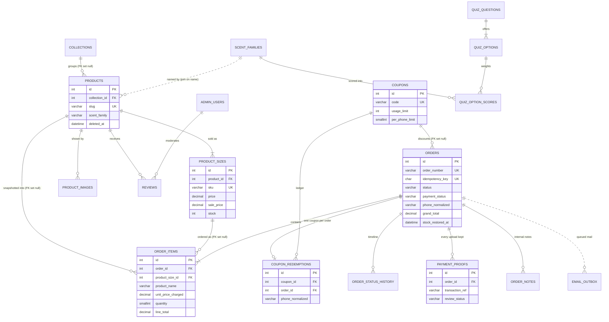

# 4. Database

One MySQL/MariaDB database, 26 tables, all InnoDB, all `utf8mb4_unicode_ci`, importable through
phpMyAdmin in one paste and created by `install.php` in dependency order. No triggers, stored
procedures, views or MySQL `ENUM` types anywhere, so a dump restores cleanly on both engines
(see 01c §5, §7). Full column-by-column DDL (the `CREATE TABLE` statements) lives in 01a
(catalogue and site tables) and 01b (commerce tables) as amended by the decisions register; the
final `orders` table is printed in full in 08 §2.3. This section is the map, not the DDL.

Two terms used throughout: a **foreign key** (FK) is a column that points at a row in another
table, and the database refuses to leave it dangling; a **snapshot** is a copy of a value taken at
the moment of the order, so later edits to the catalogue never rewrite an old invoice.

## 4.1 Entity relationship diagram

Key columns only. `PK` = primary key, `UK` = unique, `FK` = foreign key. A dotted line is a
relationship kept by the code, not by a database constraint (see 01c §5 rule 4 for why).

The other entities on the diagram carry the usual `id` primary key plus the FK shown by their
line; their key columns are in the table below.

Eight tables stand alone with no foreign keys and are not drawn: `settings`,
`admin_login_attempts`, `admin_activity_log`, `content_pages`, `slug_redirects`,
`contact_messages`, `newsletter_subscribers`, `rate_limits`. They can be emptied without
touching a single order (01c §6). `admin_activity_log.admin_id` and
`order_status_history.admin_id` deliberately carry no FK: each row also stores the admin's
username as text, so the audit trail survives an account being deleted (08 C-18, 01c §5 rule 4).

Not in this diagram because the register cut them: `payments`, `checkout_attempts`,
`order_number_seq`, `order_stock_moves`, `admin_sessions`, `cities`, `faqs`, `usp_items`,
`instagram_posts`, `restock_alerts`, `search_queries`, `spam_log` (08 §1.2, §4).

## 4.2 Table by table

**Soft-delete** means a row is hidden with a flag (`is_active = 0` or a `deleted_at` date) and
never physically removed, because an old order still points at it. **Hard** means the row really
goes. The rule behind every choice: anything an order can point at is never destroyed; anything
else is deleted for real so the admin lists do not fill with ghosts (01a §1.3).

### Catalogue

| Table | What it holds | Key columns | Notes |
|---|---|---|---|
| `collections` | The 5 merchandising groups, each with a `/collections/{slug}` page | `slug` (unique), `sort_order`, `is_active`, `show_on_home`, SEO title/description | Soft-delete. A product belongs to at most one. |
| `scent_families` | The closed list of families (Woody Oud, etc.), each with a `/scent/{slug}` page | `name` (unique), `slug` (unique), `intro`, SEO fields | Soft-delete. Products store the family **name** as text; the admin form only offers names from this table (01a §3.2, 08 C-04). |
| `products` | One perfume: copy, notes pyramid (top/heart/base as comma-separated text), longevity/sillage 1-5, season, occasion, gender, flags, SEO | `slug` (unique), `collection_id` (FK), `gender` him/her/unisex, `is_featured`, `is_new`, `is_active`, `published_at`, `rating_avg`/`rating_count`, `sales_count` | Soft-delete via `deleted_at`. **No price or stock here** - those live on sizes. Rating fields are a cache recomputed on every review decision. |
| `product_sizes` | The thing actually bought: 50 ml, 100 ml... each with its own price, sale price, SKU and stock | `product_id` (FK), `sku` (unique), `price`, `sale_price` (NULL = not on sale), `stock`, `is_default`, `low_stock_threshold` | Soft-delete via `is_active`. `stock` is unsigned so it physically cannot hold a negative (08 C-03). |
| `product_images` | Gallery rows; the resized derivatives are named by convention, not stored | `product_id` (FK), `filename`, `alt_text`, `width`/`height`, `sort_order`, `is_primary` | **Hard** delete, and the files are unlinked in the same step (01a §3.5). |
| `reviews` | Customer reviews, admin-moderated | `product_id` (FK), `rating` 1-5, `status` pending/approved/rejected, `is_sample`, `moderated_by` | Spam is hard-deleted; judgement calls are `rejected`. `is_sample = 1` marks seeded reviews so one button removes them all before launch. |

### Commerce

| Table | What it holds | Key columns | Notes |
|---|---|---|---|
| `coupons` | Discount codes | `code` (unique, stored uppercase), `type` percent/fixed, `value`, `min_order_total`, `usage_limit` (NULL = unlimited), `per_phone_limit`, `used_count`, `starts_at`/`expires_at`, `is_active` | Soft-delete once redeemed (the ledger blocks a real delete). `used_count` is a display cache; limits are counted from the ledger (01b §6). |
| `orders` | The order header: who, where, how paid, every money total, courier and lifecycle stamps | `order_number` (unique), `access_token`, `idempotency_key` (unique), `status`, `payment_method`, `payment_status`, `customer_*`, `phone_normalized`, `subtotal`/`discount_total`/`shipping_fee`/`cod_fee`/`grand_total`, `coupon_*` snapshot, `payment_reference`, `payment_account_snapshot`, `stock_restored_at` | **Snapshot.** Never deleted. Shipping fee, coupon details and the receiving bank/JazzCash account are copied in at checkout so a Settings edit never changes an old order. Full DDL: 08 §2.3. |
| `order_items` | One line per cart line, frozen at purchase | `order_id` (FK, cascades), `product_id`/`product_size_id` (FK, set to NULL if the catalogue row is ever hard-deleted), `product_name`, `product_slug`, `size_label`, `sku`, `image_filename`, `unit_price`, `sale_price`, `unit_price_charged`, `quantity`, `line_total`, `line_discount` | **Snapshot** (01b §2.1). Never edited after insert. |
| `order_status_history` | Every status and payment-status change: from, to, who, when | `order_id` (FK), `field` status/payment_status, `from_status`, `to_status`, `changed_by` customer/admin/system, `admin_id` + `admin_username` (text copy), `note` | Append-only. Feeds the customer's tracking timeline and the admin detail page. |
| `payment_proofs` | Every screenshot a customer uploads for a bank/JazzCash/Easypaisa order, plus the admin's verdict | `order_id` (FK), `transaction_ref`, `sender_name`, `amount_claimed`, `file_path` (under `storage/proofs/`), `review_status`, `reviewed_by`/`reviewed_at`/`review_note` | Append-only: a re-upload is a new row, so evidence is never overwritten (01b §5.1, 06b §0.2). |
| `coupon_redemptions` | The ledger of coupon uses, one row per order | `coupon_id` (FK, restrict), `order_id` (FK), `code`, `phone_normalized`, `discount_amount`, `order_subtotal`, `status` applied/reverted | This is how "1 per phone" for `WELCOME10` is enforced. Cancelling an order marks the row `reverted`. |
| `order_notes` | Internal admin notes on an order ("deliver after 6pm") | `order_id` (FK), `body`, `admin_id` + `admin_name`, `is_pinned` | Never shown to the customer (01b §8). |
| `email_outbox` | Queued confirmation and notification emails, drained on admin page loads | `template`, `recipient`, `subject`, `body_html`, `order_id`, `status`, `attempts`, `next_try_at`, `sent_at` | An order is never lost to a slow mail server (06b §0.2, §5). |
| `rate_limits` | Append-only attempt log for public forms | `bucket` (checkout/track/proof/contact/newsletter/review), `subject_hash`, `attempted_at`, `was_success` | Purged opportunistically; no cron needed (06b §0.2, 08 C-17). |

### Site and admin

| Table | What it holds | Key columns | Notes |
|---|---|---|---|
| `settings` | Every owner-editable string: store info, phone/WhatsApp, social links, announcement, hero copy, shipping fee and free-shipping threshold, payment toggles, bank/JazzCash/Easypaisa details, meta description | `setting_key` (the primary key - the only table with no `id`), `setting_value`, `setting_group` | Code holds a default for every key; an empty value means "use the default" (01a §5.3). Key list: 05a §4.9 plus 08 §1.4. |
| `admin_users` | The owner's login | `username` (unique), `email` (unique), `password_hash`, `is_active`, `last_login_at`, `password_changed_at` | One account in v1, no `role` column (08 C-21). Soft-delete. |
| `admin_login_attempts` | Every admin login try, for rate limiting | `ip_hash`, `username`, `attempted_at`, `was_success` | Hard-purged after 30 days, 1 login in 50 (01a §2.3). |
| `admin_activity_log` | Audit trail of admin actions with before/after values | `admin_id` + `admin_username` (text copy), `entity_type`, `entity_id`, `action` (e.g. `order.status_change`), `summary`, `before_json`/`after_json` | Append-only; purged at 365 days (05b §0.2, 08 C-18). |
| `content_pages` | About, FAQ, Shipping, Returns, Privacy, Terms as editable HTML | `slug` (unique), `title`, `body`, `body_format` html/faq, `template`, `is_system`, `is_active`, SEO fields | Soft-delete; the six system pages cannot be deleted or re-slugged (01a §2.6). |
| `slug_redirects` | Old URL to new URL after a rename, so WhatsApp links never 404 | `entity_type` product/collection/scent/page, `old_slug`, `new_slug`, `entity_id`, `hit_count` | Hard delete only when superseded; chains are collapsed to one hop (01a §5.2). |
| `contact_messages` | Contact-form submissions, saved before any email is sent | `name`, `email`, `phone`, `subject`, `message`, `order_number`, `status` new/read/replied/archived, `admin_note`, `read_at` | Soft-delete via `status = archived` (05a §0.3, 08 C-20). |
| `newsletter_subscribers` | Newsletter sign-ups and unsubscribes | `email` (unique), `status` subscribed/unsubscribed, `source`, `unsub_token`, `subscribed_at`/`unsubscribed_at` | Soft-delete: the unsubscribe row is the compliance record (05a §0.3). |

### Scent Finder quiz

| Table | What it holds | Key columns | Notes |
|---|---|---|---|
| `quiz_questions` | The 4-5 questions, in step order | `question`, `helper_text`, `step` (unique), `is_active` | Hard delete. Seeded once; no admin screen in v1 (08 §4). |
| `quiz_options` | The answers under each question | `question_id` (FK), `label`, `option_code` a-e (unique per question), `sort_order` | The code letters form the shareable result URL (01a §4.2). |
| `quiz_option_scores` | How much each answer points at each scent family | `option_id` (FK), `scent_family_id` (FK), `weight` | One row per (answer, family). No quiz answers are ever stored (01a §4.4). |

## 4.3 The five rules that keep the data honest

The SQL behind each rule is in 01c; this is the plain-English contract.

| # | Rule | What it means | Detail |
|---|---|---|---|
| 1 | **Money is `DECIMAL(10,2)`, whole rupees** | Every price and total is stored as an exact decimal (never a floating-point number), unsigned so a negative total is a hard error rather than a silent zero. PHP does its arithmetic in integer paisa, rounds exactly once (a percent coupon, half-up to the rupee) and displays `Rs. 4,950` with no decimals. | 01c §1, 08 C-01 |
| 2 | **Stock can never go negative** | Stock is reduced with a single guarded statement: "subtract this quantity from this size, but only if it still has at least that many" - and the code checks that exactly one row changed; zero rows means someone else got the last bottle and the whole order is rolled back. Sizes are always locked in ascending id order so two checkouts cannot deadlock, and the column is unsigned as a second wall. Cancelling puts stock back exactly once, because the cancel and the "stock already restored" stamp are set in the same guarded statement. | 01c §2-3, 08 C-03, C-12 |
| 3 | **Order lines are snapshots** | An `order_items` row copies the product name, slug, size label, SKU, image, list price and charged price at the moment of purchase, and `orders` copies the shipping fee, coupon terms and receiving account; nothing is ever read back from the catalogue or Settings. Renaming, repricing or retiring a perfume later cannot change what last month's invoice says. | 01b §1-2, 08 C-07 |
| 4 | **Order numbers are `SF-YYMMDD-XXXX` and cannot collide** | Example `SF-260925-K7QF`: the Karachi date plus 4 random characters from a 32-letter alphabet that drops `0 O 1 I`, so it reads cleanly over the phone and does not reveal how many orders were placed. The `order_number` column is unique in the database, so if the roughly one-in-a-million same-day clash ever happens the insert is refused and the code simply draws a new suffix and retries. | 06b §0.3, 08 C-10 |
| 5 | **Times are Karachi local time** | Every date column is a plain `DATETIME` written by PHP in Asia/Karachi (which has had no daylight-saving changes since 2009), and every database connection is set to `+05:00`, so a row that says `14:30` in phpMyAdmin means half past two in Karachi. `TIMESTAMP` columns and server defaults are never used, so a hosting migration cannot silently shift the clock. | 01c §4.2 |

The register's open question **Q-01** (random vs strictly sequential order numbers) is the only
item above the owner can still change; sequential numbering would reinstate a counter table and
alter rule 4 (08 §3.1). Everything else in this section is settled.
