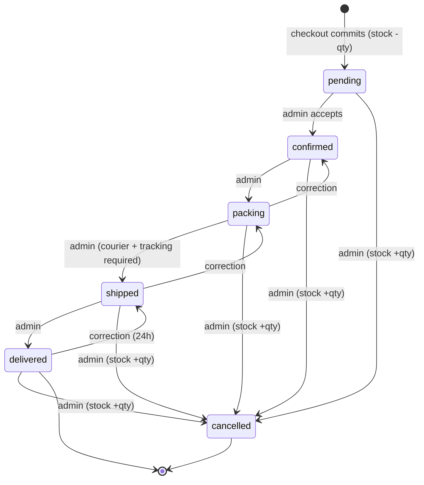

# 7. How the money logic works

One principle drives this section: **the browser is never a source of truth.** The customer's
cart holds only *which size*, *how many* and a coupon code; every price, discount, fee and total
is recomputed from the database on every page load and once more inside a locked transaction
when the order is placed (see 06a §1). Money is `DECIMAL(10,2)`, shown as `Rs. 4,950` (08 C-01).

## 7.1 The pricing pipeline (06a §2.2, always in this order)

1. **Unit price.** The sale price is used only if it is set and strictly lower than the
   normal price; otherwise the normal price is used.
2. **Line total** = unit price × quantity. Exact, no rounding.
3. **Subtotal** = sum of all in-stock lines. Sold-out lines stay visible, count for nothing and
   block checkout.
4. **Coupon discount**, only if the code passes every check in 7.2. Percent coupons round
   half-up to the whole rupee — the *only* rounding in the pipeline, and a tie favours the
   customer. A fixed coupon is clamped so it never exceeds the subtotal.
5. **Shipping.** Free if the **pre-discount** subtotal reaches the threshold, else the flat fee.
6. **Grand total** = subtotal − discount + shipping. It can never go below zero (06a §2.4).

**Worked example** (illustrative prices; fee Rs. 250, free-shipping threshold Rs. 3,000,
`WELCOME10` = 10% off, minimum order Rs. 3,000):

| Line / step | Working | Result |
|---|---|---|
| Azure Oud 100 ml × 1 | Rs. 4,950, not on sale | Rs. 4,950 |
| Cirrus 50 ml × 2 | sale price Rs. 3,955 (Rs. 4,500 struck through) × 2 | Rs. 7,910 |
| Subtotal | 4,950 + 7,910 | **Rs. 12,860** |
| Coupon `WELCOME10` | 12,860 ≥ 3,000 minimum, so it applies; 10% = Rs. 1,286 (an odd subtotal such as Rs. 4,955 would give 495.50 → Rs. 496) | **− Rs. 1,286** |
| Shipping | 12,860 ≥ 3,000 threshold, tested on the pre-discount subtotal | **Rs. 0 (Free delivery)** |
| Grand total | 12,860 − 1,286 + 0 | **Rs. 11,574** |

With a Rs. 2,800 cart the coupon is refused (*"This code needs a minimum order of Rs. 3,000. Add
Rs. 200 more to use it."*), shipping is Rs. 250, and the total is Rs. 3,050.

## 7.2 Coupon rules

| Rule | What we build | Where |
|---|---|---|
| Types | `percent` (1–90 %, whole numbers, in the admin form) or `fixed` (a rupee amount). No free-shipping type, no buy-X-get-Y, no product-specific coupons in v1 | 05a §4.5, 08 Q-12 |
| Minimum order | `min_order_total`, tested against the **pre-discount** subtotal | 06a §3.4 check 8 |
| Usage limit | Blank = unlimited; otherwise the code stops after N orders, counted inside the checkout transaction so two customers cannot both take the last use. The count is read-only; a used coupon can be deactivated but never deleted | 06a §5.3, 08 C-15, 05a §4.5 |
| Per-phone limit | Optional; `WELCOME10` ships with 1 per phone number so it is a real welcome offer. Matched on the normalised phone (`+92…`), so spaces and a leading 0 do not defeat it | 06a §3.6, 08 C-14 |
| Start / expiry | Optional dates, Pakistan time. Every code is re-checked on every page load and again inside the order transaction; one that dies between cart and checkout is dropped and the customer confirms the new total | 06a §3.4, §3.8 |
| Stacking | **No.** One code per cart. Applying a second code replaces the first and the cart says *"WELCOME10 was replaced by SKY500."* | 06a §3.3 |
| Applies to | The merchandise subtotal only. Never the shipping fee | 06a §2.4 |
| Cancelled orders | Cancelling an order releases the use: the redemption row is deleted and the counter goes back down, in the same transaction as the stock restore | 06a §3.7 |

## 7.3 Free-shipping threshold vs coupon — the settled rule

**The threshold is tested against the subtotal *before* the coupon comes off** (06a §4.1). A
coupon can never push a customer back into paying for delivery, the cart's progress bar only
ever moves forward, and coupons never discount the fee itself. Threshold `0` = always free.

## 7.4 The order state machine

Six states. Stock is taken **once** at placement and given back **once** on cancel (06b §3).

| From → To | Who | Touches stock? | Sends email? | Reversible? |
|---|---|---|---|---|
| (new) → `pending` | system, at checkout | **yes, −qty** | customer confirmation + owner alert | only by cancelling |
| `pending` → `confirmed` | owner | no | customer "Order confirmed" | only by cancelling |
| `confirmed` → `packing` | owner | no | none (internal step) | yes → `confirmed` |
| `packing` → `shipped` | owner (courier + tracking required) | no | customer "On its way" with tracking | yes → `packing` |
| `shipped` → `delivered` | owner | no | customer "Delivered" + review invitation | yes → `shipped`, within 24 h |
| any → `cancelled` | owner, reason required | **yes, +qty restored once** | customer "Order cancelled" | **no** |

The server refuses illegal jumps (*"That status change isn't allowed."*); `shipped` needs
courier + tracking; every change is logged with who and when (06b §3.2, 05b §3.3). **Payment
status is a separate field** (`unpaid`, `awaiting_verification`, `paid`, `failed`, `refunded`);
a COD order is `delivered` before it is `paid` (08 C-09). 06b §3.2 and 05b §3.1 differ on two
edges (may `confirmed` skip to `shipped`; is `delivered` terminal) — to be decided in stage 4.

## 7.5 Stock safety and double-submit, in plain words

- **Stock cannot go negative.** The decrement says "take N *only if* at least N are there"; if
  two customers race for the last bottle exactly one wins and the loser's whole order rolls back
  with *"Sorry — {Product} {size} sold out while you were checking out."* (06b §1.5, 08 C-03).
- **All or nothing.** Order, lines, stock and coupon use are one transaction; any failure means
  no order, no stock movement, cart untouched (06b §1.6).
- **A double-tap cannot create two orders.** The checkout page carries a one-time key the order
  table refuses to store twice; the second request lands on the first order's confirmation page.
  The cart is emptied and the browser redirected (303), so refresh is harmless (08 C-11).
- **The customer pays the total they saw.** A price or fee change before *Place Order* writes no
  order; they see *"Your new total is Rs. X (was Rs. Y)"* and confirm again (06a §7.7).
- **Cancel restores stock exactly once**; a second cancel, tab or retry changes nothing (08 C-12).
- **Caps**: 10 per size, 20 sizes per cart, never above stock, COD ≤ Rs. 30,000, 5 orders/phone/day flagged, not blocked (08 Q-06).

# 8. Payment and delivery flows

## 8.1 Cash on Delivery

| Step | Customer sees | Owner does |
|---|---|---|
| 1 | Picks *Cash on Delivery* at checkout — no extra fields. Disabled above Rs. 30,000 (*"Orders above Rs. 30,000 are prepaid only."*) | — |
| 2 | Order placed as `pending` / `unpaid`; confirmation page says **"Pay Rs. 6,400 in cash when your parcel arrives."**; confirmation email if an address was given | Gets the "New order" email; the order shows under *New orders* on the list |
| 3 | WhatsApp or a call from the shop | Calls to confirm (fake-COD check), sets `pending → confirmed`; nothing is ever auto-cancelled |
| 4 | "On its way" email/WhatsApp with courier + tracking | Packs, enters courier + tracking, marks `shipped` |
| 5 | Parcel arrives, pays the rider | Marks `delivered`, then presses *Mark as paid* once the rider's cash is reconciled — never inferred (06b §4.1, 05b §11) |

## 8.2 Manual Bank / JazzCash / Easypaisa

**What the customer sees.** A panel built from Settings — account title, number, IBAN for bank,
each with a *Copy* button — headed *"Transfer Rs. 6,400 to the account below, then enter the
transaction ID and upload your receipt."*, plus the owner's `manual_payment_note`. Two required
fields: **Transaction ID** (5–30 letters/digits; a repeat of one seen in the last 90 days is
accepted but badged "Duplicate TXN") and **Payment screenshot** (06b §4.2).

| Screenshot rule | Value |
|---|---|
| File types / size | JPG, PNG, WEBP only, up to 5 MB — no PDF (08 Q-08) |
| Checked how | real file type read from the bytes, not the filename; re-encoded through GD so nothing but pixels reaches disk; extension chosen by the server |
| Stored where | `storage/proofs/{YYYY}/{MM}/{random}.{ext}` — a denied folder, random name, no customer data in the path (08 C-25) |
| Who can view | only a logged-in owner, through `/admin/orders/{number}/proof`; there is no public link and the customer cannot retrieve it later (05b §5.2) |
| Re-uploads | 3 per order; a rejected proof can be re-sent via the customer's confirmation link or attached by the owner as *Replace proof* — old proofs are kept, never overwritten (06b §4.2, 05b §11) |

Placed as `pending` / `awaiting_verification`, the order tops the *Needs payment review* chip.
**Mark as paid:** the owner opens the proof, checks amount and transaction ID against the banking
app and confirms (amount pre-filled; a short payment is warned and recorded, not blocked). That
sets `paid` + `paid_at`, logs who did it and changes nothing else — confirming the order is a
separate tap. *Reject proof* needs a reason, sets `failed`, keeps the file and offers the "Payment
not verified" WhatsApp message. Unpaid after 48 h → amber badge, never auto-cancelled (05b §6.1).

## 8.3 Shipping fee and delivery-time settings

| Setting (Settings › Shipping) | Default | Notes |
|---|---|---|
| `shipping_fee` | Rs. 250 | One flat nationwide fee; city never changes it (06a §5.1). COD surcharge is Rs. 0, no setting until wanted (08 Q-05) |
| `free_shipping_threshold` | Rs. 3,000 | `0` = always free, bar hidden (08 §1.4, Q-04) |
| `delivery_time` | "2–4 working days" | Shown on the product page, emails and WhatsApp messages |

A blank or bad fee falls back to the default, never to free (06a §4.2); the fee is frozen onto each order (06a §5.2).

## 8.4 Every email that is sent

Emails go via PHPMailer over the Hostinger SMTP mailbox, queued in `email_outbox`, sent at once
if SMTP answers within 8 s, else retried on later admin page loads; after 6 failures the dashboard
says "{n} emails could not be sent". **An order is never lost because email failed** (06b §5.2).

| Trigger | To | Subject |
|---|---|---|
| Order placed | customer (if email given) | `Order SF-260925-K7QF confirmed — Sky Fragrances` |
| Order placed | owner (`order_notify_email`) | `New order SF-260925-K7QF — Rs. 6,400 — COD — Lahore` |
| Proof approved | customer | `Payment received for order SF-260925-K7QF` |
| Proof rejected | customer | `We couldn't verify your payment — order SF-260925-K7QF` |
| `pending → confirmed` | customer | `Order SF-260925-K7QF is confirmed` |
| `packing → shipped` | customer | `Your order SF-260925-K7QF is on its way` |
| `shipped → delivered` | customer | `Delivered — order SF-260925-K7QF` |
| any → `cancelled` | customer | `Order SF-260925-K7QF has been cancelled` |
| Contact form sent | the sender | `We've received your message — Sky Fragrances` |
| Contact form sent | owner | `Contact form: {subject}` |

`packing` sends nothing (06b §5.1). SPF/DKIM is a go-live step; until then WhatsApp is the real confirmation channel (08 Q-19).

# 9. The admin panel, from a phone

The panel at `/admin` is designed at 375 px first: a 52 px top bar and a fixed bottom tab bar
(*Orders · Products · + · Reviews · More*) instead of a sidebar, because the owner's daily loop is
orders → stock → orders. Below 768 px every table row becomes a card (identity as heading, one
status chip, at most three fields, money and stock in a larger weight, actions in a `⋮` sheet);
tap targets are ≥ 44 px, lists page at 20 rows, and every save is a POST + redirect so a flaky
connection cannot double-submit. Sessions expire after 120 min idle / 12 h flat, five failed logins
lock the account for 15 min, and password recovery is a renamed file, not an email (05a §2–3).

**Order detail** (`/admin/orders/{number}`, 05b §2–8) stacks in the order the owner works a new
order: header (number, status, total) → **Payment block** (proof thumbnail with full-screen viewer,
transaction ID + *Copy*, *Mark as paid*, *Reject proof*) → items at snapshotted prices → totals
(red "do not ship" banner if they ever fail to reconcile) → customer + address with *Call* / *Copy
address* → courier, tracking number and optional tracking link (08 Q-09) → timeline → notes →
danger zone. A pinned bar holds *Status* (only legal next states; cancel needs a reason and a
second tap and restores stock once), *WhatsApp* and *⋯* (print invoice, packing slip, restore
stock). WhatsApp opens `wa.me` with the message for the current status pre-filled; for `shipped`:

> Assalam-o-Alaikum {name}, / Your Sky Fragrances order {number} has been shipped. / Courier: {courier} /
> Tracking number: {tracking} / Amount: {total} / Please keep your phone available so the rider can reach
> you. Track your order at https://skyfragrances.com/track / Sky Fragrances — More Than Just A Scent

(`Amount to pay on delivery:` for COD; the tracking line becomes *"The tracking number will follow
shortly."* when empty — 05b §7.2.) Invoice and packing slip are print-ready HTML pages; the slip
shows no prices except a COLLECT banner on COD orders (08 Q-14). **Export CSV** honours the list
filters, one row per order, Excel-safe (UTF-8 BOM, bare numbers, formulas defused), ≤ 5,000 rows (05a §5.3).

| Screen | One-line purpose | Spec |
|---|---|---|
| Dashboard | Today/month revenue (accepted orders only), status chips, attention strip, latest 5 orders, low stock, best sellers | 05a §4.1 |
| Orders list | Attention chips (*Needs payment review*, *New orders*…), filters, search by number/phone/name, bulk confirm/pack/ship/print — never bulk cancel | 05b §1 |
| Products | List with stock/status filters, duplicate, hide, bulk actions; form with basics, sizes (price/sale/stock/SKU), image uploader (auto-resize, alt text required), scent profile, visibility, SEO | 05a §4.2–4.3 |
| Collections | CRUD + reorder; delete blocked while products remain | 05a §4.4 |
| Coupons | CRUD, toggle, WhatsApp share; status computed live | 05a §4.5 |
| Reviews | Approve / reject queue; *Delete all sample reviews* button | 05a §4.6 |
| Messages | Contact-form inbox, reply via WhatsApp / mailto, notes, archive | 05a §4.7 |
| Subscribers | Newsletter list, add/unsubscribe, CSV export | 05a §4.8 |
| Settings | Seven tabs: Store · Contact & Social · Home · Shipping · Payments · SEO · Advanced, each saving only its own keys; Change password (12+ characters, shows last 10 logins) lives here | 05a §4.9–4.10 |
| Activity | Full audit trail per order/product/setting | 05b §9 |
| Tools › Remove sample data | One-button purge of the seeded catalogue and reviews | 08 Q-24 |

**What the admin cannot do** (deliberate, 05a §7, 05b §10): write or edit a review; change any
price, line, total or coupon on a placed order; delete an order (cancel is a state) or cancel in
bulk; reduce a coupon's used count or delete a used coupon; hard-delete a product on any order, a
collection with products, or the last size; turn off the last payment method; create an order by
hand or a second admin (v1); send bulk email; run SQL, upload non-image files or edit templates.
